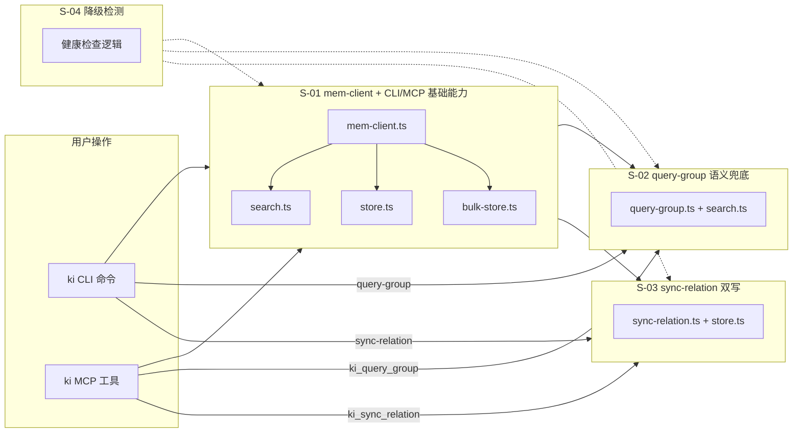
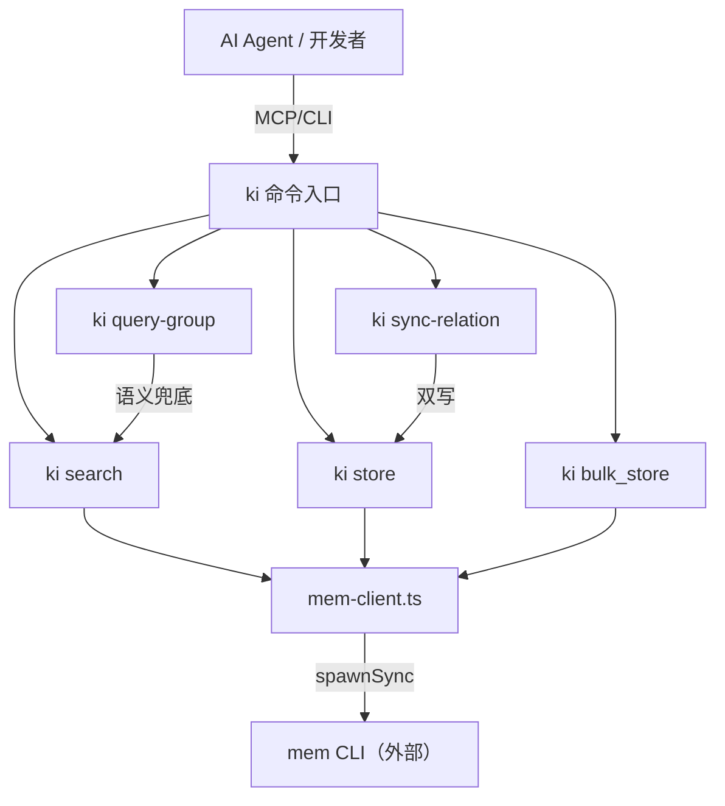

# ki 向量能力集成 — 总体设计

> 状态：草案

## 1. 需求背景 & 目标

ki 当前定位为"本地知识目录与交付层"，负责 Group 导航、热门 Relation 缓存、原文交付；mem 定位为"长期记忆与混合检索引擎"，负责向量存储、语义检索、冷热治理。两者在架构上职责分离，但分离**泄漏到了用户界面层**：

- AI Agent 需同时加载两个 MCP Server（ki MCP + mem MCP）
- Agent 必须手动编排"查 ki → 不命中 → 调 mem recall → 回写 ki"的 fallback 链路
- 开发者需学习两套 CLI 命令体系

**目标**：采用**薄封装**策略，在 ki 内部集成 mem 调用能力，对外提供统一入口。ki 不持有向量索引或缓存，mem 仍是唯一向量引擎，改变的是调用方看到的界面。

**预期收益**：
- MCP 配置从两个 server 合并为一个
- Agent 不再需要手动编排 fallback 逻辑
- 开发者使用 `ki search` / `ki store` 替代 `mem recall` / `mem store`

**不在范围内**：
- 向量索引的存储引擎、治理策略（冷热淘汰等）— 这是 mem 的职责
- mem CLI 本身的安装、升级、配置
- 统一查询工具（`ki search --depth summary|full`）— 已评估后放弃
- 现有 Agent 已配置的 ki MCP + mem MCP 双 server 的自动迁移（旧配置继续可用，用户手动切换）
- path-vectorize.ts 的重构统一（短期保留现有实现，远期统一到 mem-client）

## 2. 关键环节一览图

**分期**：
- 第一期：S-01 + S-04（基础能力 + 降级，可并行）
- 第二期：S-02 + S-03（依赖 S-01，可并行）

## 3. 总体方案设计

### 架构拓扑

ki 在现有架构上新增一层 `mem-client.ts` 作为 mem CLI 调用的唯一出口。所有向量命令（search/store/bulk_store）和现有向量集成（path-vectorize）均通过 mem-client 访问 mem。

### 共享术语速查

| 术语 | 定义 | 引用子需求 |
|------|------|-----------|
| 薄封装 | ki 不持有向量索引/cache，所有向量能力由 mem 提供，ki 仅做接口聚合 | S-01~S-04 |
| mem-client | 封装 mem CLI 调用的共享模块（PATH 注入、stdout 清洗、JSON 解析） | S-01 |
| 静默降级 | mem 不可用时向量能力优雅失败，结构化导航不受影响 | S-04 |
| 物理隔离 | ki-search 与 ki-path/ki-relation 使用独立 tags，互不干扰 | S-01, S-02 |
| 容错双写 | sync-relation 本地写成功后同步调 mem store（try-catch 包裹），失败不影响主流程返回值 | S-03 |

### 跨子需求接口契约

| 接口 | 提供方 | 消费方 | 签名摘要 |
|------|--------|--------|----------|
| `memSearch()` | S-01 (mem-client) | S-02 (query-group) | `(scope, query, opts?) → SearchResult[]` |
| `memStore()` | S-01 (mem-client) | S-03 (sync-relation) | `(scope, text, opts?) → {memoryId}` |
| `memBulkStore()` | S-01 (mem-client) | S-01 (CLI/MCP 内部) | `(scope, entries) → BulkStoreResult` |
| `checkMemAvailable()` | S-04 | S-01 | `() → {available: boolean, reason?: string}` |

## 4. 全局风险 & 跨子需求依赖

### 风险清单

| 风险 | 严重度 | 影响范围 | 缓解策略 |
|------|--------|----------|----------|
| mem CLI 不可用 | 高 | S-01/02/03 全部向量能力 | S-04 启动检测 + 静默降级 |
| spawnSync PATH 继承问题 | 高 | S-01 | 显式注入 PATH（已有 path-vectorize 验证可行） |
| mem stdout 前导日志污染 JSON | 中 | S-01 | mem-client 统一清洗逻辑 |
| sync-relation 双写与 scan-kb import 重复存储 | 中 | S-03 | import 流程内部调 sync-relation，双写由 sync-relation 统一完成 |
| scope 不一致（ki scope 与 mem scope） | 低 | S-01 | ki 的 scope 规则直接透传给 mem，不做转换 |
| 向后兼容性 | 低 | 全局 | 旧配置（ki MCP + mem MCP 双 server）继续可用，不做自动迁移或破坏性变更，用户按需手动切换到单 server |

### 跨子需求依赖

| 依赖关系 | 说明 |
|----------|------|
| S-02/S-03 → S-01 | 语义兜底和双写依赖 mem-client 提供的 `memSearch()` / `memStore()` |
| S-01 ← S-04 | mem-client 在调用前可查询 S-04 的可用性状态，决定是否走降级路径 |

### 非功能性假设（默认值）

- 数据量级：单机低量级（ki 本身是 CLI 工具，非服务）
- QPS：单用户低频（Agent 调用，非高并发）
- 可用性：允许单点故障（mem 不可用时降级）
- 一致性：最终一致（双写异步，允许短暂延迟）
- 延迟容忍：秒级（mem CLI 调用约 1-5s）
