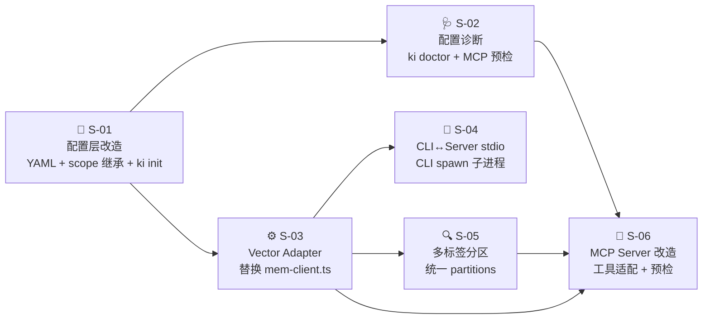
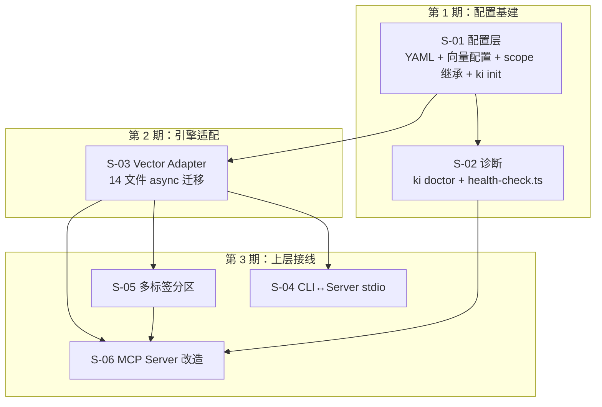

# KiSearch 重构技术设计（REQ-20260717-003）

> 父文档。子文档：REF_S01 ~ REF_S06。基座模块设计见 `ZVEC_ENGINE_DESIGN.md`（REQ-002，已完成）。

## 1. 需求背景 & 目标

**背景**：KiSearch 当前通过 `mem-client.ts` spawnSync `mem` CLI 实现向量检索，每次 `ki search` 冷启动 ~4s。底层引擎 lancedb 存在锁文件卡死、版本漂移、Recall@1 仅 12.5% 等痛点。基座模块 ZvecEngine（REQ-002）已实现完成（14/14 冒烟 + e2e 通过），封装了 `@zvec/zvec` Rust 内核，提供 async search/store/delete 接口。

**目标**：将 ki-search 从「spawn mem CLI 的无状态薄封装」改造为「自持有 zvec 向量的常驻服务」，对用户接口无感，备份/恢复不受影响。具体：配置独立化（YAML）+ 引擎适配（async）+ 多标签分区 + scope 继承 + ki init/doctor。

**不在范围内**：
- 基座模块 ZvecEngine 内部实现（已完成，不改）
- MCP 协议本身（使用现有 @modelcontextprotocol/sdk）
- KB 文件格式（markdown / ai-results.json 不变）
- 备份逻辑（backup.ts 不改）

## 2. 关键环节一览图

## 3. 总体方案设计

### 3.1 子需求节点图

### 3.2 共享术语速查

| 术语 | 定义 | 定义于 |
|------|------|--------|
| **Vector Adapter** | 引擎适配层（`scripts/lib/vector-client.ts`，新增），替换 `mem-client.ts`，封装 ZvecEngine，提供 async search/store/delete 接口 | S-03 |
| **partitions** | 统一分区输出结构 `{ ok: boolean, partitions: Record<string, SearchResult[]> }`，按 tag 分组 | S-05 |
| **scope 继承** | 三级 fallback：`scopes[scope]` → `scopes["default"]` → 现有 fallback（`dataDir/{scope}` / null） | S-01 |
| **health check** | 配置诊断函数集（`scripts/lib/health-check.ts`，新增），检查 embedding 连通性 / 目录 / 维度 | S-02 |
| **stdio 通道** | CLI spawn `ki mcp --serve` 子进程，通过 stdin/stdout 进行 MCP 协议通信 | S-04 |
| **tag metadata** | tag 从 content 文本 hack（`【标签:xxx】`）升为 zvec metadata 标量字段 `tags`（数组），content 文本格式不变 | S-03 |
| **per-call spawn** | CLI 每次向量命令 spawn 一个临时 MCP server 子进程（`ki mcp --serve`），stdio 通信后退出 | S-04 |

## 4. 全局风险 & 跨子需求依赖

### 4.1 跨子需求风险

| 风险 | 涉及子需求 | 严重度 | 应对 |
|------|-----------|--------|------|
| Vector Adapter 接口签名变更导致 S-04/S-05/S-06 全部返工 | S-03 → S-04/S-05/S-06 | 🔴 | S-03 接口设计先确认，再并行开发 S-04/S-05/S-06 |
| scope 继承逻辑与 Vector Adapter 的 scope 过滤不一致 | S-01 ↔ S-03 | 🟡 | scope 继承仅影响 KB 目录映射；向量 scope 过滤由 zvec metadata 处理，两者职责分离 |
| MCP 启动预检（S-02）与 MCP 工具适配（S-06）同时改 mcp-server.ts | S-02 ↔ S-06 | 🟡 | S-02 先完成 health-check.ts 函数库；S-06 在 mcp-server.ts 中调用 |
| stdio 通道（S-04）与 MCP Server 改造（S-06）的 `--serve` 模式耦合 | S-04 ↔ S-06 | 🟡 | S-06 定义 `--serve` 模式行为；S-04 负责 spawn + stdio 通信 |

### 4.2 接口契约变更登记

| 变更类型 | 接口/结构 | 变更内容 | 影响的子需求 |
|---------|----------|---------|------------|
| 新增 | `VectorAdapter` 类 | 替换 `mem-client.ts` 全部 10 个导出函数 | S-03 定义，S-04/S-05/S-06 消费 |
| 新增 | `callMcpTool()` | CLI 向量命令通过 stdio 调用 MCP server 子进程 | S-04 定义，S-03 CLI 入口消费 |
| 修改 | search 输出结构 | `{ ok, results: [] }` → `{ ok, partitions: {} }` | S-05 定义，S-06 消费 |
| 新增 | `HealthCheck` 函数集 | checkConfig / checkEmbedding / checkDirectories | S-02 定义，S-06 消费 |
| 新增 | `ki init` / `ki doctor` 命令 | CLI 新命令 | S-01/S-02 定义 |
| 修改 | `KiConfig` 类型 | + vectorDir + embedding；JSON → YAML | S-01 定义，全部消费 |
| 修改 | scope 解析 | 三级 fallback 继承 | S-01 定义，S-03 间接消费 |

### 4.3 共享术语定义

> 术语定义见 §3.2 共享术语速查表。各子文档引用时写「见父文档 §3.2」。
