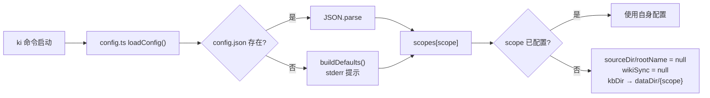
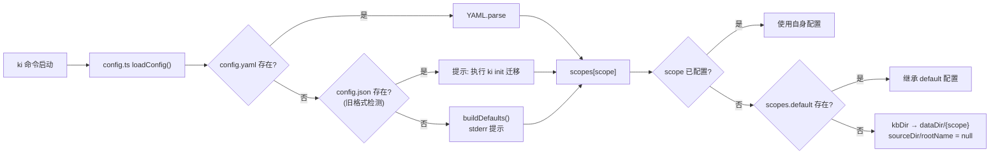

# S-01：配置层改造（YAML + 向量配置 + scope 继承 + ki init）

> 覆盖 REQ-11（向量配置独立化 + YAML）+ REQ-14（scope 运行时化 + 继承）+ REQ-15（ki init）。

## 1. 术语

| 术语 | 含义 | 引用 |
|------|------|------|
| `config.yaml` | KiSearch 配置文件，YAML 格式，位于 `~/.ki/config.yaml` | — |
| scope 继承 | 三级 fallback：`scopes[scope]` → `scopes["default"]` → 现有 fallback | 见父文档 §3.2 |
| `ki init` | 配置文件初始化命令，生成带注释的 YAML 配置 | — |
| `ScopeConfig` | 单个 scope 的 KB 目录映射配置（kbDir/sourceDir/rootName/wikiSync） | — |

## 2. 现状（AS-IS）

### 2.1 现状描述

配置文件为 JSON 格式（`~/.ki/config.json`），由 `scripts/lib/config.ts` 加载。`KiConfig` 接口仅含 `dataDir`/`backupDir`/`scopes`/`_configPath`，无向量相关配置。向量 embedding/db 路径/scope 定义全部依赖 mem 的 `~/.config/memory-mcp/config.yaml`（`mem-client.ts:372 readMemConfigScopes`）。

Scope 解析函数（`config.ts:177-209`）：
- `getScopeDataDir(config, scope)`：`scopes[scope].kbDir` → fallback `dataDir/{scope}`
- `getScopeSourceDir(config, scope)`：`scopes[scope].sourceDir` → **null（无 fallback）**
- `getScopeRootName(config, scope)`：`scopes[scope].rootName` → **null（无 fallback）**
- `getScopeWikiSync(config, scope)`：`scopes[scope].wikiSync` → **null（无 fallback）**

`ensureMemScope`（`mem-client.ts:478`）会校验 scope 是否存在于 mem 配置，不存在则报错。

### 2.2 痛点

- 痛点 1：向量配置寄生在 mem 的 config.yaml，去掉 mem 后全部丢失（apiKey/model/维度/db 路径）
- 痛点 2：JSON 格式不支持注释，用户难以理解各字段含义
- 痛点 3：未配置的 scope 的 `sourceDir`/`rootName`/`wikiSync` 无 fallback，直接返回 null，导致 wiki-sync / diff / import 失败
- 痛点 4：无配置初始化命令，用户首次使用需手动创建 JSON 文件

### 2.3 AS-IS 流程图



## 3. 方案（TO-BE）

### 3.1 方案概述

配置文件迁移为 YAML 格式（`~/.ki/config.yaml`），新增 `vectorDir`/`embedding` 字段，保留 `scopes`（KB 目录映射）并增加三级 fallback 继承。新增 `ki init` 命令生成带注释的配置文件。

### 3.2 关键决策点

| 决策 | 选择 | 理由 | 备选方案 | 否决原因 |
|------|------|------|---------|---------|
| 配置格式 | YAML | 支持注释，适合配置描述 | JSON | 不支持注释，用户难理解字段含义 |
| scope 配置 | 保留 + 继承 | KB 目录映射不能删（7 处依赖），继承简化未配置 scope | 完全移除 scopes | 破坏 KB 目录映射（kbDir/sourceDir/rootName/wikiSync） |
| `ki init` 交互模式 | 逐步询问 + `--yes` 一键 | 兼顾新手引导和老手快速生成 | 仅 `--yes` 模式 | 新手用户不知道该填什么 |
| 旧 config.json 处理 | 检测 + 提示迁移 | 不自动转换避免数据丢失 | 自动转换 JSON→YAML | JSON 中路径展开规则与 YAML 不同，自动转换可能出错 |
| scope 策略 | `scopeMode`（default/strict 二档枚举） | 单开关调和 S-01 自动创建与 S-06 未声明报错的矛盾；避免两个布尔的 4 组合怪异项 | 两个布尔（enableDefaultScope + dynamicScope） | 4 组合含「强制传 + 不校验」的高串味风险项，语义空间过大 |

### 3.3 TO-BE 流程图



### 3.4 行为差异对照表

| 场景 | AS-IS | TO-BE | 影响 |
|------|-------|-------|------|
| 配置文件格式 | JSON（config.json） | YAML（config.yaml） | 破坏性（需 ki init 迁移） |
| 向量配置 | 寄生 mem config.yaml | ki config.yaml 独立持有 | 新增字段 |
| 未配置 scope 的 sourceDir | null | 继承 default.sourceDir | 兼容增强 |
| 未配置 scope 的 rootName | null | 继承 default.rootName | 兼容增强 |
| 首次使用 | 手动建 JSON | `ki init` 生成 | 新增命令 |
| scope 校验（原 ensureMemScope） | scope 不存在则报错 | `scopeMode=default` 自动创建；`scopeMode=strict` 未注册报错 | 由 scopeMode 决定（调和 S-01↔S-06） |

### 3.5 scope 策略（scopeMode · 解决 N19，调和 S-01↔S-06）

`scopeMode` 决定「未传 scope」与「未注册 scope」的处置，统一原本 S-01（自动创建）与 S-06 §3.5（未声明报错）的矛盾：

| `scopeMode` | 缺省（未传 scope） | 未注册 scope（不在 `scopes` 中） | 适用场景 |
|-------------|-------------------|-------------------------------|---------|
| `default`（默认） | 落 `default` scope | 任意 scope 自动创建（S-01 运行时化行为） | 单项目 / 尝鲜，零摩擦 |
| `strict` | **报错**（必须显式传 scope） | **报错** `unknown scope`（`scopes` 即白名单） | 多项目防串味护栏 |

- `strict` 模式下，`scopes` map 的 key 即为**允许的 scope 白名单**，复用现有配置结构，无需新增字段。
- **护栏边界（诚实声明）**：`strict` 只能拦「未传 / 未注册」，**拦不住「传了合法但错的 scope」**（如误传已注册的另一个 scope）。当前**不引入项目级绑定**（`X-Ki-Project` 等方案已取消）——多 scope 的正确选择由调用方（CLI 参数 / LLM 工具参数）负责，隔离边界由「全局唯一的 scope 命名 + `scopeMode` 护栏」保证。此残留风险已知并接受。

## 4b. 数据模型

### 4b.1 持久化结构（config.yaml）

```typescript
interface KiConfig {
  dataDir: string;                    // KB 源数据目录
  backupDir: string;                  // 备份目录
  vectorDir: string;                  // 【新增】zvec collection 目录
  embedding: EmbeddingConfig;         // 【新增】embedding 配置
  scopeMode: 'default' | 'strict';    // 【新增】scope 策略（默认 'default'）；见 §3.5
  scopes: Record<string, ScopeConfig>; // 保留（KB 目录映射 + strict 模式下作 scope 白名单）
  _configPath?: string;               // 配置文件路径（内部）
}

interface EmbeddingConfig {
  provider: string;                   // "siliconflow" | "openai-compatible"
  baseURL: string;                    // API 端点
  model: string;                      // 模型名称
  dimension: number;                  // 向量维度（必须 === 4096）
  // apiKey 从 env SILICONFLOW_API_KEY 读取，不写入配置文件
}

interface ScopeConfig {
  kbDir?: string;                     // KB 数据目录
  sourceDir?: string;                 // 源文件目录
  rootName?: string;                  // Group 树根名
  wikiSync?: { enabled: boolean; sourceDir?: string };
}
```

### 4b.2 scope 解析函数签名（修改）

```typescript
// config.ts — 4 个函数加三级 fallback
function getScopeDataDir(config: KiConfig, scope: string): string;
// 1. scopes[scope].kbDir → 2. scopes["default"].kbDir → 3. dataDir/{scope}

function getScopeSourceDir(config: KiConfig, scope: string): string | null;
// 1. scopes[scope].sourceDir → 2. scopes["default"].sourceDir → 3. null

function getScopeRootName(config: KiConfig, scope: string): string | null;
// 1. scopes[scope].rootName → 2. scopes["default"].rootName → 3. null

function getScopeWikiSync(config: KiConfig, scope: string): WikiSyncConfig | null;
// 1. scopes[scope].wikiSync → 2. scopes["default"].wikiSync → 3. null
```

## +9. 迁移策略

### 存量数据处理

- 旧 `~/.ki/config.json` 检测：启动时如果 `config.yaml` 不存在但 `config.json` 存在，stderr 提示「检测到旧版 JSON 配置，建议执行 `ki init` 生成 YAML 配置」
- **不自动转换**：JSON 中路径已展开（`parseAndExpand` 处理过 `~`/相对路径），YAML 需要重新展开，自动转换可能出错
- `ki init` 交互模式可读取旧 `config.json` 的值作为默认值建议

### 旧接口/命令废弃

| 旧接口/命令 | 处理方式 | 废弃时间线 |
|------------|---------|-----------|
| `config.json` 读取 | 保留兼容读取（降级提示），优先读 `config.yaml` | 不主动移除 |
| `ensureMemScope()` | 直接移除（向量 scope 无需预校验） | 本版本 |
| `readMemConfigScopes()` | 直接移除（不再读 mem 配置） | 本版本 |

### 回滚方案

保留 `config.json` 读取能力（`findConfigFile` 优先 `.yaml` 后 `.json`），出问题时可删除 `config.yaml` 回退到旧 JSON 配置。

## +10. 影响范围

| 影响对象 | 影响类型 | 影响描述 | 破坏性 |
|---------|---------|---------|:------:|
| `scripts/lib/config.ts` | 接口变更 | JSON→YAML 解析 + 4 个 scope 函数加继承 + KiConfig 新增字段 | 否 |
| `scripts/init.ts`（新增） | 新增 | `ki init` 命令实现 | 否 |
| `bin/ki.mjs` | 配置变更 | COMMANDS 添加 `init: 'scripts/init.ts'` | 否 |
| `package.json` | 依赖变更 | 新增 `yaml` npm 包 | 否 |
| 全部 config 消费方 | 行为变更 | 未配置 scope 现在有 fallback（增强，非破坏） | 否 |
| MCP 工具寻址（S-06 §3.5） | 行为变更 | scope 校验改为读 `scopeMode`（default 自动创建 / strict 白名单报错） | 否 |
