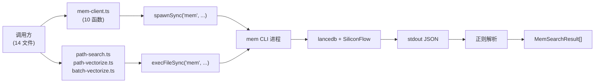
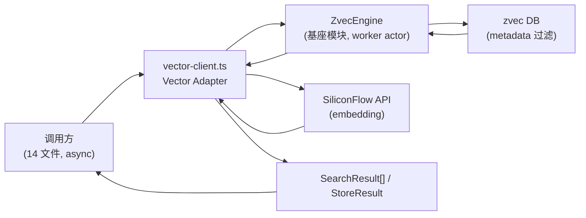

# S-03：Vector Adapter（引擎适配层）

> 覆盖 REQ-06 扩展（引擎适配 + async 迁移 + memoryId→docId + tag→metadata）。共享术语见父文档 §3.2。

## 1. 术语

| 术语 | 含义 | 引用 |
|------|------|------|
| Vector Adapter | `scripts/lib/vector-client.ts`（新增），替换 `mem-client.ts`，封装 ZvecEngine | 见父文档 §3.2 |
| tag metadata | tag 升为 zvec metadata 标量字段 `tags`（数组），content 文本格式不变 | 见父文档 §3.2 |
| memoryId→docId | mem 返回 memoryId → Vector Adapter 返回 doc id（content hash，不兼容旧 mem id），升级需 restore 重建 | — |

## 2. 现状（AS-IS）

### 2.1 现状描述

`scripts/lib/mem-client.ts` 导出 10 个函数，通过 `execFileSync('mem', ...)` spawnSync 调用 mem CLI，正则解析 stdout。被 14 个文件消费：

**A 类（9 个直接 import）**：search.ts、store.ts、bulk-store.ts、sync-relation.ts、delete-relation.ts、query-group.ts、manage-index.ts、lib/import.ts、lib/incremental.ts

**B 类（3 个直接 execFileSync mem）**：lib/path-search.ts、lib/path-vectorize.ts、lib/batch-vectorize.ts

**C 类（2 个间接）**：get-module-info.ts、lib/group-resolve.ts（通过 path-search.ts）

### 2.2 痛点

- 痛点 1：`spawnSync` 同步阻塞事件循环，sync-relation 的 `memStoreAsync` 已改 exec 但接口不统一
- 痛点 2：tag 过滤靠 `content.includes('【标签:xxx】')` 客户端文本 hack（`mem-client.ts:170`），性能差且不可靠
- 痛点 3：B 类文件绕过 mem-client 直接 `execFileSync('mem')`，适配时容易遗漏
- 痛点 4：memoryId 由 mem 生成，sync-relation 回写进 KB；换引擎后 id 来源变了，回写链可能断

### 2.3 AS-IS 流程图



## 3. 方案（TO-BE）

### 3.1 方案概述

新增 `scripts/lib/vector-client.ts`（Vector Adapter），封装 ZvecEngine 基座模块，提供与 mem-client 等价的 async 接口。14 个消费文件迁移为 async 调用。tag 升为 zvec metadata 字段，content 格式不变。doc id 由 Vector Adapter 用 content hash 生成（不兼容旧 mem id，升级需 restore 重建）。

### 3.2 关键决策点

| 决策 | 选择 | 理由 | 备选方案 | 否决原因 |
|------|------|------|---------|---------|
| Adapter 文件位置 | `scripts/lib/vector-client.ts`（新文件） | 与 mem-client.ts 平行，迁移时可并存 | 直接改 mem-client.ts | 14 个消费方同时改风险大，新文件可渐进迁移 |
| tag 存储方式 | zvec metadata 字段 `tags`（数组）+ content 文本保留 | metadata 用于检索过滤；content 保留供 path-search 解析 | 仅 metadata，去掉 content 前缀 | `extractPathFromContent`（path-search.ts:133）依赖 content 前缀 |
| doc id 生成规则 | Vector Adapter 用 content hash 生成（不兼容旧 mem id） | ki 不知 mem 的 id 规则；content hash 可自控；升级靠 restore 重建 | 沿用 mem memoryId 规则 | ki 不知道 mem CLI 内部的 id 生成规则（mem-client.ts:205 从 stdout 解析），无法复现 |
| | | | 用 zvec 自动 id | 回写链断裂，sync-relation 找不到已写入的 relation |
| B 类文件处理 | 改为调用 Vector Adapter | 统一入口，消除直接 execFileSync | 保留直接调 ZvecEngine | 绕过 Adapter 无法统一处理 tag metadata 和异常 |

> **async 承诺的实现前提（2026-07-21 复核 `zvec-probe-node` / `@zvec/zvec` v0.5.0）**：Vector Adapter 对外提供的 async 接口**不是**由绑定直接给出的——`@zvec/zvec` v0.5.0 的写入 API（`insertSync`/`upsertSync`/`updateSync`/`deleteSync`/`ZVecCreateAndOpen`/`ZVecOpen` 等）**全部 Sync-only**，仅 `query`/`multiQuery`/`optimize`/`deleteByFilter` 有 Async 版本（见 `zvec-probe-node/verify_blocking.mjs`）。故 async 契约由 **`ZvecEngine` 基座模块的 worker actor 模型**兑现：实例跑在 dedicated `worker_threads`，主线程持 proxy、所有方法 async 签名经 `postMessage` 转发，worker 内串行执行 Sync 调用。即 Vector Adapter 的 async 是「真异步」（不阻塞事件循环），而非把 Sync 调用包成 Promise。详见 S-06 §3.4「写入线程模型」与 `review/fix-plan.md` §1。

### 3.3 TO-BE 流程图



### 3.4 行为差异对照表

| 场景 | AS-IS | TO-BE | 影响 |
|------|-------|-------|------|
| 函数签名 | sync（`spawnSync`） | async（`Promise`） | 内部变更（接口不变） |
| tag 过滤 | `content.includes('【标签:xxx】')` 客户端 hack | zvec metadata `tags` 字段过滤 | 性能提升，content 格式不变 |
| id 来源 | mem 返回 memoryId（mem 内部生成，ki 不可控） | Vector Adapter 返回 doc id（content hash 生成，不兼容旧 mem id） | 破坏性（升级需 restore 重建） |
| 可用性检测 | `ensureMemAvailable`（mem --version） | `ensureVectorAvailable`（embedding + db） | 行为变更 |
| B 类文件 | 直接 `execFileSync('mem')` | 调用 Vector Adapter | 统一入口 |

## 4a. 接口设计

### 4a.1 对外接口

```typescript
// scripts/lib/vector-client.ts

interface SearchResult {
  id: string;              // doc id（Vector Adapter 用 content hash 生成，不兼容旧 mem id）
  score: number;           // 归一化分数（越大越相关）
  content: string;         // 原文（含【标签:xxx】前缀，格式不变）
  scope: string;           // scope metadata
  tags: string[];          // tag metadata（新增，从 content 提取 + metadata 双写）
}

interface StoreResult {
  ok: boolean;
  id: string;              // doc id
  error?: string;
}

interface BulkStoreResult {
  ok: number;
  errors: { id?: string; error: string }[];
  skipped: number;
}

// ─── 检索 ───
async function vectorSearch(params: {
  scope: string;
  query: string;
  limit?: number;
  tags?: string | string[];   // 单标签或数组
}): Promise<SearchResult[]>;

// ─── 写入 ───
async function vectorStore(params: {
  scope: string;
  content: string;            // 含【标签:xxx】前缀
  tags: string[];             // tag metadata
  metadata?: Record<string, unknown>;
}): Promise<StoreResult>;

async function vectorStoreAsync(params: { /* 同 vectorStore */ }): Promise<StoreResult>;
// 与 vectorStore 相同，保留命名兼容 sync-relation.ts 原调用

async function vectorBulkStore(params: {
  scope: string;
  entries: { content: string; tags: string[]; metadata?: Record<string, unknown> }[];
  onProgress?: (completed: { path: string; id: string }[], failedCount: number) => void;
  // onProgress 回调：每完成一批调用一次，返回 {path, id}（id = doc id，非旧 memoryId）
}): Promise<BulkStoreResult>;

// ─── 删除 ───
async function vectorDelete(params: {
  scope: string;
  ids: string[];
}): Promise<{ deleted: number; errors: string[] }>;

// ─── 可用性 ───
async function ensureVectorAvailable(): Promise<{ available: boolean; reason?: string }>;
```

| 接口 | 输入 | 输出 | 异常 |
|------|------|------|------|
| `vectorSearch` | scope, query, limit?, tags? | `SearchResult[]` | embedding 失败 / zvec 错误 |
| `vectorStore` | scope, content, tags, metadata? | `StoreResult` | embedding 失败 / zvec 锁 |
| `vectorBulkStore` | scope, entries[] | `BulkStoreResult` | 部分失败进 errors[] |
| `vectorDelete` | scope, ids[] | `{ deleted, errors }` | id 不存在进 errors[] |
| `ensureVectorAvailable` | — | `{ available, reason? }` | 不抛异常 |

### 4a.2 内部协作接口

```typescript
// Vector Adapter 内部调用 ZvecEngine（基座模块）
import { ZvecEngine } from '../../src/zvec-engine/index.js';

// 从 content 提取 tag（保持 content 格式不变）
function extractTagsFromContent(content: string): string[];
// "【标签:ki-path】实际内容" → ["ki-path"]

// 生成 doc id（content hash，不兼容旧 mem memoryId）
function generateDocId(content: string, scope: string): string;
// 使用 SHA-256(content + scope) 截断为 32 字符，如 "a1b2c3d4..."
// 注意：与旧 mem memoryId 生成规则不同，升级后需 restore 重建
```

### 4a.3 契约变更声明

| 变更类型 | 接口 | 变更内容 | 影响的子需求 |
|---------|------|---------|------------|
| 新增 | `VectorAdapter` 全套接口 | 替换 mem-client.ts 10 个函数 | S-04（CLI 通道调用）、S-05（分区封装调用）、S-06（MCP 工具调用） |
| 废弃 | `memSearch` / `memStore` / `memStoreAsync` / `memBulkStore` | 被 vector* 系列替代 | — |
| 废弃 | `ensureMemAvailable` / `checkMemAvailable` | 被 `ensureVectorAvailable` 替代 | S-02（health check 调用新函数） |
| 废弃 | `getMemScopes` / `checkMemScope` / `ensureMemScope` / `resetMemScopesCache` | scope 运行时化，无需校验 | S-01（scope 继承） |
| 废弃 | `readMemConfigScopes`（内部函数） | 不再读 mem 配置 | — |

## +10. 影响范围

> **关键区分**：14 个消费文件分两类——CLI 入口文件改用 `callMcpTool`（S-04），库函数直接用 Vector Adapter。`ki import-kb` / `ki restore` 是例外（无对应 MCP 工具，直接用 Vector Adapter）。

### A 类：直接 import mem-client.ts（9 个文件）

| 文件 | 原调用 | 新调用 | 改动 |
|------|--------|--------|------|
| `scripts/search.ts` | `memSearch` | `callMcpTool('search', ...)`（见 S-04） | 改为 MCP 客户端调用 |
| `scripts/store.ts` | `memStore` | `callMcpTool('store', ...)` | 同上 |
| `scripts/bulk-store.ts` | `memBulkStore` | `callMcpTool('bulk_store', ...)` | 同上 |
| `scripts/sync-relation.ts` | `memStoreAsync` + path-vectorize 导入 | `callMcpTool('sync_relation', ...)` | 同上；移除直接 path-vectorize 导入 |
| `scripts/delete-relation.ts` | `memSearch` | `callMcpTool('delete_relation', ...)` | 同上 |
| `scripts/query-group.ts` | `memSearch` | `callMcpTool('query_group', ...)` | 同上 |
| `scripts/manage-index.ts` | `ensureMemAvailable` | `callMcpTool('manage_index', ...)` | 同上 |
| `scripts/lib/import.ts` | `ensureMemScope` | 移除（scope 无需校验） | 删 import；vectorize 通过 batch-vectorize 走 Vector Adapter |
| `scripts/lib/incremental.ts` | `ensureMemScope` | 移除（同上） | 删 import；同上 |

> **注意**：前 7 个 CLI 入口文件改用 `callMcpTool`，不直接调用 Vector Adapter。Vector Adapter 由 MCP Server 子进程内部的 MCP 工具处理器调用（见 S-06）。

### B 类：直接 execFileSync('mem')（3 个文件）→ 直接用 Vector Adapter

| 文件 | 原调用 | 新调用 | 改动 |
|------|--------|--------|------|
| `scripts/lib/path-search.ts` | `execFileSync('mem', ['search', ...])` | `vectorSearch({ tags: 'ki-path' })` | + async，移除 parseSearchJson |
| `scripts/lib/path-vectorize.ts` | `execFileSync('mem', ['store'/`'search'`/`'delete'`])` | `vectorStore` / `vectorSearch` / `vectorDelete` | + async |
| `scripts/lib/batch-vectorize.ts` | `execFileSync('mem', ['store'/`'delete'`])` | `vectorBulkStore` / `vectorDelete` | + async |

### C 类：间接使用（2 个文件）

| 文件 | 原路径 | 新路径 | 改动 |
|------|--------|--------|------|
| `scripts/get-module-info.ts` | → searchPath() → mem | `callMcpTool('get_module_info', ...)` | 改为 MCP 客户端调用 |
| `scripts/lib/group-resolve.ts` | → searchPath() → mem | → searchPath() → vectorSearch | 随 path-search 适配自动受益（仅在 server 内部被调用时走此路径） |

### 例外：`ki import-kb` / `ki restore`（直接用 Vector Adapter）

| CLI 命令 | 调用链 | 为什么不走 callMcpTool |
|---------|--------|----------------------|
| `ki import-kb` | import-kb.ts → lib/import.ts → batch-vectorize.ts + path-vectorize.ts → **Vector Adapter** | 长运行多阶段操作，无对应 MCP 工具 |
| `ki restore` | restore.ts → lib/import.ts + lib/incremental.ts → batch-vectorize.ts + path-vectorize.ts → **Vector Adapter** | 同上；restore 重放 ai-results 触发批量重向量化 |

> **锁冲突风险**：`ki import-kb` / `ki restore` 直接 open ZvecEngine，若 MCP Server 正在运行会锁冲突。处理：检测锁冲突 → 提示「请先停止 MCP Server」→ 退出。

## +6. 异常处理

| 场景 | 行为 | 对外暴露 |
|------|------|---------|
| embedding API 失败（网络/限流） | 重试 3 次（指数退避），仍失败抛 `EmbeddingError` | 是 |
| embedding 返回维度 ≠ 4096 | 抛 `DimensionMismatchError`，不写入 | 是 |
| zvec 文件锁冲突 | 抛 `CollectionLockedError`，提示「可能有进程正在使用」 | 是 |
| zvec upsert 部分失败 | 失败项进 `BulkStoreResult.errors[]`，成功项正常写入 | 是（errors 数组） |
| zvec query 返回空 | 返回 `[]`，不报错 | 否 |
| Vector Adapter 初始化失败 | 抛 `VectorAdapterInitError`，含原因 | 是 |
| sync-relation 回写 doc id 不匹配 | doc id 由 Vector Adapter 生成（content hash），与旧 mem memoryId 不兼容；升级后需 restore 重建。运行时若 doc id 查找失败，日志 warn 但不中断 | 否（warn 日志） |

## +9. 迁移策略

### 存量数据处理

- 现有 mem 向量数据不迁移（REQ-003 Q3 决策：靠 restore 重建）
- **doc id 由 Vector Adapter 用 content hash 生成，不兼容旧 mem memoryId**（mem 的 id 生成规则由 mem CLI 内部控制，ki 不可控）
- **升级后必须执行 `ki restore` 重建向量**，否则 KB metadata 中的旧 mem memoryId 在 zvec 中不存在，sync-relation / diff 的 memoryId 关联失效
- restore 时重放 ai-results → Vector Adapter 生成新 doc id → 写入 KB metadata → sync-relation 用新 doc id 查找 → 成功
- ki 启动时可选检测：若 KB metadata 中的 memoryId 在 zvec 中查不到，stderr 提示「检测到旧版向量 id，建议执行 ki restore 重建」

### 旧接口废弃

| 旧接口 | 处理方式 | 废弃时间线 |
|--------|---------|-----------|
| `mem-client.ts` 全部导出 | 保留文件但标记 `@deprecated`，内部转发到 vector-client | 本版本标记，下版本删除 |
| `execFileSync('mem', ...)`（B 类） | 直接替换为 vector-client 调用 | 本版本 |

### 回滚方案

- `mem-client.ts` 保留不删（标记 deprecated），出问题时可恢复 import
- B 类文件保留原 `execFileSync` 代码注释，可快速恢复
- zvec collection 可销毁重建（`ZvecEngine.destroy()`），不影响 KB 源数据
