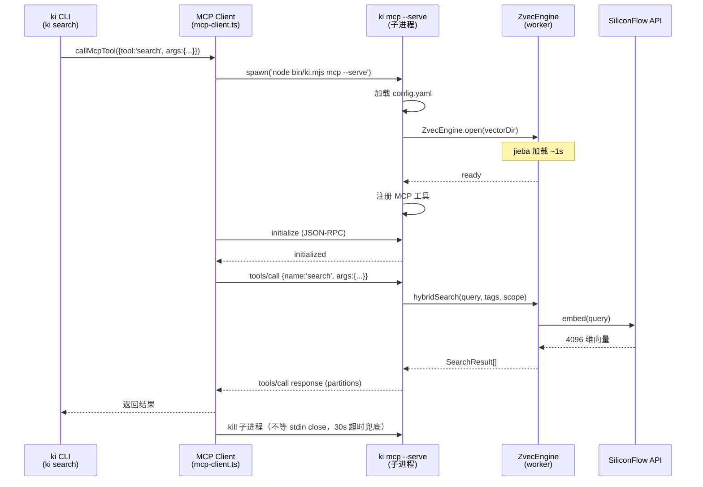

# S-04：CLI↔MCP Server stdio 通道

> 覆盖 REQ-12（CLI↔MCP server 通信通道）。共享术语见父文档 §3.2。

## 1. 术语

| 术语 | 含义 | 引用 |
|------|------|------|
| stdio 通道 | CLI spawn `ki mcp --serve` 子进程，通过 stdin/stdout 进行 MCP 协议通信 | 见父文档 §3.2 |
| per-call spawn | CLI 每次向量命令 spawn 一个临时 MCP server 子进程，通信后退出 | 见父文档 §3.2 |
| `--serve` 模式 | `ki mcp --serve` 以子进程模式运行 MCP server，不启动健康预检的阻塞流程，处理完请求后退出 | — |

## 2. 现状（AS-IS）

### 2.1 现状描述

CLI 命令（`ki search`/`ki store` 等）是短命 Node 进程，通过 `mem-client.ts` 的 `execFileSync('mem', ...)` 或 `spawnSync` 同步调用 mem CLI。MCP Server（`ki mcp`）是独立常驻进程，使用 `StdioServerTransport` 与 AI Agent 通信，CLI 不经过 MCP Server。

### 2.2 痛点

- 痛点 1：换 zvec 后，zvec 文件锁排他（基座模块 v6 实测），CLI 无法与 MCP Server 同时打开同一 collection
- 痛点 2：CLI 每次 `ZVecOpen` 加载 jieba 词典 ~1s（基座模块 worker 启动成本）
- 痛点 3：CLI 直接调 ZvecEngine 需要在 14 个消费文件中各自处理 open/close/锁，重复且易错

## 3. 方案（TO-BE）

### 3.1 方案概述

**选定方案甲 + 部署模型 Y（2026-07-21 拍板）**：引入**独立守护进程** `ki server`，单一持有 zvec rw 句柄，以**单一 HTTP 通道（StreamableHTTP）同时服务 CLI 与 AI Agent**：

- **HTTP 通道（给 CLI 与 Agent 共用）**：`ki server` 监听本地 HTTP（MCP StreamableHTTP）。CLI 向量命令与 AI Agent **都经 HTTP 复用 server 已持有的句柄**，彻底避开 zvec 跨进程排他锁冲突。Agent 不再 spawn 子进程、不再用 stdio——它和 CLI 一样是 HTTP 客户端，区别仅在于 Agent 常驻、CLI 短命。
- **stdio `--serve` 仅作兜底**：仅在**本地没有 `ki server` 守护进程**时启用（如未启动 server 的单机 CLI 用法）。此时 CLI 按现有 per-call spawn `ki mcp --serve`（stdio）工作，无锁冲突；但 Agent 在这种"无守护"模式下**不可用时无法走 stdio**，必须提示用户先 `ki server start`。

> 为什么 Y 而非 X：X 要求 Agent 亲自 spawn server 为子进程（stdio 才能被 Agent 拥有），等于把"常驻 server"的生命周期绑在 Agent 上，与"常驻"心智模型冲突；而 cli 的 stdio 兜底已由独立的 `--serve` 路径保留，stdio 不必是 Agent 的常驻通道。故 Y：守护进程归用户/系统托管，Agent 改连 HTTP。

> **多项目模型统一（解决 N10 · 2026-07-21）**：`ki server` 是**单一全局 daemon**（绑定单一 `config.yaml` + **单一 collection**，由 `vectorDir` 决定），Agent 在 IDE 静态登记**一个**端点（`http://127.0.0.1:18789/mcp`）即可服务全部项目；**项目切换不切 daemon**，而由工具调用携带 `scope` 元数据（S-01 三层 fallback）实现。即「多项目」= `scope` 区隔，而非「多 daemon 多端口」，彻底消解 v5 N10 的「固定端点 × 多 daemon 端口」冲突。工具目标寻址 = `scope` × `tags`（`tags`∈{ki-search,ki-path,ki-relation}，S-05 既有，非独立 collection）见 S-06 §3.5；同机多 ki 配置的高级多 daemon 场景才需多端点，由用户/IDE 分别登记。

**本地写入命令的冲突兜底（用户明确诉求，已收敛）**：`store`/`bulk_store`/`sync_relation`/`delete_relation`/`manage_index` 等**写命令默认经 HTTP 复用 server 句柄（无缝、不提示）**。仅当用户显式要求**本地执行**（写命令加 `--local` 标志，或 `ki import-kb`/`ki restore` 这类必须独占 collection 的批量重建操作）时，才走本地 `open`：此时若 daemon 持锁，CLI **先提示「MCP 守护进程正在运行（pid X），关闭它以本地执行？[Y/n]」**（并警告关闭会断开任何已连接的 Agent），确认后 `ki server stop` 再本地执行；拒绝则回退 HTTP 执行。读取类命令（`search`/`query_group`/`get_module_info`）永远透明走 HTTP，无提示。

> **写提示语义溯源（N2 决策·2026-07-21 用户澄清）**：用户最初「MCP 运行时本地写命令需提示关闭 MCP」的诉求，诞生于 **stdio MCP 时代**——彼时 MCP 以 stdio 常驻、持进程锁，CLI 的 `import`/写入命令因锁冲突会失败，故需提示关闭 MCP。**但模型 Y 下 daemon 是 HTTP 模式，写命令经 HTTP 复用 daemon 句柄，根本不存在锁冲突，也就无需提示**（用户原话：「如果 mcp 服务是 http 模式，则不存在这样的问题」）。故收敛为：正常写命令静默走 HTTP（无缝、不提示）；仅 `import-kb`/`restore` 这类**必须本地独占重建**、无法经 HTTP 执行的批量操作，以及显式 `--local`，才提示关闭 daemon。这既消除了 stdio 时代的失败痛点，又忠实于用户「冲突时才提示」的本意。

> 实测依据：`test/zvec-lock-demo/` 的 demo 验证 zvec 锁为**跨进程排他**——任一进程持 rw 锁时，其他进程（ro 或 rw）`open` 立即抛 `Can't lock .../LOCK`（0–1ms，不阻塞）。故本地 `open` 仅在 daemon 未持锁时可行；稳态下唯一锁持有者是 daemon，CLI/Agent 都复用其 HTTP 句柄。详见 `review/scenario-rehearsal-v2.md` 附录。

### 3.2 关键决策点

| 决策 | 选择 | 理由 | 备选方案 | 否决原因 |
|------|------|------|---------|---------|
| 传输架构（CLI↔server） | **常驻 server + HTTP 二通道（方案甲）** | 解决 zvec 跨进程排他锁冲突：server 单一持锁，CLI 经 HTTP 复用其句柄；demo 实测锁跨进程排他且 fail-fast | 纯 stdio per-call | stdio 进程级单连接，CLI 无法复用 Agent 的 server 通道，spawn 子进程会与 server 抢锁失败 |
| CLI 是否复用常驻 server | **是（server 在跑时走 HTTP）** | 避免锁冲突，读写都经 server 句柄 | 否（仅 per-call spawn） | 与跨进程排他锁冲突，spawn 子进程 open 必失败 |
| 持久 server 暴露通道 | **单一 HTTP（CLI 与 Agent 共用 StreamableHTTP）** | 模型 Y：守护进程归用户托管，Agent 与 CLI 同为 HTTP 客户端；stdio 无法满足"已运行进程被客户端 attach" | 仅 stdio | stdio 下客户端无法 attach 已运行守护进程，且 CLI 仍抢锁 |
| Agent 连接方式 | **Agent 改连 HTTP（StreamableHTTP）** | 模型 Y：Agent 是 HTTP 客户端，与 CLI 共用 daemon 句柄；不再 spawn `--serve` | Agent 亲自 spawn server（模型 X） | X 把 server 生命周期绑在 Agent 上，背离"常驻"语义 |
| CLI stdio 模式 | **保留 `--serve` 仅作「无 daemon」兜底** | 未启动 server 的单机 CLI 仍按原 per-call stdio 工作；但 Agent 在此模式下不可用，须提示先 `ki server start` | 移除 | 破坏无 server 时的可用性 |
| 本地写入命令遇 server 持锁 | **仅 `--local`/批量重建（import-kb/restore）触发提示** | 用户原话诉求诞生于 stdio MCP 锁冲突时代；模型 Y 下 daemon 为 HTTP，写命令经 HTTP 复用句柄无锁冲突、无需提示（"http 模式则不存在这样的问题"）；仅 `import-kb`/`restore` 必须本地独占重建（无法走 HTTP）及显式 `--local` 才提示关闭 daemon | 所有写命令都提示 | stdio 时代才需；HTTP 模型下正常写无冲突，每次写都提示会频繁打断且矛盾 |
| 提示关闭后的处置 | Y→`ki server stop` 后本地执行；n→回退 HTTP | daemon 是稳态下唯一锁持有者，stop 安全；提示须警告"关闭会断开已连接 Agent" | 直接 kill LOCK pid | 可能误杀 Agent（模型 X 下才存在 Agent-spawned --serve 歧义，Y 下已消除） |
| 超时 | 30s（HTTP 请求含 embedding） | 大批量写入可能耗时，留足余量 | 10s | 可能超时 |

### 3.3 行为差异对照表

| 场景 | AS-IS | TO-BE（模型 Y） | 影响 |
|------|-------|-------|------|
| CLI 向量命令执行 | `execFileSync('mem')` 同步 | daemon 在跑→HTTP 异步；无 daemon→spawn `ki mcp --serve` stdio 兜底 | 内部变更（接口不变） |
| CLI 与常驻 server 并存 | 不支持 | **支持**：CLI（HTTP）+ Agent（HTTP）共用 daemon 句柄，无冲突 | 新增能力（主场景） |
| CLI 延迟 | ~4s（mem 冷启动 + lancedb + embedding） | ~1s（HTTP 复用热句柄，免 jieba 重加载） | 性能提升 |
| 锁冲突（daemon 运行时 CLI 读） | 不存在 | 不存在（透明走 HTTP） | 无冲突 |
| 锁冲突（daemon 运行时 CLI 默认写） | 不存在 | 不存在（默认写也走 HTTP 复用句柄） | 无冲突、无缝 |
| 锁冲突（daemon 运行时 CLI `--local`/批量重建写） | 不存在 | 提示「关闭 daemon（pid X）以本地执行？[Y/n]」（警告会断开 Agent）→ Y 停 daemon 本地写；n 回退 HTTP | 体验兜底（非静默失败） |
| 无 daemon 时 CLI 命令 | 各自独立 | 各自独立（per-call stdio spawn）；但 Agent 须先 `ki server start` 才可用 | 无冲突 |
| Agent 连接方式 | spawn `ki mcp --serve` stdio | **改连 daemon HTTP（StreamableHTTP）**，不再 spawn `--serve` | Agent 集成改造 |

### 3.4 常驻 server 与写入提示流程

**生命周期归属（N1 决策·2026-07-21 拍板：纯手动启动）**

> v1 **不**提供 systemd --user / launchd 自启，也**不**做首次访问惰性自启（惰性自启会让 Agent 隐式拥有 daemon 生命周期，退化为模型 X 实质，与 Y 矛盾）。daemon **由用户手动 `ki server start` 启动**，作为有意的运维边界。代价：daemon 未运行时 Agent 的记忆能力不可用——此时 Agent 连接失败并提示用户「请先 `ki server start`」，而非自行拉起。文档须明确该运维步骤。（daemon 实现语言与形态见 S-06 §3.1 / §3.4：N9 决策为 **Node 自研 daemon**，复用 `scripts/mcp-server.ts` + `StreamableHTTPServerTransport`，官方 Python server 仅作工具面参考。）

**`ki server` 生命周期（新增，独立守护进程）**

| 命令 | 行为 |
|------|------|
| `ki server start` | 启动**独立守护进程**，持 rw 锁，监听 HTTP（StreamableHTTP，端口取 `config.yaml` 或默认），写 pidfile（`~/.ki/zvec-server.pid`）；已运行则拒绝并报告 |
| `ki server stop` | 读 pidfile，优雅停止 daemon 并释放锁 |
| `ki server status` | 检查 HTTP 健康（`GET /health`）+ pidfile 存活校验 |

**CLI 命令路由（probe 优先，模型 Y）**

```
CLI 命令启动
  ├─ probe(): 本地是否有 daemon 持锁？(HTTP 健康探测 / 读 pidfile)
  │     ├─ 有 daemon → 读取类 / 默认写入类: 透明走 HTTP（复用句柄，无提示）
  │     │             → 显式 --local / 批量重建(import-kb,restore): 提示「MCP 守护进程运行中(pid X)，关闭它以本地执行？[Y/n]（关闭会断开已连接 Agent）」
  │     │                  Y → ki server stop → 本地 open 执行
  │     │                  n → 回退 HTTP 执行
  │     └─ 无 daemon → 按原 per-call spawn `ki mcp --serve`（stdio）执行；
  │                     若本命令是 Agent 发起，则提示「请先 ki server start」
```

**依赖的跨子需求变更**

- S-06（MCP Server）：`ki server` 为**独立守护进程**，暴露单一 **HTTP（StreamableHTTP）** 通道，CLI 与 Agent 共用；`--serve` stdio 子进程模式保留为「无 daemon」兜底，但**Agent 集成禁止再 spawn `--serve`**（会与 daemon 抢锁），Agent 必须改连 HTTP。
- S-01（Config）：新增 `server.httpPort` 配置项。
- S-03（Vector Adapter）：暴露 `isLocked()` / `stopServer()` / 写命令 HTTP 工具（供 daemon 处理 CLI 与 Agent 的写请求）。

## 4a. 接口设计

### 4a.1 对外接口

```typescript
// scripts/lib/mcp-client.ts（新增）

interface McpClientOptions {
  timeout?: number;           // 默认 30s
  configPath?: string;        // 配置文件路径
}

/** 通过 spawn ki mcp --serve 子进程执行一次 MCP 工具调用 */
async function callMcpTool<T = unknown>(params: {
  tool: string;               // 工具名：search / store / bulk_store / ...
  args: Record<string, unknown>;
  options?: McpClientOptions;
}): Promise<T>;

/** 检查 ki mcp --serve 是否可用（快速探测，不发送实际请求） */
async function isMcpServeAvailable(): Promise<boolean>;
```

| 接口 | 输入 | 输出 | 异常 |
|------|------|------|------|
| `callMcpTool` | tool, args, options? | `Promise<T>`（工具返回值） | 子进程崩溃 / 超时 / 工具报错 |
| `isMcpServeAvailable` | — | `Promise<boolean>` | 不抛异常 |

### 4a.2 内部协作接口

```typescript
// 内部实现：使用 MCP SDK Client + StdioClientTransport
import { Client } from '@modelcontextprotocol/sdk/client/index.js';
import { StdioClientTransport } from '@modelcontextprotocol/sdk/client/stdio.js';

// spawn 命令：node bin/ki.mjs mcp --serve
// 子进程以 --serve 模式运行，注册工具后等待 stdio 请求
```

### 4a.3 契约变更声明

| 变更类型 | 接口 | 变更内容 | 影响的子需求 |
|---------|------|---------|------------|
| 新增 | `callMcpTool` | CLI 向量命令的统一入口 | S-03 消费方（14 文件中需要向量的 CLI 命令） |
| 新增 | `--serve` 模式 | `ki mcp --serve` 子进程模式 | S-06（MCP Server 实现 --serve） |

## +5. 时序图



> 注：上图展示**无 daemon 时的 stdio 兜底路径**（per-call spawn `ki mcp --serve`）。**模型 Y 主路径**为：CLI/Agent 经 HTTP StreamableHTTP 直连 `ki server` 守护进程（已持 rw 锁），不再 spawn 子进程、不二次 open。详见 §3.1、§3.4。

## +6. 异常处理

| 场景 | 行为 | 对外暴露 |
|------|------|---------|
| 子进程 spawn 失败（ki.mjs 不存在） | 抛 `McpSpawnError`，提示「ki 命令不可用」 | 是 |
| 子进程启动超时（>10s 未 ready） | 杀死子进程，抛 `McpTimeoutError`，提示「server 启动超时」 | 是 |
| 请求处理超时（>30s） | 杀死子进程，抛 `McpTimeoutError` | 是 |
| 子进程崩溃（非零退出） | 读取 stderr，抛 `McpCrashError`，含 stderr 内容。若 stderr 含 config/embedding/vectorDir 关键字，追加提示「请执行 `ki init` 生成配置或 `ki doctor` 诊断」 | 是 |
| stdio JSON-RPC 解析失败 | 抛 `McpProtocolError`，含原始输出 | 是 |
| 工具调用返回错误 | 透传工具错误信息 | 是 |
| CLI 读/默认写命令遇 daemon 持锁 | 透明走 HTTP 复用 daemon 句柄（Agent、CLI 共用），无冲突、不提示 | 否 |
| CLI `--local`/批量重建写遇 daemon 持锁 | 提示「MCP 守护进程运行中（pid X），关闭它以本地执行？[Y/n]（关闭会断开已连接 Agent）」；Y → `ki server stop` 后本地 open 执行；n → 回退 HTTP 执行 | 是 |
| 无 daemon 时 per-call stdio spawn open 失败 | 子进程 stderr 输出锁冲突信息；CLI 抛 `McpCrashError`，提示「另一个 ki 命令正在使用向量服务，请等待其完成后重试」 | 是 |
| Agent 集成仍 spawn `ki mcp --serve` | **禁止**：与 daemon 抢锁必 `Can't lock`。Agent 必须改连 `ki server` HTTP（StreamableHTTP） | 是（构建期约束） |
| `ki import-kb` / `ki restore`（批量重建，强制本地独占） | 检测 daemon 持锁 → 提示「MCP 守护进程运行中（pid X），关闭它以本地重建？[Y/n]」；Y → `ki server stop` 后本地执行；n → 中止 | 是 |
| daemon 单句柄长 bulk_store 阻塞 | 文档说明边界：单进程同步原生调用阻塞事件循环；长操作期间 Agent/其他 CLI 请求排队。必要时对该类操作限流或独立事务 | 否（已知边界） |
| 子进程收到 response 后未退出 | callMcpTool 收到 response 后主动 kill 子进程（不等 stdin close），加 30s 超时 kill 兜底 | 否 |

## +10. 影响范围

| 影响对象 | 影响类型 | 影响描述 | 破坏性 |
|---------|---------|---------|:------:|
| `scripts/lib/mcp-client.ts`（新增） | 新增 | CLI↔server 通信客户端 | 否 |
| `scripts/mcp-server.ts` | 行为变更 | 新增 `--serve` 模式（子进程模式，不阻塞等待 AI Agent） | 否 |
| `bin/ki.mjs` | 行为变更 | `mcp` 命令支持 `--serve` 参数 | 否 |
| `package.json` | 依赖变更 | 确认 `@modelcontextprotocol/sdk` 含 client 模块 | 否 |
| CLI 向量命令（search/store 等） | 行为变更 | 从直接调 mem-client 改为调 `callMcpTool` | 否（接口不变） |
| `ki import-kb` / `ki restore` | 行为变更 | 直接用 Vector Adapter（无对应 MCP 工具）；检测锁冲突时提示停止 server | 否（接口不变） |

> **注意**：S-03 的 14 个消费文件中，7 个 CLI 入口文件（search/store/bulk-store/sync-relation/delete-relation/query-group/manage-index）+ get-module-info 改用 `callMcpTool`；3 个 B 类库函数（path-search/path-vectorize/batch-vectorize）+ 2 个 A 类库函数（import/incremental）直接用 Vector Adapter。`ki import-kb` / `ki restore` 是例外：它们通过 B 类库函数直接使用 Vector Adapter，不走 `callMcpTool`（长运行多阶段操作，无对应 MCP 工具）。若 MCP Server 正在运行，这两个命令会锁冲突——检测后提示用户停止 server。
