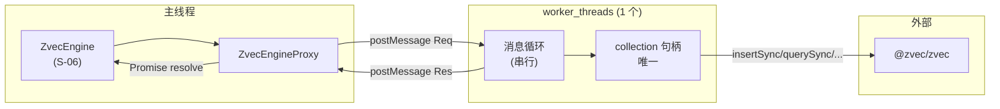
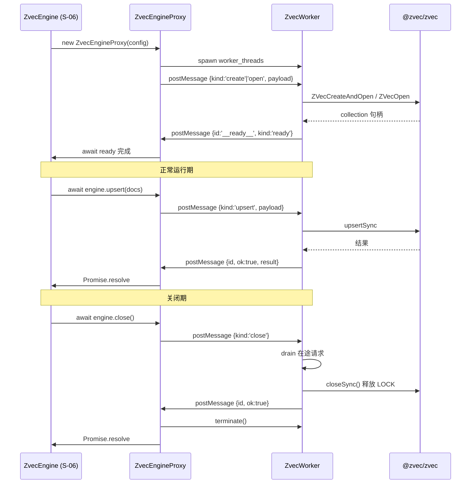

# S-04 Worker 线程与消息协议 · 设计

> 父文档：`ZVEC_ENGINE_DESIGN.md`
> 子需求编号：S-04
> 对应文件：`src/zvec-engine/{worker.ts, worker-protocol.ts, proxy.ts}`

---

## 1. 术语

| 术语 | 含义 | 引用 |
|---|---|---|
| `ZvecWorker` | 承载 zvec collection 句柄的 dedicated `worker_threads` 线程 | 本文件 §3 |
| `ZvecEngineProxy` | 主线程持有的 proxy，把所有方法调用转为 postMessage | 本文件 §3.1 |
| `WorkerMessage` | postMessage 消息协议（Req/Res） | 本文件 §4b |
| Transferable | `ArrayBuffer` 零拷贝所有权转移（用于向量） | 本文件 §3.2 |
| actor 模型 | 单 worker 串行处理消息，内部状态（句柄）不共享 | 本文件 §3.1 |
| ready 信号 | worker 完成 `ZVecOpen` 后向主线程发送的就绪消息 | 本文件 §3.4 |
| drain | `close()` 前等待在途请求完成 | 本文件 §3.4 |

---

## 2. 现状（AS-IS）

### 2.1 现状描述

v5 §5"不阻塞主事件循环"已锁定**单一 zvec worker（actor 模型）**，但未定义：
- 消息协议（请求/响应字段、id 关联、错误传递）
- proxy 如何把 async 方法调用映射到消息
- worker 入口文件如何被 `new Worker` 解析（tsc 产物下）
- worker ready/close/crash 的生命周期事件
- 向量跨线程的具体形式（`number[]` vs `Float32Array`）

### 2.2 痛点

- zvec Node 绑定（0.5.0）Async API 仅覆盖 `query/multiQuery/optimize/deleteByFilter`；`create/open/insert/upsert/update/delete` **仅 Sync** → 主线程直接调会阻塞事件循环（实测 insert 200 条 = 41.8ms）
- 锁是**文件级、进程内独占**（v4 实测 `Can't lock read-write collection`），主线程 + worker 无法同时持柄 → 必须单一 worker 独占
- `postMessage` 走 structuredClone，**无法传 collection 句柄** → 句柄必须在 worker 内创建
- 4096 维 `number[]` 拷贝成本高（约 130KB JSON 化） → 必须 Transferable

---

## 3. 方案（TO-BE）

### 3.1 方案概述



- **主线程**：`ZvecEngine`（S-06）调 `ZvecEngineProxy` 方法 → proxy 把调用打包成 `WorkerMessage` → `postMessage` 给 worker → 返回 `Promise`
- **worker**：启动时 `ZVecOpen`/`ZVecCreateAndOpen` 一次持有句柄 → 消息循环串行处理 → 调 zvec Sync API → `postMessage` 回结果
- **协议**：每条消息带 `id`（UUID）+ `kind` + `payload`；响应带同 `id` 关联；错误序列化为 `{name, message, code, stack}`

### 3.2 关键决策点

| 决策 | 选择 | 理由 | 备选方案 | 否决原因 |
|---|---|---|---|---|
| worker 数量 | **1 个**（actor） | 锁进程内独占，多 worker 无意义 | 多 worker（读/写分离） | read_only 也锁冲突（v4 实测） |
| 向量传输 | `Float32Array` + transfer list | 零拷贝，4096×4=16KB/条 | `number[]` structuredClone | 拷贝开销 + JSON 化损失精度 |
| 文本传输 | 普通 `string`（structuredClone） | 文本本身几 KB | Transferable `TextEncoder` 编码 | 编码/解码开销大于拷贝 |
| 消息 id | UUID v4（`crypto.randomUUID()`） | 冲突概率 0 | 自增序号 | proxy 重建后序号重置冲突 |
| worker 入口 | `new Worker(new URL('./worker.js', import.meta.url), { type: 'module' })` | tsc 产物下稳定可解析 | 传 `eval: true` + 内联代码 | 调试困难，sourcemap 失效 |
| worker 类型 | ESM（`type: 'module'`） | 与 `tsconfig.src.json` 输出对齐 | CJS | 项目整体 ESM |
| 串行 vs 并发 | **严格串行**（FIFO 队列） | 简单，避免句柄并发问题 | worker 内并发（Promise.all） | zvec Sync API 本身阻塞 worker 线程，无并发收益 |
| 写入让出 | 批量 `insertSync` 分批，每批间 `setImmediate` | 查询插队，降低尾延迟 | 一次性 insertSync 整批 | 大批量写入阻塞查询 |
| 错误传递 | `{ name, message, code, stack, data? }` | 完整保留类型化异常信息 | 只传 message | 丢失 `DimensionMismatchError` 等类型 |
| worker ready | worker 完成 open 后主动 `postMessage({kind:'ready'})` | 主线程 await ready 再接受调用 | 主线程立即接受调用，内部排队 | 排队期间调用方无法区分"open 失败"vs"处理中" |
| close 语义 | **顺序：drain → closeSync → terminate**。proxy 先发 `close` 消息 → worker drain 在途 → `closeSync()` 释放 LOCK → 回 ok → proxy 再 `terminate()` 回收线程 | 必须 `closeSync` 先执行完才能 terminate，否则 LOCK 不释放 | 先 terminate 再 closeSync | terminate 强杀线程后 closeSync 根本没机会执行（🔴#2 修复） |
| destroy 语义 | **worker 内执行**：proxy 发 `destroy` 消息 → worker 先 `closeSync()` 释放句柄 → 同 worker 内调 `ZVecDestroy(dbPath)` → 回 ok → proxy terminate | 与 close 同 worker 路径，避免主线程绕过句柄直接操作 | 主线程直接调 `ZVecDestroy` | 主线程无句柄状态，可能在 closeSync 未完成时抢跑（⚠️S-1 修复） |
| worker crash | `error`/`exit` 事件 → proxy reject 所有在途 + 标记不可用 | 清晰失败，由 S-06 决策重 spawn | 自动重 spawn | 重 spawn 时机应由 S-06 控制 |
| probe 实现 | 主线程**临时 spawn** 一次性 worker 尝试 open（**不传 collectionName**，zvec `ZVecOpen` 仅需 `path`+`readOnly`），立即 terminate | 与常驻 worker 同路径，行为一致；zvec open 从磁盘元数据恢复集合名，无需新名 | 主线程直接 ZVecOpen | 污染主线程句柄状态；且若传新集合名（如 `__probe__`）与持久化元数据不符会 open 失败（🔴#1 修复） |
| 写入批大小 | **默认 100 条/批**，可经 `WriteOptions.batchSize` 调整（下限 20 / 上限 500） | 实测 200 条 41.8ms → 100 条 ~21ms；兼顾"写入吞吐"与"查询尾延迟 ~21ms"；KiSearch 写入不频繁（扫描后批量灌库），21ms 尾延迟可接受 | 固定 20 条 | 吞吐下降 5×，灌库时间不可接受（⚠️S-2 修复） |

### 3.3 消息协议

#### 请求消息（主线程 → worker）

```typescript
type WorkerRequest =
  | { id: string; kind: 'create'; payload: CreatePayload }
  | { id: string; kind: 'open';   payload: OpenPayload }
  | { id: string; kind: 'close';  payload: { drainTimeoutMs?: number } }
  | { id: string; kind: 'destroy'; payload: { dbPath: string } }
  | { id: string; kind: 'info';   payload: {} }
  | { id: string; kind: 'upsert'; payload: WritePayload }
  | { id: string; kind: 'insert'; payload: WritePayload }
  | { id: string; kind: 'update'; payload: WritePayload }
  | { id: string; kind: 'delete'; payload: { ids: string[] } }
  | { id: string; kind: 'fetch';  payload: { ids: string[]; includeVector?: boolean } }
  | { id: string; kind: 'listIds'; payload: { filterSql?: string; limit: number } }
  | { id: string; kind: 'query';  payload: QueryPayload }
  | { id: string; kind: 'multiQuery'; payload: MultiQueryPayload }
  | { id: string; kind: 'optimize'; payload: {} }
  | { id: string; kind: 'createIndex'; payload: { field: string; indexParam: object } }
  | { id: string; kind: 'dropIndex';   payload: { field: string } };

interface WritePayload {
  docs: Array<{
    id: string;
    text?: string;
    vector?: Float32Array;    // Transferable；预计算 vector 或主线程已 embed
    fields?: Record<string, ScalarValue>;
  }>;
}

interface QueryPayload {
  fieldName: string;
  vector?: Float32Array;       // Transferable
  fts?: { matchString: string } | { queryString: string };
  topk: number;
  filterSql?: string;
  outputFields?: string[];
}

interface MultiQueryPayload {
  queries: Array<{
    fieldName: string;
    vector?: Float32Array;     // Transferable
    fts?: { matchString: string };
  }>;
  topk: number;
  rerank: { type: 'rrf'; rankConstant?: number } | { type: 'weighted'; weights: number[] };
  filterSql?: string;
  outputFields?: string[];
}
```

#### 响应消息（worker → 主线程）

```typescript
type WorkerResponse =
  | { id: string; ok: true;  result: unknown }
  | { id: string; ok: false; error: SerializedError }
  | { id: '__ready__'; kind: 'ready' };
  // 注：v1 不引入带外日志通道（__log__），关键事件（open 成功/close 完成/crash）经
  // ready 响应 + 业务响应 + error 事件已足够覆盖；后续如需可观测性再加

interface SerializedError {
  name: string;                // 'DimensionMismatchError' | 'CollectionLockedException' | ...
  message: string;
  code?: string;               // 业务错误码（如 'ZVEC_ALREADY_EXISTS'）
  stack?: string;
  data?: Record<string, unknown>;
}

// info 消息的 result 类型（worker → 主线程）
interface InfoResult extends PersistedSchema {
  docCount: number;
  locked: false;               // 实例 info() 调用时恒 false（自身持锁）；
                               // "是否被其他进程持锁"语义仅 ZvecEngine.probe 静态方法提供
}
```

### 3.4 生命周期



#### 状态机

```
[init] --spawn--> [opening] --ready--> [open]
[opening] --open 失败--> [failed] (proxy reject 所有后续调用)
[open] --close 调用--> [closing] --drain 完成--> [closed]
[open] --worker error/exit--> [crashed] (proxy reject 在途 + 后续)
[closed/crashed/failed] --不再接受任何调用-->
```

### 3.5 写入让出（查询插队）

worker 内批量写入循环：
```typescript
for (const batch of chunkBy(docs, 100)) {
  collection.insertSync(batch);
  await new Promise(resolve => setImmediate(resolve));  // 让出，处理积压查询消息
}
```
消息循环本身按 FIFO 处理；`setImmediate` 之间到达的查询消息会被插入下一批之前处理。

---

## 4. 接口设计 + 数据模型

### 4a. 接口设计

#### proxy.ts（主线程侧）

```typescript
export class ZvecEngineProxy {
  constructor();
  spawn(config: ZvecEngineConfig | ZvecEngineOpenConfig, mode: 'create' | 'open'): Promise<PersistedSchema>;
  send<T>(kind: WorkerRequest['kind'], payload: unknown, transfer?: Transferable[]): Promise<T>;
  close(): Promise<void>;
  terminate(): Promise<void>;
  isOpen(): boolean;
  onCrash(cb: (err: Error) => void): void;
}
```

#### worker.ts（worker 侧入口）

```typescript
// 该文件作为 new Worker 入口，不参与主线程 import
// 内部：
//   1. 监听 parentPort 'message'
//   2. 反序列化 WorkerRequest
//   3. 调用 zvec 对应 Sync API
//   4. postMessage WorkerResponse
//   5. create/open 完成后 postMessage {id:'__ready__', kind:'ready'}
```

#### worker-protocol.ts（共享）

```typescript
export type { WorkerRequest, WorkerResponse, WritePayload, QueryPayload, MultiQueryPayload, SerializedError };
export function serializeError(err: unknown): SerializedError;
export function deserializeError(se: SerializedError): Error;  // 按 name 重建类型化异常
export function collectTransferables(payload: unknown): Transferable[];  // 扫描 payload 中所有 Float32Array.buffer
```

| 接口 | 输入 | 输出 | 异常 |
|---|---|---|---|
| `ZvecEngineProxy.spawn` | config + mode | `PersistedSchema` | open 失败的类型化异常 |
| `ZvecEngineProxy.send` | kind + payload + transfer | `T`（按 kind 不同） | worker 侧业务异常 / 超时 |
| `ZvecEngineProxy.close` | — | void | — |
| `serializeError` | 任意异常 | `SerializedError` | — |
| `deserializeError` | `SerializedError` | 类型化异常实例 | — |

### 4b. 数据模型

（已在 §3.3 完整定义，此处不重复）

---

## 5. 异常处理

| 场景 | 行为 | 是否对外暴露 |
|---|---|---|
| worker spawn 失败（如入口文件不存在） | proxy `spawn()` reject，标 `WorkerSpawnError` | 是 |
| worker `ZVecOpen` 失败（锁/不存在/损坏） | worker 发 `ok:false` + `SerializedError`，proxy 反序列化为对应类型化异常 reject | 是 |
| worker 运行中 crash | proxy `onCrash` 回调 + reject 所有在途 + 后续调用立即 reject `WorkerCrashedError` | 是 |
| 消息 id 不匹配 | proxy 丢弃该响应（defensive），不 reject | 否 |
| `send` 时 worker 已 closed/crashed | 立即 reject `WorkerUnavailableError` | 是 |
| `close` 期间在途请求 | drain（等待完成）；超过 `closeTimeoutMs`（默认 5000）→ terminate + reject `CloseTimeoutError` | 是 |
| Transferable 已被 transfer 后再次访问 | 主线程侧 try/catch 标 `WorkerProtocolError` | 是 |
| `destroy` 时 worker 仍 open | proxy 先 `close` 再 `destroy` | 否（透明） |

---

## 6. 性能 & 安全

### 性能

- **postMessage 往返**：~0.1ms（实测），叠加 zvec 查询 0.68ms ≪ 5ms 目标
- **Transferable 向量**：零拷贝，16KB/条 vs `number[]` structuredClone ~130KB JSON 化
- **大批量写入**：200 条 41.8ms；分批 100 + setImmediate 让出，查询尾延迟从 41.8ms 降到 ~21ms
- **不做的优化**：多 worker（锁独占无收益）、自定义二进制协议（postMessage 已够快）、共享内存 SharedArrayBuffer（复杂度远超收益）

### 安全

- worker 入口文件路径用 `new URL(..., import.meta.url)` 解析，**禁止外部传入**
- 消息协议字段白名单（kind 枚举）；未知 kind 直接 reject `WorkerProtocolError`
- `payload` 大小上限 100MB（`postMessage` 默认上限），防 OOM

---

## 7. 测试方案

| 类型 | 范围 | 工具 |
|---|---|---|
| 单元测试 | `serializeError`/`deserializeError` 7 种类型化异常往返 | node:test |
| 单元测试 | `collectTransferables` 扫描嵌套 payload | node:test |
| 集成测试 | spawn → create → ready → upsert → query → close 全链路（真 zvec db 临时目录） | node:test |
| 集成测试 | open 锁冲突 → `CollectionLockedException` | node:test |
| 集成测试 | worker crash（process.exit）→ proxy reject 在途 | node:test |
| 集成测试 | close drain：close 时有 3 个在途请求，全部完成后 terminate | node:test |
| 集成测试 | 大批量写入中查询插队（1000 条 upsert + 100 次 query 并发） | node:test |

不在测试范围内：
- worker 内存泄漏压测（属二期健壮性）
- 跨平台 worker spawn（Windows/macOS 留 issue 跟踪）

---

## 8. 待定问题

| 编号 | 问题 | 影响范围 | 建议决策时间 | 负责人 |
|---|---|---|---|---|
| T-05 | worker 崩溃后是否自动重 spawn 并恢复在途请求 | S-04, S-06 | 一期完成后（二期健壮性） | 实现者 |
