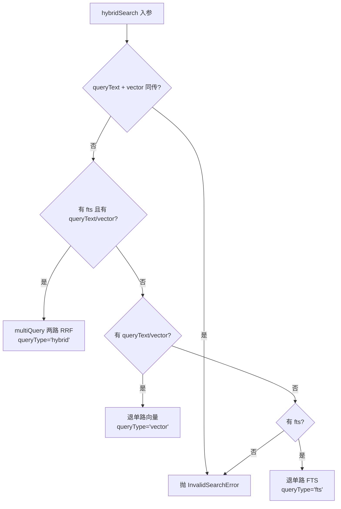
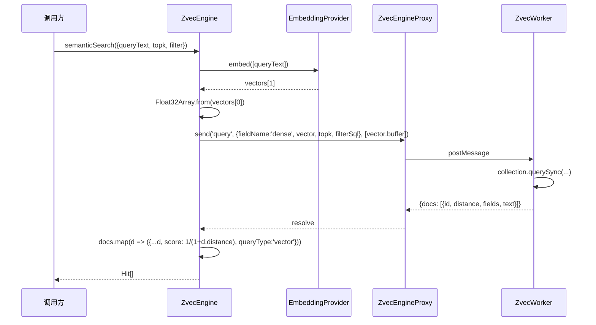
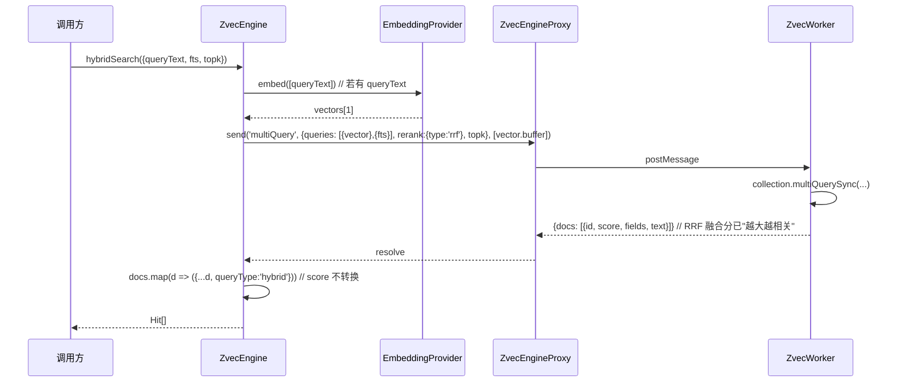

# S-05 检索路由与 score 归一化 · 设计

> 父文档：`ZVEC_ENGINE_DESIGN.md`
> 子需求编号：S-05
> 对应文件：`src/zvec-engine/search/{router.ts, normalize.ts}`

---

## 1. 术语

| 术语 | 含义 | 引用 |
|---|---|---|
| `HybridSearchReq` | 混合检索请求（queryText/vector/fts 三选一/组合） | 本文件 §4b |
| `SemanticSearchReq` | 语义检索请求（queryText，内部转 vector） | 本文件 §4b |
| `VectorSearchReq` | 向量检索请求（直接给 vector） | 本文件 §4b |
| `FtsSearchReq` | FTS 关键词检索请求（match） | 本文件 §4b |
| 退化矩阵 | hybridSearch 按可用输入自动降级路由的规则 | 本文件 §3.2 |
| score 归一化 | vector 路 `1/(1+distance)` 转换为"越大越相关" | 本文件 §3.3 |
| `queryType` | Hit 的来源标识（'vector'/'fts'/'hybrid'），仅说明，不影响 score 方向 | v5 §4.4 |

---

## 2. 现状（AS-IS）

### 2.1 现状描述

v5 §4.3 已定义 4 类检索请求结构与退化矩阵，§4.4 定义了 `Hit` 结构与 score 归一化原则，但：
- 未定义"主线程 embed → worker 检索"的具体编排（哪一步在哪侧）
- 未定义 `score = 1/(1+distance)` 的边界（distance 缺失/负数/NaN）
- 未定义 `weighted` 融合在"fts BM25 数值碾压 vector"实测下如何标记
- 未定义 `outputFields` 缺省时返回哪些字段

### 2.2 痛点

- 退化矩阵若不收敛到单一入口，S-06 engine 会在每个检索方法里重复 if/else
- score 归一化若在 worker 内做，主线程单测无法覆盖；若在主线程做，worker 又需多传 distance
- `weighted` 已被 v4 实测"fts 数值碾压"，若不在设计层标记"实验性"，调用方可能误用

---

## 3. 方案（TO-BE）

### 3.1 方案概述

`search/router.ts` 提供 `routeSearch(req, side)` 统一编排 4 类检索的退化路径；`search/normalize.ts` 提供 `normalizeScore(distance, metric)` 纯函数。**score 归一化在主线程做**（worker 返回原始 distance + 文档数据，主线程转 score），便于单测覆盖。

### 3.2 关键决策点

| 决策 | 选择 | 理由 | 备选方案 | 否决原因 |
|---|---|---|---|---|
| 路由入口 | `router.ts` 单一函数 `routeSearch` | 4 类检索共用退化矩阵 | 每个检索方法各自实现 | 重复逻辑，难维护 |
| score 归一化位置 | **主线程**（worker 返回 distance） | 单测易覆盖；worker 只做 zvec 调用 | worker 内归一化 | 单测需起 worker，重 |
| `hybridSearch` 默认 rerank | `{ type: 'rrf', rankConstant: 60 }` | v4 实测 weighted 被 fts 碾压 | `weighted` |  fts BM25 量级 1~30+，vector ∈ (0,1]，尺度不匹配 |
| `weighted` 融合 | **标记 `@experimental`**，JSDoc 警告 + 文档标注 | v4 实测风险 | 直接不暴露 | 违背 v5 §4.3 契约 |
| `queryText` + `vector` 同传 | 抛 `InvalidSearchError`（互斥校验，**仅检索侧**） | v3 推演 #5 遗留；与 v5 §4.2 写入侧"`text` 与 `vector` 并存"语义不冲突——写入侧 text/vector 可并存（vector 为准、text 仅写 FTS），但检索侧 queryText 的唯一作用是 embed 成 vector，与已给 vector 语义等价，并存会产生歧义（用哪个） | 静默 vector 优先 | 行为不直观，调用方不知哪个生效（🔴#3 修复：明确"写入侧并存 OK / 检索侧互斥 OK"的语义边界） |
| `outputFields` 缺省 | 返回 `fts.field` + 所有 `scalarFields` | v5 §4.3 定义 | 仅返回 fts.field | 标量字段（tag/scope）是过滤/展示刚需 |
| `includeVector` 默认 | `false` | 省带宽；4096 维 16KB/条 | `true` | 检索场景极少需要向量 |
| `topk` 上限 | 1000 | 对齐 zvec-mcp-server-tools.md L290 | 10000 | zvec 性能拐点 |
| `listIds` 上限 | 10000（与 topk 区分，扫描场景） | v5 §4.5 定义 | 与 topk 一致 1000 | listIds 无排序开销，允许更大 |
| 空 `queryText`/`vector`/`fts` | 抛 `InvalidSearchError`（三者皆缺） | v5 §4.3 退化矩阵末支 | 返回空数组 | 静默错误 |

### 3.3 退化矩阵（v5 §4.3 原样继承）



### 3.4 score 归一化规则

| 检索类型 | 原始返回 | 归一化 | 说明 |
|---|---|---|---|
| vector（COSINE） | distance ∈ [0, 2]，越小越相似 | `score = 1 / (1 + distance)` → ∈ [1/3, 1]，越大越相关 | 主线程转换 |
| fts | BM25 原值，越大越相关 | 不转换 | zvec 已"越大越相关" |
| hybrid（RRF） | RRF 融合分，越大越相关 | 不转换 | — |
| hybrid（weighted） | 加权和，方向依赖权重 | 不转换，**标记实验性** | — |

**边界处理**：
- `distance < 0` 或 `distance > 2` → 视为 zvec 异常，clamp 到 `[0, 2]` 区间
- `distance` 为 `NaN`/`undefined` → 该 Hit 丢弃 + 警告日志
- `metric !== 'COSINE'` → 抛 `SchemaMismatchError`（v5 已限定 COSINE，此处防御）

### 3.5 检索执行编排

#### semanticSearch（主线程编排）



#### hybridSearch（两路融合）



---

## 4. 接口设计 + 数据模型

### 4a. 接口设计

```typescript
// search/router.ts
export interface RoutedSearch {
  kind: 'query' | 'multiQuery';
  payload: QueryPayload | MultiQueryPayload;  // 见 S-04 §3.3
  queryType: 'vector' | 'fts' | 'hybrid';
  needsEmbed: boolean;
  embedTexts?: string[];                       // 若 needsEmbed
}

export function routeSearch(
  req: SemanticSearchReq | VectorSearchReq | FtsSearchReq | HybridSearchReq,
  ctx: { denseField: string; ftsField?: string }
): RoutedSearch;

// search/normalize.ts
export function normalizeVectorScore(distance: number, metric: 'COSINE'): number;
export function toHit(raw: RawHit, queryType: 'vector'|'fts'|'hybrid', metric: 'COSINE'): Hit;
```

| 接口 | 输入 | 输出 | 异常 |
|---|---|---|---|
| `routeSearch` | 4 类检索请求 + 集合上下文 | `RoutedSearch` | `InvalidSearchError` |
| `normalizeVectorScore` | distance + metric | score ∈ [1/3, 1] | `SchemaMismatchError` |
| `toHit` | worker 返回 + queryType + metric | `Hit` | — |

### 4b. 数据模型

#### 检索请求（v5 §4.3 原样继承）

```typescript
export interface SearchOptions {
  topk?: number;
  filter?: Filter;
  outputFields?: string[];
  includeVector?: boolean;
}

export interface SemanticSearchReq extends SearchOptions { queryText: string; }
export interface VectorSearchReq  extends SearchOptions { vector: number[]; }
export interface FtsSearchReq     extends SearchOptions { match: string; }

export interface HybridSearchReq extends SearchOptions {
  /**
   * 语义侧文本（内部 embed 成 vector）。
   * **与 `vector` 互斥**：同传抛 `InvalidSearchError`。
   * 注：v5 §4.2 写入侧 `text`/`vector` 可并存（vector 为准、text 仅写 FTS），
   * 但检索侧 `queryText` 唯一作用就是 embed 成 vector，与已给 `vector` 语义等价，故互斥。
   */
  queryText?: string;
  /** 语义侧预计算向量（与 `queryText` 互斥） */
  vector?: number[];
  /** 关键词侧串（独立字段，不与 queryText/vector 互斥） */
  fts?: string;
  rerank?: {
    type: 'rrf' | 'weighted';
    weights?: Record<string, number>;
    rankConstant?: number;
  };
}
```

#### Hit（v5 §4.4 原样继承）

```typescript
export interface Hit {
  id: string;
  score: number;
  queryType: 'vector' | 'fts' | 'hybrid';
  fields: Record<string, ScalarValue>;
  text?: string;
  vector?: number[];
}
```

#### Worker 返回的原始结构（内部）

```typescript
export interface RawHit {
  id: string;
  distance?: number;          // vector 路返回；fts/hybrid 无
  score?: number;             // fts/hybrid 路返回
  fields: Record<string, ScalarValue>;
  text?: string;
  vector?: Float32Array;      // 仅 includeVector=true
}
```

---

## 5. 异常处理

| 场景 | 行为 | 是否对外暴露 |
|---|---|---|
| `queryText` + `vector` 同传 | 抛 `InvalidSearchError('queryText and vector are mutually exclusive')` | 是 |
| 三者皆缺（hybridSearch） | 抛 `InvalidSearchError` | 是 |
| `topk > 1000` | 抛 `InvalidSearchError` | 是 |
| `topk ≤ 0` | 抛 `InvalidSearchError` | 是 |
| `vector.length !== dimension` | 抛 `DimensionMismatchError` | 是 |
| `fts` 检索但集合未配 FTS | 抛 `InvalidSearchError('collection has no fts config')` | 是 |
| `rerank.type === 'weighted'` 但 `weights` 缺失 | 抛 `InvalidSearchError` | 是 |
| `rerank.weights` 数量与 `queries` 不等长 | 抛 `InvalidSearchError` | 是 |
| `distance` 为 NaN | 该 Hit 丢弃 + warn 日志 | 否（透明） |

---

## 6. 性能 & 安全

### 性能

- 不含 embed 的检索（vectorSearch/ftsSearch）<5ms（基准 0.8ms 均值）
- 含 `queryText` 的检索：总时延 = embed RTT（数百 ms）+ <5ms
- `includeVector: true` 时单 Hit 增加 16KB（4096×4B），topk=10 → 160KB，可接受
- 不做的优化：score 归一化 SIMD 化（微秒级，无意义）、Hit 对象池（GC 压力小）

### 安全

- `filter` 经 S-02 `compileFilter` 编译（白名单 + 转义），不直接拼字符串
- `match`/`queryText` 长度上限 10000 字符（防 DoS）
- `outputFields` 校验必须是已声明 `scalarFields` 或 `fts.field`，未声明字段抛 `InvalidSearchError`

---

## 7. 测试方案

| 类型 | 范围 | 工具 |
|---|---|---|
| 单元测试 | 退化矩阵 4 条路径（hybrid/vector/fts/InvalidSearchError） | node:test |
| 单元测试 | queryText+vector 同传互斥 | node:test |
| 单元测试 | `normalizeVectorScore` 边界（d=0/0.5/1/2/clamp 外） | node:test |
| 单元测试 | `toHit` vector 路 score 转换 + fts 路 score 直通 | node:test |
| 单元测试 | `topk` 边界（0/1/1000/1001） | node:test |
| 集成测试 | 真 zvec db：upsert 100 条 → 4 类检索 → score 方向断言 | node:test |

不在测试范围内：
- 真实 embedding 的 Recall@5 验收（实现后手动跑 compare.py 语料）

---

## 8. 待定问题

| 编号 | 问题 | 影响范围 | 建议决策时间 | 负责人 |
|---|---|---|---|---|
| T-02 | `score=1/(1+distance)` 公式在真实 embedding 下是否满足"自检索 top1≈1、不相关≈1/3" | S-05 | 实现完成后与 Recall@5 一并验证 | 实现者 |
