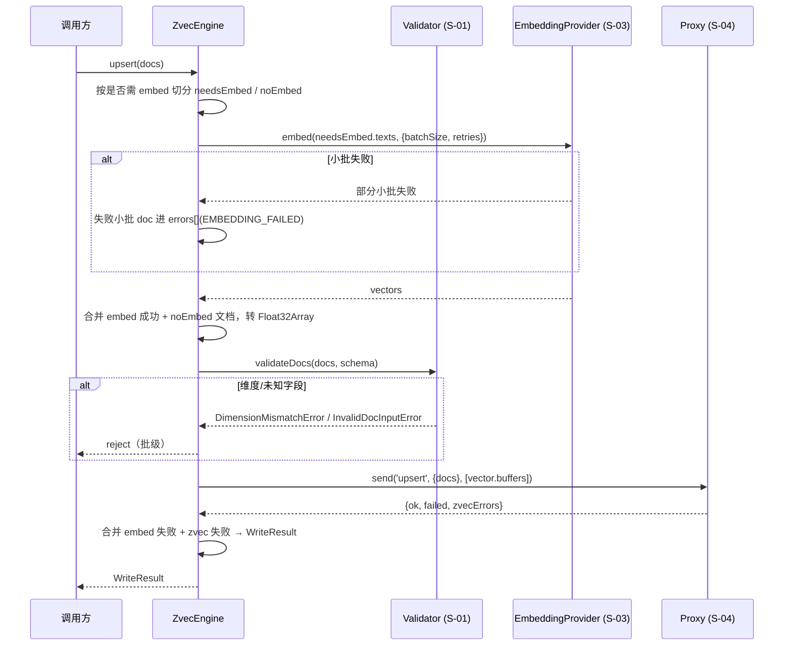
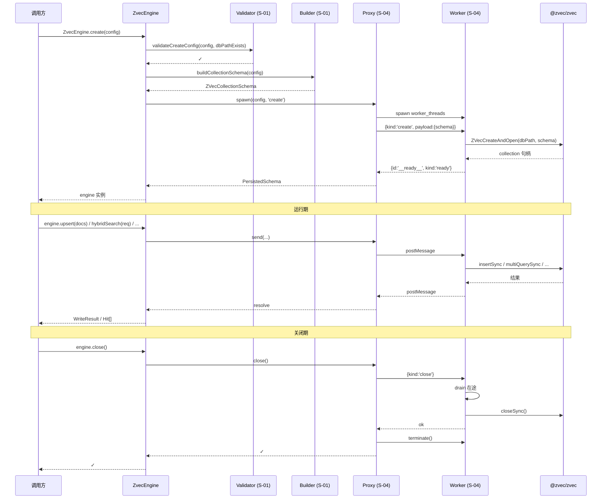
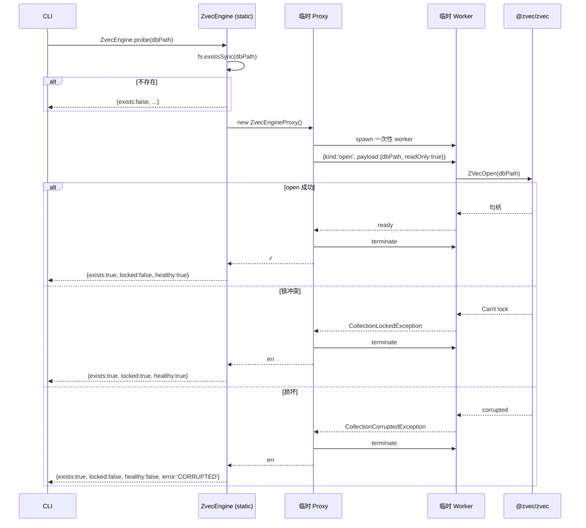

# S-06 ZvecEngine 门面与生命周期 · 设计

> 父文档：`ZVEC_ENGINE_DESIGN.md`
> 子需求编号：S-06
> 对应文件：`src/zvec-engine/{engine.ts, errors.ts, index.ts}`

---

## 1. 术语

| 术语 | 含义 | 引用 |
|---|---|---|
| `ZvecEngine` | 基座对外门面类，所有方法的调用入口 | 本文件 §4a |
| `WriteResult` | 写入操作返回结构（ok/failed/errors[]） | 本文件 §4b |
| `WriteErrorCode` | 文档级错误码枚举 | 本文件 §4b |
| 类型化异常 | 7 种引擎层异常（批级错误） | 本文件 §4b |
| `probe` | 静态方法，无需句柄探测 db 状态 | 本文件 §4a |
| 句柄 | zvec collection 实例，由 S-04 worker 唯一持有 | 见 S-04 §3 |

---

## 2. 现状（AS-IS）

### 2.1 现状描述

v5 §4.5 已定义 `ZvecEngine` 完整方法签名（create/open/tryOpen/probe/upsert/insert/update/delete/fetch/listIds/4 类检索/索引管理/生命周期），§4.4 定义了 `WriteResult`/`WriteErrorCode` 与批级/文档级错误分层。但：
- 未定义 engine 内部如何编排 S-01（schema）/ S-03（embedding）/ S-04（worker proxy）/ S-05（router）
- 未定义 7 种类型化异常的构造/继承结构
- 未定义 `probe` 的具体实现（v5 §4.5 仅一句话"临时 worker 内尝试轻量 ZVecOpen"）
- 未定义 `WriteResult.errors[]` 在各写入方法（upsert/insert/update/delete）下的具体填充规则

### 2.2 痛点

- engine 若把编排逻辑直接写在方法里，会与 S-01~S-05 模块耦合，单测难以 mock
- 类型化异常若不继承统一基类，调用方 `catch` 后无法区分"基座异常"vs"调用方代码异常"
- `probe` 若复用常驻 worker，会与"CLI 无句柄"场景矛盾

---

## 3. 方案（TO-BE）

### 3.1 方案概述

`ZvecEngine` 作为**编排层**，组合 S-01~S-05 模块；自身只做：参数校验、调用顺序编排、异常转换、结果聚合。所有 zvec 实际调用经 S-04 proxy 转发到 worker；所有 embed 经 S-03 provider 在主线程执行；所有检索路由经 S-05 router；所有 schema 校验经 S-01 validator。

### 3.2 关键决策点

| 决策 | 选择 | 理由 | 备选方案 | 否决原因 |
|---|---|---|---|---|
| engine 内部依赖注入 | **private 构造 + 静态工厂内部装配 + 测试专用注入入口**：构造函数标 `private`（与 v5 §4.5 静态工厂签名对齐，调用方不能 `new`）；`create/open` 内部 `new ZvecEngineProxy()`、`new SiliconFlowProvider(...)`；测试期经 `ZvecEngine.__forTest__.createWithDeps(deps)` 注入 mock | 保持 v5 契约不变，同时可测 | 构造函数 public 接收依赖 | 破坏"必须经 create/open 获取实例"的不变量，调用方可绕过校验直接 new（🔴#4 修复） |
| 类型化异常基类 | `ZvecEngineError extends Error`，所有具体异常继承 | `instanceof ZvecEngineError` 统一识别 | 每种异常独立继承 Error | 无法统一 catch |
| `errors[]` 填充规则 | upsert/insert/update：embedding 失败/id 冲突/not found 进 errors[]；delete：不存在 id 进 errors[] | 对齐 v5 §4.4 | 所有错误都进 errors[] | 批级用法错误应直接 reject |
| `tryOpen` 行为 | 任意 open 失败返回 `null`，不抛；调用方需判别原因请用 `open` | v5 §4.5 定义 | 抛错 | 与 tryOpen 语义冲突 |
| `probe` 实现 | **独立 spawn 一次性 worker** 尝试 open，立即 terminate | 与常驻 worker 同路径，行为一致；不污染主线程 | 复用主线程 proxy | 常驻 worker 已持锁，probe 必失败 |
| `close` 幂等 | 多次调用安全（内部状态机判断） | v5 §4.5 定义 | 非幂等 | 上层难以管理 |
| `destroy` 顺序 | 先 `close`（若 open）→ `ZVecDestroy(dbPath)` | 避免句柄残留 | 直接 destroy | LOCK 未释放 |
| `isLocked` 语义 | "是否有**其他进程**持锁"（自身持锁返回 false） | v3 推演 #8 歧义 | "是否被持锁（含自身）" | 自身持锁时返回 true 无意义 |
| `isHealthy` 语义 | `isOpen() && !crashed` | 复合判断 | 仅 isOpen | 不覆盖 worker 崩溃 |
| upsert 幂等 | 同 id 覆盖（zvec 原生 upsertSync） | v5 §4.5 B-04 | 同 id 报错 | 与 upsert 语义冲突 |
| insert 重复 id | 进 errors[]（ID_CONFLICT），其他 doc 正常写 | v4 实测 zvec 部分成功 | 整批回滚 | zvec 原生行为是部分成功 |
| update 联动 | 见 v5 §4.5：仅 fields / 传 text 重嵌 / 仅 vector 且配 FTS 抛 `InconsistentUpdateError` | v5 §4.5 | 不校验 | FTS 索引与向量漂移 |
| `optimize` 触发时机 | 由调用方显式调用，engine 不自动 | 避免写入放大 | 写入 N 条后自动 optimize | 隐式行为不可控 |

### 3.3 写入方法编排（以 upsert 为例）



### 3.4 probe 实现

```typescript
static async probe(dbPath: string): Promise<ProbeResult> {
  // 1. 检查目录是否存在
  if (!fs.existsSync(dbPath)) {
    return { exists: false, locked: false, healthy: false, error: 'NOT_FOUND' };
  }
  // 2. spawn 一次性 worker 尝试 ZVecOpen（不传 collectionName；
  //    zvec open 从磁盘元数据恢复集合名，无需新名）
  const probeProxy = new ZvecEngineProxy();
  try {
    await probeProxy.spawn({ dbPath, readOnly: true }, 'open');
    await probeProxy.terminate();
    return { exists: true, locked: false, healthy: true };
  } catch (err) {
    await probeProxy.terminate();
    if (err instanceof CollectionLockedException) {
      return { exists: true, locked: true, healthy: true };
    }
    if (err instanceof CollectionCorruptedException) {
      return { exists: true, locked: false, healthy: false, error: 'CORRUPTED' };
    }
    return { exists: true, locked: false, healthy: false, error: 'UNKNOWN' };
  }
}
```

> **🔴#1 修复说明**：原伪码传 `collectionName: '__probe__'` 是事实错误——
> (1) zvec `ZVecOpen(path)` 从磁盘元数据恢复集合，集合名在 create 时已固化；
> (2) `'__probe__'` 过不了 S-01 §3.2 集合名正则 `^[a-zA-Z][a-zA-Z0-9_]{2,}$`（不允许前导下划线）。
> probe 应仅传 `dbPath` + `readOnly`，让 zvec 自己从元数据读集合名。

---

## 4. 接口设计 + 数据模型

### 4a. 对外接口

```typescript
// engine.ts
export class ZvecEngine {
  static create(config: ZvecEngineConfig): Promise<ZvecEngine>;
  static open(config: ZvecEngineOpenConfig): Promise<ZvecEngine>;
  /**
   * tryOpen 仅用于"能否用"的布尔判断；任意 open 失败返回 null 不抛。
   * 若需判别失败原因（锁冲突 vs 不存在 vs 损坏），请用 `open`（拿类型化异常）或 `probe`（拿 ProbeResult）。
   */
  static tryOpen(config: ZvecEngineOpenConfig): Promise<ZvecEngine | null>;
  static probe(dbPath: string): Promise<ProbeResult>;

  info(): Promise<CollectionInfo>;
  close(): Promise<void>;
  destroy(): Promise<void>;
  isHealthy(): boolean;
  isLocked(): boolean;
  isOpen(): boolean;

  upsert(docs: DocInput[]): Promise<WriteResult>;
  insert(docs: DocInput[]): Promise<WriteResult>;
  update(docs: DocInput[]): Promise<WriteResult>;
  delete(ids: string[]): Promise<WriteResult>;
  fetch(ids: string[]): Promise<Doc[]>;
  listIds(filter?: Filter, limit?: number): Promise<string[]>;

  semanticSearch(req: SemanticSearchReq): Promise<Hit[]>;
  vectorSearch(req: VectorSearchReq): Promise<Hit[]>;
  ftsSearch(req: FtsSearchReq): Promise<Hit[]>;
  hybridSearch(req: HybridSearchReq): Promise<Hit[]>;

  createIndex(field: string, indexParam: object): Promise<void>;
  dropIndex(field: string): Promise<void>;
  optimize(): Promise<void>;
}

/**
 * probe 探测结果（判别联合）
 * - healthy=true 时 error 不存在
 * - healthy=false 时 error 必填，区分 NOT_FOUND/CORRUPTED/UNKNOWN
 * - locked 与 healthy 正交：locked=true 时 healthy 仍为 true（db 本身健康，只是被持锁）
 */
export type ProbeResult =
  | { exists: false; locked: false; healthy: false; error: 'NOT_FOUND' }
  | { exists: true; locked: boolean; healthy: true }
  | { exists: true; locked: false; healthy: false; error: 'CORRUPTED' | 'UNKNOWN' };
```

// index.ts（公开导出门面）
export { ZvecEngine } from './engine.js';
export type {
  ZvecEngineConfig, ZvecEngineOpenConfig,
  DocInput, ScalarValue,
  ScalarFieldDef, FtsConfig, SchemaAssert,
  Filter,
  SemanticSearchReq, VectorSearchReq, FtsSearchReq, HybridSearchReq, SearchOptions,
  Hit, WriteResult, WriteErrorCode,
  CollectionInfo, Doc, ProbeResult,
} from './types.js';
export { SiliconFlowProvider } from './embedding/siliconflow.js';
export type { EmbeddingProvider, EmbedOptions } from './embedding/provider.js';

// 异常：仅导出 v5 §4.5 契约的 7 种核心类型化异常 + 基类
// （Worker*/Embedding* 系列属内部实现细节，标 @internal 不导出，
//   但仍可被 errors.ts 内部 / worker-protocol.deserializeError 使用）
export {
  ZvecEngineError,
  DimensionMismatchError,
  InvalidSchemaError,
  InvalidDocInputError,
  InvalidSearchError,
  InvalidFilterError,
  SchemaMismatchError,
  InconsistentUpdateError,
  CollectionNotFoundError,
  CollectionLockedException,
  CollectionCorruptedException,
  CollectionAlreadyExistsError,
} from './errors.js';
```

### 4b. 数据模型

#### Hit / WriteResult / WriteErrorCode（v5 §4.4 原样继承）

```typescript
export interface Hit {
  id: string;
  /**
   * 归一化相关性分：**越大越相关**（方向统一，无需按 queryType 分支解读）。
   * - vector 路（COSINE）：经 `1/(1+distance)` 归一化，**值域 [1/3, 1]**；
   *   distance 异常（<0 或 >2）时 clamp 到 [0,2] 后再归一化
   * - fts 路：BM25 原值（zvec 已"越大越相关"），值域依赖语料
   * - hybrid 路：RRF 融合分（默认）或加权融合分（实验性），值域依赖融合方式
   */
  score: number;
  queryType: 'vector' | 'fts' | 'hybrid';
  fields: Record<string, ScalarValue>;
  text?: string;
  vector?: number[];    // 仅当 SearchOptions.includeVector === true 时填充
}
```

```typescript
export interface WriteResult {
  ok: number;
  failed: number;
  errors?: Array<{ id: string; code: WriteErrorCode; reason: string }>;
}

export type WriteErrorCode =
  | 'EMBEDDING_FAILED'
  | 'ID_CONFLICT'
  | 'NOT_FOUND'
  | 'ZVEC_WRITE_ERROR'
  | 'UNKNOWN';
```

#### 类型化异常（批级错误）

```typescript
// errors.ts
export class ZvecEngineError extends Error {
  /** 业务错误码（如 'ZVEC_ALREADY_EXISTS'），与 SerializedError.code 一一对应 */
  readonly code?: string;
  /** 附加数据（如不符的字段名、期望/实际维度），与 SerializedError.data 一一对应 */
  readonly data?: Record<string, unknown>;
  constructor(message: string, options?: { code?: string; data?: Record<string, unknown>; cause?: unknown });
}

export class DimensionMismatchError extends ZvecEngineError {}
export class InvalidSchemaError extends ZvecEngineError {}
export class InvalidDocInputError extends ZvecEngineError {}
export class InvalidSearchError extends ZvecEngineError {}
export class InvalidFilterError extends ZvecEngineError {}
export class SchemaMismatchError extends ZvecEngineError {}
export class InconsistentUpdateError extends ZvecEngineError {}

export class CollectionNotFoundError extends ZvecEngineError {}
export class CollectionLockedException extends ZvecEngineError {}
export class CollectionCorruptedException extends ZvecEngineError {}
export class CollectionAlreadyExistsError extends ZvecEngineError {}

export class EmbeddingError extends ZvecEngineError {}
export class EmbeddingConfigError extends ZvecEngineError {}

export class WorkerSpawnError extends ZvecEngineError {}
export class WorkerCrashedError extends ZvecEngineError {}
export class WorkerUnavailableError extends ZvecEngineError {}
export class WorkerProtocolError extends ZvecEngineError {}
export class CloseTimeoutError extends ZvecEngineError {}
```

#### CollectionInfo / Doc（v5 §4.4 原样继承）

```typescript
export interface CollectionInfo {
  name: string;
  dimension: number;
  metric: 'COSINE';
  denseDataType: 'FP32' | 'FP16';
  docCount: number;
  scalarFields: ScalarFieldDef[];
  fts?: FtsConfig;
  locked?: boolean;
}

export interface Doc {
  id: string;
  vector?: number[];
  fields?: Record<string, ScalarValue>;
  text?: string;
}
```

---

## 5. 时序图（生命周期）

### 5.1 create → 正常运行 → close



### 5.2 probe（无句柄探测）



---

## 6. 异常处理

| 场景 | 行为 | 是否对外暴露 |
|---|---|---|
| `create` 配置非法 | S-01 validator 抛对应异常 | 是 |
| `open` 不存在/锁/损坏 | 抛 `CollectionNotFoundError`/`CollectionLockedException`/`CollectionCorruptedException` | 是 |
| `tryOpen` 任意失败 | 返回 `null`，不抛 | 是 |
| 调用方法时 engine 未 open | 抛 `WorkerUnavailableError` | 是 |
| `upsert` 部分 embed 失败 | 失败 doc 进 `errors[]`(EMBEDDING_FAILED)，其余正常写 | 是 |
| `insert` 部分 id 冲突 | 冲突 doc 进 `errors[]`(ID_CONFLICT)，其余正常写 | 是 |
| `update` 部分 id 不存在 | 不存在 doc 进 `errors[]`(NOT_FOUND) | 是 |
| `update` 仅 vector 且配 FTS | 整个调用 reject `InconsistentUpdateError` | 是 |
| `delete` 部分 id 不存在 | 进 `errors[]`(NOT_FOUND)（待实测确认 zvec 行为） | 是 |
| `close` 重复调用 | 幂等，安全返回 | 否 |
| `destroy` 时仍 open | 先 `close` 再 `ZVecDestroy` | 否（透明） |
| worker 崩溃 | 后续所有方法 reject `WorkerCrashedError`；`isHealthy()` 返回 false | 是 |

---

## 7. 性能 & 安全

### 性能

- **create**：实测 ~61ms（4096 维 + jieba FTS）
- **open**：实测 ~50ms
- **upsert 200 条**：实测 ~42ms（含 embed 则叠加 HTTP RTT）
- **查询**：实测 0.68ms + postMessage ~0.1ms ≪ 5ms 目标
- **probe**：~50ms（一次性 worker spawn + open + terminate）
- 不做的优化：engine 实例池（单实例足够）、方法级缓存（命中语义复杂）

### 安全

- `dbPath` 必须是绝对路径（防 cwd 相对路径漂移）
- `dbPath` 禁止包含 `..`（防目录遍历）
- `probe` 的临时 worker 与常驻 worker 同等校验入口文件路径
- 异常 `message` 不泄露 `apiKey` 等敏感字段（S-03 已保证）

---

## 8. 影响范围

| 影响对象 | 影响类型 | 影响描述 | 是否破坏性变更 |
|---|---|---|---|
| `src/zvec-engine/engine.ts` | 新增 | ZvecEngine 类 | 否 |
| `src/zvec-engine/errors.ts` | 新增 | 17 种类型化异常 | 否 |
| `src/zvec-engine/index.ts` | 新增 | 公开导出门面 | 否 |
| `src/zvec-engine/types.ts` | 新增 | 所有 TS 类型 | 否 |
| `package.json` | 修改 | 新增 `@zvec/zvec` 依赖、`files` 加 `dist/`、`prepublishOnly` 加 `tsc -p tsconfig.src.json` | 否 |
| `tsconfig.src.json` | 新增 | src 专用 tsc 配置 | 否 |

---

## 9. 测试方案

| 类型 | 范围 | 工具 |
|---|---|---|
| 集成测试 | create → upsert → 4 类检索 → close → reopen 全链路 | node:test |
| 集成测试 | open 锁冲突时 tryOpen 返回 null、open 抛 CollectionLockedException | node:test |
| 集成测试 | probe 三种状态（不存在/锁/健康） | node:test |
| 集成测试 | upsert 部分 embed 失败 + 部分 id 冲突混合 errors[] 聚合 | node:test |
| 集成测试 | update 仅 vector + 配 FTS → InconsistentUpdateError | node:test |
| 集成测试 | close 幂等 + destroy 顺序 | node:test |
| 单元测试 | 17 种异常 instanceof ZvecEngineError | node:test |

不在测试范围内：
- 真实 embedding 全链路（实现后手动跑）
- 跨平台（Windows/macOS）兼容性（留 issue）

---

## 10. 待定问题

| 编号 | 问题 | 影响范围 | 建议决策时间 | 负责人 |
|---|---|---|---|---|
| T-03 | `deleteSync` 对不存在 id 的 zvec 行为（静默成功 vs 报错） | S-06 | 实现期 Node 实测 | 实现者 |
| T-04 | `probe` 对不存在路径的错误类型是否可与"损坏"明确区分 | S-06 | 实现期 Node 实测 | 实现者 |
