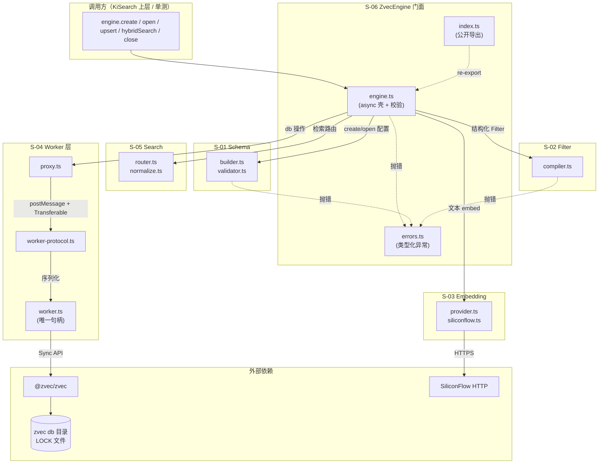
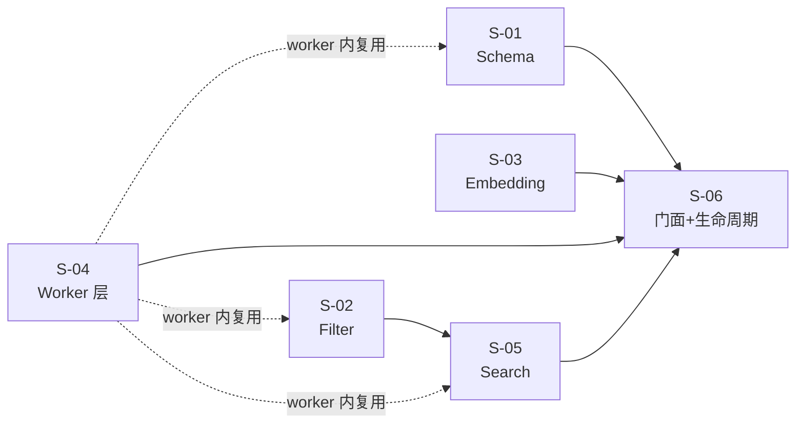

# ZvecEngine 基座模块 · 总体设计

> 关联需求：REQ-20260717-002（zvec-base-module v5）
> 本文档：REQ-20260717-002 的**实现级技术设计**父文档，仅覆盖基座模块（引擎抽象层），不含 KiSearch 上层（MCP server 常驻 / CLI 改造）。

---

## 1. 需求背景 & 目标

### 背景
- `zvec-base-module.md`（v5）已完成**接口契约设计**（ZvecEngine 类签名、DocInput/Hit/WriteResult、错误分层、并发模型决策）。
- 本次 design-craft 把契约落到**可编码的实现方案**：目录结构、模块拆分、worker 线程协议、与 `@zvec/zvec` 的映射、错误处理落点。

### 整体目标
1. 产出 `src/zvec-engine/` 独立 npm 库形态的 TS 源码，tsc 预编译到 `dist/zvec-engine/`，与 `scripts/`（jiti 直跑）解耦。
2. 闭合 v3 推演遗留的 4 项 🟡：#2 EmbeddingProvider 跨 worker 归属（锁定方案 X）、#1 FTS 单分词器标注风险、#3 embed 失败粒度统一、#4 Filter 转义机制。
3. 交付可单测、可锁版本、与领域解耦的引擎抽象层。

### 不在范围内
- ❌ KiSearch 上层（MCP server 常驻架构、scope 编排、CLI 改造、mem-client.ts 迁移）—— 属 REQ-20260717-001 的 REQ-02~REQ-10，另立设计。
- ❌ 真实 embedding 的 Recall@5 验收（实现后用 SiliconFlow + compare.py 语料补测）。
- ❌ jieba 对代码符号标识符的 token 行为实测（留待实现后，S-01 标注风险）。

---

## 2. 关键环节一览图

---

## 3. 总体方案设计

### 子需求节点图

**说明**：
- S-01/S-02/S-03 为纯函数/纯类模块，无 worker 依赖，可并行实现。
- S-04 是底座，worker 线程内 import 复用 S-01/S-02/S-05 编译产物。
- S-05 依赖 S-02（filter 编译后才能进 zvec query）。
- S-06 是集成门面，聚合所有前述模块。

### 跨子需求共享术语速查

| 术语 | 定义处 | 含义 |
|---|---|---|
| `ZvecEngineConfig` | S-01 §4b | `create` 入参（含 collection/embedding） |
| `ZvecEngineOpenConfig` | S-01 §4b | `open` 入参（含 schemaAssert） |
| `DocInput` | S-01 §4b | 文档写入输入（id/text/vector/fields） |
| `Filter` | S-02 §4b | 结构化过滤（and/or/not/比较；**v1 不支持 IN**，留 v2） |
| `Hit` | S-05 §4b | 检索结果项（id/score/queryType/fields/text/vector?） |
| `WriteResult` | S-06 §4b | 写入结果（ok/failed/errors[]） |
| `WriteErrorCode` | S-06 §4b | 文档级错误码枚举 |
| `EmbeddingProvider` | S-03 §4a | 可注入的 embedding 抽象 |
| `WorkerMessage` | S-04 §4b | postMessage 协议（Req/Res） |
| 类型化异常（7 种） | S-06 §4b | DimensionMismatchError/CollectionLockedException/... |

---

## 4. 全局风险 & 跨子需求依赖

### 跨子需求风险

| # | 风险 | 影响子需求 | 缓解 |
|---|---|---|---|
| R-01 | **FTS 单分词器 vs 混合语料**（jieba 对代码符号标识符 token 行为未实测） | S-01, S-05 | S-01 默认 jieba 并在 §待定问题标注；实现后用 `syncRelation` 真实代码符号语料实测；若不满足，S-01 改为支持**双 FTS 字段**（content_zh 用 jieba + content_code 用 whitespace），S-05 路由改为双 FTS 路 multiQuery |
| R-02 | **EmbeddingProvider 跨 worker 归属**（方案 X 已锁定） | S-03, S-04 | S-03 在主线程执行 embed，产出 `Float32Array` 经 Transferable 零拷贝传 S-04 worker；worker 完全不感知 provider |
| R-03 | **embed 失败粒度矛盾**（§4.4 vs §4.6） | S-03, S-06 | 统一为：S-06 engine 在调 S-03 前按"是否需 embed"切分批次，embed 失败仅影响 text 文档，预计算 vector 文档独立写 |
| R-04 | **Filter 转义注入**（结构化 Filter → zvec SQL） | S-02 | S-02 采用字段白名单（仅 schema 已声明的 scalarFields）+ 字符串值单引号转义（`'` → `\'`）+ 拒绝 `{raw}` 逃生口（v1 版本不暴露） |
| R-05 | **worker 入口打包**（tsc 产物下 `new Worker` 路径解析） | S-04, S-06 | 锁定 `new Worker(new URL('./worker.js', import.meta.url), { type: 'module' })`；`tsconfig.src.json` 输出 ESM；发布前在 `npm pack` 产物 + tsx 直跑 + 单测三种场景回归 |
| R-06 | **score 归一化公式未真实 embedding 验证** | S-05 | 公式 `1/(1+distance)` 依赖 distance∈[0,2]，实现后须用真实 SiliconFlow embedding + compare.py 语料验证（自检索 top1≈1，不相关≈1/3） |

### 接口契约变化风险

| 变更点 | 影响 |
|---|---|
| S-06 `ZvecEngine.upsert` 签名（v5 §4.5 定义）若需调整 | S-04 协议、S-03 调用点、S-05 路由全部跟随 |
| S-04 `WorkerMessage` 协议字段 | S-04 worker 与 proxy 双侧同步修改 |
| S-01 `ZvecEngineConfig` 增加字段（如双 FTS） | S-06 校验、S-05 路由、S-04 worker schema 重建 |

### 全局共享术语速查（跨子需求引用）

详见各子需求 §4a/§4b 定义，本节仅列引用入口：

- 配置/文档/检索请求结构 → **S-01 §4b**
- Filter 结构 → **S-02 §4b**
- Embedding 接口 → **S-03 §4a**
- Worker 协议结构 → **S-04 §4b**
- 检索结果结构 → **S-05 §4b**
- 写入结果 / 异常类型 / 引擎签名 → **S-06 §4a / §4b**

---

## 5. 待定问题汇总

| 编号 | 问题 | 影响子需求 | 建议决策时间 | 负责人 |
|---|---|---|---|---|
| T-01 | jieba 对代码符号标识符（`syncRelation` / `ki/path`）的 token 行为是否满足 REQ-04 精确召回 | S-01, S-05 | 实现完成后 1 周内（真实语料实测） | 实现者 |
| T-02 | `score=1/(1+distance)` 公式在真实 embedding 下是否满足"自检索 top1≈1、不相关≈1/3" | S-05 | 实现完成后与 Recall@5 一并验证 | 实现者 |
| T-03 | `deleteSync` 对不存在 id 的 zvec 行为（静默成功 vs 报错） | S-06 | 实现期 Node 实测 | 实现者 |
| T-04 | `probe` 对不存在路径的错误类型是否可与"损坏"明确区分 | S-06 | 实现期 Node 实测 | 实现者 |
| T-05 | worker 崩溃重 spawn 后，是否需自动重 `ZVecOpen` 并恢复在途请求 | S-04, S-06 | 一期完成后（二期健壮性） | 实现者 |

---

## 6. 文档清单

| 文档 | 路径 | 说明 |
|---|---|---|
| 父文档 | `design/ZVEC_ENGINE_DESIGN.md` | 本文档 |
| S-01 | `design/S01_Schema_DESIGN.md` | Schema 构建与校验 |
| S-02 | `design/S02_Filter_DESIGN.md` | Filter 编译器 |
| S-03 | `design/S03_Embedding_DESIGN.md` | Embedding 提供方 |
| S-04 | `design/S04_Worker_DESIGN.md` | Worker 线程与协议 |
| S-05 | `design/S05_Search_DESIGN.md` | 检索路由与归一化 |
| S-06 | `design/S06_Engine_DESIGN.md` | ZvecEngine 门面与生命周期 |
