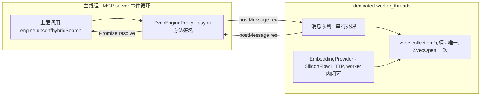

# 修复方案规划：ZvecEngine 基座模块（对应 scenario-rehearsal 问题清单）

> 输入：`review/scenario-rehearsal.md`（🔴 1 / 🟡 6 / 🟢 2）
> 目标：给出每条问题的具体修复方案与回写要点，供 `design-craft` / 设计文档 v5 修订直接引用。

## 0. 技术事实复核（实测依据）

| 事实 | 证据 | 对方案的影响 |
|---|---|---|
| 锁是文件级、进程内独占 | `verify_blocking.mjs` H-02：同进程对已开集合再 `ZVecOpen` 报锁冲突；`closeSync()` 释放后可重开 | worker 必须是"唯一 open 者"，不能主线程+worker 同时 open |
| read_only 也冲突 | `zvec-mcp-server-tools.md` 坑 3/7：`open(read_only=true)` 仍报 LOCK 冲突 | 不能"主线程只读 + worker 写"分柄 |
| 写入侧仅 Sync API | `verify_blocking.mjs` 附：仅 `query/multiQuery/optimize/deleteByFilter` 有 Async | 写入 async 承诺只能靠 worker 实现 |
| worker 可独立加载 native 模块 | Node `worker_threads` 可 `import '@zvec/zvec'`，每个 worker 独立 napi 实例 | "单一 worker open 一次"成立，无锁冲突 |
| worker 间不共享对象 | `postMessage` 走 structuredClone，不能传 collection 句柄 | 必须把"句柄+操作"都封装在 worker 内 |

---

## 1. 🔴 #1 写入侧 async 承诺与锁语义冲突 —— 核心修复

### 1.1 方案对比

| 方案 | 做法 | 主线程阻塞？ | 签名 async？ | 复杂度 | 评价 |
|---|---|---|---|---|---|
| **A. 写入 worker 独占句柄** | 写操作 postMessage 给 worker；查询仍在主线程走原生 Async | ❌ | ✅ | 中 | ❌ 查询也需句柄，但 read_only 也锁冲突 → 查询得也进 worker，退化为方案 A' |
| **A'. 单一 zvec worker（actor 模型）⭐推荐** | 整个 `ZvecEngine` 实例运行在 dedicated worker；主线程持 proxy，所有方法 postMessage 转发 | ❌ | ✅ | 中 | 干净、无锁冲突、签名保持 async；代价是查询多一次 postMessage 往返（~0.1ms） |
| **B. Atomics.wait 伪异步** | 主线程同步等 worker 完成 Sync 调用 | ✅ 主线程阻塞 | 形式 async | 低 | 没解放并发，意义有限；❌ 不推荐 |
| **C. 诚实下调 async 承诺** | 写入接受 Sync 在主线程执行，承认短暂阻塞；查询走原生 Async | ✅ 写入期阻塞 | 部分 | 低 | 最简单；违反"不阻塞事件循环"NFR，但单批 insert200=41.8ms 可能可接受 |

### 1.2 推荐方案 A'：单一 zvec worker（actor 模型）



**关键设计点**
- **主线程不 open**：只有 worker 在启动时 `ZVecOpen` 一次，持有唯一写句柄 → 无锁冲突（消解 §5 实测的"同进程再 open 冲突"）。
- **主线程持 `ZvecEngineProxy`**：所有方法签名保持 `async`（§4 承诺不变），内部 `postMessage` 转发到 worker，返回 Promise。
- **embedding 在 worker 内闭环**：SiliconFlow HTTP 调用、embed、insert 都在 worker 内完成，避免 4096 维向量跨线程传输（16KB/条）。worker 有 `fetch` 能力，async HTTP 不阻塞 worker 事件循环。
- **查询也走 worker**：因 read_only 也锁冲突，查询不能在主线程另开句柄。查询 0.68ms + postMessage 往返 ~0.1ms ≪ 5ms 目标，可接受。
- **向量跨线程用 Transferable**：若上层确需预计算 vector 传入（`VectorSearchReq.vector`），用 `Float32Array` + transfer list 零拷贝传递。

**取舍与缓解**
- **串行化代价**：单 worker 串行处理消息，一个大批量 insert（41.8ms/200条）会阻塞期间到达的查询。
  - 缓解：worker 内批量写入分批 `insertSync`，每批间 `setImmediate` 让出，处理积压查询消息（查询插队）。
  - 或：NFR 标注"写入期间查询延迟上限 = 单批 insert 时延"，KiSearch 写入不频繁（扫描后批量灌库），可接受。
- **worker 生命周期**：启动/重启/优雅关闭。worker 崩溃 → 主线程 proxy 检测 → 重 spawn worker → worker 内重 `ZVecOpen`（db 落盘未损，重开即恢复）。
- **close() 语义**：`engine.close()` = terminate worker + worker 内 `closeSync()` 释放 LOCK。幂等。
- **CLI 场景**：CLI 不 spawn worker，而是走 MCP 协议（MCP server 的 worker 持锁）；或 CLI 自己 spawn worker（独立进程，锁不冲突）。

**对 §5 的回写要点**
- 删除"批量写入用 Sync 并包 worker 线程"的模糊表述。
- 改为："`ZvecEngine` 实例运行在 dedicated worker_threads，主线程持 proxy；所有方法经 postMessage 转发，签名保持 async。worker 启动时 `ZVecOpen` 一次，持有唯一写句柄（消解同进程锁冲突）。embedding 在 worker 内闭环。"
- "实例生命周期 = 进程生命周期"改为"= worker 生命周期"。
- 补 NFR："写入期间查询延迟上限 = 单批 insert 时延（实测 41.8ms/200 条）；写入不频繁场景可接受。"

**对 §4.5 方法签名的回写要点**
- 签名不变（仍 `Promise<...>`），但补注："实现层经 worker_threads 转发；`ZvecEngine` 不可跨线程直接持有句柄。"

---

## 2. 🟡 #2 CLI 缺静态锁探测 API

**问题**：`isLocked/isHealthy/isOpen` 均实例方法，CLI 拿不到句柄时无法决策"走 MCP 还是排队"。

**方案**：补静态方法
```ts
class ZvecEngine {
  // 静态：无需句柄，CLI 在 open 前探测 db 状态
  static probe(dbPath: string): {
    exists: boolean;        // db 目录是否存在
    locked: boolean;        // 是否被其他进程持锁
    healthy: boolean;       // 是否可正常 open（非损坏）
    error?: 'NOT_FOUND' | 'LOCKED' | 'CORRUPTED' | 'UNKNOWN';
  };
}
```

**实现思路**：尝试一次轻量 `ZVecOpen(dbPath)`（在 CLI 进程的临时 worker 里），捕获错误按类型映射：
- `Can't lock .../LOCK` → `{locked:true, healthy:true}`
- 目录不存在 → `{exists:false}`
- 其他损坏错误 → `{healthy:false, error:'CORRUPTED'}`

> 注：探测本身会瞬间竞争锁，但 `closeSync()` 立即释放，不影响常驻 server。若 server 已持锁，CLI 探测必然拿到 `locked:true`，正是决策依据。

**对 §4.5 回写**：在方法清单补 `static probe(dbPath)`。

---

## 3. 🟡 #3 InconsistentUpdateError 未命名

**问题**：§4.5 update 规则引用 `InconsistentUpdateError`，但 §4.4 批级异常清单仅列 `DimensionMismatchError`/`InvalidDocInputError`/`SchemaMismatchError`。

**方案**：在 §4.4 批级异常清单显式补入：
```
- INCONSISTENT_UPDATE → 抛 InconsistentUpdateError
  （update 只传 vector 不传 text 且集合配置了 FTS 时；避免向量更新而 FTS 索引停留旧原文）
```

**对 §4.4 回写**：批级异常注释块补一行。

---

## 4. 🟡 #4 embedding 整批失败粒度未定义

**问题**：`EmbeddingProvider.embed(texts[])` 是整批调用，与"文档级 EMBEDDING_FAILED"粒度不匹配。

**方案**：明确失败边界（写回 §4.6 + §4.4）：
1. `EmbeddingProvider` 内部按 `batchSize` 分小批（已有 `EmbedOptions.batchSize`），每小批独立重试（已有 `retries`）。
2. 小批重试耗尽仍失败 → 该小批对应的 doc 标 `EMBEDDING_FAILED` 进 `errors[]`。
3. **预计算 vector 的 doc**（`DocInput.vector` 已给）不依赖 embed，照常写入，不受 embed 失败影响。
4. `embed` 内部不支持单条失败区分时，以小批为最小失败单元（一批同成败）。

**对 §4.6 回写**：`EmbedOptions` 注释补"失败粒度 = 小批（batchSize）"。
**对 §4.4 回写**：`EMBEDDING_FAILED` 说明补"按 batchSize 小批标记，预计算 vector 的 doc 不受影响"。

---

## 5. 🟡 #5 listIds 无 limit 默认/上限

**问题**：`listIds(filter?, limit?)` 无默认值与上限，大库全扫描有内存/时延风险。

**方案**：
```ts
listIds(filter?: Filter, limit?: number): Promise<string[]>;
// limit 默认 1000，上限 10000（与 topk 上限 1000 区分：listIds 是扫描场景，允许更大）
// 超过上限抛 InvalidSearchError；调用方需分页应自行迭代
```

**对 §4.5 回写**：`listIds` 签名补默认值与上限注释。

---

## 6. 🟡 #6 db 损坏重灌数据源未闭合

**问题**：§5 说"上层触发 destroy→create→全量重灌"，但基座不备份，重灌数据源未定义。

**方案**：在 §5 明确 db 的数据耐久性定位：
- **db 是可重建缓存，非权威数据源**。权威数据在 KiSearch 上层（代码库抽取结果 + 索引文件）。
- 损坏重建流程：上层捕获 `CollectionCorruptedException` → `destroy()` → `create()` → 重新扫描代码库 → 重新抽取 → 全量 `upsert`。
- 基座模块**不自带备份**，但提供 `destroy()` + `create()` 闭环支撑。

**对 §5 回写**："db 损坏识别与重建"条目补"db 为可重建缓存，重灌数据源 = 上层代码库重新抽取"。

---

## 7. 🟡 #7 score 归一化公式未真实 embedding 验证

**问题**：`score=1/(1+distance)`、distance∈[0,2] 假设依赖真实 COSINE 定义，demo 用退化 hash 向量未验证。

**方案**：
- 公式本身正确（COSINE distance = 1 - cosine ∈ [0,2]）。
- 实现后须用真实 SiliconFlow embedding + `compare.py` 语料验证：
  1. 自检索 top1 score 接近 1（distance 接近 0）。
  2. 不相关文档 score 接近 1/3（distance 接近 2）。
  3. Recall@5≥90%（与 H-04 一并闭合）。

**回写**：§6 H-04 标注"score 归一化公式与 Recall@5 一并在真实 embedding 下验证"。属待验证项，非设计修订。

---

## 8. 🟢 #8 delete 不存在 id 的 zvec 行为未实测

**方案**：补 Node 实测（扩展 `verify_blocking.mjs`）：
```js
// delete 一个不存在的 id，观察 zvec 行为
const s = col.deleteSync(["not_exist_id"]);
// 期望：按文档进 errors[](NOT_FOUND)；但 zvec 实际可能静默成功 → 须实测确认
```

**回写**：实测后据实修正 §4.5 `delete` 的 NOT_FOUND 语义。

---

## 9. 🟢 #9 open 维度校验时机/异常名未定义

**方案**：明确 open 时校验：
```ts
static open(config: ZvecEngineOpenConfig): Promise<ZvecEngine>;
// 内部：open 后读持久化 schema，校验
//   - embedding.dimension === 持久化 dimension → 不符抛 DimensionMismatchError
//   - 持久化 metric === 'COSINE' → 不符抛 SchemaMismatchError
//   - schemaAssert（若传）逐项比对 → 不符抛 SchemaMismatchError
```

**对 §4.5 回写**：`open` 注释补校验点与异常名。

---

## 10. 修复优先级与验证清单

| 优先级 | 项 | 类型 | 回写位置 |
|---|---|---|---|
| P0 | #1 worker actor 架构 | 🔴 阻断 | §5 + §4.5 注 + design-craft 上层 |
| P1 | #2 静态 probe | 🟡 | §4.5 |
| P1 | #6 损坏重灌数据源 | 🟡 | §5 |
| P2 | #3 InconsistentUpdateError 命名 | 🟡 | §4.4 |
| P2 | #4 embed 失败粒度 | 🟡 | §4.4 + §4.6 |
| P2 | #5 listIds limit | 🟡 | §4.5 |
| P3 | #9 open 维度校验 | 🟢 | §4.5 |
| P3 | #7 score 公式验证 | 🟡 待验 | §6 H-04（实现后） |
| P3 | #8 delete 实测 | 🟢 待验 | §4.5（实测后） |

**回写后建议**：v5 设计文档修订 P0–P2 后，重跑 scenario-rehearsal 增量推演（仅 worker 架构 + 静态 probe + 重灌数据源三条），确认 🔴 闭合即可进入 design-craft 上层。
