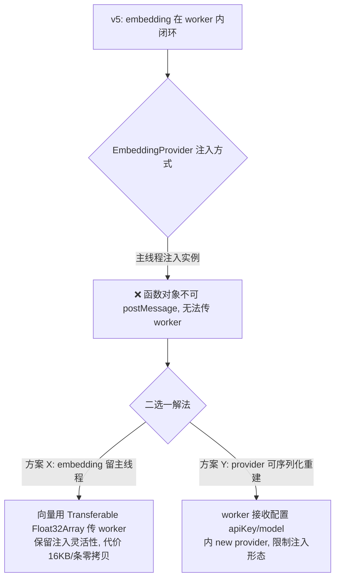
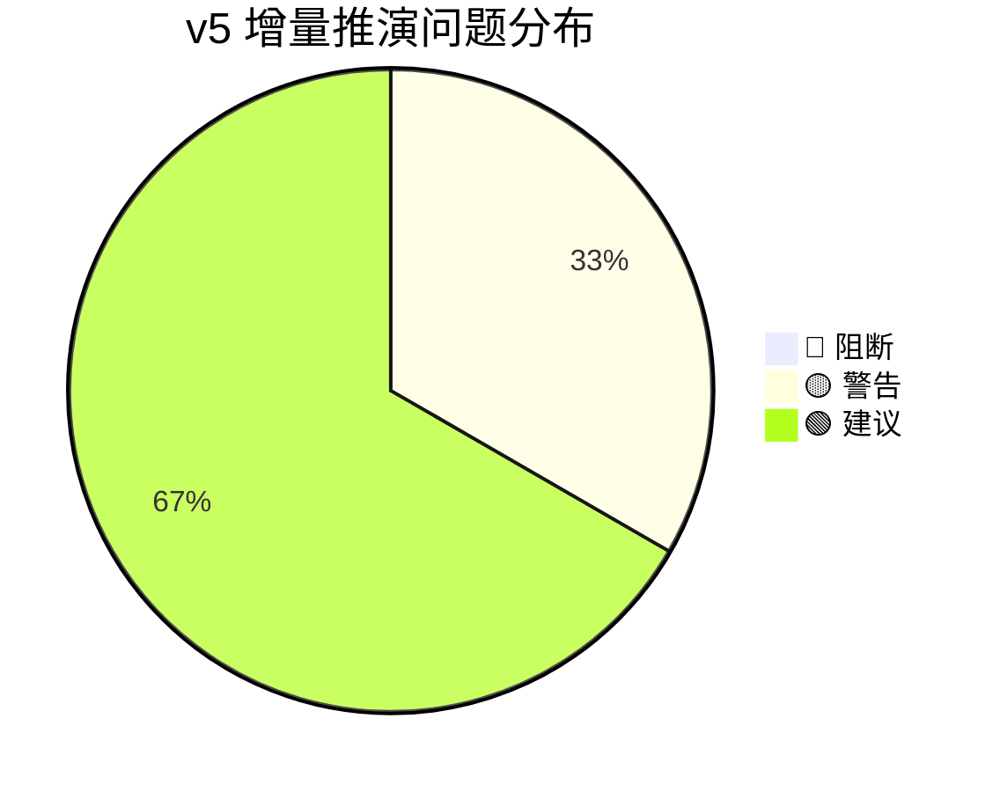

# 增量场景推演报告 v2：ZvecEngine 基座模块 v5

> 推演时间：2026-07-20
> 输入文档：`zvec-base-module.md`（v5，已回写 `fix-plan.md` 的 P0–P2 修复）
> 推演口径：增量模式——只验证 v5 修复项是否闭合 + worker 架构是否引入新风险，不重跑已通过的 Happy Path。

## 1. 增量推演范围

| 修复项 | v5 改动位置 | 增量验证场景 |
|---|---|---|
| #1 🔴 worker actor 架构 | §0 决策 / §5 不阻塞条目 / §4.5 close | S3' 写入 async + 锁、S2' CLI 锁探测 |
| #2 🟡 静态 probe | §4.5 `static probe` / §5 db 归属 | S2' |
| #6 🟡 重灌数据源 | §5 db 损坏条目 | S6' |
| #3 🟡 InconsistentUpdateError 命名 | §4.4 批级异常 | S5' |
| #4 🟡 embed 失败粒度 | §4.4 EMBEDDING_FAILED / §4.6 EmbedOptions | S4' |
| #5 🟡 listIds limit | §4.5 listIds | S7' |
| #9 🟢 open 维度校验 | §4.5 open | S8' |
| 新风险扫描 | worker 架构副作用 | S9' embedding 注入张力 |

## 2. 修复项验证

### 🎬 S3' 写入 async 承诺 + 锁语义（验证 #1 🔴）

【v4 矛盾】worker 线程属同一进程，主线程持柄则 worker 再 open 锁冲突；句柄无法 postMessage。
【v5 方案】整个 ZvecEngine 实例跑在 dedicated worker，worker 唯一 open，主线程持 proxy。

| 验证点 | v4 | v5 | 结果 |
|---|---|---|---|
| 主线程是否持句柄 | 是 → worker 再 open 冲突 | 否，只持 proxy | ✅ 闭合 |
| worker 间对象共享 | 需要（不可行） | 不需要（句柄+操作都在 worker 内） | ✅ 闭合 |
| async 签名承诺 | 依赖未定义 worker 方案 | postMessage 天然 async | ✅ 闭合 |
| 查询句柄来源 | 主线程（read_only 也锁冲突） | 同一 worker（唯一句柄） | ✅ 闭合 |
| close 语义 | closeSync 释放 LOCK | terminate worker + closeSync | ✅ 闭合 |

【结论】🔴 #1 **已闭合**。worker actor 架构消解了"同进程锁冲突"与"async 承诺"的矛盾。

---

### 🎬 S2' CLI 锁探测（验证 #2 🟡）

【v4 缺陷】CLI 拿不到句柄时无静态锁探测 API。
【v5 方案】`ZvecEngine.probe(dbPath)` 在调用方进程的临时 worker 内尝试轻量 open，按错误映射。

| 验证点 | 结果 |
|---|---|
| CLI 无实例时能否探测 | ✅ 静态方法，无需句柄 |
| MCP server 持锁时 CLI 探测 | ✅ 临时 worker open 失败→locked:true |
| 探测是否影响常驻 server | ✅ open 失败不持锁，closeSync 即释放 |
| 损坏/不存在识别 | ✅ 按错误类型映射 healthy/exists |

【结论】🟡 #2 **已闭合**。CLI 决策链路（probe→走 MCP 或排队）成立。

---

### 🎬 S6' db 损坏重灌数据源（验证 #6 🟡）

【v5 方案】db 明确为"可重建缓存非权威源"，重灌 = 上层重新扫描代码库抽取。

| 验证点 | 结果 |
|---|---|
| 重灌数据源是否定义 | ✅ 上层代码库重新抽取 |
| 基座职责边界 | ✅ 只提供 destroy+create 闭环，不备份 |
| 责任划分 | ✅ db 损坏=缓存失效，非数据丢失（权威数据在上层） |

【结论】🟡 #6 **已闭合**。

---

### 🎬 S4'/S5'/S7'/S8' 文档对齐项（验证 #3/#4/#5/#9）

| # | 验证点 | 结果 |
|---|---|---|
| #3 | InconsistentUpdateError 是否在批级异常清单 | ✅ §4.4 已显式补入 |
| #4 | embed 失败粒度 + 预计算 vector 不受影响 | ✅ §4.4/§4.6 已明确 batchSize 小批 |
| #5 | listIds limit 默认/上限 | ✅ 默认 1000/上限 10000/超限抛错 |
| #9 | open 维度/metric 校验异常名 | ✅ §4.5 open 注释已补 DimensionMismatchError/SchemaMismatchError |

【结论】#3/#4/#5/#9 **全部闭合**。

---

## 3. 新风险扫描：worker 架构副作用

### 🎬 S9' EmbeddingProvider 注入 vs worker 内 embedding 的张力

【v5 表述】§5"embedding（SiliconFlow HTTP）在 worker 内闭环，避免 4096 维向量跨线程传输"。
【§4.6 接口】`EmbeddingProvider` 为可注入实例（`embed(texts, opts): Promise<number[][]>`），上层默认注入 `SiliconFlowProvider`。

| 方案 | 注入灵活性 | 跨线程开销 | 复杂度 |
|---|---|---|---|
| X（embedding 留主线程） | ✅ 任意 provider 实现 | 向量 Transferable 零拷贝 | 低 |
| Y（embedding 进 worker） | ❌ provider 须可序列化重建 | 无 | 中（需工厂注册） |

【结论】🟡 **新-#1**：v5"embedding 在 worker 内闭环"与 §4.6"EmbeddingProvider 可注入任意实现"存在张力（函数对象不可 postMessage）。需在 design-craft 上层明确二选一。**建议方案 X**：embedding 留主线程（保留注入语义），向量用 Transferable 传 worker（4096×4=16KB/条，Transferable 零拷贝，开销可忽略）。

---

### 🎬 其他实现层细节（🟢，不阻断）

| 新风险 | 说明 | 处理 |
|---|---|---|
| worker ready 同步 | 主线程在 worker `ZVecOpen` 完成前调用方法 | proxy 缓存请求或 await ready 信号 |
| close drain | close 时 worker 仍有在途 postMessage 请求 | reject 在途请求或 drain 后再 terminate |
| worker 单点 | worker 崩溃期间请求失败 | v5 已有重 spawn + 重 open 恢复，可接受 |
| probe 对不存在路径的错误类型 | ZVecOpen 不存在路径的错误是否可区分 | 待 Node 实测确认（同 #8） |

## 4. 问题汇总（增量）

| # | 类型 | 场景 | 问题描述 | 建议 | 严重度 |
|---|---|---|---|---|:---:|
| 新-#1 | 设计冲突 | S9' | embedding 在 worker 内与 EmbeddingProvider 注入张力（函数不可 postMessage） | 建议方案 X：embedding 留主线程，向量 Transferable 传 worker | 🟡 |
| 新-#2 | 实现细节 | S9' | worker ready 同步 / close drain | proxy 实现 await ready + drain/reject | 🟢 |
| 新-#3 | 待实测 | S2'/S8' | probe 对不存在路径、delete 不存在 id 的 zvec 错误类型 | 补 Node 实测 | 🟢 |

统计：🔴 0 / 🟡 1 / 🟢 2（原 🔴 #1 已闭合；#7/#8 仍待真实 embedding/实测，非本次范围）

## 5. 推演结论

### 评审结论

| 条件 | 结论 |
|---|---|
| 存在 ≥1 个 🔴 阻断 | — |
| 无 🔴 但 ≥1 个 🟡 | ⚠️ **有条件通过** |

### 整体判断

**v5 修复成功闭合了原 🔴 阻断（#1 worker 架构），6 个 🟡 中 5 个完全闭合、1 个（新-#1）为 worker 架构引入的新张力。**

- 原 🔴 #1（写入 async 与锁冲突）：✅ **闭合**。worker actor 模型消解了同进程锁冲突，async 承诺经 postMessage 成立，查询/写入/embedding 统一进 worker 无句柄分柄问题。
- 原 🟡 #2/#3/#4/#5/#6/#9：✅ **全部闭合**。
- 新 🟡 新-#1：embedding 归属二选一，建议方案 X（embedding 留主线程 + 向量 Transferable），不阻断进入实现，但须在 design-craft 上层明确。
- 待验证项 #7（score 公式）/ #8（delete 实测）：仍留实现后真实 embedding / Node 实测补验。

### 下一步建议
1. **进入 design-craft 上层**（MCP server 常驻架构、db 文件共享、scope 隔离），并在其中明确 embedding 归属（建议方案 X）。
2. 实现后补两项实测：真实 SiliconFlow embedding 验 score 公式 + Recall@5（#7）、`deleteSync`/`probe` 不存在路径错误类型（#8/新-#3）。
3. 本基座模块设计 **可进入实现阶段**（P0 主链路 B-01/B-04/B-11 + worker proxy 骨架先行）。
