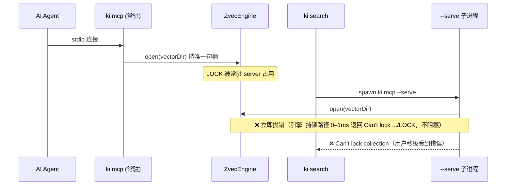

# 场景推演报告（二次推演）：KiSearch 重构设计

> 推演时间：2026-07-21
> 输入文档：`design/REFACTOR_DESIGN.md` + `design/REF_S01~S06` + 基模 `zvec-base-module.md` §0
> 启用策略 profile：✅ 重构/迁移类 + ✅ 批处理/同步类 + ✅ CRUD/接口类 + ✅ 并发/竞态敏感类
> 本轮聚焦：上一轮（scenario-rehearsal.md）未充分覆盖的**并发/锁冲突**维度——尤其 CLI 子进程与常驻 Agent server 的 zvec 排它锁冲突。

## 1. 角色清单

| # | 角色 | 类型 | 职责 | 来源 |
|---|------|------|------|------|
| 1 | 👤 用户 | 用户 | 终端执行 `ki search`/`store` 等 CLI 命令 | 设计 §交互对象 |
| 2 | 🤖 AI Agent | 用户 | 常驻 MCP server 的 stdio 客户端，持有 db 句柄 | 设计 §交互对象 |
| 3 | ⚙️ CLI 子进程 | 程序 | `ki mcp --serve` 短命子进程，CLI 向量命令 spawn 它 | S-04 |
| 4 | 🗄️ ZvecEngine（基模） | 程序 | 持有唯一写句柄，文件级锁；提供 `probe()` | 基模 §0 |

## 2. 推演矩阵 + 启用策略 profile

### 设计点覆盖矩阵（本轮新增并发维度）

| 设计点 \ 场景 | Agent 运行中跑 CLI | 两个并发 CLI | CLI 兜底直连 | probe() 探测 | 锁冲突处理 |
|---|---|---|---|---|---|
| per-call spawn (S-04) | ✅ | ✅ | ✅ | - | ✅ |
| 基模 db 单一持有 (基模 §0) | ✅ | ✅ | - | ✅ | - |
| zvec 排它锁 (基模 §0) | ✅ | ✅ | ✅ | - | - |
| probe() 决策分叉 (基模 B-16) | - | - | - | ✅ | - |

### 启用策略 profile

- ✅ **重构/迁移类**（命中：mem→zvec、JSON→YAML、sync→async）
- ✅ **批处理/同步类**（命中：import-kb/restore 重放）
- ✅ **CRUD/接口类**（命中：vectorSearch/Store/Delete）
- ✅ **并发/竞态敏感类**（命中：db 文件锁、单一写句柄、worker 串行化、CLI 锁协调）——本轮关键

## 3. 场景推演详情

### 🎬 场景 A：AI Agent 已常驻，用户在终端执行 `ki search`

【执行者】用户 + AI Agent
【场景描述】Agent 通过 `ki mcp` 常驻（持久持有 zvec 写句柄）；用户另开终端跑 `ki search "foo"`。

【数据走向验证】

| 步骤 | 操作 | 数据流向 | 验证结果 | 问题 |
|------|------|----------|---------|------|
| 1 | Agent 启动 `ki mcp` | server 持有 `ZvecEngine.open(vectorDir)` 唯一句柄（基模 §0） | ✅ 已知 | — |
| 2 | 用户执行 `ki search` | CLI → `callMcpTool` → spawn `ki mcp --serve` 子进程 | ✅ 设计 | — |
| 3 | 子进程 `ZvecEngine.open(vectorDir)` | 试图获取句柄（无论 rw 还是 ro） | ❌ **立即失败** | **锁冲突** |
| 4 | open 结果 | zvec 原生引擎对持锁路径**立即抛 `Can't lock .../LOCK`**（实测 0–1ms，不阻塞、不排队、不等超时） | ❌ 子进程秒级失败 | **`Can't lock read-write/read-only collection` 错误返回 CLI** |

【关键设计点验证】

| # | 设计点 | 验证问题 | 验证结果 | 问题 | 置信度 |
|---|--------|---------|---------|------|--------|
| A1 | S-04 §3.3「锁冲突：不存在（CLI 子进程独立 open/close）」 | Agent 常驻持锁时 CLI 子进程能否 open？ | ❌ 失败 | 与基模 §0「db 由常驻 server 单一持有」**直接矛盾** | 🔴 高 |
| A2 | S-04 §+6「zvec 锁冲突 → McpCrashError：另一个 ki 命令正在使用」 | 是否覆盖 Agent server 持锁场景？ | ❌ 未覆盖 | 仅提「另一个 ki 命令」，漏掉「Agent 常驻 server」这一主场景 | 🔴 高 |
| A3 | 基模 `probe()` 是否被使用 | S-04 是否用 probe() 在 open 前分叉？ | ❌ 未使用 | 基模专为「走 MCP 还是排队」提供 `probe()`，S-04 完全忽略 | 🔴 高 |

【推演结论】
- **`ki search`/`store`/`bulk_store`/`sync_relation`/`query_group`/`delete_relation`/`get_module_info`/`manage_index` 在 Agent 常驻时全部不可用**（open 即抛 `Can't lock .../LOCK`，0–1ms 快速失败）。
- 这是 ki 的**主使用场景**（ki 既被 Agent 用，也被同一用户并行用），属 🔴 阻断。
- **实测已验证（见文末「附录：zvec 跨进程锁 demo 实测」）**：zvec 锁为**跨进程排他**——只要任一进程持有 rw 锁，其他进程（无论 ro 还是 rw）`open` 都立即失败；仅「多 ro 进程」可并发。因此设计「db 由常驻 server 单一持有」是**与引擎行为一致**的，S-04 的 per-call spawn 实质违背的是引擎自身的硬约束，而非基模单方面规定。

### 🎬 场景 B：两个 `ki search` 并发执行

【执行者】用户（CI/脚本或快速连击）
【场景描述】同时跑 `ki search A` 和 `ki search B`，各 spawn 一个 `--serve` 子进程。

【数据走向验证】

| 步骤 | 操作 | 验证结果 | 问题 |
|------|------|---------|------|
| 1 | 子进程 A `open(vectorDir)` 先到 | ✅ 成功 | — |
| 2 | 子进程 B `open(vectorDir)` 后到 | ❌ 锁冲突 | 必有一方失败 |

【关键设计点验证】

| # | 设计点 | 验证问题 | 验证结果 | 问题 | 置信度 |
|---|--------|---------|---------|------|--------|
| B1 | S-04 §3.3「锁冲突：不存在」 | 并发 CLI 是否冲突？ | ❌ 冲突 | 与 §+6 自相矛盾 | 🔴 高 |

【推演结论】并发 CLI 必然锁冲突；§3.3 声称「不存在」是事实错误。S-04 §+6 给了「另一个 ki 命令」提示，但 §3.3 未同步修正。

### 🎬 场景 C：CLI 兜底直连 vs 基模契约

【执行者】CLI 进程
【场景描述】Agent 未运行，CLI 子进程独占 open（设计预期的正常路径）。

【关键设计点验证】

| # | 设计点 | 验证问题 | 验证结果 | 问题 | 置信度 |
|---|--------|---------|---------|------|--------|
| C1 | 基模「CLI 写入走 MCP 协议或排队等待锁释放」 | per-call spawn 是否违背「db 单一持有」？ | ⚠️ 仅当无 server 时成立 | 一旦 server 存在即断裂（见场景 A） | 🟡 中 |

【推演结论】无 server 时 per-call spawn 可用（~1s）；有 server 时断裂。设计未定义「有 server 时 CLI 怎么办」。

### 🎬 场景 D：基模 `probe()` 的正确用法（对照）

基模 §0 + B-16 已给出正解：
- CLI 在 open 前应先 `ZvecEngine.probe(vectorDir)`（带超时 3000ms）。
- `locked:true` → 说明有 server 持有 → 应**走 MCP 协议连那个 server**（而非自己 open）。
- `locked:false` → 无 server → 可安全 open（per-call spawn 兜底）。

但 S-04 的 `callMcpTool`/`--serve` 流程**完全没有 probe 步骤**，也没有「连已有 server」的通道（stdio 被 Agent 占用）。

## 4. 问题汇总

| # | 类型 | 角色 | 场景 | 问题描述 | 建议 | 严重度 |
|---|------|------|------|---------|------|:------:|
| 1 | 设计冲突 | 用户/Agent | A | S-04 per-call spawn 与基模 §0「db 由常驻 server 单一持有」契约冲突（**该契约与 zvec 引擎跨进程排他锁行为一致**）：Agent 常驻时 CLI 向量命令全部以 `Can't lock` 快速失败 | **【已决策·方案甲·模型 Y】**：引入独立守护 `ki server` 持锁 + 暴露**单一 HTTP 通道**同时服务 CLI 与 Agent（Agent 改连 HTTP，stdio 仅作无 daemon 兜底）；写命令默认走 HTTP，`--local`/批量重建才提示关闭 daemon。详见 `design/REF_S04_CLI_Server_Channel_DESIGN.md` §3.1–§3.4 | 🔴 → ✅ |
| 2 | 事实错误 | — | A/B | S-04 §3.3 行为表「锁冲突：不存在（CLI 子进程独立 open/close）」与 §+6「zvec 锁冲突」自相矛盾，且与基模排它锁事实不符 | 删除/修正 §3.3 该行，明确锁冲突存在且与 Agent server 冲突 | 🔴 |
| 3 | 遗漏场景 | 用户 | A | S-04 §+6 锁冲突提示仅「另一个 ki 命令」，未覆盖「Agent 常驻 server」这一主场景 | §+6 区分两类锁冲突：①Agent server 持锁 ②另一 CLI 子进程持锁 | 🔴 |
| 4 | 遗漏机制 | CLI | A/C/D | 基模提供 `ZvecEngine.probe()` 专解「走 MCP 还是排队」，S-04 完全未引用 | `callMcpTool` 增加 probe 前置；probe 锁定则不 spawn 子进程，改走 server 通道 | 🟡 |
| 5 | 约束缺口 | 架构 | A | stdio 单连接使 CLI 无法复用 Agent 的 server 通道；用户选 stdio 导致 per-call spawn，进而与排它锁冲突——需用户重新决策传输方式 | **【已决策·方案甲·模型 Y】**：server 加**单一 HTTP 通道**（CLI 与 Agent 共用，复用 server 句柄），stdio 仅作无 daemon 兜底；本地写入命令提示关闭 daemon | 🟡 → ✅ |

统计：🔴 阻断 3 个 / 🟡 警告 2 个 / 🟢 建议 0 个

## 5. 推演结论

### 整体评估
- 推演覆盖：4 角色 / 4 场景（3 并发 + 1 对照）
- 问题发现：🔴 3 个 / 🟡 2 个 / 🟢 0 个

### 评审结论

| 条件 | 结论 |
|------|------|
| 存在 ≥1 个 🔴阻断 | ❌ **不通过** |

### 核心结论

本轮重推发现一个**架构级阻断**：S-04 的「per-call stdio spawn」方案与基模 `zvec-base-module.md` §0 的「db 由常驻 MCP server 单一持有」契约根本冲突。

- **直接症状**：AI Agent 常驻（持有 zvec rw 句柄）时，用户在终端执行的任何 `ki` 向量命令都会 spawn 一个 `--serve` 子进程尝试 `open(vectorDir)`，因 zvec 跨进程文件级排它锁（LOCK 文件）而**立即抛 `Can't lock .../LOCK`**（实测 0–1ms，不阻塞、不等超时），快速失败返回 CLI。
- **根因**：用户选择 stdio 作 CLI↔server 传输 → 无法复用 Agent 的 server 通道 → 被迫 per-call spawn；而 spawn 子进程又无法与常驻 server 共享 db 句柄。这是当初 Q0「server 优先 + 兜底 (选项 C)」想解决却被 stdio 选择重新引入的问题。
- **基模已有正解**：§0 + B-16 提供 `ZvecEngine.probe(dbPath)`（带超时），明确用于「在 open 前决策走 MCP 还是排队」。S-04 应复用该机制，而非忽略。

### 下一步建议（**已决策：方案甲**）

用户已于 2026-07-21 拍板：

> **直接选择 server + HTTP**：常驻 `ki server` 持 zvec rw 锁并暴露 **HTTP 通道（给 CLI）+ stdio 通道（给 Agent）**；CLI **保留 stdio `--serve` 兜底**；当本地有 MCP 运行时，CLI 的**写入类命令**先提示用户关闭 MCP 再本地执行。

> **部署模型细化（2026-07-21 二次拍板 · 模型 Y）**：经 v3 推演，「Agent 连常驻 server stdio」与「server 由 `ki server start` 独立启动」自相矛盾（已运行守护进程的 stdio 无法被作为客户端的 Agent attach）。故**改为单一 HTTP 通道同时服务 CLI 与 Agent**（Agent 改连 HTTP StreamableHTTP，不再 spawn `--serve`）；stdio `--serve` 仅作「无 daemon」时的 CLI 兜底。写命令默认走 HTTP 无缝，仅显式 `--local`/批量重建才提示关闭 daemon。

据此，S-04 设计已更新（`design/REF_S04_CLI_Server_Channel_DESIGN.md` §3.1–§3.4、§+6）：
- daemon 在跑 → 读/默认写命令透明走 HTTP；`--local`/批量重建写提示关闭 daemon；
- 无 daemon → 回落原 per-call stdio spawn（Agent 此模式须提示先 `ki server start`）。

**后续待办（落入对应子需求）**：
1. S-06（MCP Server）：实现 `ki server` 独立守护进程，单一 HTTP（StreamableHTTP）通道服务 CLI+Agent；`--serve` stdio 仅留作无 daemon 兜底；`ki server start/stop/status` 生命周期 + pidfile。
2. S-01（Config）：新增 `server.httpPort` 配置项。
3. S-03（Vector Adapter）：暴露 `isLocked()` / `stopServer()` 及写命令 HTTP 工具。
4. CLI 路由层：命令启动时 `probe()` 分叉（HTTP / 提示关闭 daemon / per-call stdio 兜底）。
5. Agent 集成改造：既有「spawn `ki mcp --serve` stdio」改为「连 `ki server` HTTP」。

> 注：上一轮已修复的 memoryId→docId 迁移问题（🔴 阻断 2 项）经本轮回归确认仍成立，未见回归。本轮新发现集中在并发/锁冲突维度，已通过方案甲闭环。

---

## 附录：zvec 跨进程锁 demo 实测（2026-07-21）

**疑问**：zvec 的锁是「跨进程排他」还是「仅单进程内排他」？这决定了 S-04 是否真有阻断。

**方法**：写 `test/zvec-lock-demo/`（`worker.mjs` 持锁/探测子进程 + `run.mjs` 编排器）。先 `ZVecCreateAndOpen` 建库，再按 4 种组合派生 holder（持锁常驻进程）+ prober（另一独立进程尝试 `ZVecOpen`），记录 `open` 的耗时与错误信息。

**实测结果**：

| 场景 | holder | prober | 结果 | 含义 |
|---|---|---|---|---|
| C | ro | ro | ✅ `PROBE_OK 10ms` readDocs=1 | 两个**独立进程**可同时持只读锁 → **锁是跨进程的**（确证） |
| A | rw | ro | ❌ `Can't lock read-only collection: .../LOCK`（1ms） | 写者持锁时，只读打开也失败 |
| B | rw | rw | ❌ `Can't lock read-write collection: .../LOCK`（0ms） | 第二个写进程失败 |
| D | ro | rw | ❌ `Can't lock read-write collection: .../LOCK`（1ms） | 有读者时也挡住写者 |

**结论（实锤）**：
1. **锁是跨进程排他**：场景 C 中两个独立 OS 进程同时持只读锁并各自成功查询，证明 LOCK 文件是跨进程生效的；场景 A/B/D 证明任一进程持 rw 锁时，其他进程（ro 或 rw）`open` 一律立即失败。
2. **失败是「立即抛错」而非「阻塞排队」**：所有失败均在 0–1ms 返回 `Can't lock .../LOCK`，**不阻塞、不等超时、不挂起**。这推翻了先前「子进程挂起 ~30s → 超时 kill」的推测（那是基于基模 `probe()` 文档的字面理解，但引擎实测并非如此）。
3. **对 S-04 的影响不变、且更硬**：Agent 常驻 server 持的是 rw 锁（它要同时服务读写），故 CLI 不论 spawn 只读还是读写子进程都会 `Can't lock` 快速失败。场景 A 尤其关键——连 CLI 的 `search`（只读）在 Agent 运行时都不可用。**唯一出路是让 CLI 复用 Agent server 已持有的句柄（走 MCP 协议 / socket 二通道），而非自己 `open`。**

**对基模 `probe()` 的再评估**：基模 §0 + B-16 假设「持锁路径阻塞等待、由 `probe()` 超时判定 locked」——但引擎实测是「立即抛错」。因此 `probe()` 本身若建立在「阻塞」假设上则模型失真；但其**用途仍成立且更重要**：既然任何 `open` 在持锁时都会立即失败，CLI 更必须在 `open` 前先判断「是否有 server 在跑」，有则连那个 server、不要自己 spawn。

**复现**：`rm -rf test/zvec-lock-demo/data && node test/zvec-lock-demo/run.mjs`
