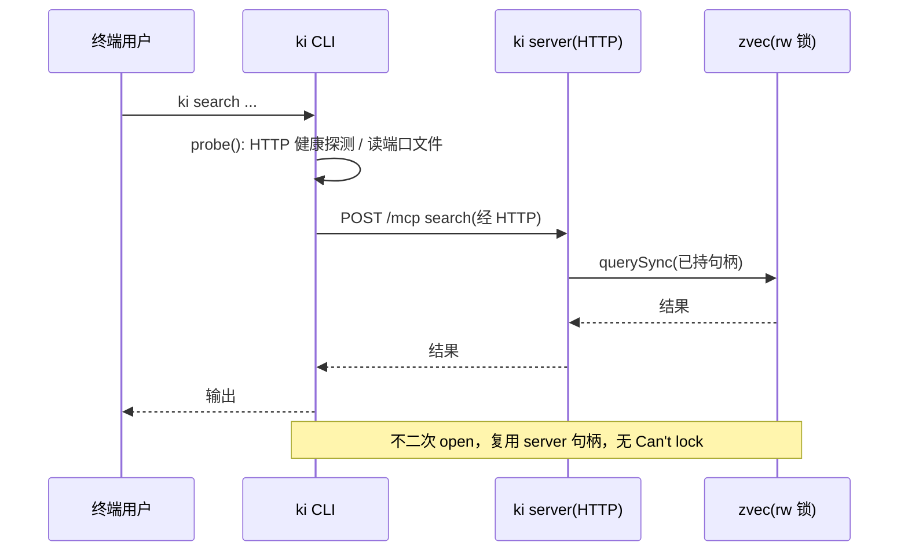
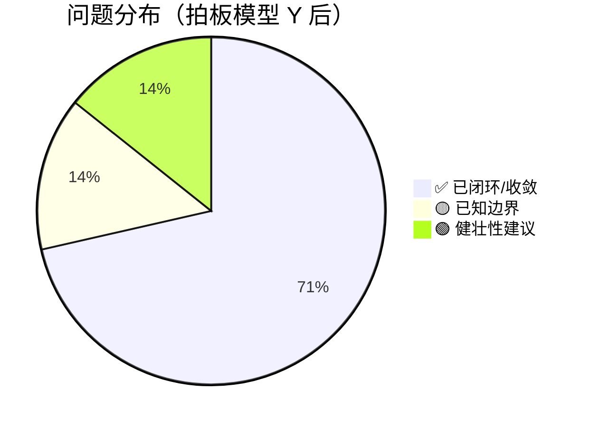

# 场景推演报告 v3：方案甲（server+HTTP + CLI stdio 兜底 + 写入提示）

> 推演时间：2026-07-21
> 输入文档：design/REF_S04_CLI_Server_Channel_DESIGN.md §3.1–§3.4、§+6；design/REF_S06_MCP_Server_DESIGN.md；review/scenario-rehearsal-v2.md（zvec 跨进程排他锁 demo 实锤）
> 推演目的：验证「方案甲」决策是否闭环 v2 的 🔴 阻断，并暴露新设计引入的问题

## 1. 角色清单

| # | 角色 | 类型 | 权限层级 | 职责 | 来源 |
|---|------|------|---------|------|------|
| 1 | 终端用户 | 用户 | 已登录 | 直接执行 ki CLI 命令（search/store/import-kb…） | S-04 §术语 |
| 2 | AI Agent | 程序 | — | MCP 客户端，调用 ki 工具做记忆读写 | S-04/S-06 |
| 3 | 常驻 ki server（独立守护） | 程序 | — | 单一持有 zvec rw 句柄，暴露**单一 HTTP（StreamableHTTP）** 同时服务 CLI 与 Agent（模型 Y） | S-04 §3.1 |
| 4 | CLI 子进程 ki mcp --serve | 程序 | — | 无持久 server 时的 stdio 兜底进程 | S-04 §3.4 |

## 2. 推演矩阵 + 启用策略 profile

### 2.1 启用策略 profile

- ✅ 并发/竞态敏感类（命中：zvec 跨进程排他锁、server 单句柄并发请求）
- ✅ 重构/迁移类（命中：CLI 通道由 per-call stdio 迁移为 server+HTTP）
- ➖ 未启用：CRUD/接口类、事务/状态机类、批处理/同步类、实时/推送类

### 2.2 设计点覆盖矩阵

| 设计点 \ 场景 | S1 读(有server) | S2 写(有server) | S3 无server兜底 | S4 并发 | S5 start/恢复 | S6 连接模型 | S7 Agent抢锁 | S8 旁路命令 | S9 提示判定 |
|--------------|:---:|:---:|:---:|:---:|:---:|:---:|:---:|:---:|:---:|
| HTTP 二通道路由（模型 Y：单一 HTTP 服务 CLI+Agent） | ✅ | ✅ | - | ✅ | - | ✅ | - | - | - |
| CLI stdio 兜底（仅无 daemon） | - | - | ✅ | - | - | - | ✅ | - | - |
| 写入提示关闭 daemon（仅 --local/批量） | - | ✅ | - | - | - | - | ✅ | ✅ | ✅ |
| server 单句柄并发 | - | - | - | 🟡 | - | - | - | - | - |
| server 生命周期/发现 | - | - | - | - | 🟢 | ✅ | ✅ | 🟢 | ✅ |

### 2.3 推演矩阵（角色 × 场景）

| 场景 \ 角色 | 终端用户 | AI Agent | ki server | CLI 子进程 |
|-------------|:---:|:---:|:---:|:---:|
| S1 有server读命令 | ✅ | - | ✅ | - |
| S2 有server写命令 | ✅ | - | ✅ | - |
| S3 无server兜底 | ✅ | ✅ | - | ✅ |
| S4 并发多客户端 | ✅ | ✅ | ✅ | - |
| S5 start/崩溃恢复 | ✅ | - | ✅ | - |
| S6 连接模型（已拍板 Y） | - | ✅ | ✅ | - |
| S7 Agent抢锁 | - | 🟡 | ✅ | 🟡 |
| S8 import-kb/restore | ✅ | - | - | - |
| S9 提示判定 | ✅ | 🟡 | - | - |

## 3. 场景推演详情

### 3.1 S1：server 在跑 + 用户执行读命令 ki search



【数据走向验证】CLI → HTTP → server（持锁）→ zvec，无第二进程 open。✅ 通过。
【关键设计点】HTTP 路由：✅ 可行，闭环 v2 阻断。
【推演结论】原 🔴 阻断（Agent 常驻时 CLI 读失败）已闭环。

### 3.2 S2：server 在跑 + 用户执行写命令 ki store

【设计点验证】S-04 §3.4 规定「写入类命令遇 server 持锁 → 提示关闭 MCP」。但同一文档 §3.1 又规定「CLI 优先经 HTTP 复用 server 句柄」——写也可走 HTTP（server 持 rw，能写）。两处触发条件重叠（见 P2）。

- 若写命令默认走 HTTP：server 处理 insert → 成功，无需提示（无缝）。
- 若写命令默认本地执行 + 遇锁提示：提示「关闭 MCP？[Y/n]」→ Y 停 server 后本地写；n 走 HTTP 或中止。

【推演结论】功能可行，但提示与 HTTP 路由的优先级/触发条件必须明确，否则提示路径要么成死代码、要么与无缝路由矛盾（🟡 P2）。

### 3.3 S3：无持久 server + Agent spawn --serve + 用户 CLI 命令

【数据走向】无 server → CLI 回落 per-call spawn ki mcp --serve（stdio），Agent 亦 spawn 自己的 --serve。二者不同时存在（Agent 的 --serve 持锁时用户 CLI 也 spawn → 冲突？见 S7）。本场景假设时序错开或各持锁瞬间无重叠。
【推演结论】兜底路径与 v2 前行为一致，无新增问题（需 S7 验证并发错开）。✅

### 3.4 S4：并发多客户端打同一个 HTTP server

【关键设计点】server 单 Node 进程持单 rw 句柄。insertSync/querySync 为同步原生调用，阻塞事件循环。多客户端并发请求由事件循环串行化——无数据竞争（单线程安全），但一个长 bulk_store 会阻塞 Agent 及其他 CLI 请求（🟡 P5）。

### 3.5 S5：ki server start / 崩溃恢复

【关键设计点】
- 重复 ki server start：须读 pidfile 校验进程存活，已运行则拒绝/报告（🟢 P6）。
- 崩溃：zvec 用文件锁，OS 在进程死亡时自动释放 LOCK；但 pidfile 可能残留 → status 须校验 pid 存活（🟢 P6）。
【推演结论】无 🔴，属健壮性建议。

### 3.6 S6：连接模型——**已拍板：模型 Y（独立守护 + Agent 走 HTTP）** ✅

```mermaid
flowchart TD
    A[ki server start 起独立守护进程, 持 rw 锁] -->|暴露单一 HTTP StreamableHTTP| B[CLI 与 Agent 同为 HTTP 客户端]
    B -->|CLI 短命| C[读/写默认走 HTTP 复用句柄]
    B -->|Agent 常驻| D[Agent 改连 HTTP, 不再 spawn --serve]
    A -->|stdio --serve| E[仅「无 daemon」时 CLI 兜底; Agent 此模式不可用, 须提示先 start]
    Note over A,E: 模型 Y 已消除 P1 矛盾——不再有 Agent 连常驻 server stdio 表述, stdio 仅作无 daemon 兜底
```

【决策（2026-07-21 用户拍板）】采用 **Y**：`ki server start` 起真正独立守护进程（持有 rw 锁 + 监听 HTTP）；**AI Agent 改连 HTTP（StreamableHTTP）**，不再 spawn `ki mcp --serve`、不再使用 stdio；stdio `--serve` 仅保留为「无 daemon」时的 CLI 兜底。该决策直接消解了原 🔴 P1（"Agent 连常驻 server stdio" 与 "server 由 ki server start 独立启动" 的自相矛盾）。

> 否决 X 的理由：X 要求 Agent 亲自 spawn server 为子进程（stdio 才能被 Agent 拥有），等于把"常驻 server"生命周期绑在 Agent 上，背离"常驻"心智模型；而 cli 的 stdio 兜底已由独立 `--serve` 路径保留，stdio 不必是 Agent 的常驻通道。

### 3.7 S7：Agent 旧集成仍 spawn --serve 与 daemon 抢锁

【场景（已收敛）】模型 Y 下，稳态锁持有者只有 daemon。任何 Agent/工具若仍按旧方式 spawn `ki mcp --serve` → 子进程 open → `Can't lock` 立即失败。
【关键设计点】**已转为构建期硬约束（非运行期隐患）**：S-04 §+6 明确「Agent 集成禁止再 spawn `--serve`，必须改连 `ki server` HTTP（StreamableHTTP）」。旧 Agent 集成不再是运行期歧义，而是需在集成改造时消除的对接项（P3 ✅ 收敛）。

### 3.8 S8：ki import-kb / ki restore 批量重建命令

【场景】二者强制本地独占 collection（重建/导入，无对应 MCP 写工具），不走常规 HTTP 写路由。daemon 在跑时它们必须本地 open → `Can't lock`。
【关键设计点】**已收敛（P2/P4 延伸解决）**：S-04 §3.4/§+6 规定它们**复用 CLI 路由层同一 `isLocked()` 逻辑**——检测 daemon 持锁 → 提示「MCP 守护进程运行中（pid X），关闭它以本地重建？[Y/n]」；Y → `ki server stop` 后本地执行；n → 中止。不再有独立静默失败路径。

### 3.9 S9：提示「关闭哪个 MCP」的判定

【场景（已收敛）】模型 Y 下**稳态唯一锁持有者是 daemon**（Agent 走 HTTP，不 spawn `--serve`），故提示只面向 daemon：
- 提示 `ki server stop`（有 pidfile，安全停止）；
- 附警告「关闭会断开任何已连接的 Agent」——因为 Agent 也连这个 daemon，stop 会使 Agent 暂时失去记忆能力，需用户知情（这是合理的、预期的，而非误杀）。
- 不再存在 P4(b)「Agent-spawned --serve」歧义，因为 Y 已禁止该模式。
【推演结论】P4 ✅ 收敛：提示逻辑无需再按锁持有者分流转为单一 daemon 路径 + Agent 断开警告。

## 4. 问题汇总

| # | 类型 | 角色 | 场景 | 问题描述 | 建议 | 严重度 |
|---|------|------|------|---------|------|:---:|
| 1 | 设计冲突 | Agent/server | S6 | 「Agent 连常驻 server 的 stdio」与「server 由 ki server start 独立启动」矛盾 | **【已决策·模型 Y】** `ki server start` 起独立守护进程，暴露单一 HTTP（StreamableHTTP）同时服务 CLI 与 Agent；Agent 改连 HTTP，不再 spawn `--serve`；stdio 仅作无 daemon 兜底。详见 S-04 §3.1–§3.4 | ✅ 已闭环 |
| 2 | 设计冲突 | 用户 | S2/S8 | 「写命令提示关闭 MCP」与「写命令走 HTTP 复用句柄」触发条件重叠/矛盾；import-kb/restore 旁路路径未复用同一 probe | **【已收敛】** 写命令默认走 HTTP（无缝、不提示）；提示仅限显式 `--local` 或批量重建（import-kb/restore），且复用同一 `isLocked()`→`ki server stop` 路径 | ✅ 已收敛 |
| 3 | 流程缺陷 | Agent | S7 | 旧 Agent 集成仍 spawn ki mcp --serve stdio，会与持久 server 抢锁 Can't lock | **【已收敛·构建期约束】** S-04 §+6 明确禁止 Agent spawn `--serve`，必须改连 daemon HTTP；旧集成转为对接改造项，非运行期歧义 | ✅ 已收敛 |
| 4 | 流程缺陷 | 用户/Agent | S9 | 提示「关闭 MCP」未区分锁持有者，可能误杀 Agent 记忆 | **【已收敛·模型 Y 消除歧义】** 稳态唯一锁持有者是 daemon，提示只面向 daemon（`ki server stop` + 警告会断开 Agent）；Y 已禁止 Agent-spawned `--serve`，不再有 (b) 歧义 | ✅ 已收敛 |
| 5 | 并发正确性 | server | S4 | server 单进程持 rw，同步原生调用阻塞事件循环；长 bulk_store 阻塞 Agent 与其他 CLI 请求 | **【保留为已知边界🟡】** 文档说明吞吐/响应性边界；必要时为该 class 操作限流或独立事务 | 🟡 已知边界 |
| 6 | 边界处理 | 用户 | S5 | ki server start 重复启动、pidfile 残留、崩溃后 LOCK 清理 | start 校验 pidfile 存活；status 校验 pid；崩溃由 OS 释放文件锁 | 🟢 健壮性 |

## 5. 推演结论

### 整体评估
- 推演覆盖：4 角色 / 9 场景
- 问题发现（初版）：🔴 1（P1 连接模型矛盾）/ 🟡 5（P2–P5）/ 🟢 1（P6）
- **2026-07-21 用户拍板「模型 Y」后**：P1 ✅ 已闭环，P2–P4 ✅ 已收敛，P5 降为已知边界🟡，P6 保留为健壮性🟢
- 当前遗留：**0 个 🔴 阻断 / 1 个 🟡 已知边界（单句柄并发阻塞）/ 1 个 🟢 健壮性**

### 评审结论



| 条件 | 结论 |
|------|------|
| 存在 ≥1 个 🔴阻断 | ❌ 不通过 |
| 无 🔴阻断，仅 🟡 已知边界 + 🟢 建议 | ✅ **通过（模型 Y 下方案甲成立）** |

### 关键结论

1. **原 v2 🔴 阻断（Agent 常驻时 CLI 读/写全失败）已被方案甲闭环**：server 单一持 rw 锁并暴露 HTTP，CLI/Agent 经 HTTP 复用句柄，不再二次 open，杜绝 Can't lock（S1 验证）。
2. **方案甲自身引入的 1 个 🔴（P1 连接模型矛盾）已通过「模型 Y」拍板闭环**：`ki server start` 起独立守护进程，暴露单一 HTTP（StreamableHTTP）同时服务 CLI 与 Agent；Agent 改连 HTTP，不再 spawn `--serve`、不再用 stdio。stdio 仅作无 daemon 兜底。
3. **P2–P4 全部收敛**：写命令默认走 HTTP（无缝、不提示），提示仅在显式 `--local`/批量重建（import-kb/restore）时触发并复用同一 `isLocked()`→`ki server stop` 路径；「误杀 Agent」歧义因 Y 禁止 Agent-spawned `--serve` 而天然消除。
4. **遗留 1 个 🟡 已知边界（P5）**：daemon 单进程持 rw，同步原生调用阻塞事件循环，长 bulk_store 会短暂阻塞其他请求——文档说明边界即可，必要时限流。1 个 🟢（P6）健壮性：start 校验 pidfile、崩溃由 OS 释放文件锁。

### 下一步建议（落地）
- **S-06（MCP Server）**：实现 `ki server` 独立守护进程，单一 HTTP（StreamableHTTP）通道，CLI 与 Agent 共用；`--serve` stdio 仅留作无 daemon 兜底；新增 `ki server start/stop/status` + pidfile。
- **S-01（Config）**：新增 `server.httpPort`。
- **S-03（Vector Adapter）**：暴露 `isLocked()` / `stopServer()` 及写命令 HTTP 工具。
- **CLI 路由层（S-04）**：命令启动 `probe()` 分叉——有 daemon→读/默认写走 HTTP，`--local`/批量重建提示关闭 daemon；无 daemon→`ki mcp --serve` stdio 兜底（Agent 此模式须提示先 `ki server start`）。
- **Agent 集成改造**：将既有「spawn `ki mcp --serve` stdio」改为「连 `ki server` HTTP（StreamableHTTP）」，消除 P3 对接项。
