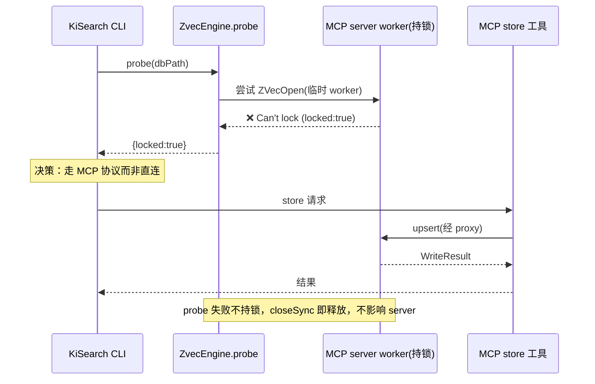
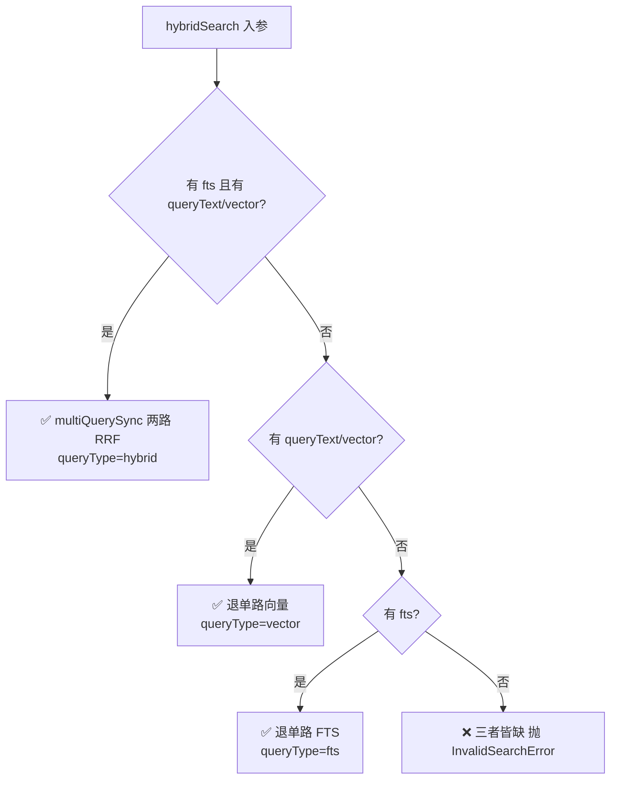
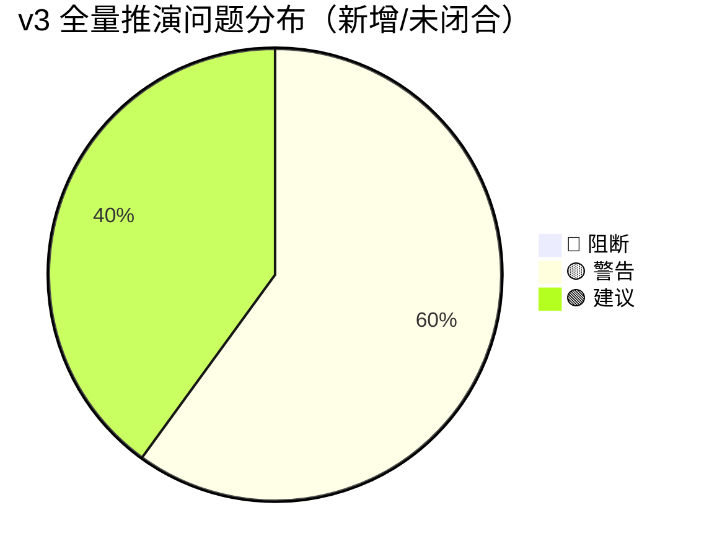

# 场景推演报告 v3：ZvecEngine 基座模块（全量推演，v5）

> 推演时间：2026-07-20
> 输入文档：`zvec-base-module.md`（v5）、`requirement.md`（REQ-20260717-001）、`dependencies/zvec.md`、`dependencies/README.md`
> 推演口径：全量推演——在 v2 增量核验（v5 修复项已闭合）基础上，补充 v2 未深覆盖的场景，判断"设计是否正确合理、能否进入实现"。
> 原则：只记录问题，不修改设计文档。

## 1. 角色清单

| # | 角色 | 类型 | 权限层级 | 职责 | 来源 |
|---|------|------|---------|------|------|
| 1 | KiSearch 常驻 MCP server | 程序 | 持有 db 写句柄（主调用方） | 常驻持有单一 worker 写句柄；对外暴露 MCP 工具；调用所有 ZvecEngine 能力 | §0 db 归属 / §5 常驻保活 |
| 2 | KiSearch CLI | 程序 | 并发写入方 | 一次性建库/查询/回写；写入须走 MCP 协议或排队等锁 | §0 / §5 db 归属 |
| 3 | KiSearch 上层领域层（ki-relation/ki-path/ki-search） | 程序 | 调用方 | 把领域标签/tag/scope 映射为通用 `tags`/`fields` 传下引擎 | §2 铁律 |
| 4 | Embedding 提供方（SiliconFlow HTTP API） | 程序（外部） | 注入依赖 | 提供 4096 维 Qwen3-Embedding-8B；含重试/分批/超时 | §4.6 / REQ-03 |
| 5 | 开发人员 | 用户 | 配置者 | 注入 EmbeddingProvider、配置 schema/tokenizer | §4.1 |

> 全部为程序/系统角色，无"用户登录层级"概念；权限差异体现在"谁持有锁"而非账号体系。

## 2. 推演矩阵 + 启用策略 profile

### 2.1 角色 × 场景推演矩阵

| 场景 \ 角色 | MCP server | CLI | 领域层 | Embedding | 开发 |
|---|---|---|---|---|---|
| S1 建库+写入+混合检索(Happy) | ✅ | - | ✅ | ✅ | - |
| S2 常驻时 CLI 并发写入(锁协调) | ✅ | ✅ | - | - | - |
| S3 批量写入(worker async 承诺) | ✅ | - | - | - | - |
| S4 embedding 失败/限流(异常) | ✅ | - | - | ✅ | - |
| S5 update 不一致(异常) | ✅ | - | - | - | - |
| S6 db 损坏重建(异常) | ✅ | - | - | - | - |
| S7 listIds 大库扫描(边界) | ✅ | - | - | - | - |
| S8 open 维度/度量不符(异常) | ✅ | - | - | - | - |
| S9 hybrid 退化矩阵(异常/边界) | ✅ | - | - | - | - |
| S10 代码符号精确召回(混合语料) | ✅ | - | ✅ | - | - |
| S11 embed 失败粒度(边界) | ✅ | - | - | ✅ | - |
| S12 结构化 Filter 注入(安全) | ✅ | - | ✅ | - | - |
| S13 queryText+vector 同传(边界) | ✅ | - | - | - | - |
| S14 worker 入口打包(部署) | ✅ | - | - | - | - |

### 2.2 设计点覆盖矩阵

| 设计点 \ 场景 | S1 | S2 | S3 | S4 | S5 | S6 | S7 | S8 | S9 | S10 | S11 | S12 | S13 | S14 |
|---|---|---|---|---|---|---|---|---|---|---|---|---|---|---|
| 单集合 + tag 隔离 | ✅ | - | - | - | - | - | - | - | - | - | - | - | - | - |
| 维度校验铁律(4096) | ✅ | - | - | - | - | - | - | ✅ | - | - | - | - | - | - |
| metric 限定 COSINE + score 归一化 | ✅ | - | - | - | - | - | - | ✅ | ✅ | - | - | - | - | - |
| db 单一进程单一写句柄 | ✅ | ✅ | ✅ | - | - | - | - | - | - | - | - | - | - | - |
| 全异步(async)承诺 | ✅ | - | ✅ | ✅ | ✅ | - | - | - | - | - | ✅ | - | - | ✅ |
| embedding 自动 embed + 分层错误 | ✅ | - | - | ✅ | - | - | - | - | - | - | ✅ | - | - | - |
| update 联动规则 | - | - | - | - | ✅ | - | - | - | - | - | - | - | - | - |
| 退化矩阵(hybrid) | - | - | - | - | - | - | - | - | ✅ | - | - | - | ✅ | - |
| 损坏识别/重建责任 | - | - | - | - | - | ✅ | - | - | - | - | - | - | - | - |
| listIds 性能边界 | - | - | - | - | - | - | ✅ | - | - | - | - | - | - | - |
| FTS 分词器全局唯一 | - | - | - | - | - | - | - | ✅ | ✅ | ✅ | - | - | - | - |
| Filter 转义/注入 | - | - | - | - | - | - | - | - | - | - | - | ✅ | - | - |
| EmbeddingProvider 跨 worker | ✅ | - | ✅ | ✅ | - | - | - | - | - | - | ✅ | - | - | ✅ |

### 2.3 启用策略 profile

- ✅ CRUD/接口类（命中：B-01~B-16 全为集合/文档/检索 CRUD + 接口契约）
- ✅ 并发/竞态敏感类（命中：db 文件锁、单一写句柄、worker 串行化、CLI 锁协调）
- ✅ 批处理/同步类（命中：bulk upsert 分批 + embedding 分批重试）
- ➖ 未启用：事务/状态机类、实时/推送类、重构/迁移类

> 加压点：并发锁语义（S2/S3）、批级错误分层（S4/S11）、Filter 注入（S12）、分词器决策（S10）。

## 3. 场景推演详情

### 🎬 S1 建库 + 写入 + 混合检索（Happy Path）

【执行者】MCP server + 领域层 + Embedding
【场景描述】首次建库 → 批量 upsert（喂 `{id,text,fields}`）→ hybridSearch 召回

【数据走向验证】

| 步骤 | 操作 | 数据流向 | 验证结果 | 问题 |
|---|---|---|---|---|
| 1 | 领域层映射标签 | 领域 → `tags`/`fields` | ✅ | - |
| 2 | `ZvecEngine.create` | 主线程 → worker（postMessage）→ zvec 建库 | ✅ | - |
| 3 | `upsert({id,text,fields})` | text 传 worker → embedding（SiliconFlow HTTP，worker 内）→ 向量 + FTS 索引写入 | ⚠️ | S11 embed 失败粒度 / S14 worker 内 embedding 注入（见 #2/#3） |
| 4 | `hybridSearch({queryText,fts})` | worker 内 embed → `multiQuerySync` 两路 RRF → Hit[] | ✅（路径成立） | S10 分词器对代码符号待验 |

【关键设计点验证】

| # | 设计点 | 验证问题 | 结果 | 问题 | 置信度 |
|---|---|---|---|---|---|
| 1 | 单集合 + tag 隔离 | 三层标签是否能共存不串扰 | ✅ | filter 隔离成立 | 高 |
| 2 | 维度校验铁律 | create 时 4096 校验 | ✅ | 不符抛 `DimensionMismatchError` | 高 |
| 3 | metric 限定 COSINE | score 归一化方向 | ⚠️ | 公式需真实 embedding 验证（已知 #7） | 中 |

【结论】Happy Path 数据走向与接口契约成立；阻塞点为 embedding 在 worker 内的注入可行性（#2）与代码符号分词（#1）。

---

### 🎬 S2 常驻时 CLI 并发写入（锁协调，协作路径）



【验证】✅ 数据走向与锁协调成立（v5 #2 已闭合）。CLI 探测 → 路由 MCP → server worker 唯一写句柄，无双写冲突。

---

### 🎬 S3 批量写入（worker async 承诺）

【验证】✅ v5 worker actor 架构消解"同进程锁冲突 + async 承诺"矛盾：`ZVecOpen` 仅 worker 内一次，主线程 proxy 经 `postMessage` 转发天然 async；查询亦进 worker（read_only 也锁冲突）。插入分批 `insertSync` + `setImmediate` 让出查询插队，41.8ms/200 条可接受。

---

### 🎬 S4 embedding 失败 / 限流（异常）

【验证】✅ 分层错误设计正确：批级用法错误（维度/未知字段/schema 漂移/不一致更新）抛类型化异常；文档级可恢复错误（embedding 失败/id 冲突/not found）进 `WriteResult.errors[]` 且 `EMBEDDING_FAILED` 以 `batchSize` 小批为失败粒度。⚠️ 但"预计算 vector 不受 embed 失败影响"与"小批同成败"存在内部张力（见 S11 / #3）。

---

### 🎬 S5 update 不一致（异常）

【验证】✅ `update` 仅传 vector 不传 text 且集合配 FTS → 抛 `InconsistentUpdateError`（v5 #3 已补），避免向量更新而 FTS 索引停留旧原文导致漏召回。联动规则（仅 fields / 传 text 重嵌）清晰。

---

### 🎬 S6 db 损坏重建（异常）

【验证】✅ db 定位为"可重建缓存非权威源"，`open()` 失败抛 `CollectionCorruptedException`；重建责任 = 上层重新扫描代码库抽取 → `destroy()`+`create()`+全量 `upsert`。基座只提供闭环，不备份。责任划分正确。

---

### 🎬 S7 listIds 大库扫描（边界）

【验证】✅ `listIds` 纯 filter 扫描原生可行（H-01 已实测）；limit 默认 1000 / 上限 10000 / 超限抛 `InvalidSearchError`，与检索 topk 上限 1000 区分合理。

---

### 🎬 S8 open 维度/度量不符（异常）

【验证】✅ `open` 后校验：embedding.dimension ≠ 持久化 dimension → `DimensionMismatchError`；持久化 metric ≠ COSINE → `SchemaMismatchError`；`schemaAssert` 逐项比对。类型化异常名齐全（v5 #9）。

---

### 🎬 S9 hybrid 退化矩阵（异常/边界）

【验证】✅ 退化矩阵完整覆盖四种输入组合（hybrid / 退 vector / 退 fts / 三者皆缺抛 `InvalidSearchError`）。`queryType` 仅作来源标识，score 方向统一"越大越相关"，消解 v1 方向分叉陷阱。`weighted` 被 fts 数值碾压已实测，默认 rrf 合理。



---

### 🎬 S10 代码符号精确召回（混合语料，⚠️ 高风险）

【执行者】MCP server + 领域层
【场景描述】KiSearch 语料 = bk-monitor 中文 wiki + 代码符号（函数名/路径，如 `syncRelation`、`ki/path/to/file`）。REQ-04 验收明确要求"代码符号查询精确命中"为刚需。

【关键设计点验证】

| # | 设计点 | 验证问题 | 结果 | 问题 | 置信度 |
|---|---|---|---|---|---|
| 1 | FTS 分词器全局唯一 | 单集合单 FTS 字段只能配一个 tokenizer，中文与代码符号能否同时保召回 | ⚠️ | 设计强制"默认 jieba、禁 standard"（H-03 证 standard 中文返回空），但代码符号（CamelCase/snake_case/路径）在 jieba 下的 token 行为**未经实测**；若 jieba 把 `syncRelation` 拆碎或 `ki/path` 切错，将直接失败 REQ-04 验收 | 中 |

【风险分析】

```mermaid
flowchart TD
    A[单集合 单一 FTS 字段] --> B{选哪个 tokenizer?}
    B -->|jieba(设计默认)| C[✅ 中文 wiki 召回 OK<br/>⚠️ 代码符号 token 行为待验]
    B -->|standard| D[❌ 中文 FTS 全空(H-03 已证)]
    B -->|whitespace| E[❌ 中文拆不了词<br/>代码符号仅按空格切]
    C --> F{REQ-04 代码符号精确命中?}
    F -->|jieba 保留标识符| G[✅ 验收过]
    F -->|jieba 拆碎标识符| H[❌ REQ-04 失败]
```

> **zvec 约束**：FTS 字段不支持 alter（schema 演化），tokenizer 建库即定，无法事后更换。且单集合只有一个 FTS 字段，`ki-relation`/`ki-path`/`ki-search` 共用同一 `content` + 同一 tokenizer，无法"中文用 jieba、代码符号用 whitespace"分而治之。

【结论】🔴/🟡 待实测定级 —— 设计未对"混合语料单 tokenizer"这一 REQ-04 核心验收风险给出实测结论。建议：进入实现前用真实混合语料实测 jieba 对 `CamelCase`/`snake_case`/路径分隔 的 token 产出；若不满足，考虑建库时配置**两个 STRING FTS 字段**（一个 jieba 给中文、一个 whitespace/standard 给代码符号，查询时走 hybrid 双 FTS 路）——但需先验证 zvec 是否允许同一集合多 FTS 字段且多路 `multiQuerySync` 合并。严重度暂评 🟡（功能可用，但可能升级为 🔴 阻断 REQ-04 验收）。

---

### 🎬 S11 embed 失败粒度（边界，🔴→🟡 内部矛盾）

【验证】⚠️ §4.4 与 §4.6 存在表述矛盾：
- §4.4：`EMBEDDING_FAILED` 注"预计算 vector 的 DocInput（已给 vector）不依赖 embed，照常写入，不受 embed 失败影响"。
- §4.6："embed 接口不支持单条失败区分时以**小批为最小失败单元（一批同成败）**"。

当一个 `batchSize` 小批同时含 `text` 文档（需 embed）与预计算 `vector` 文档（不需 embed），且该批 embed 失败：按 §4.4 预计算 vector 文档应照常写入；按 §4.6"一批同成败"整批失败（含预计算 vector 文档）。**两种表述对预计算 vector 文档的命运给出相反结论**，实现者无法唯一确定行为。

【建议】明确切分规则：engine 在调用 `embed` 前将小批按"是否需 embed"分为两组，embed 失败仅使 `text` 文档标 `EMBEDDING_FAILED`，预计算 `vector` 文档独立写入。此规则同时兑现 §4.4 的"预计算 vector 不受影响"承诺。严重度 🟡。

---

### 🎬 S12 结构化 Filter 转义 / 注入（安全，🟡）

【验证】⚠️ §4.3 将 `Filter` 定义为结构化类型"内部转 zvec 类 SQL 字符串并转义，避免注入"，但**未定义转义机制**：
- zvec filter 为类 SQL 布尔表达式（`tag='ki-relation'`、`publish_year > 2000`），字段名须为合法标识符，字符串值须加引号。
- 字段名若来自领域层映射（可控，schema 已声明），风险较低；但**字符串值**（如 `fields` 中的任意标量文本）若含引号/特殊字符且不转义，将破坏 filter 语法或注入。
- 现有 `Filter` 联合类型还预留 `{ raw: string }` 逃生口（调用方自负转义），进一步放大注入面。

【建议】在设计层明确转义策略：字段名走白名单/标识符校验（非法即抛 `InvalidFilterError`）；字符串值统一加单引号并对内部单引号转义（`'`→`\'` 或按 zvec 语法）；`{ raw }` 逃生口标注为"仅限可信内部调用"。严重度 🟡（安全 + 正确性）。

---

### 🎬 S13 HybridSearchReq 同传 queryText + vector（边界，🟢）

【验证】⚠️ §4.3 `HybridSearchReq.queryText` 与 `vector` 标注"二选一"，但未定义**两者同时传入**时的优先级/校验行为。实现者可能静默取其一或报错。

【建议】明确：二者互斥校验（同时传入抛 `InvalidSearchError`）或"vector 优先于 queryText"。严重度 🟢。

---

### 🎬 S14 worker 入口打包 / 分发（部署，🟡）

【验证】⚠️ v5 架构要求整个 `ZvecEngine` 跑在 dedicated `worker_threads`。`worker_threads` 需要**可解析的 worker 脚本入口**。KiSearch 以 `bin/ki.mjs`（Node/ESM）分发，ki 进程在 `knowledge-indexer` 内以 TS 源码运行（经 loader/tsx）。若 ki 后续被打包（esbuild/tsup/pkg）或 worker 文件未被正确打包进产物，worker 入口解析将失败。

【建议】实现时锁定 worker 入口方案（如 `new Worker(new URL('./zvec-worker.mjs', import.meta.url))`），并在目标运行方式（tsx 直跑 / 打包产物）下回归验证 worker 可 spawn。严重度 🟡（部署风险，不阻断设计正确性）。

---

## 4. 问题汇总

| # | 类型 | 角色 | 场景 | 问题描述 | 建议 | 严重度 |
|---|------|------|------|---------|------|:---:|
| 1 | 设计冲突/待验 | 领域层/MCP | S10 | 单集合单一 FTS 分词器，无法同时适配"中文 wiki(jieba)+代码符号(whitespace)"；jieba 对标识符 token 行为未实测，直接关系 REQ-04 代码符号精确召回验收 | 真实混合语料实测 jieba 标识符 token；不满足则评估双 FTS 字段方案 | 🟡（可升级 🔴） |
| 2 | 设计冲突 | MCP/Embedding | S1/S3/S11/S14 | v5 §5 声称"embedding 在 worker 内闭环"，但 §4.6 `EmbeddingProvider` 为可注入实例（函数对象不可 `postMessage`），跨 worker 边界未定义 → 与"可注入任意实现"矛盾，v5 未实际闭合（延续 v2 新-#1） | 明确方案 X（embedding 留主线程 + 向量 Transferable 零拷贝）或方案 Y（provider 序列化重建，约束注入形态）；改 §5 表述 | 🟡 |
| 3 | 内部矛盾 | MCP | S4/S11 | §4.4"预计算 vector 不受 embed 失败影响" 与 §4.6"小批同成败"对混合小批中预计算 vector 文档命运给出相反结论 | engine 调用 embed 前按"是否需 embed"切分批次，embed 失败仅影响 text 文档 | 🟡 |
| 4 | 安全/正确性 | 领域层/MCP | S12 | 结构化 Filter → zvec 类 SQL 字符串，转义机制未定义，存在注入与语法破坏风险（`{raw}` 逃生口放大面） | 明确字段名白名单 + 字符串值引号/转义策略；`{raw}` 限可信内部 | 🟡 |
| 5 | 边界 | MCP | S13 | `HybridSearchReq` 同时传 `queryText`+`vector` 优先级未定义 | 互斥校验或"vector 优先" | 🟢 |
| 6 | 部署 | MCP | S14 | worker_threads 入口在 ki 的 ESM/TS/打包分发下须可解析，未验证 | 锁定 worker 入口方案并回归目标运行方式 | 🟡 |
| 7 | 需求映射 | 上层 | S4 | REQ-06 验收"ok/errors/skipped" 与设计 `WriteResult`(ok/failed/errors，无 skipped) 不完全对齐（upsert 幂等无 skip，insert 冲突进 errors 非 skipped） | REQ-06 验收重映射 skipped，或设计注明"upsert 覆盖不计 skip" | 🟢 |
| 8 | 语义 | MCP | S2/S8 | `isLocked()` 在自身持锁进程内语义歧义（自身持锁返回 true 无意义） | 明确 isLocked = "是否有其他进程持锁"，或仅跨进程(CLI)探测用 | 🟢 |
| 9 | 待实测 | MCP | S5/S7 | `deleteSync` 对不存在 id 的 zvec 行为未实测，NOT_FOUND 如何落入 `errors[]` 未确认 | Node 实测 deleteSync 缺失 id 返回/异常 | 🟢（同 v2 新-#3） |
| 10 | 待实测 | MCP | S1/S9 | `score=1/(1+distance)` 公式与 Recall@5≥90% 需真实 SiliconFlow embedding + compare.py 语料闭合 | 实现后补真实 embedding 基准 | 🟢（同 v2 #7） |

> 已闭合项（v5 已修复，本次确认无需重开）：🔴 #1 worker actor 架构；🟡 #2 静态 probe / #3 InconsistentUpdateError / #4 embed 失败粒度命名 / #5 listIds limit / #6 db 重灌定位 / #9 open 维度校验。

统计（本次新增/未闭合）：
- 🔴 阻断：0（#1 为 🟡 待实测，可升级）
- 🟡 警告：6（#1~#4、#6，其中 #2 为 v5 内部未闭合项）
- 🟢 建议：4（#5、#7、#8、#9、#10 中 🟢 部分）



## 5. 推演结论

### 整体评估
- 推演覆盖：5 个角色 / 14 个场景（含协作 S2、异常 S4~S9、边界 S10~S13、部署 S14）
- 问题发现：🔴 0 / 🟡 6 / 🟢 4
- v5 已闭合的 🔴 #1（worker 架构）与 5 项 🟡 经本次确认仍然有效，设计主干正确。

### 评审结论

| 条件 | 结论 |
|---|---|
| 存在 ≥1 个 🔴 阻断 | — |
| 无 🔴 但存在 ≥1 个 🟡 | ⚠️ **有条件通过** |

### 关键判断：设计是否正确合理？

**整体正确、主干可行，但有 4 项 🟡 须在进入实现 / design-craft 上层前闭合，否则会在实现期返工：**

1. **#2 EmbeddingProvider 跨 worker 边界未定义（最高优先级）**：v5 §5 自己声称"embedding 在 worker 内闭环"，但可注入的 provider 实例无法 `postMessage` 到 worker，这是 v5 内部未闭合的内在矛盾（v2 已标 🟡 但 v5 文档未改）。必须在 design-craft 上层**明确方案 X 或 Y 并回写 §5**，否则 worker 架构无法落地。
2. **#1 FTS 分词器单选择 vs 混合语料**：直接关系 REQ-04 代码符号精确召回验收，须用真实混合语料实测 jieba 标识符行为；不满足则升级 🔴 并改方案（双 FTS 字段）。
3. **#3 embed 失败粒度内部矛盾**：§4.4 与 §4.6 表述冲突，须统一为"按是否需 embed 切分批次"。
4. **#4 Filter 转义机制缺失**：安全 + 正确性，须在设计层定义转义策略。

其余 #5/#6/#7/#8/#9/#10 为边界、部署、需求映射与待实测项，不阻断设计，但建议在实现期一并处理。

### 与依赖/需求一致性抽检
- ✅ 需求 REQ-01（封装引擎层）、REQ-04（原生混合检索）：接口 B-01/B-04/B-11 完整覆盖。
- ✅ 依赖 `zvec.md` 事实对齐：COSINE 度量、FTS 需 STRING+FtsIndexParam、jieba 中文有效/standard 中文失效、批量整批回滚与逐条 id 冲突、Async 仅覆盖 query/multiQuery/optimize/deleteByFilter —— 设计 §4~§7 全部正确引用且无与依赖矛盾之处。
- ✅ 铁律（基座不认识 ki-relation、MCP 在上层）得到遵守，probe/tryOpen/close 正确支撑上层锁协调，未越界。
- ⚠️ 依赖 `zvec.md` 提示"FTS 字段不支持 alter、单集合单 FTS 字段"，设计据此正确约束为建库即定；但由此衍生的混合语料分词冲突（#1）是依赖事实与需求 REQ-04 之间的张力，非设计错误，属需实测验证的验收风险。

### 下一步建议
1. **立即决策 #2（embedding 归属）**并回写 v5 §5——这是 worker 架构能否实现的前提。
2. **实现前实测 #1（jieba 标识符 token）**与 #9/#10（delete 缺失 id、score 公式 + Recall@5），用真实混合语料与 SiliconFlow embedding 闭合验收。
3. 进入 `design-craft` 上层（MCP server 常驻架构 / db 共享策略 / scope 隔离）时，一并闭合 #3（embed 批次切分）、#4（Filter 转义）、#6（worker 打包）。
4. 基座模块**可进入实现**（P0 主链路 B-01/B-04/B-11 + worker proxy 骨架先行），但 #2 决策须在 proxy 骨架落地前锁定。
