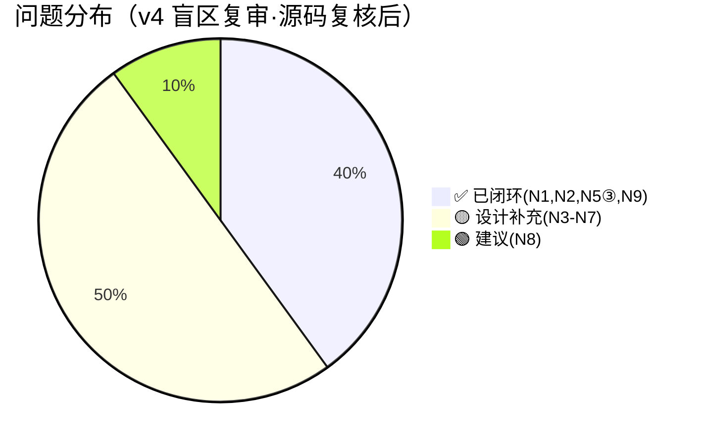

# 场景推演报告 v4：方案甲·模型 Y 盲区复审

> 推演时间：2026-07-21
> 输入文档：design/REF_S04_CLI_Server_Channel_DESIGN.md §3.1–§3.4、§+6；design/REF_S06_MCP_Server_DESIGN.md；design/S06_Engine_DESIGN.md（isLocked 语义 §57）；review/scenario-rehearsal-v2.md 附录（zvec 跨进程排他锁 demo）
> 推演目的：模型 Y 拍板后，挖上一轮（v3）未覆盖的盲区——守护进程生命周期归属、写入提示语义与原话偏差、多项目探测歧义、stop 阻塞期、HTTP 暴露面、daemonize、Agent 端点配置

## 1. 角色清单

| # | 角色 | 类型 | 权限层级 | 职责 | 来源 |
|---|------|------|---------|------|------|
| 1 | 终端用户 | 用户 | 已登录 | 执行 ki CLI 命令（search/store/import-kb…） | S-04 §术语 |
| 2 | AI Agent | 程序 | — | **HTTP 客户端**，经 daemon 做记忆读写（模型 Y：不再 spawn --serve） | S-04 §3.1 |
| 3 | ki server 守护进程 | 程序 | — | 独立守护，单一持有 zvec rw 句柄，暴露**单一 HTTP** 服务 CLI+Agent | S-04 §3.1 |
| 4 | CLI stdio 兜底子进程 | 程序 | — | 仅「无 daemon」时 per-call spawn `ki mcp --serve`（stdio） | S-04 §3.4 |

## 2. 推演矩阵 + 启用策略 profile

### 2.1 启用策略 profile

- ✅ 并发/竞态敏感类（命中：daemon 单句柄、stop 阻塞期、HTTP 并发多 client）
- ✅ 重构/迁移类（命中：Agent stdio→HTTP 改造、CLI 路由层）
- ✅ 批处理/同步类（命中：import-kb/restore 批量重建、长 bulk_store）
- ➖ 未启用：CRUD/接口类、事务/状态机类、实时/推送类

### 2.2 设计点覆盖矩阵（本轮新增盲区）

| 设计点 \ 场景 | N1 守护启动 | N2 写提示语义 | N3 多项目探测 | N4 stop阻塞 | N5 HTTP暴露 | N6 daemonize | N7 Agent端点 | N8 isLocked语义 |
|--------------|:---:|:---:|:---:|:---:|:---:|:---:|:---:|:---:|
| 生命周期归属 | 🔴/🟡 | - | - | - | - | 🟡 | 🟡 | - |
| 写命令路由 | - | 🟡 | - | - | - | - | - | - |
| HTTP 单通道多 client | - | - | - | - | 🟡 | - | 🟡 | - |
| 本地独占写 | - | 🟡 | - | 🟡 | - | - | - | 🟢 |

### 2.3 推演矩阵（角色 × 场景）

| 场景 \ 角色 | 终端用户 | AI Agent | ki server | CLI 兜底 |
|-------------|:---:|:---:|:---:|:---:|
| N1 守护进程谁启动 | 🔴/🟡 | 🟡 | - | - |
| N2 写命令提示语义 | 🟡 | - | - | - |
| N3 多项目/多 vectorDir | 🟡 | 🟡 | 🟡 | - |
| N4 阻塞期 stop | - | 🟡 | 🟡 | - |
| N5 HTTP 鉴权/并发 | - | 🟡 | 🟡 | - |
| N6 跨平台 daemonize | 🟡 | - | - | - |
| N7 Agent 端点配置 | - | 🟡 | - | - |
| N8 isLocked 语义 | - | - | - | 🟢 |

## 3. 场景推演详情

### 3.1 N1：守护进程到底「谁启动、何时启动」⚠️ 架构级空白

【场景】模型 Y 的核心前提是「独立守护进程归用户/系统托管」。但 S-04 §3.1/§3.4 只写了 `ki server start` 命令行为，**从未说明这个 daemon 在 Agent 的真实使用链路里由谁拉起**：

- 若**用户手动** `ki server start`：Agent 的记忆能力在用户启动前完全不可用，且用户须记住「用 ki 前先起 server」——这与「常驻、无感」心智模型冲突，也违背用户最初「Agent 常驻就能用」的预期。
- 若**Agent 在首次访问时自动** `ki server start`：等于 Agent 拥有 daemon 生命周期 → 回到模型 X 的实质（只是 transport 换成 HTTP），与 Y 宣称的「守护进程归用户/系统托管、Agent 不 spawn」自相矛盾。
- 若**系统/用户级服务**（systemd --user / launchd）：最贴合 Y，但设计未提供 unit 文件、未定义开机自启/崩溃重启策略。

【关键设计点】S-04 把「生命周期归属」当成了既定事实，但它是**未定义的空白**。这是 v3 收敛 P1 时顺带引入的新盲点：P1 解决了「Agent 怎么连」，却没解决「daemon 怎么存在」。

【推演结论】🔴/🟡 级架构空白：必须明确 daemon 的启动责任方与时机，否则 Y 在 Agent 主场景下无法自洽（要么 Agent 退化成隐式 spawn 者，要么用户手动运维）。

### 3.2 N2：写入提示语义与你原话的偏差 ⚠️ 待你拍板

【场景】你最初的原话是：「cli stdio 也同样保持，只不过**如果 mcp 是用 cli 运行时，本地 cli 写入的相关命令需要有提示关闭 mcp**」。

但 v3 收敛时，我把写命令改成了**默认走 HTTP 无缝、不提示**，仅 `--local`/批量重建才提示。这与你的原话存在偏差：

- 你的字面意图：MCP（daemon）运行时，**本地写入类命令应当提示「关闭 MCP」**。
- 我的收敛：写命令默认 HTTP 透明复用，根本不提示；只有显式 `--local` 才提示。

【关键设计点】这两者的体验完全不同：
- 按你原话：每次 `ki store`（daemon 在跑）都会弹「是否关闭 MCP 以本地执行？」——频繁打断，但忠实于「本地写要提示」。
- 按我的收敛：写命令静默走 HTTP，体验更顺，但**静默违背了「本地写要提示」的字面要求**，且用户可能误以为自己在本地写、实际走的是 daemon。

【推演结论】🟡（但属「需你确认」级，非技术缺陷）：v3 的收敛是我单方面做的 interpretation，与你的原话不一致。必须在两种语义间二选一（见下方提问）。

### 3.3 N3：多项目 / 多 vectorDir 时的探测歧义

【场景】`ki` 是按项目隔离记忆的（不同 config → 不同 vectorDir）。若用户有两个项目 A、B，各需自己的 daemon（不同 vectorDir、不同端口）。

- `ki server start`（A 项目目录内）：默认端口写死或单例 → 写 pidfile。
- 切到 B 项目再 `ki server start`：§3.4 说「已运行则拒绝并报告」→ B 的 daemon 起不来。
- CLI `probe()` 只认「端口/pidfile 是否有 daemon」，**不绑定当前项目的 vectorDir** → B 项目的 `ki search` 可能误连到 A 的 daemon（不同 vectorDir），读出错误数据。

【关键设计点】设计未定义「daemon 与 config/vectorDir 的绑定与发现机制」。`probe()` 的判定维度（端口 or pidfile）不足以在多项目并存时路由正确。

【推演结论】🟡 遗漏场景：多项目并存时，单例 daemon + 端口 probe 会导致跨项目误连或第二个项目无法起 daemon。

### 3.4 N4：`ki server stop` 在阻塞调用中的行为

【场景】daemon 单进程、同步原生调用（insertSync/querySync）阻塞事件循环（v3 P5）。假设 daemon 正在执行一个长 `bulk_store`（同步阻塞数十秒）：

- 此时用户在另一终端执行 `ki server stop`（另一 HTTP 请求或信号）→ 该请求进入事件循环队列，**必须等当前 bulk 调用返回后才能被处理**。
- 结果：`ki server stop` 挂起直到 bulk 结束，与 §3.4「优雅停止」的预期（用户期望秒级响应）不符。

【关键设计点】§3.4 的 stop 描述未覆盖「daemon 正忙（同步阻塞）」这一边界。stop 的「优雅」需明确为：要么等当前同步调用完成（stop 延迟不可控），要么把写操作改成可中断/异步（超出当前设计）。

【推演结论】🟡 边界处理：stop 在 daemon 同步阻塞期内的响应性未定义。

### 3.5 N5：HTTP 通道的暴露面与并发多 client

【场景】daemon 监听本地 HTTP 端口，需确认三件事：

1. **鉴权**：localhost 上任意本地进程都能调用写工具（含潜在恶意程序）。是否需 bearer token？设计未提。
2. **端口冲突**：§3.4 只说「已运行则拒绝」，未说「端口被**非 ki** 进程占用」时怎么办（start 失败策略缺失）。
3. **并发多 client（Y 的核心前提）**：Y 成立的前提是「单一 HTTP 同时服务 CLI 与 Agent」。需确认 MCP StreamableHTTP 传输在 SDK 层面支持**并发多客户端会话**（CLI 短命 + Agent 常驻同时在线）。若 SDK 的 StreamableHTTP server 是单会话/单连接模型，Y 的前提直接崩塌。

【关键设计点】第 3 点是 🔴 级**前提性待查证项**（置信度中，需在实现前用 SDK 实测确认）。若 StreamableHTTP 不支持并发多 client，则 Y 不可行，需退回到「per-client 独立 server」或「Agent 独占 + CLI 排队」。

【推演结论】🟡（其中并发多 client 为需查证的 🔴 前提项）：HTTP 暴露面、端口冲突、并发多 client 都需在 S-06 落地前确认。

### 3.6 N6：守护进程化（detach）的跨平台机制

【场景】`ki server start` 必须真正脱离启动它的 shell（否则用户终端被阻塞）。Node 单进程 daemonize 在类 Unix 靠 `fork`+`setsid`/`detached` spawn，Windows 上无 fork。设计完全没提实现机制。

【关键设计点】这是落地必踩的坑：若只是「前台运行」，用户体验灾难；若用 `child_process.spawn(..., {detached:true, stdio:'ignore'})` 需配合 pidfile 与跨平台处理。设计应至少点明机制与 Windows 差异。

【推演结论】🟡 边界/落地：daemonize 机制与跨平台未定义。

### 3.7 N7：Agent 如何得知 daemon 的 URL/端口

【场景】Agent 集成从「spawn `ki mcp --serve` stdio」改为「连 `ki server` HTTP」。但 Agent（如 OpenClaw/Claude Code）怎么知道 daemon 的 URL 与端口？

- URL 来自 `config.yaml` 的 `server.httpPort`？Agent 如何读取 ki 的 config？
- 端口是固定默认值（如 18789）还是随机？随机则 Agent 无法预配置。
- 这是真实的对接落地缺口，设计未提 Agent 侧的端点发现/配置方式。

【推演结论】🟡 遗漏：Agent 端 HTTP endpoint 的配置/发现机制未定义。

### 3.8 N8：isLocked 语义（引用 S06_Engine §57）

【场景】S06_Engine §57 明确：`isLocked` 语义应为「是否有**其他进程**持锁（自身持锁返回 false）」，否决「含自身」。

- CLI（独立进程）probe daemon 持锁 → 返回 true ✅ 正确。
- 若误用「含自身」语义，daemon 自 probe 会误判为已持锁 → 路由错乱。

【关键设计点】S-04 §3.4 路由层应**显式注明**：CLI 的 `probe()` 走「HTTP 健康探测 / 读 pidfile」，**不要**调用 ZvecEngine.isLocked（避免 daemon 自判定歧义）。当前 §3.4 写的是「HTTP 健康探测 / 读 pidfile」，已正确，但应与 S06_Engine §57 语义对齐、加一句防呆注释。

【推演结论】🟢 建议：在 S-04 路由层补一句「probe 走 pidfile/HTTP，不调 ZvecEngine.isLocked」，与 S06_Engine §57 对齐。

### 3.9 N9：官方 zvec-mcp-server 源码复核（对模型 Y 的启示）⚠️ 架构决策输入

【源码事实】复核 `zvec-mcp-server/`（位于仓库根 `zvec-mcp-server/`，独立 Python 包，Apache-2.0）：

1. **FastMCP 实现，默认 stdio**：`src/zvec_mcp/__main__.py` 调 `mcp.run()`（无 transport 参数）→ 默认 **stdio**。`pyproject.toml` 依赖 `mcp>=1.1.2` + `zvec>=0.3.0`。IDE 集成（`uvx zvec-mcp-server`）即 per-client stdio spawn。
2. **进程内集合缓存**：`utils.py` 的 `_open_collections: dict` 是**模块级全局 dict**。stdio 下每进程独立缓存、须各自 `open_collection`；且每进程各自 `zvec.open()` 抢 rw 锁 → 跨进程 `Can't lock`。**这正印证用户「stdio MCP 时代锁冲突」的原话**。
3. **tool 前必须先 `open_collection`**：所有 17 个 tool 在 `get_collection()` 返回 None 时报「Collection 'X' not found. Please open it first.」→ 守护进程模式下须保证集合已被打开（daemon 启动时按 config 预开，或首个 client 打开）。
4. **FastMCP 原生支持 streamable-http**：`mcp>=1.1.2` 的 FastMCP 提供 `transport="streamable-http"`（ASGI，uvicorn 承载），**单 server 进程可服务多个并发 MCP 客户端会话**——这正是模型 Y（单一 HTTP daemon 同时服务 CLI + Agent）的前提。

【对模型 Y 的启示】
- **N5③ 风险大幅下降（🔴→🟢 待烟雾测试）**：daemon 自研于 Node，须基于 **MCP TypeScript SDK** 的 `StreamableHTTPServerTransport`——该传输同样以 HTTP 承载、单 server 进程可服务多个并发 MCP 客户端会话（与 FastMCP 等价）。仍建议实现前用 TS SDK 做一次双 client 并发烟雾测试，确认 session 隔离与集合缓存共享语义。
- **模型 Y 把「硬失败」转为「可控软串行」**：stdio 下多 client 各自抢锁→直接 `Can't lock` 失败；HTTP daemon 下单进程单 rw 锁持有者、缓存全 client 共享→无锁冲突。但须修正：`zvec-probe-node` 实测 `@zvec/zvec` v0.5.0 的写入 API **全部 Sync-only**（仅 `query/multiQuery/optimize/deleteByFilter` 有 Async）——若 zvec 调用跑在主线程，长 bulk insert 会**硬阻塞整个事件循环**，连 `ki server stop` 信号都得等其跑完（比「软串行」严重，见 N4）。故 daemon 必须把 `ZvecEngine` 下沉到 **dedicated `worker_threads`（actor 模型）**：worker 持唯一句柄、主线程持 proxy 经 `postMessage` 转发，事件循环/HTTP 服务不被冻结，async 契约(S-03)也由此兑现。详见 `review/fix-plan.md` §1。
- **N9 已决策（2026-07-21）：采用 (b) Node 自研 daemon**。官方 server 是 Python，而 `ki` 是 Node/TS；用户拍板 **用 Node zvec 绑定（`zvec-probe-node` 已确认存在，是 `@zvec/zvec` 的 Node 探针/验证脚本集合）自研 `ki server` daemon**，与 `ki` 同语言、可深度定制。代价：需把官方 17 工具移植到 Node + 自管并发/缓存（以官方 server 的 17 工具为规范参考，见 §3.9 末尾）。`ki` CLI(Node) 与 Agent 同为 MCP StreamableHTTP 客户端，调 Node daemon 暴露的工具；`import-kb`/`restore`/`--local` 仍走本地 `zvec` + 停 daemon。落到 S-06。

## 4. 问题汇总

| # | 类型 | 角色 | 场景 | 问题描述 | 建议 | 严重度 |
|---|------|------|------|---------|------|:---:|
| 1 | 设计冲突/空白 | 用户/Agent/server | N1 | **守护进程生命周期归属未定义**：谁在何时启动 daemon？用户手动→Agent 主场景不可用且需运维；Agent 自动起→退回模型 X 实质；系统服务→未提供 unit | **【已决策·纯手动启动】** daemon 由用户手动 `ki server start`，v1 不提供 systemd/launchd 自启、不做惰性自启（惰性自启=隐式 X，与 Y 矛盾）；未运行时 Agent 连接失败并提示「请先 ki server start」。S-04 §3.4 已补「生命周期归属」章节 | ✅ 已闭环 |
| 2 | 需求偏差 | 用户 | N2 | **写入提示语义与你原话偏差**：原话要「MCP 运行时本地写命令提示关闭 MCP」；v3 收敛为「写默认走 HTTP 不提示，仅 --local/批量才提示」 | **【已澄清·印证 B 正确】** 用户确认该诉求诞生于 stdio MCP 锁冲突时代；模型 Y 下 daemon 为 HTTP，写命令经 HTTP 复用句柄无锁冲突、无需提示（"http 模式则不存在这样的问题"）；仅 `import-kb`/`restore` 必须本地独占重建及 `--local` 才提示关闭 daemon。S-04 §3.1 已补写提示语义溯源 | ✅ 已闭环 |
| 3 | 遗漏场景 | 用户/Agent | N3 | 多项目/多 vectorDir 并存时，单例 daemon + 端口/pidfile probe 导致跨项目误连或第二项目起不来 | daemon 与 config/vectorDir 绑定（按项目起独立 daemon 或 probe 校验 vectorDir 匹配）；或明确「单 daemon 全局单例，多项目共用」 | 🟡 |
| 4 | 边界处理 | 用户/server | N4 | `ki server stop` 在 daemon 同步阻塞（长 bulk）期内无法被处理，stop 挂起至调用完成；经 `zvec-probe-node` 实测，`@zvec/zvec` v0.5.0 写入全 Sync-only，主线程硬阻塞事件循环让 stop 信号也得排队 | **已定位解法**：daemon 用「单一 zvec worker(actor 模型)」把 zvec 调用下沉到 worker 线程，主线程事件循环不被冻结、stop 信号可及时响应；async 契约(S-03)也由此兑现。N4 转为「写入线程模型」落地项（见 S-06 §3.4、fix-plan.md §1） | 🟡 |
| 5 | 安全/前提 | Agent/server | N5 | HTTP 暴露面：①无鉴权（本地任意进程可调写）②端口被非 ki 占用时 start 失败策略缺失③**MCP StreamableHTTP 是否支持并发多 client**（Y 的核心前提） | ①加 bearer token 或限制 loopback ②start 端口占用处理 ③**官方 FastMCP 栈（`mcp>=1.1.2`）原生支持 streamable-http 并发多 client（见 N9）→ 降为🟢 仅需烟雾测试** | 🟡（③已降🟢） |
| 6 | 边界/落地 | 用户 | N6 | daemonize（detach）机制与跨平台（Windows 无 fork）未定义 | 明确 spawn detached+pidfile 机制及 Windows 差异 | 🟡 |
| 7 | 遗漏 | Agent | N7 | Agent 改造后如何得知 daemon 的 URL/端口未定义（配置来源、固定/随机端口） | 定义 Agent 侧端点配置/发现（读 config.yaml server.httpPort 或环境变量） | 🟡 |
| 8 | 数据/语义 | CLI/server | N8 | isLocked 语义须为「其他进程持锁」；路由层 probe 应避免 daemon 自判定 | S-04 路由层补注「probe 走 pidfile/HTTP，不调 ZvecEngine.isLocked」，对齐 S06_Engine §57 | 🟢 |
| 9 | 架构决策 | 架构 | N9 | 官方 zvec-mcp-server 是 **Python/FastMCP**，而 `ki` 是 **Node/TS**。模型 Y 的 daemon 究竟复用官方 Python server 还是用 Node zvec 绑定自研？ | **【已决策·2026-07-21】采用 (b) Node 自研 daemon**：`ki server` 基于 Node zvec 绑定（`zvec-probe-node`）实现，暴露 StreamableHTTP；官方 17 工具为移植规范参考。落到 S-06 | ✅ 已闭环 |

## 5. 推演结论

### 整体评估
- 推演覆盖：4 角色 / 8 盲区场景（N1–N8）+ 1 源码复核（N9，源于官方 zvec-mcp-server 复核）
- **2026-07-21 用户拍板 + 官方源码复核后**：
  - **N1 ✅ 已闭环**：纯手动启动（用户 `ki server start`；v1 不做自启/惰性自启；未运行时 Agent 提示先起）。S-04 §3.4 已补「生命周期归属」。
  - **N2 ✅ 已闭环**：用户澄清印证 v3 收敛(B)正确——原诉求是 stdio 锁冲突时代的产物，HTTP 模型下写命令无锁冲突、无需提示；仅 `import-kb`/`restore`/`--local` 才提示关闭 daemon。S-04 §3.1 已补「写提示语义溯源」。
  - **N5③ ✅ 风险解除（概念由官方 FastMCP 栈佐证，实现以 MCP TS SDK 验证）**：复核官方 `zvec-mcp-server` 为 FastMCP（`mcp>=1.1.2`），其 **streamable-http 并发多 client** 能力佐证了「zvec + HTTP + 多 client 并发」模型可行；本项目的实际 daemon 用 MCP TypeScript SDK 实现同构能力，N5③ 在其上做双 client 烟雾测试。降为 🟢 仅需一次烟雾测试。
  - **遗留 N3–N8（非阻断，落地级补充，N9 已闭环）**：须在 S-06/S-01/S-04 落地前补齐。**当前 0 个 🔴 阻断**。
- 当前遗留问题计数：**0 个 🔴 阻断 / 5 个 🟡 设计补充（N3–N7）/ 1 个 🟢（N8）+ N5③ 降🟢**（N1/N2/N5③/N9 均已闭环）。

### 评审结论

| 条件 | 结论 |
|------|------|
| 存在 ≥1 个 🔴架构空白/前提阻断 | ❌ 不通过 |
| 无 🔴，仅 🟡补充 + 🟢建议 | ✅ **通过（设计层面成立；N5③ 概念由官方 FastMCP 佐证、实现以 MCP TS SDK 验证；N9 已决策 Node 自研 daemon；剩 N3–N8 落地级补充）** |

> 注：v3 已闭环的 P1–P4 仍成立；本轮 N1/N2 亦已闭环；**官方 zvec-mcp-server 源码复核（N9）进一步确认模型 Y 的技术可行性**——其 FastMCP streamable-http 多 client 并发佐证了「zvec + HTTP + 多 client」模型可行（概念层面），故 N5③ 由「🔴 验证门」降为「🟢 烟雾测试」（实现以 MCP TypeScript SDK 验证）；N9 已决策 Node 自研 daemon。

### 关键结论

1. **N1 闭环**：daemon 由用户手动 `ki server start` 启动（v1 不做 systemd/惰性自启，避免退化为隐式 X）；未运行时 Agent 连接失败并提示先起。这是有意的运维边界，已在 S-04 §3.4 写明。
2. **N2 闭环（且印证 v3 收敛正确）**：用户澄清「提示关闭 MCP」源于 stdio 锁冲突时代；HTTP 模型下写命令经 daemon 句柄无冲突、无需提示。故「写默认 HTTP 无缝、仅 `import-kb`/`restore`/`--local` 提示关闭 daemon」的收敛方案完全符合本意。
3. **N5③ 风险解除（关键）**：官方 `zvec-mcp-server` 即 FastMCP（`mcp>=1.1.2`），其 `streamable-http` 并发多 client 能力**佐证**了模型 Y「单一 HTTP daemon 服务 CLI + Agent」前提可行（概念层面）；本项目 daemon 用 MCP TypeScript SDK 实现同构能力，单进程内集合缓存被所有 client 共享，把 stdio 下的「硬失败 Can't lock」转为「**可控软串行**」。**修正（zvec-probe-node 实测）**：`@zvec/zvec` v0.5.0 写入 API 全 Sync-only，若跑主线程会硬阻塞事件循环；daemon 用「单一 zvec worker(actor)」下沉写入到 worker 线程，事件循环/HTTP 不被冻结，async 契约(S-03)也由此兑现（详见 `review/fix-plan.md` §1、S-06 §3.4「写入线程模型」）。N5③ 降为🟢 烟雾测试（在 TS SDK 上执行）。
4. **N9 已决策（2026-07-21）：采用 (b) Node 自研 daemon**。官方 server 是 Python，而 `ki` 是 Node/TS；用户拍板 **用 Node zvec 绑定（`zvec-probe-node`）自研 `ki server` daemon**，与 `ki` 同语言、可深度定制。官方 17 工具作为移植规范参考；`ki` CLI(Node) 与 Agent 同为 MCP StreamableHTTP 客户端，调 Node daemon 暴露的工具。该决策已落到 S-06 待实现。
5. **遗留 N3–N8 为落地级 🟡/🟢**：N3 多项目 daemon 绑定、N4 stop 阻塞期语义、N5①② HTTP 鉴权/端口占用、N6 daemonize 跨平台、N7 Agent 端点配置、N8 isLocked 语义对齐。均不推翻设计。

### 下一步建议（落地）
- **N9 已决策（b）Node 自研 daemon**：`ki server` 基于 Node zvec 绑定（`zvec-probe-node`）实现，复用 `scripts/mcp-server.ts` 基础、改用 `StreamableHTTPServerTransport`；官方 Python server 的 17 工具作为移植规范参考，`ki` 现有 8 工具为 MVP。落到 S-06。
- **N5③ 烟雾测试（针对 MCP TypeScript SDK）**：用 TS SDK 的 `StreamableHTTPServerTransport` 起 server，双 client（CLI 模拟 + Agent 模拟）并发 call `store`/`search`，确认无锁冲突、session 隔离、缓存共享。预期通过（TS SDK 的 StreamableHTTP 为 HTTP 承载，单进程服务多 client）。
- **S-04 补**：多项目 daemon 与 config/vectorDir 绑定（N3）、stop 阻塞期语义（N4）、Agent 端点配置来源（N7，建议固定默认端口 + 读 `config.yaml server.httpPort` 或环境变量）。
- **S-06 补**：确认 daemon 落地路径（N9）、HTTP 鉴权（loopback + 可选 bearer token，N5①）、端口被非 ki 占用时 start 失败策略（N5②）、daemonize 机制与 Windows 差异（N6，建议 `spawn(..., {detached:true, stdio:'ignore'})` + pidfile）、daemon 启动预开配置集合（N9③）。
- **S-01**：确认 `server.httpPort` 为固定默认值（如 18789），供 Agent 预配置。
- **S-03**：路由层 probe 显式走 pidfile/HTTP、不调 `ZvecEngine.isLocked`（N8，对齐 S06_Engine §57）。
