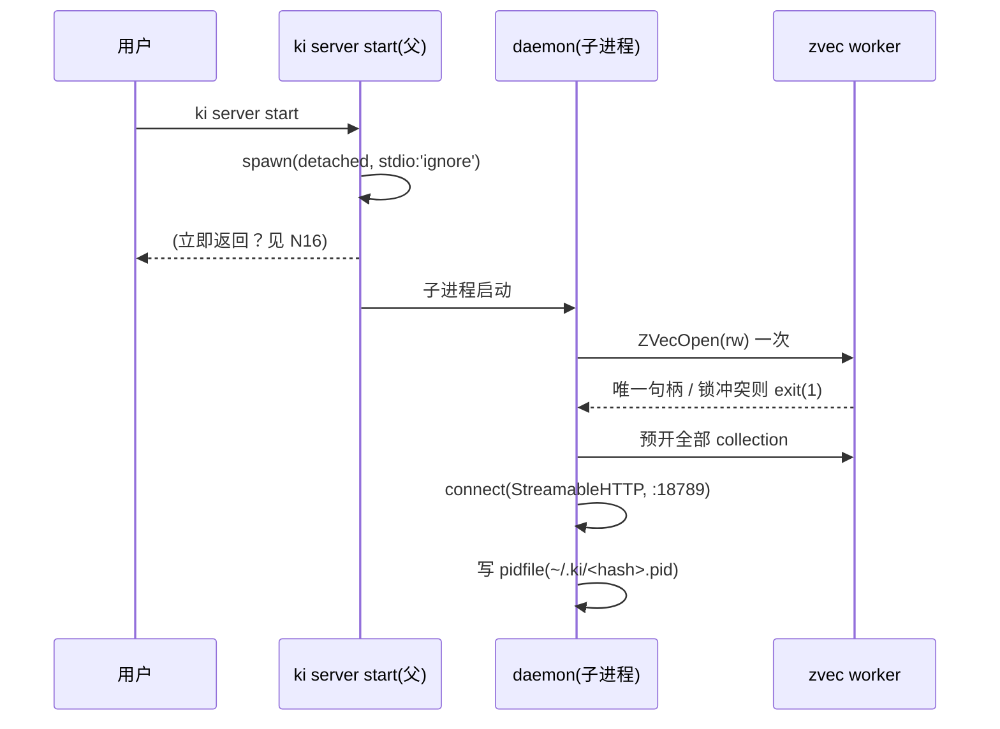
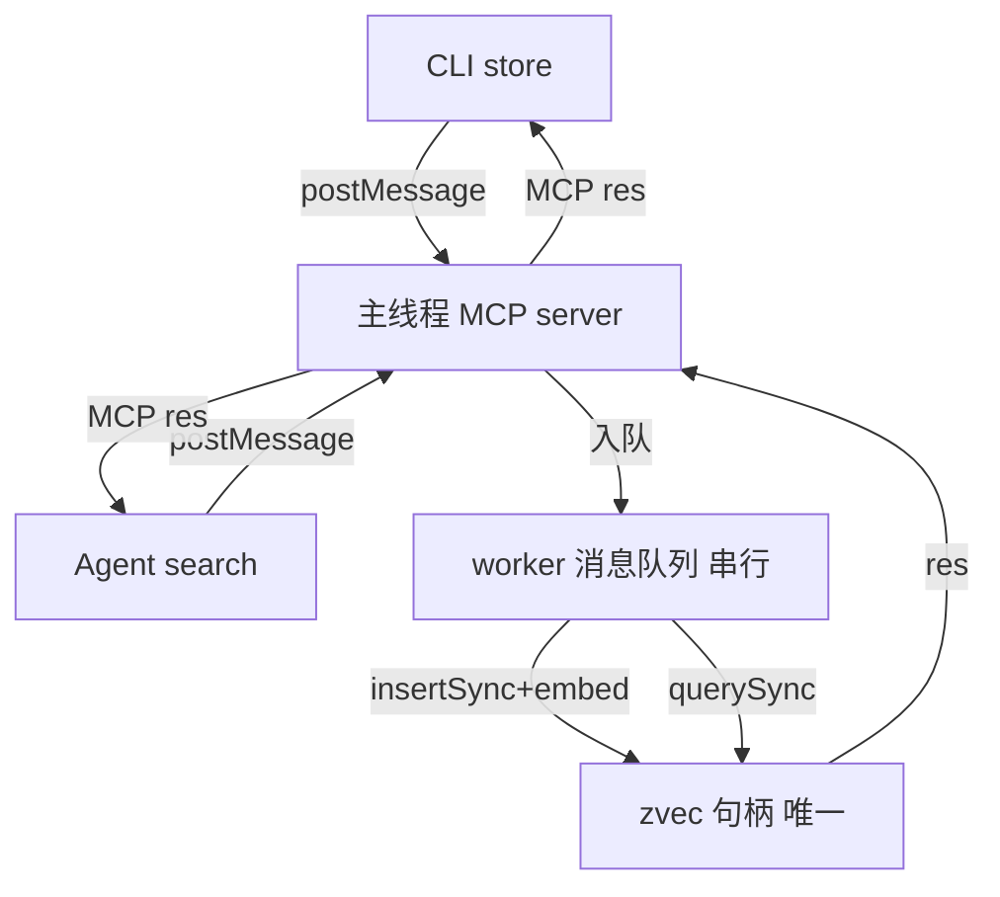
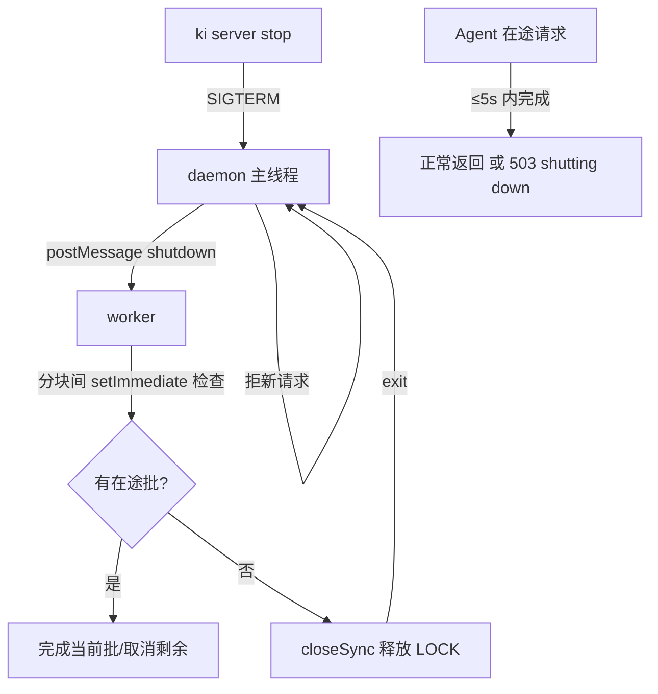
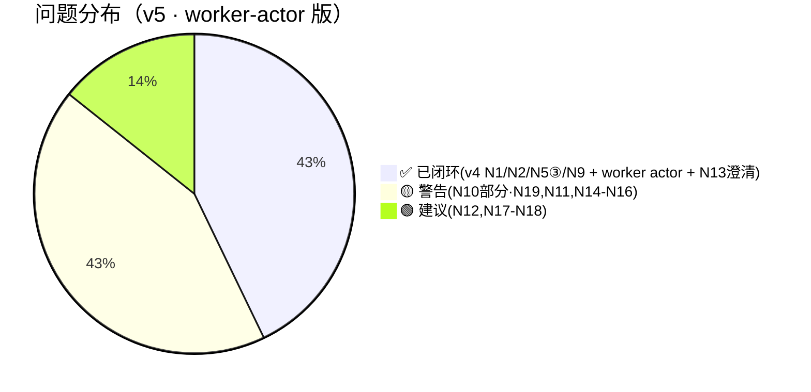

# 场景推演报告：KiSearch zvec Node MCP（模型 Y · worker-actor 版）

> 推演时间：2026-07-21
> 输入文档：
> - `design/REF_S04_CLI_Server_Channel_DESIGN.md`（模型 Y / 生命周期 / 路由）
> - `design/REF_S06_MCP_Server_DESIGN.md`（daemon / 工具面 / §3.4）
> - `design/REF_S03_VectorAdapter_DESIGN.md`（Vector Adapter / worker actor）
> - `review/fix-plan.md`（🔴 worker actor 修复方案，已定稿）
> - `review/scenario-rehearsal-v4.md`（前轮盲区 N1–N9）
>
> 本轮定位：**v4 已闭环项（N1/N2/N5③/N9）+ worker actor 定稿后**，重验「现在的设计」并挖掘 daemon 运行时 / 多项目 / 无状态 HTTP 工具面 的残差盲区。

## 1. 角色清单

👥 角色清单
━━━━━━━━━━━━━━

| # | 角色 | 类型 | 权限层级 | 职责 | 来源 |
|---|------|------|---------|------|------|
| 1 | 用户 | 用户 | 运维者 | `ki server start/stop`、`ki import-kb`/`restore`/`--local`、在 IDE 中用 Agent | S-04 §3.4 / N1 |
| 2 | ki CLI（启动器） | 程序 | — | `ki server start` 以 detached spawn daemon；`ki server stop` 发 SIGTERM | S-06 §4a.1 / N6 |
| 3 | ki CLI（HTTP 客户端） | 程序 | — | 经 StreamableHTTP 调 daemon 工具（store/search/…）；`--local` 走本地独占 | S-04 §3.1 |
| 4 | ki server daemon | 程序 | — | 独立进程；worker 持 `ZvecEngine` 唯一句柄；HTTP 服务 CLI+Agent | S-06 §3.4 / fix-plan §1 |
| 5 | AI Agent（IDE MCP 客户端） | 程序 | — | streamable-http 客户端调 daemon；会话内 search/store | S-04 §3.1 / N7 |
| 6 | SiliconFlow Embedding API | 程序 | 外部 | worker 内 embed 调用（4096 维） | S-03 / fix-plan §1.2 |
| 7 | zvec native 绑定（`@zvec/zvec`） | 程序 | — | worker 内 `ZVecOpen`/`insertSync`/… | S-03 / verify_blocking |

## 2. 推演矩阵 + 启用策略 profile

📋 推演矩阵（场景 × 角色）
━━━━━━━━━━━━━━

| 场景 \ 角色 | 用户 | CLI启动器 | CLI客户端 | daemon | Agent | 外部API |
|-------------|------|----------|---------|--------|-------|--------|
| S1 启动 daemon | ✅ | ✅ | - | ✅ | - | - |
| S2 Agent 连接并检索 | - | - | - | ✅ | ✅ | - |
| S3 CLI+Agent 并发读写 | - | - | ✅ | ✅ | ✅ | - |
| S4 import-kb 独占重建 | ✅ | - | ✅(本地) | (停) | - | - |
| S5 server stop 在途请求 | ✅ | - | - | ✅ | ✅ | - |
| S6 daemon 未运行 Agent 连失败 | - | - | - | (无) | ✅ | - |
| S7 多项目双 daemon 端口 | ✅ | ✅ | - | ✅×2 | ✅ | - |
| S8 worker 崩溃恢复 | - | - | - | ✅ | ✅ | - |
| S9 bulk_store 经 daemon + shutdown | - | - | ✅ | ✅ | - | - |
| S10 启动就绪握手 | ✅ | ✅ | - | ✅ | - | - |
| S11 工具目标 collection 解析 | - | - | ✅ | ✅ | ✅ | - |

🎯 启用策略 profile
━━━━━━━━━━━━━━
- ✅ **重构/迁移类**（命中：stdio MCP → HTTP daemon 改造、worker actor 重构）
- ✅ **并发/竞态敏感类**（命中：文件锁、worker 单句柄、StreamableHTTP 多 client 并发）
- ➖ 批处理/同步类（仅 import-kb 批量，但走本地绕开 daemon，边际命中）
- ➖ CRUD/接口类、事务/状态机类、实时/推送类（无相关信号）

## 3. 场景推演详情

### 3.1 S1：启动 daemon（happy path）

【执行者】用户 + CLI启动器 + daemon
【数据走向】`ki server start` → loadConfig → 端口占用校验 → runStartupCheck → **detached spawn** 子进程 → 子进程内 worker `ZVecOpen(rw)` 一次 → 预开 config 声明的全部 collection → connect(StreamableHTTP) → 写 pidfile。



【关键设计点验证】
| # | 设计点 | 验证问题 | 结果 | 问题 | 置信度 |
|---|--------|---------|------|------|--------|
| 1 | N6 daemonize | detached spawn 后父进程如何确认 daemon 真起好？ | ⚠️ 存疑 | 见 N16：无启动握手，父返回即"看起来成功" | 🟡 高 |
| 2 | N3 pidfile | 多项目按 vectorDir 哈希分 pidfile | ✅ 通过 | — | — |
| 3 | 写入线程模型 | worker 唯一 open，主线程不 open | ✅ 通过（fix-plan §1 已闭环） | — | — |

### 3.2 S3：CLI 与 Agent 并发读写（并发 profile 加压）

【执行者】CLI客户端 + Agent + daemon（worker）
【数据走向】CLI `store`（postMessage→worker insertSync+embed）→ Agent `search`（postMessage→worker querySync）；两者并发到达主线程，主线程转发到同一 worker 的消息队列，**worker 串行执行** Sync 调用。



【关键设计点验证】
| # | 设计点 | 验证问题 | 结果 | 问题 | 置信度 |
|---|--------|---------|------|------|--------|
| 1 | N5③ 并发多 client | TS SDK StreamableHTTP 单 server 能否并发服务 CLI+Agent | ✅ 概念由 FastMCP 佐证、实现以 TS SDK 验证（待烟雾测试） | — | 🟢 |
| 2 | worker 串行化 | 一个长 insert 阻塞期间到达的 search 怎么办 | ⚠️ 存疑 | 见 N11：须分块 `setImmediate` 让出，否则 search 卡到 insert 结束 | 🟡 高 |
| 3 | 锁冲突 | 主线程/worker 是否仅 worker 持锁 | ✅ 通过（read_only 也冲突→全进 worker，fix-plan §1 已处理） | — | — |

### 3.3 S5：server stop 在途请求（异常/边界）

【执行者】用户 + daemon + Agent
【描述】`ki server stop` 发 SIGTERM 时，恰有 Agent 的 `store` 在 worker 执行。



【关键设计点验证】
| # | 设计点 | 验证问题 | 结果 | 问题 | 置信度 |
|---|--------|---------|------|------|--------|
| 1 | N4 stop 语义 | SIGTERM 在 worker 跑 bulk 分块循环时如何协作取消 | ❌ 设计缺口 | 见 N11：N4 仅说"等 ≤5s"，未定义 worker 协作取消/完成语义 | 🟡 高 |
| 2 | 503 传播 | 在途 Agent 请求收到 503 后能否重试 | ⚠️ 存疑 | S-06 §6 未定义客户端重试/回退逻辑 | 🟡 中 |

### 3.4 S7：多项目双 daemon 端口（NEW · 残差盲区）

【执行者】用户 + Agent
【描述】用户有项目 A、B，各起一个 daemon（端口按 N3 不同）。Agent 的 MCP 端点在 IDE 中**静态配置一次**。

```mermaid
flowchart LR
    subgraph IDE[IDE MCP 客户端 静态配置]
        EP[url: http://127.0.0.1:18789/mcp]
    end
    EP -->|连谁?| Q{18789 上跑的是?}
    Q -->|项目A daemon| A[项目A 记忆]
    Q -->|项目B daemon(若也用18789则冲突)| B[项目B 记忆]
    Q -->|用户切到 cwd=B 但端点未变| X[❌ 写入串到 A]
```

【关键设计点验证】
| # | 设计点 | 验证问题 | 结果 | 问题 | 置信度 |
|---|--------|---------|------|------|--------|
| 1 | N3 × N7 冲突 | Agent 静态端点无法随 cwd/项目切换；多项目共用 18789 冲突，分端口则 Agent 须重配 | ❌ 设计冲突 | 见 N10：跨项目记忆串味 / 端口冲突风险 | 🟡 高 |

### 3.5 S9：bulk_store 经 daemon + shutdown（batch 边际）

【执行者】CLI客户端 + daemon + worker
【描述】CLI 经 daemon 提交大批量 `bulk_store`；中途用户 `ki server stop`。

【关键设计点验证】
| # | 设计点 | 验证问题 | 结果 | 问题 | 置信度 |
|---|--------|---------|------|------|--------|
| 1 | 分块让出 | worker 须 `insertSync` 分批 + `setImmediate` 让出，插入查询/控制消息 | ⚠️ 存疑 | fix-plan §1 提了缓解但未写进 S-06 §3.4「写入线程模型」 | 🟡 中 |
| 2 | worker 崩溃在途 | bulk 中途 worker 崩，CLI 的 postMessage Promise 永不 resolve | ❌ 缺口 | 见 N14：无 pending 请求 reject/重试传播 | 🟡 中 |

### 3.6 S11：工具目标 collection 解析（NEW · 无状态 HTTP 工具面）

【执行者】CLI客户端 / Agent + worker
【描述】官方 server 靠每会话 `open_collection(name)` 建立上下文；我们改为 daemon 预开**全部** collection，但工具调用须知道操作哪个。

【关键设计点验证】
| # | 设计点 | 验证问题 | 结果 | 问题 | 置信度 |
|---|--------|---------|------|------|--------|
| 1 | 集合上下文 | `store`/`search` 在无状态 StreamableHTTP 下如何定位目标 collection（ki-search/ki-path/ki-relation） | ❌ 设计缺口 | 见 N13：当前工具 schema 无 collection 字段、store 依赖隐式默认，多 scope 歧义 | 🟡 高 |

### 3.7 其它场景（简记）
- **S2 Agent 连接检索**：happy path 通过；就绪前连接见 N12。
- **S4 import-kb 独占重建**：需停 daemon 拿锁，N2 仅"提示关闭"，链路笨重见 N15。
- **S6 daemon 未运行**：Agent 连接失败→提示`ki server start`（N1 已闭环）✅。
- **S8 worker 崩溃恢复**：fix-plan §1 说主线程 respawn+重 `ZVecOpen`，但在途请求见 N14。
- **S10 启动就绪握手**：见 N16。

## 4. 问题汇总

📊 问题汇总
━━━━━━━━━━━━━━

| # | 类型 | 角色 | 场景 | 问题描述 | 建议 | 严重度 |
|---|------|------|------|---------|------|:------:|
| N10 | 设计冲突（部分解决） | Agent/用户 | S7 | 固定/单端点与多 daemon 多端口矛盾：Agent 的 MCP 端点静态配置一次，无法随 cwd/项目切换；多项目共用 18789 冲突、分端口则 Agent 须重配 → 跨项目记忆串味 | **方向已定（S-06 §3.5 + S-04 §3.1）**：单一全局 daemon + 单一 collection，多项目 = `scope` metadata 区隔而非多 daemon，Agent 静态端点恒有效。**但残留 N19**：cwd→scope 映射未定义，LLM 默认传 default 仍会串味 | 🟡 |
| N11 | 流程缺陷 | server/worker | S5/S9 | SIGTERM 在 worker 执行 bulk 分块循环时，N4 仅说"等 ≤5s"，未定义 worker 协作取消/完成语义与分块 `setImmediate` 让出 | 定义 worker 控制消息：主线程 SIGTERM→`postMessage(shutdown)`；worker 在批间断点检查，完成当前批或取消剩余；>5s 由主线程 SIGKILL worker | 🟡 |
| N12 | 遗漏 | Agent/CLI | S2/S10 | `/health` 就绪门槛未定义（worker open + 预开集合完成才算 ready）；早连 Agent 拿 503 无"等待重试"指引 | readiness = worker open + 预开全部集合完毕；`/health` 返回 ready 态；连接失败带"daemon 启动中，请重试" | 🟢 |
| N13 | 契约澄清（已闭环） | 工具/worker | S11 | 无状态 StreamableHTTP 下工具"操作哪个 collection"未定义：官方靠每会话 `open_collection`，我们预开全部但未定义工具→collection 映射（store 隐式默认、无字段） | **澄清闭环（S-06 §3.5 评估）**：非设计冲突——`ki-search/ki-path/ki-relation` 是 S-05 的 **tag**（非独立 collection），zvec-engine 单一 collection；S-03 已定义 scope+tags 二维 metadata 寻址，工具本就有 scope+tags。本节只点明无状态 HTTP 下须显式带 scope/tags | ✅ 已闭环 |
| N14 | 遗漏 | server | S8/S9 | worker 崩溃时主线程 respawn，但在途 `postMessage` Promise 永不 resolve → 客户端挂起至超时；无"可重试错误"传播 | 主线程监听 worker `exit` → reject 所有 pending 为 `{ok:false, error:"daemon restarting, retry"}`；CLI/Agent 据此重试/提示 | 🟡 |
| N15 | 流程缺陷 | 用户/CLI | S4 | `import-kb` 需独占锁重建，N2 仅"提示关闭 daemon"，未定义自动 `stop→重建→可选 restart`，手动链路笨重 | 定义 import-kb：探测 pidfile→若 daemon 持锁则自动 `ki server stop` 或报错二选一→本地重建→可选 `ki server start`；在 S-04 路由层固化 | 🟡 |
| N16 | 遗漏 | 用户/CLI | S1/S10 | `ki server start` detached spawn 后父进程立即返回，不知 daemon 是否真起好（worker open 成功/锁冲突）；无启动握手 | 父 spawn 后轮询 pidfile + `/health` ready（≤5s），成功打印"started pid X port Y"；失败（锁冲突/open 错）打印并清理 pidfile | 🟡 |
| N17 | 建议 | Agent | 集成 | Agent 侧 MCP 客户端须配置成 streamable-http（`url=http://127.0.0.1:18789/mcp`），N7 只说"读端口"漏了 IDE `mcp.json` 的 streamable-http 条目形态 | S-06/部署文档补"Agent/IDE 如何登记 HTTP MCP server"（type/url/可选 auth header） | 🟢 |
| N18 | 建议 | Agent/CLI | auth | N5① 可选 bearer token；须确认 MCP TS SDK 的 StreamableHTTP 客户端支持自定义 `Authorization` 头（authProvider/requestInit） | 实现前确认 TS SDK 注入 header 方式；文档固化 token 配置 | 🟢 |
| N19 | 设计冲突（新增·N10 残留） | Agent/daemon | S7 | N10 把端点切换转为 scope 传参，但未定义 cwd/项目 → scope 映射：无状态 HTTP 下 daemon 拿不到 cwd，LLM 默认传 scope=default → 多项目数据混入 default，串味风险仅被推迟 | 单项目用户(默认 default)安全；多项目须 IDE 侧按项目配置 scope、或 daemon 支持 `X-Ki-Scope` 请求头由 Agent 注入、或文档强约束。见 S-06 §3.5 N19 注 | 🟡 |

统计：
- 🔴 阻断：0 个
- ✅ 已闭环：1 个（N13 — 澄清为契约，S-03/S-05 的 scope×tags 已覆盖，见 S-06 §3.5 评估）
- 🟡 警告：6 个（N10 部分解决·残留 N19、N11、N14、N15、N16、N19）
- 🟢 建议：2 个（N12、N17–N18）

> **2026-07-21 评估复核**：原把 N13 当「3 collection 设计冲突」属事实性错误——`ki-search/ki-path/ki-relation` 实为 S-05 的 tag（zvec-engine 单一 collection）。N13 降为契约澄清并闭环；同时暴露 N10 真残留（cwd→scope 映射）记为 N19。

> 注：v4 的 🔴（worker actor）已由 `fix-plan.md` 闭环；本轮 **0 个 🔴**，残差均为落地级 🟡/🟢，且全部源自「worker actor + 模型 Y 运行时」的新现实，v4 未触及。

## 5. 推演结论

### 整体评估
- 推演覆盖：7 角色 / 11 场景（S1–S11），启用 profile：重构/迁移 + 并发/竞态
- 问题发现：**🔴 0 / ✅ 1（N13 澄清）/ 🟡 6（N10 部分·N19、N11、N14、N15、N16、N19）/ 🟢 2（N12、N17–N18）**（经 2026-07-21 评估复核：N13 原定性为 3-collection 冲突属事实错误，降为契约澄清；N10 残留 cwd→scope 记为 N19）
- 与前轮关系：v4 的 N1/N2/N5③/N9 已闭环；原 🔴 worker actor 由 `fix-plan.md` 解决。本轮发现的 N10–N19 是 daemon 落地时才暴露的运行时盲区，**不推翻设计**，但须在 S-04/S-06 落笔前补齐（N19 为评估复核新增）。



### 评审结论

| 条件 | 结论 |
|------|------|
| 存在 ≥1 个 🔴阻断 | ❌ 不通过 |
| 无 🔴，仅 🟡 + 🟢 | ✅ **通过（设计层面成立；残差为 6🟡+2🟢 落地补充，N19 须在 S-04/S-06 落笔前定 cwd→scope 方案）** |

### 关键结论
1. **核心架构已自洽**：worker actor（fix-plan §1）+ 模型 Y（N9 Node 自研 daemon）+ N1 手动启动 + N2 HTTP 无缝写，四者互相支撑，v4 的 🔴 已消除。
2. **残差盲区集中在「daemon 运行时」与「多项目/无状态工具面」**，经 2026-07-21 评估复核后：
   - **N10（多项目端点）🟡 部分解决**——方向已定（单一全局 daemon + 单一 collection + `scope` 多项目，见 S-06 §3.5 / S-04 §3.1）；**但残留 N19**：cwd/项目 → scope 映射未定义，无状态 HTTP 下 LLM 默认传 default 仍会串味，须另定方案。
   - **N13（collection 映射）✅ 澄清闭环**——原「3 collection 设计冲突」属事实错误：`ki-search/ki-path/ki-relation` 实为 S-05 的 tag（zvec-engine 单一 collection）。寻址 = 单 collection 内 `scope`×`tags` 二维 metadata 过滤，S-03/S-05 已定义，工具本就有 scope+tags。降为契约澄清。
   - **N11/N14/N16** 是 daemon 生命周期的工程细节（worker 协作 shutdown、崩溃 pending reject、启动握手），fix-plan 提了方向但未写进 S-06。
   - **N15** 是 import-kb 与 daemon 锁的衔接 UX。
3. **N12/N17/N18** 为部署/集成级建议（就绪门槛、IDE mcp.json 形态、TS SDK auth header）。

### 下一步建议（落地前补齐，落到 S-04/S-06）
- **P1（部分）**：N13 工具→collection 映射 → 澄清为单 collection + `scope`×`tags`（S-06 §3.5 / §4a.3，已闭环）；N10 多项目端点 → 方向已定（单一全局 daemon + scope），**残留 N19（cwd→scope 映射）待解，须在落笔前定方案**。
- **P2（强烈建议）**：N11 worker 协作 shutdown + 分块让出；N14 worker 崩溃 pending reject；N16 启动握手（pidfile+/health 轮询）；N15 import-kb 自动 stop→重建→可选 restart。
- **P3（可选）**：N12 readiness 门槛；N17 IDE streamable-http 登记文档；N18 TS SDK auth header 确认。
- **验证门（仍待实现前）**：N5③ 用 MCP TS SDK 做双 client 并发烟雾测试（确认 StreamableHTTP 并发可达）。
