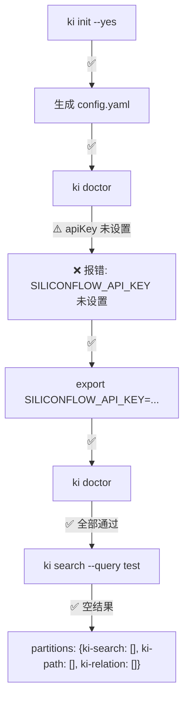
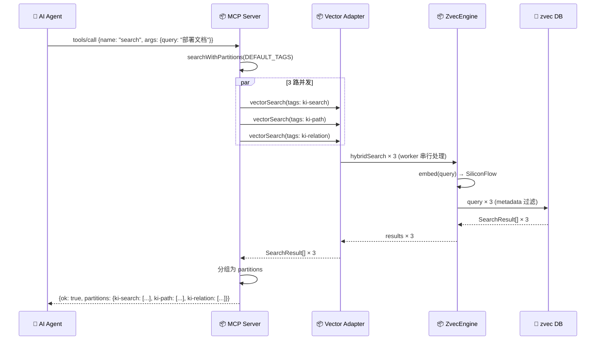
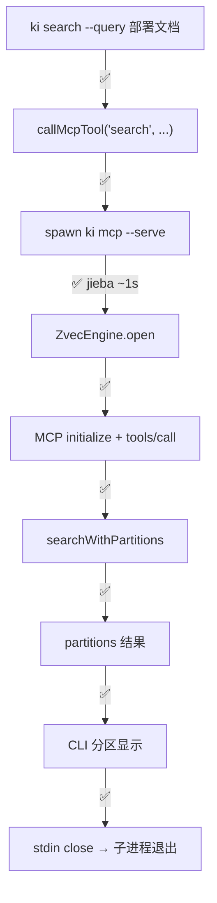
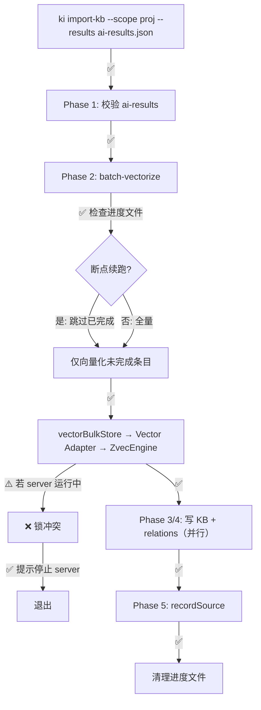
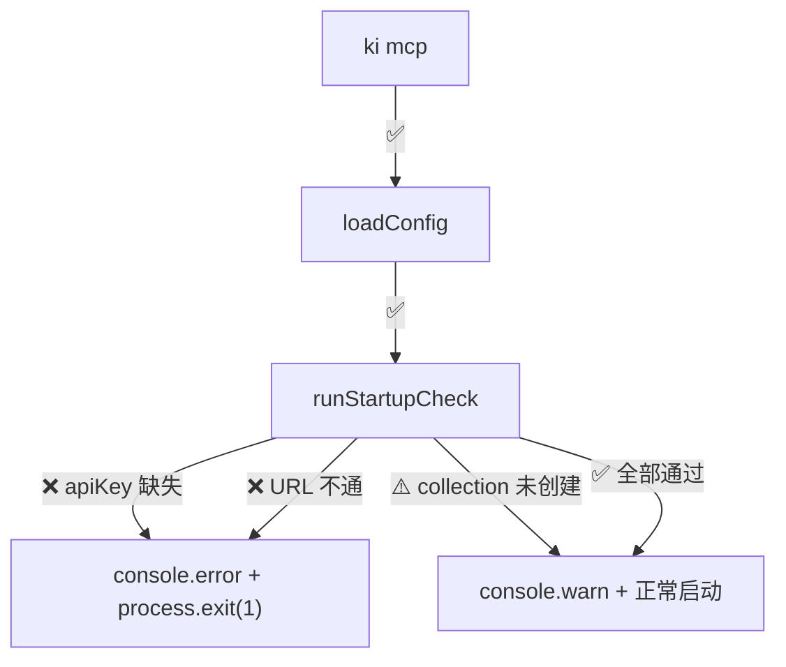
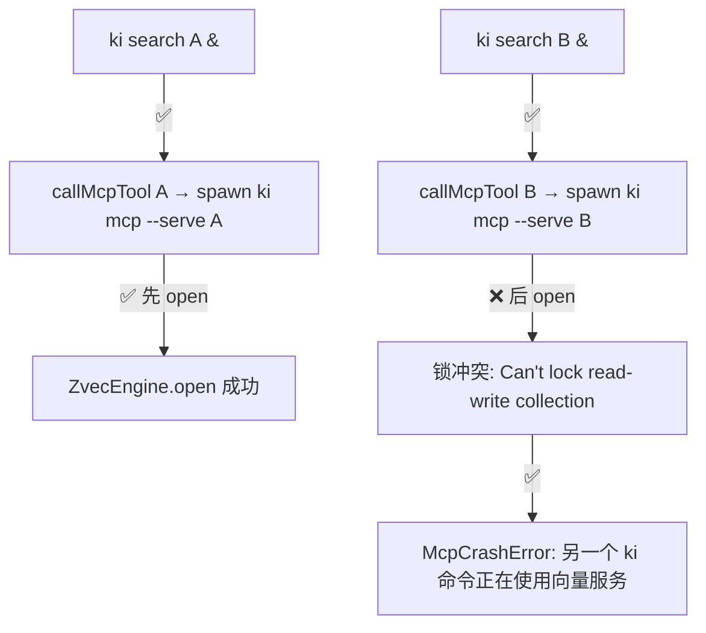
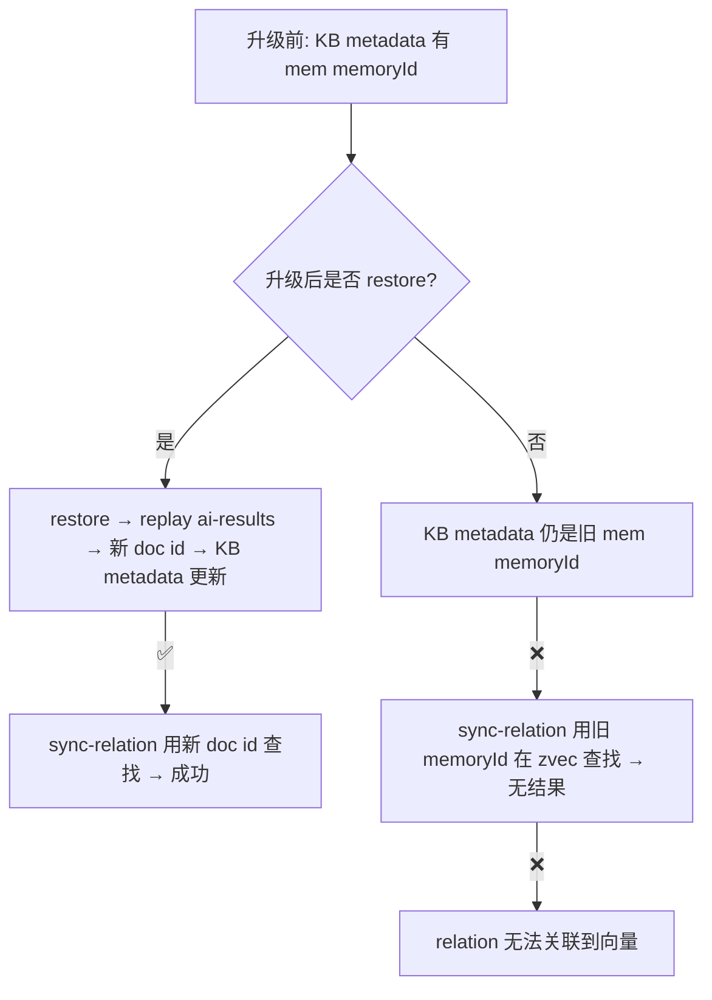
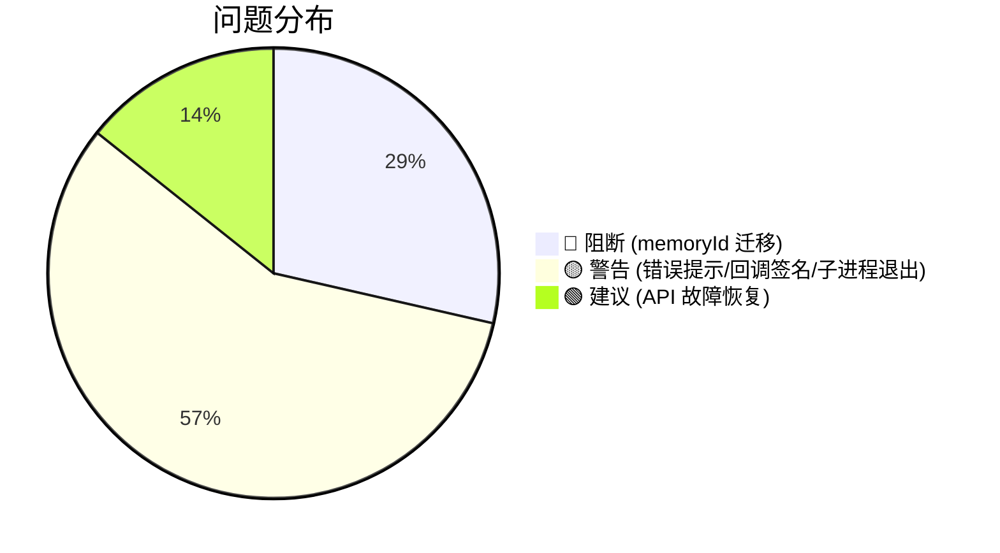

# 场景推演报告：KiSearch 重构设计

> 推演时间：2026-07-21
> 输入文档：`design/REFACTOR_DESIGN.md` + `design/REF_S01~S06`
> 启用策略 profile：✅ 重构/迁移类 + ✅ 批处理/同步类 + ✅ CRUD/接口类

## 1. 角色清单

| # | 角色 | 类型 | 职责 | 来源 |
|---|------|------|------|------|
| 1 | 👤 用户 | 用户 | 执行 CLI 命令（search/store/init/doctor/import-kb/restore/backup） | 设计文档 §交互对象 |
| 2 | 🤖 AI Agent | 用户 | MCP 客户端，通过 stdio 连接 MCP Server，调用 search/store 等工具 | 设计文档 §交互对象 |
| 3 | ⚙️ CLI 进程 | 程序 | 短命 Node 进程，向量命令通过 callMcpTool spawn `ki mcp --serve` 子进程 | S-04 |

## 2. 推演矩阵 + 启用策略 profile

### 设计点覆盖矩阵

| 设计点 \ 场景 | 首次安装 | AI Agent 检索 | CLI 检索 | 批量导入 | 备份恢复 | MCP 启动 | 旧配置升级 | 并发 CLI | scope 继承 | memoryId 迁移 |
|---|---|---|---|---|---|---|---|---|---|---|
| callMcpTool stdio (S-04) | - | - | ✅ | - | - | - | ✅ | ✅ | - | - |
| Vector Adapter async (S-03) | - | ✅ | ✅ | ✅ | ✅ | - | - | - | - | ✅ |
| partitions 统一输出 (S-05) | - | ✅ | ✅ | - | - | - | - | - | - | - |
| scope 三级继承 (S-01) | ✅ | - | - | - | - | - | - | - | ✅ | - |
| ki init YAML (S-01) | ✅ | - | - | - | - | - | ✅ | - | - | - |
| ki doctor 诊断 (S-02) | ✅ | - | - | - | - | ✅ | ✅ | - | - | - |
| MCP 启动预检 (S-02/S-06) | - | - | - | - | - | ✅ | - | - | - | - |
| tag metadata 双写 (S-03) | - | ✅ | ✅ | ✅ | ✅ | - | - | - | - | - |
| memoryId→docId (S-03) | - | - | - | ✅ | ✅ | - | - | - | - | ✅ |
| import-kb 锁冲突 (S-03/S-04) | - | - | - | ✅ | ✅ | - | - | - | - | - |
| 断点续跑 (import.ts) | - | - | - | ✅ | ✅ | - | - | - | - | - |
| 旧 config.json 兼容 (S-01) | - | - | - | - | - | - | ✅ | - | - | - |

### 启用策略 profile

- ✅ **重构/迁移类**（命中：mem→zvec 引擎替换、JSON→YAML、sync→async、回滚）
- ✅ **批处理/同步类**（命中：import-kb 批量向量化、restore 重放、断点续跑）
- ✅ **CRUD/接口类**（命中：vectorSearch/vectorStore/vectorDelete 接口）

## 3. 场景推演详情

### 场景 1：首次安装配置

**执行者**：👤 用户
**场景描述**：新用户从零开始安装 ki，生成配置，验证连通性，执行首次检索

| 步骤 | 操作 | 数据流向 | 验证结果 | 问题 |
|------|------|----------|---------|------|
| 1 | `ki init --yes` | 生成 `~/.ki/config.yaml` + 创建 dataDir/backupDir/vectorDir | ✅ | - |
| 2 | `ki doctor` | 读 config → 检查 apiKey（env） → ❌ | ✅ | 设计正确：apiKey 缺失时清晰报错 |
| 3 | `export SILICONFLOW_API_KEY=...` | 设置 env | ✅ | - |
| 4 | `ki doctor` | 检查 URL 连通性 → 发送 test embedding → 验证维度 4096 | ✅ | - |
| 5 | `ki search --query test` | callMcpTool → spawn ki mcp --serve → search → 空结果 | ✅ | 首次使用 zvec collection 不存在（⚠️ 正常） |

**推演结论**：数据走向 5 项通过；关键设计 3 项通过。

---

### 场景 2：AI Agent 多标签检索

**执行者**：🤖 AI Agent
**场景描述**：Agent 通过 MCP 协议执行语义检索，返回 partitions 结构

| # | 设计点 | 验证问题 | 验证结果 | 问题 | 置信度 |
|---|--------|---------|---------|------|--------|
| 1 | partitions 统一输出 | 3 路并发查询结果是否正确分组？ | ✅ | Promise.all + tag 映射，逻辑正确 | — |
| 2 | tag metadata 过滤 | zvec metadata `tags` 字段过滤是否生效？ | ✅ | 基座模块支持标量过滤 | — |
| 3 | Vector Adapter async | worker actor 串行处理 3 路查询是否延迟过高？ | ✅ | 3 × 0.8ms = 2.4ms，远 < 5ms | — |

**推演结论**：数据走向 3 项通过；关键设计 3 项通过。

---

### 场景 3：CLI 检索

**执行者**：👤 用户 → ⚙️ CLI 进程
**场景描述**：用户执行 `ki search`，CLI spawn MCP server 子进程，stdio 通信返回 partitions

| # | 设计点 | 验证问题 | 验证结果 | 问题 | 置信度 |
|---|--------|---------|---------|------|--------|
| 1 | callMcpTool stdio | spawn → initialize → tools/call → response → exit 流程是否完整？ | ✅ | S-04 时序图已覆盖 | — |
| 2 | jieba ~1s 延迟 | CLI 用户是否可接受 ~1s 延迟？ | ✅ | 用户已确认（比现状 4s 好） | — |
| 3 | 子进程退出 | stdin close 后子进程是否正确退出？ | ⚠️ | 设计提到「stdin close → 退出」，但未设计超时 kill 机制 | 🟡 中 |

**推演结论**：数据走向 4 项通过；关键设计 2 项通过 / 1 项存疑。

---

### 场景 4：批量导入（批处理 + 重构迁移）

**执行者**：👤 用户
**场景描述**：用户执行 `ki import-kb`，5 阶段流水线含断点续跑，直接用 Vector Adapter

| # | 设计点 | 验证问题 | 验证结果 | 问题 | 置信度 |
|---|--------|---------|---------|------|--------|
| 1 | Vector Adapter async | Phase 2 async 向量化 + Phase 3/4 并行是否兼容？ | ✅ | import.ts 已用 Promise.all（line 599），async 迁移后自然兼容 | — |
| 2 | 断点续跑 | 中断后重跑是否跳过已完成条目？ | ✅ | progress.ts 已实现，path-based 不依赖 id | — |
| 3 | import-kb 锁冲突 | server 运行时 import-kb 是否正确提示？ | ✅ | S-03/S-04 已设计锁冲突检测 + 提示 | — |
| 4 | tag metadata 双写 | batch-vectorize 是否同时写 metadata tags + content 前缀？ | ⚠️ | 设计说「tag 升为 metadata + content 格式不变」，但 batch-vectorize 的 `onProgress` 回调返回 `memoryId`，改为 doc id 后回调签名是否一致？ | 🟡 中 |
| 5 | memoryId→docId | Vector Adapter 返回 doc id，import.ts 写入 KB metadata，是否与 sync-relation 查找一致？ | ⚠️ | 见场景 10 详细分析 | 🔴 高 |

**推演结论**：数据走向 5 项通过；关键设计 3 项通过 / 2 项存疑。

---

### 场景 5：备份恢复（批处理 + 重构迁移）

**执行者**：👤 用户
**场景描述**：用户备份 KB 数据，在新环境恢复，重放 ai-results 重建向量

| 步骤 | 操作 | 数据流向 | 验证结果 | 问题 |
|------|------|----------|---------|------|
| 1 | `ki backup --scope proj` | KB 源目录 → tar.gz（不含向量） | ✅ | backup.ts 不改，向量不进备份 |
| 2 | 新环境部署 ki | `ki init --yes` → 配置 | ✅ | - |
| 3 | `ki restore --scope proj --mode full` | untar KB → handleImport → replay ai-results | ✅ | restore.ts 调 handleImport |
| 4 | restore 重向量化 | handleImport → batch-vectorize → Vector Adapter → ZvecEngine | ✅ | 新 doc id 生成，KB metadata 更新 |
| 5 | `ki search` | 检索到恢复的数据 | ✅ | - |

| # | 设计点 | 验证问题 | 验证结果 | 问题 | 置信度 |
|---|--------|---------|---------|------|--------|
| 1 | 幂等性 | restore 重跑是否产生重复向量？ | ✅ | Vector Adapter 用 upsert（幂等），doc id = content hash，重跑覆盖 | — |
| 2 | 锁冲突 | restore 时 server 运行 → 锁冲突 | ✅ | 同 import-kb，检测 + 提示 | — |
| 3 | 向量不进备份 | backup 只打包 KB 源，向量靠 restore 重建 | ✅ | 设计一致 | — |

**推演结论**：数据走向 5 项通过；关键设计 3 项通过。

---

### 场景 6：MCP 启动预检失败

**执行者**：👤 用户
**场景描述**：apiKey 缺失或 embedding URL 不通时，MCP server 拒绝启动

| # | 设计点 | 验证问题 | 验证结果 | 问题 | 置信度 |
|---|--------|---------|---------|------|--------|
| 1 | 预检阻断 | ❌ 时是否拒绝启动？ | ✅ | S-02/S-06 设计：process.exit(1) | — |
| 2 | 预检警告 | ⚠️ 时是否正常启动？ | ✅ | zvec collection 未创建是正常的 ⚠️ | — |
| 3 | embedding API 临时故障 | API 临时不可用时 server 拒绝启动，恢复后无法自动重连 | ⚠️ | 设计未考虑 API 临时故障的 retry/skip 选项 | 🟢 低 |

**推演结论**：数据走向 2 项通过；关键设计 2 项通过 / 1 项存疑（低置信度）。

---

### 场景 7：旧配置升级

**执行者**：👤 用户（已有 config.json 的老用户）
**场景描述**：用户升级 ki 后，旧 config.json 无 vectorDir/embedding，ki 命令如何表现

| 步骤 | 操作 | 数据流向 | 验证结果 | 问题 |
|------|------|----------|---------|------|
| 1 | 升级 ki（npm i） | 新代码 + 旧 config.json | ✅ | - |
| 2 | `ki search --query test` | config.ts 读 config.json（兼容）→ 无 embedding 配置 → callMcpTool → spawn ki mcp --serve → --serve 模式加载 config → 无 vectorDir → ZvecEngine.open 失败 | ⚠️ | 错误信息是否清晰？ |
| 3 | `ki doctor` | 检测 config.yaml 不存在 → 检测 config.json 存在 → 提示「执行 ki init」 | ✅ | - |
| 4 | `ki init` | 读旧 config.json 值作为默认建议 → 生成 config.yaml | ✅ | - |

| # | 设计点 | 验证问题 | 验证结果 | 问题 | 置信度 |
|---|--------|---------|---------|------|--------|
| 1 | 旧 config.json 兼容 | 旧 config.json 能否被读取？ | ✅ | config.ts 保留 JSON 读取能力 | — |
| 2 | 缺 embedding 配置时的错误 | ki search 在缺 embedding 配置时报错是否清晰？ | ⚠️ | 错误链：callMcpTool → McpCrashError（含 stderr），但未明确提示「缺少 embedding 配置，请执行 ki init」 | 🟡 中 |
| 3 | ki init 读旧配置 | ki init 是否读取旧 config.json 作为默认值？ | ✅ | S-01 设计已含 | — |

**推演结论**：数据走向 3 项通过 / 1 项存疑；关键设计 2 项通过 / 1 项存疑。

---

### 场景 8：并发 CLI

**执行者**：👤 用户（脚本中并行执行两个 ki 命令）
**场景描述**：`ki search A & ki search B` 同时执行

| # | 设计点 | 验证问题 | 验证结果 | 问题 | 置信度 |
|---|--------|---------|---------|------|--------|
| 1 | 并发锁冲突 | 两个 CLI 同时 spawn server，第二个锁冲突 | ⚠️ | 设计已识别（S-04 异常处理），但错误信息未提示「等待另一个命令完成」 | 🟡 中 |
| 2 | 无排队机制 | 锁冲突后直接报错，无等待重试 | ⚠️ | 可接受（CLI 并发罕见），但应在错误信息中建议串行执行 | 🟢 低 |

**推演结论**：数据走向 2 项通过；关键设计 0 项通过 / 2 项存疑。

---

### 场景 9：scope 继承

**执行者**：👤 用户
**场景描述**：用户使用未配置的 scope，验证三级 fallback

| 步骤 | 操作 | 数据流向 | 验证结果 | 问题 |
|------|------|----------|---------|------|
| 1 | `ki search --scope new-proj --query test` | config.scopes["new-proj"] 不存在 → 继承 default | ✅ | 向量 scope 自动创建（metadata） |
| 2 | `ki store --scope new-proj --content "..."` | scope metadata = "new-proj" 写入 zvec | ✅ | - |
| 3 | `ki import-kb --scope new-proj` | getScopeSourceDir → scopes["new-proj"].sourceDir → null → scopes["default"].sourceDir | ✅ | 三级 fallback 生效 |
| 4 | `ki scan-kb --scope new-proj` | getScopeDataDir → scopes["new-proj"].kbDir → null → scopes["default"].kbDir → dataDir/new-proj | ✅ | - |

**推演结论**：数据走向 4 项通过；关键设计 1 项通过。

---

### 场景 10：memoryId 迁移（重构/迁移类 加压）

**执行者**：👤 用户（从 mem 升级到 zvec）
**场景描述**：现有 KB metadata 含 mem 生成的 memoryId，升级后不 restore 直接使用

**关键事实**（代码调研确认）：
- memoryId 由 `mem store` CLI 生成（`mem-client.ts:205`：从 stdout JSON 解析 `id` / `memoryId`），ki 不知道生成规则
- import.ts Phase 4 将 memoryId 写入 relations-cache（`import.ts:496: upsertRelation(..., memoryId, ...)`）
- 但 Phase 3/4 的 `memoryMap: new Map()`（`import.ts:626`）为空，实际 memoryId 来自 `e.memoryId`（ai-results.json）或 `ctx.memoryMap`（Phase 2 结果）
- incremental.ts 将 memoryId 写入 relation（`incremental.ts:166: rel.memoryId = memoryId`）
- diff.ts 构建 memoryId Map 用于关联（`diff.ts:83: buildMemoryIdMap`）

| # | 设计点 | 验证问题 | 验证结果 | 问题 | 置信度 |
|---|--------|---------|---------|------|--------|
| 1 | memoryId→docId 映射 | 不 restore 时旧 memoryId 是否导致 sync-relation 失效？ | ❌ | 旧 mem memoryId 在 zvec 中不存在，sync-relation 查找失败 | 🔴 高 |
| 2 | doc id 生成规则 | 设计说「沿用原 memoryId 生成规则」但 ki 不知道 mem 的规则 | ⚠️ | 应改为「Vector Adapter 用自身规则生成 doc id（如 content hash），不兼容旧 mem id」 | 🔴 高 |
| 3 | 升级引导 | 设计是否明确要求升级后必须 restore？ | ❌ | S-03 迁移策略说「靠 restore 重建」但未明确标注「升级后必须执行 restore，否则功能失效」 | 🔴 高 |

**推演结论**：数据走向 1 项通过 / 2 项失败；关键设计 0 项通过 / 3 项失败。

## 4. 问题汇总

| # | 类型 | 角色 | 场景 | 问题描述 | 建议 | 严重度 |
|---|------|------|------|---------|------|:------:|
| 1 | 流程缺陷 | 用户 | memoryId 迁移 | 升级后不 restore 时，旧 mem memoryId 在 zvec 中不存在，sync-relation / diff 的 memoryId 关联失效 | S-03 迁移策略补充「升级后必须执行 `ki restore` 重建向量，否则 sync-relation/diff 功能失效」的显式警告；ki 启动时检测旧 memoryId 格式并提示 | 🔴 |
| 2 | 设计冲突 | 用户 | memoryId 迁移 | S-03 说「doc id 沿用原 memoryId 生成规则」但 ki 不知道 mem 的 id 生成规则（mem CLI 内部生成） | 修改 S-03：doc id 由 Vector Adapter 用自身规则生成（content hash 或 UUID），不保证兼容旧 mem id；升级靠 restore 重建 | 🔴 |
| 3 | 流程缺陷 | 用户 | 旧配置升级 | 缺 embedding 配置时 callMcpTool → McpCrashError，错误信息未明确提示「缺少 embedding 配置，请执行 ki init」 | S-04 异常处理补充：McpCrashError 含 config 相关错误时，追加提示「请执行 ki init 生成配置或 ki doctor 诊断」 | 🟡 |
| 4 | 流程缺陷 | 用户 | 并发 CLI | 两个 CLI 命令同时执行时第二个锁冲突，错误信息未建议串行执行 | S-04 异常处理：锁冲突错误信息改为「另一个 ki 命令正在使用向量服务，请等待其完成后重试」 | 🟡 |
| 5 | 数据问题 | 用户 | 批量导入 | batch-vectorize 的 `onProgress` 回调返回 `{path, memoryId}`，改为 doc id 后回调签名是否一致未明确 | S-03 接口设计补充：`vectorBulkStore` 的 onProgress 回调返回 `{path, id}` 而非 `{path, memoryId}`，import.ts 适配 | 🟡 |
| 6 | 遗漏场景 | 用户 | CLI 检索 | `ki mcp --serve` 子进程 stdin close 后退出，但未设计超时 kill 机制（子进程可能 hang） | S-04 补充：callMcpTool 在收到 response 后主动 kill 子进程（不等 stdin close），加 30s 超时 kill | 🟡 |
| 7 | 遗漏场景 | 用户 | MCP 启动 | embedding API 临时故障时 server 拒绝启动，恢复后无法自动重连 | S-02 补充 `--skip-check` 选项或 API 故障 retry 策略（低优先级） | 🟢 |

统计：
- 🔴 阻断：2 个
- 🟡 警告：4 个
- 🟢 建议：1 个

## 5. 推演结论

### 整体评估
- 推演覆盖：3 个角色 / 10 个场景
- 问题发现：🔴 2 个 / 🟡 4 个 / 🟢 1 个

### 问题分布

### 评审结论

| 条件 | 结论 |
|------|------|
| 存在 ≥1 个 🔴 阻断 | ⚠️ **有条件通过** |

2 个 🔴 阻断均集中在 **memoryId 迁移** 问题——升级后不 restore 会导致 sync-relation/diff 功能失效，且设计文档中「沿用原 memoryId 生成规则」的表述不准确。修复这两个阻断项后可进入开发。

### 下一步建议

1. **必须修复**（🔴 阻断）：
   - 修改 S-03 迁移策略：明确「doc id 由 Vector Adapter 自身规则生成，不兼容旧 mem id；升级后必须执行 `ki restore` 重建向量」
   - 修改 S-03 doc id 描述：从「沿用原 memoryId 生成规则」改为「Vector Adapter 用 content hash 生成 doc id」
   - 在 `ki mcp` / `ki search` 启动时检测旧 memoryId 格式（如 KB metadata中的 memoryId 在 zvec 中查不到），提示用户执行 restore

2. **建议修复**（🟡 警告）：
   - S-04 补充错误信息友好提示（config 缺失 / 并发锁冲突）
   - S-03 明确 `vectorBulkStore` onProgress 回调签名
   - S-04 补充子进程 kill 机制

3. 修复后建议使用增量推演模式（仅重推 memoryId 迁移场景）
