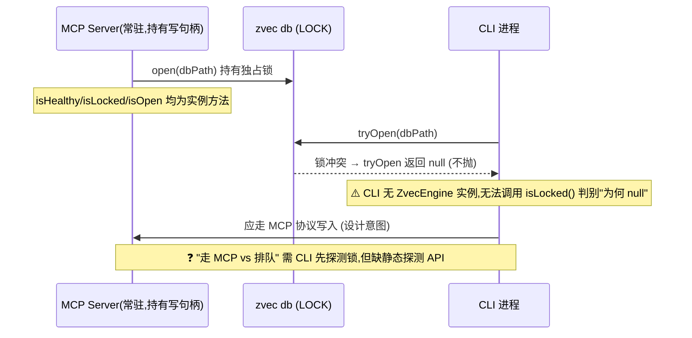
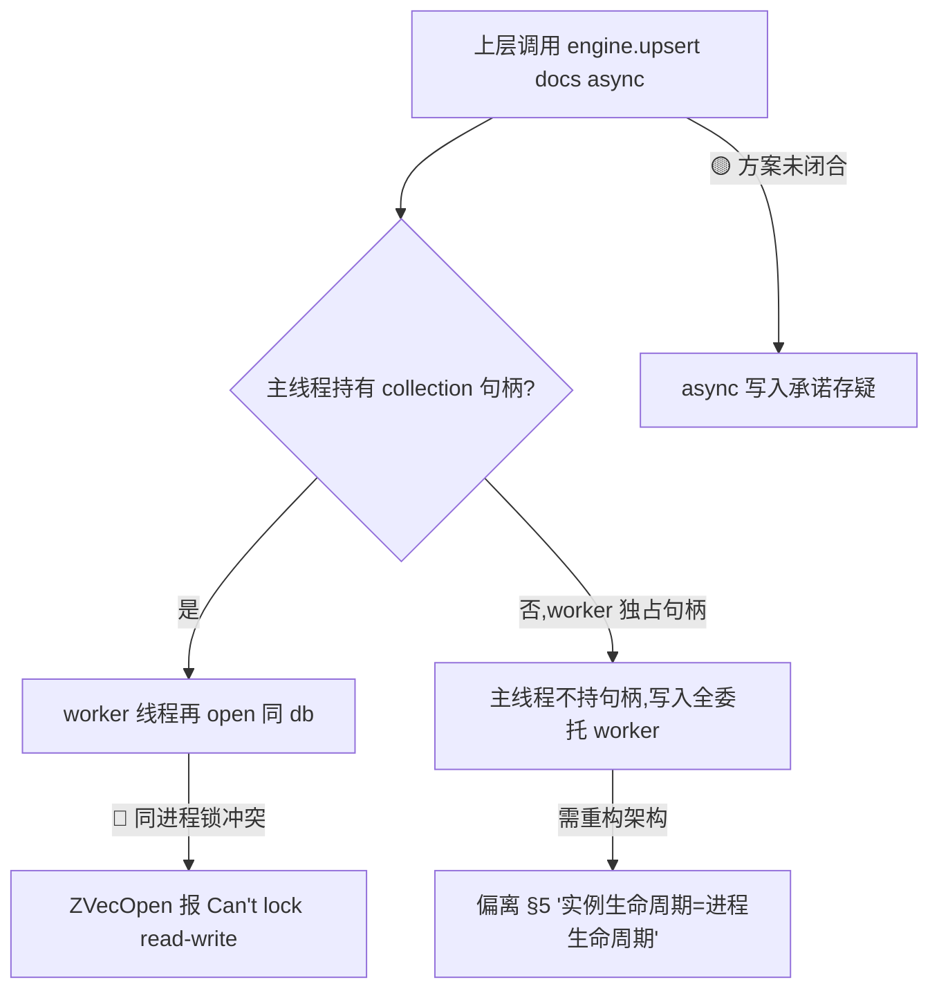
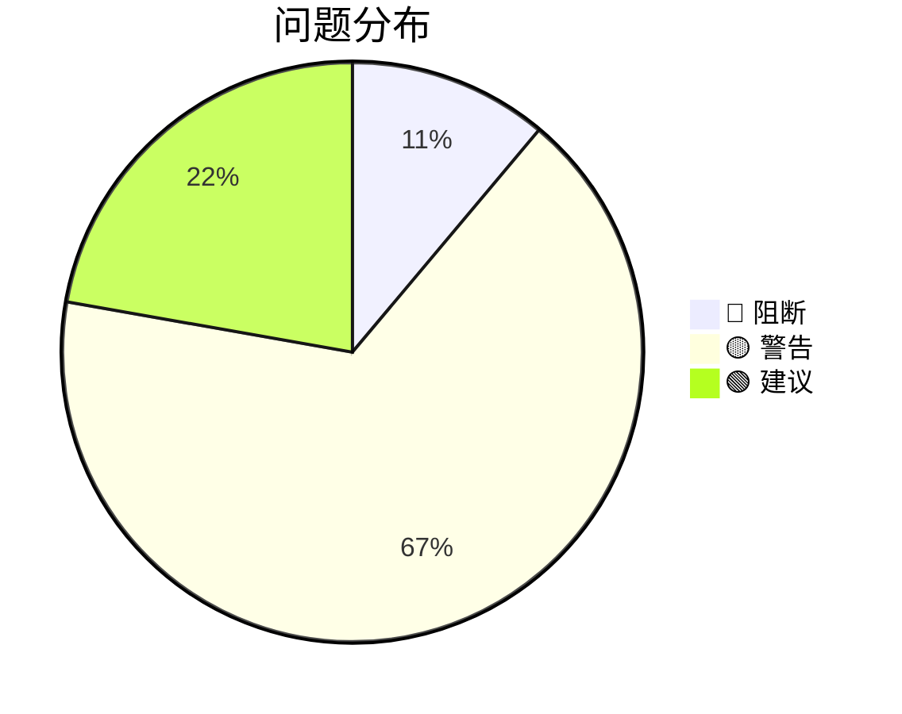

# 场景推演报告：ZvecEngine 基座模块（REQ-20260717-002）

> 推演时间：2026-07-20
> 输入文档：`2026-07-17-KiSearch-zvec-node-mcp/zvec-base-module.md`（v4，已含 `verify_blocking.mjs` Node 实测回写）
> 推演口径：设计层面可行性验证，不修改设计文档（问题仅记录）

## 1. 角色清单

| # | 角色 | 类型 | 权限层级 | 职责 | 来源 |
|---|------|------|---------|------|------|
| 1 | KiSearch 常驻 MCP server | 程序 | 持有 db 写句柄（主调用方） | 常驻持有单一写句柄；对外暴露 MCP 工具；调用所有 ZvecEngine 能力 | §0 db 归属 / §5 常驻保活 |
| 2 | KiSearch CLI | 程序 | 并发写入方 | 一次性建库/查询/回写；写入须走 MCP 协议或排队等锁 | §0 / §5 db 归属 |
| 3 | KiSearch 上层领域层（ki-relation/ki-path/ki-search） | 程序 | 调用方 | 把领域标签/tag/scope 映射为通用 `tags`/`fields` 传下引擎 | §2 铁律 |
| 4 | Embedding 提供方（SiliconFlow HTTP API） | 程序（外部） | 注入依赖 | 提供 4096 维 Qwen3-Embedding-8B；含重试/分批/超时 | §4.6 / REQ-03 |
| 5 | 开发人员 | 用户 | 配置者 | 注入 EmbeddingProvider、配置 schema/tokenizer | §4.1 |

> 全部为程序/系统角色，无"用户登录层级"概念；权限差异体现在"谁持有锁"而非账号体系。

## 2. 推演矩阵 + 启用策略 profile

### 2.1 角色 × 场景推演矩阵

| 场景 \ 角色 | MCP server | CLI | 领域层 | Embedding | 开发 |
|---|---|---|---|---|---|
| S1 建库+写入+混合检索(Happy) | ✅ | - | ✅ | ✅ | - |
| S2 常驻时 CLI 并发写入(锁协调) | ✅ | ✅ | - | - | - |
| S3 批量写入(worker 线程 async 承诺) | ✅ | - | - | - | - |
| S4 embedding 失败/限流(异常) | ✅ | - | - | ✅ | - |
| S5 update 不一致(异常) | ✅ | - | - | - | - |
| S6 db 损坏重建(异常) | ✅ | - | - | - | - |
| S7 listIds 大库扫描(边界) | ✅ | - | - | - | - |
| S8 open 维度/度量不符(异常) | ✅ | - | - | - | - |

### 2.2 设计点覆盖矩阵

| 设计点 \ 场景 | S1 | S2 | S3 | S4 | S5 | S6 | S7 | S8 |
|---|---|---|---|---|---|---|---|---|
| 单集合 + tag 隔离 | ✅ | - | - | - | - | - | - | - |
| 维度校验铁律(4096) | ✅ | - | - | - | - | - | - | ✅ |
| metric 限定 COSINE + score 归一化 | ✅ | - | - | - | - | - | - | ✅ |
| db 单一进程单一写句柄 | ✅ | ✅ | ✅ | - | - | - | - | - |
| 全异步(async)承诺 | ✅ | - | ✅ | ✅ | ✅ | - | - | - |
| embedding 自动 embed + 分层错误 | ✅ | - | - | ✅ | - | - | - | - |
| update 联动规则 | - | - | - | - | ✅ | - | - | - |
| 退化矩阵(hybrid) | ✅ | - | - | - | - | - | - | - |
| 损坏识别/重建责任 | - | - | - | - | - | ✅ | - | - |
| listIds 性能边界 | - | - | - | - | - | - | ✅ | - |

### 2.3 启用策略 profile

- ✅ **CRUD/接口类**（命中：create/open/upsert/insert/update/delete/fetch/listIds + 4 类检索）
- ✅ **并发/竞态敏感类**（命中：db 文件锁、单一写句柄、CLI 争锁、worker 线程、embedding 重试退避）
- ✅ **批处理/同步类**（命中：批量写入、embedding 分批、指数退避）
- ➖ 事务/状态机类（无状态机信号）
- ➖ 实时/推送类（无）
- ➖ 重构/迁移类（无）

## 3. 场景推演详情

### 🎬 S1 建库 + 写入 + 混合检索（Happy Path）

【执行者】MCP server + 领域层 + Embedding
【场景描述】常驻服务启动建库，灌入领域文档，做一次 hybridSearch 召回。

【数据走向验证】
| 步骤 | 操作 | 数据流向 | 验证 | 问题 |
|---|---|---|---|---|
| 1 | `ZvecEngine.create(config)` | 配置 → zvec 建库(4096/COSINE/jieba) | ✅ | - |
| 2 | `upsert(docs)` 带 text | doc.text → Embedding.embed → dense；text → fts.field | ✅ | - |
| 3 | `hybridSearch({queryText, fts})` | queryText→embed→vector 路；fts 路 BM25；RRF 融合 | ✅ | - |
| 4 | 返回 `Hit[]`（score 越大越相关） | 引擎层内归一化 | ✅ | ⚠️ 公式未真实 embedding 验证(见 #7) |

【关键设计点验证】
| # | 设计点 | 问题 | 结果 | 置信度 |
|---|---|---|---|---|
| 1 | 维度校验铁律 | 4096 校验路径清晰 | ✅ | 高 |
| 2 | 默认 jieba | 实测 jieba 中文命中、standard 返回空 | ✅ | 高 |
| 3 | score 归一化 | `1/(1+distance)` 依赖 distance∈[0,2]，demo 用 hash 未验证 | ⚠️ | 中 |
| 4 | 退化矩阵 | fts 缺失→vector、queryText 缺失→fts 逻辑闭合 | ✅ | 高 |

【结论】数据走向 4/0/0；关键设计 3✅/1⚠️。Happy Path 成立。

---

### 🎬 S2 常驻时 CLI 并发写入（锁协调）

【执行者】MCP server（持锁） + CLI（争锁）
【场景描述】server 已常驻持有写句柄，CLI 启动尝试写入，应优雅判断走 MCP 或排队。

【关键设计点验证】
| # | 设计点 | 问题 | 结果 | 置信度 |
|---|---|---|---|---|
| 1 | db 单一写句柄 | 同进程再 open 报锁冲突(实测 H-02) | ✅ | 高 |
| 2 | CLI 锁决策入口 | `isLocked()` 是实例方法,CLI 无实例时无法调 | ❌ | 高 |

【结论】🔴 级衍生问题：**CLI 拿不到句柄时缺少静态锁探测 API**（见问题 #2）。

---

### 🎬 S3 批量写入 worker 线程（async 承诺闭合性）

【执行者】MCP server
【场景描述】验证"所有写入方法均 async"在 zvec(0.5.0)仅 Sync 写入 API 下如何成立。

【关键设计点验证】
| # | 设计点 | 问题 | 结果 | 置信度 |
|---|---|---|---|---|
| 1 | worker 线程包裹 Sync 写入 | worker 是**同一进程**,与 §5 实测"同进程再 open 锁冲突"直接矛盾 | ❌ | 中高 |
| 2 | 句柄跨 worker 传递 | Node worker_threads 不共享对象,collection 句柄无法 postMessage | ❌ | 中 |
| 3 | async 承诺落地 | §4 声明全 async,但写入侧无 Async API,依赖未定义的 worker 方案 | ❌ | 中高 |

【结论】**🔴 阻断**：写入侧 async 承诺依赖 worker 线程，而 worker 线程属同一进程，会与主线程已持有的写锁冲突（§5 实测证据反向印证）。技术上可行路径是"写入 worker 独占句柄、主线程不持"，但这要求重构"实例=进程生命周期"模型，设计文档未定义该架构，属方案不闭合。

---

### 🎬 S4 embedding 失败/限流（异常路径）

【执行者】MCP server + Embedding
【场景描述】SiliconFlow 429/超时，批量 upsert 中部分需 embed 的 doc。

【关键设计点验证】
| # | 设计点 | 问题 | 结果 | 置信度 |
|---|---|---|---|---|
| 1 | 文档级 EMBEDDING_FAILED | `embed(texts[])` 为整批调用,整批失败才能标记;逐条失败无法区分 | ⚠️ | 中 |
| 2 | 预计算 vector 文档 | 有 vector 的 doc 在 embed 整批失败时应仍可写,未定义 | ⚠️ | 中 |

【结论】⚠️ 错误处理粒度与 `EmbeddingProvider.embed` 整批接口不匹配（见问题 #4）。

---

### 🎬 S5 update 不一致（异常路径）

【执行者】MCP server
【场景描述】`update` 只传 vector 不传 text 且配置了 FTS。

【关键设计点验证】
| # | 设计点 | 问题 | 结果 | 置信度 |
|---|---|---|---|---|
| 1 | 抛 InconsistentUpdateError | §4.5 引用该异常,但 §4.4 批级异常清单仅列 DIMENSION_MISMATCH/UNKNOWN_FIELD/SCHEMA_MISMATCH,未命名该异常 | ⚠️ | 高 |

【结论】⚠️ 文档内部命名不一致（见问题 #3）。

---

### 🎬 S6 db 损坏重建（异常路径）

【执行者】MCP server
【场景描述】db 损坏，`open` 抛 `CollectionCorruptedException`，上层 destroy→create→重灌。

【关键设计点验证】
| # | 设计点 | 问题 | 结果 | 置信度 |
|---|---|---|---|---|
| 1 | 重灌数据源 | 基座不备份;重灌数据来源(代码抽取再生成?)未在设计内闭合 | ⚠️ | 中 |

【结论】⚠️ 损坏即潜在数据丢失风险，数据源未闭合（见问题 #6）。

---

### 🎬 S7 listIds 大库扫描（边界）

【执行者】MCP server
【场景描述】`listIds(filter, limit)` 在十万级文档下调用。

【关键设计点验证】
| # | 设计点 | 问题 | 结果 | 置信度 |
|---|---|---|---|---|
| 1 | limit 默认/上限 | 签名有 `limit?` 但无默认值与上限定义;topk 上限 1000 未对齐 | ⚠️ | 中 |

【结论】⚠️ 无 limit 默认值时大库全扫描有内存/时延风险（见问题 #5）。

---

### 🎬 S8 open 维度/度量不符（异常路径）

【执行者】MCP server
【场景描述】open 时注入的 EmbeddingProvider 维度或度量与持久化 schema 不符。

【关键设计点验证】
| # | 设计点 | 问题 | 结果 | 置信度 |
|---|---|---|---|---|
| 1 | dimension 校验时机 | §4.5 仅说"须 ===",未定义不符抛何异常、何时校验 | ⚠️ | 中 |
| 2 | 非 COSINE 库 | 说抛 SchemaMismatchError,但 dimension 不符的异常名缺失 | ⚠️ | 中 |

【结论】⚠️ 校验契约不完整（见问题 #9）。

## 4. 问题汇总

| # | 类型 | 角色 | 场景 | 问题描述 | 建议 | 严重度 |
|---|------|------|------|---------|------|:---:|
| 1 | 设计冲突 | server | S3 | 写入侧 async 承诺依赖 worker 线程，但 worker 属同一进程，与 §5 实测"同进程再 open 锁冲突"矛盾；句柄无法跨 worker 传递；"实例=进程生命周期"模型未定义写入 worker 独占架构 | 明确写入 worker 独占句柄架构（主线程不持句柄、经消息队列委托），或改回"Sync 写入 + 主线程可接受最大批次时延"并下调 async 承诺 | 🔴 |
| 2 | 遗漏场景 | CLI | S2 | CLI 拿不到句柄时无静态锁探测 API；`isLocked/isHealthy/isOpen` 均为实例方法，CLI 无实例时无法决策"走 MCP 还是排队" | 补静态 `ZvecEngine.probeLock(dbPath)` / `inspect(dbPath)`，返回锁/健康/损坏状态 | 🟡 |
| 3 | 设计冲突 | server | S5 | `update` 联动规则引用 `InconsistentUpdateError`，但 §4.4 批级异常清单未命名该异常，内部不一致 | 在批级异常类型中显式命名 `InconsistentUpdateError`（或并入 `UNKNOWN`），与 §4.5 对齐 | 🟡 |
| 4 | 流程缺陷 | server | S4 | `EmbeddingProvider.embed(texts[])` 为整批调用，与"文档级 EMBEDDING_FAILED"粒度不匹配；整批失败 vs 单条失败、含预计算 vector 的 doc 如何处理未定义 | 明确 embed 失败边界：整批失败→所有需 embed 的 doc 标 EMBEDDING_FAILED，预计算 vector 的 doc 照常写入 | 🟡 |
| 5 | 边界处理 | server | S7 | `listIds` 的 `limit` 无默认值与上限，`topk` 上限 1000 未对齐；大库全扫描有内存/时延风险 | 定义 limit 默认值（如 1000）与上限，与 topk 上限一致 | 🟡 |
| 6 | 数据问题 | server | S6 | db 损坏重建的"全量重灌"数据源未在设计中闭合（基座不备份），损坏即潜在数据丢失 | 明确重灌数据源（如领域层从代码重新抽取），或在 NFR 标注"db 为可重建缓存、非权威数据源" | 🟡 |
| 7 | 异常覆盖 | server | S1 | `score=1/(1+distance)` 的 distance∈[0,2] 假设依赖真实 COSINE 定义，H-04 语义 Recall 未闭合（demo 用退化 hash 向量致 score 全 0） | 实现后须用真实 SiliconFlow embedding + compare.py 语料验证归一化公式与 Recall@5≥90% | 🟡 |
| 8 | 流程缺陷 | server | S8 | `delete` 不存在 id 的 zvec 实测行为未验证（B-07 假设进 errors[] NOT_FOUND，但 demo 未验 delete） | 补 delete 不存在 id 的 Node 实测，确认 zvec 是忽略还是报错 | 🟢 |
| 9 | 流程缺陷 | server | S8 | open 时 `embedding.dimension` 与持久化 dimension 不符的校验时机/异常名未定义 | 明确 open 维度校验点与异常（如 `DimensionMismatchError`） | 🟢 |

统计：🔴 阻断 1 / 🟡 警告 6 / 🟢 建议 2

## 5. 推演结论

### 整体评估
- 推演覆盖：5 角色 / 8 场景（Happy + 并发 + 异常 + 边界）
- 问题发现：🔴 1 / 🟡 6 / 🟢 2

### 评审结论

| 条件 | 结论 |
|---|---|
| 存在 ≥1 个 🔴 阻断 | ❌ **不通过**（须先闭合写入侧 async 与锁冲突方案） |
| 无 🔴 但 ≥1 个 🟡 | — |

### 核心判断：设计是否"合理"

**总体合理，但有一处阻断级未闭合。**

设计在"消解 zvec 已知陷阱"上做得扎实：限定 COSINE（消解 IP 归一化地雷）、默认 jieba（实测 standard 中文失效闭环）、score 统一方向、错误分层（批级抛异常 vs 文档级 errors[]）、单集合 + tag 隔离、维度铁律——这些都有 Node 实测支撑，方向正确。

**唯一阻断项（#1）** 是 v4 为修正 v3"批量写入走 Async"不实时引入的"worker 线程"方案，与 §5 自身实测的"同进程再 open 锁冲突"形成内部矛盾。这不是推翻设计，而是**方案未闭合**：要么明确"写入 worker 独占句柄、主线程不持"的重构架构，要么诚实下调 async 承诺（Sync 写入 + 评估最大批次时延）。建议优先选前者（更贴合常驻服务不阻塞并发的诉求），并在 `design-craft` 上层阶段补全。

6 个 🟡 均为非阻断的可优化/需补全项，其中 #2（CLI 静态锁探测）和 #6（损坏重灌数据源）直接影响上线健壮性，建议在设计落地前补完。

### 下一步建议
1. **先修 #1（🔴）**：在 design-craft 上层架构中明确"写入 worker 独占句柄"模型，或调整 async 写入承诺；这是进入实现的前置条件。
2. 补 #2 / #3 / #4 / #5 / #6（🟡）：静态锁探测 API、异常命名对齐、embed 失败粒度、listIds limit、损坏重灌数据源。
3. 实现后用真实 SiliconFlow embedding + compare.py 语料闭合 #7（H-04 语义 Recall）与 #8（delete 实测）。
