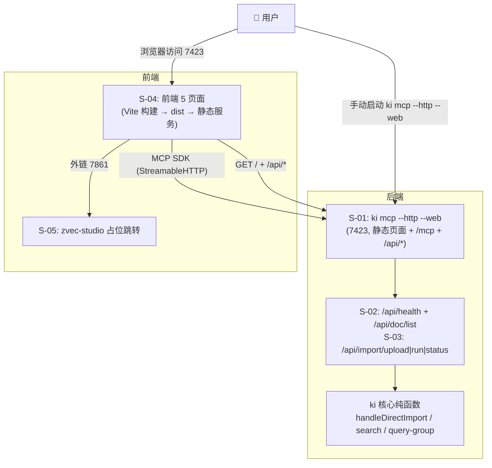
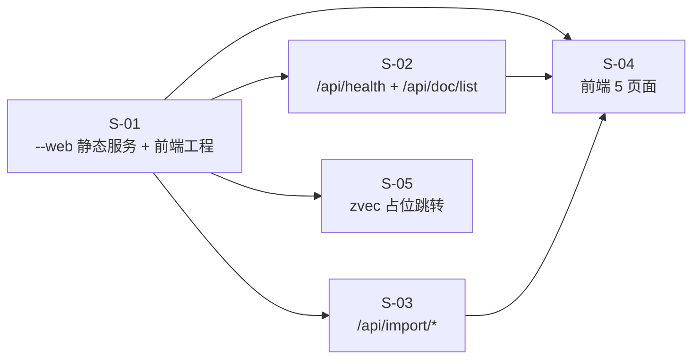

# 技术设计：可视化前端界面

> 本文档为父文档，含全局架构 + 关键环节一览图 + 全局风险。子需求详见 `design/` 下各子文档。

## 1. 需求背景 & 目标

**背景**：ki 现有 CLI/MCP 能力均为文本交互，缺乏可视化前端。REQ-20260806-001 已完成直导/切分/增量/原文召回链路，本需求在其上构建 Web 表示层。

**整体目标**：5 个 Web 页面（总览/浏览/搜索/上传/写入）经 MCP HTTP + 方案 A 扩展路由与 ki 通信；前端由 `ki mcp --http --web` 一并提供静态页面。

**不在范围内**：
- 破坏性操作（doc delete / scope clear|delete / backup / restore / export）→ 留 CLI
- 批量/JSON 写入 → 取消（v3）
- zvec-studio 打开 ki 向量库 → 占位跳转，后续实现（v3）
- 多用户权限/鉴权体系 → 本机单用户回环

## 2. 关键环节一览图

## 3. 总体方案设计

**子需求节点图**（依赖拓扑）：

**共享术语速查**（跨子需求引用）：

| 术语 | 定义 | 出处 |
|------|------|------|
| scope | 项目隔离标识（`resolveScope`，default 兜底） | S-02/S-03/S-04 |
| `/api/*` | mcp-http 扩展路由前缀，与 `/mcp` 隔离 | S-02/S-03 |
| `--web` | `ki mcp --http` 新增参数，控制是否提供前端静态页面 | S-01 |
| 受控上传目录 | `~/.ki/import-uploads/<uploadId>/` | S-03 |
| Group 路径 | relations-cache 中 group 层级路径 | S-02 |

**核心架构决策**（源码实证）：
1. 前端与 `/mcp` **同源**（7423 复用根路由 `/`）→ MCP SDK 直连，**无 CORS**（C-03 已调研确认，见 `review/mcp-sdk-browser-probe.md`）
2. 前端静态产物用 Vite 构建到 `web/dist`，`ki mcp --http --web` 服务该目录
3. 浏览页数据源统一走 `/api/doc/list`（返回 Group 路径 + 文档），不复用 `ki_query_group` 文本解析

## 4. 全局风险 & 跨子需求依赖

| 风险 | 影响 | 应对 |
|------|------|------|
| `/` 根路由与 `/mcp` 同源，需确保静态文件服务不误拦截 MCP/API 请求 | 全功能 | S-01 路由按 `pathname` 前缀分流：`/mcp` → MCP、`/api/` → 接口（未匹配返回 JSON 404，**不 fallback index.html**）、其余 GET → 静态（SPA fallback） |
| MCP SDK 版本（^1.29.0）与前端 bundle 兼容性 | 通信 | 前端复用同一 SDK 版本，Vite 打包验证 |
| 30 分钟会话回收导致前端 MCP 会话失效 | 搜索/写入 | 前端 SDK 自动重连（initialize 重建会话） |
| 导入长任务挂起 HTTP 请求 | 上传 | S-03 异步 job 模型 + status 轮询 |
| `/api/doc/list` 大 scope 文档量 | 浏览 | 分页/limit 上限（S-02 设计） |

**跨子需求接口依赖**（父级契约，子文档细化）：

| 接口 | 方法 | 参数 | 定义位置 | 消费方 |
|------|------|------|----------|--------|
| `/` + 静态资源 | GET | — | S-01 | 浏览器 |
| `/api/health` | GET | — | S-02 | 总览页 |
| `/api/doc/list` | GET | `scope`(必), `q`(可选文件名模糊) | S-02 | 浏览页 |
| `/api/import/upload` | POST | `scope`, `files[{name,content,size}]` | S-03 | 上传页 |
| `/api/import/run` | POST | `scope`, `uploadId`, `mode`, 切分参数 | S-03 | 上传页 |
| `/api/import/status` | GET | `jobId` | S-03 | 上传页 |
| `ki_search` 等 MCP 工具 | JSON-RPC | 各工具契约 | 既有 | 搜索/写入页 |

## 变更记录

- 2026-08-08 v1：父文档初版，5 个子需求拆分（S-01~S-05）
