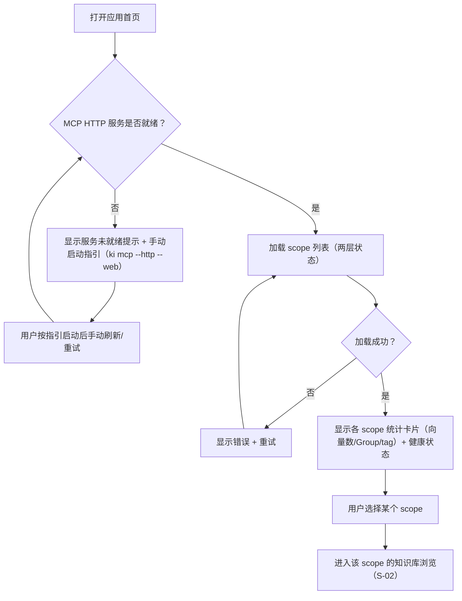
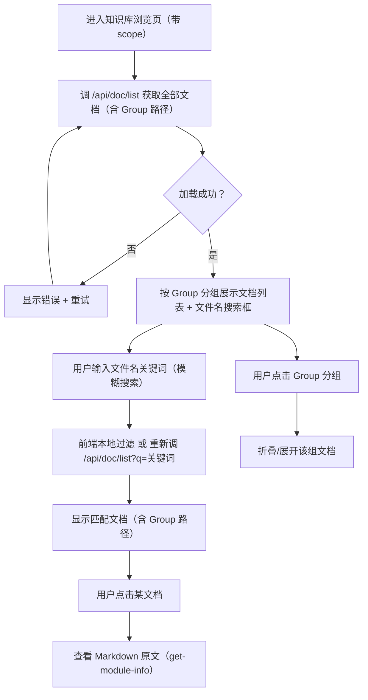
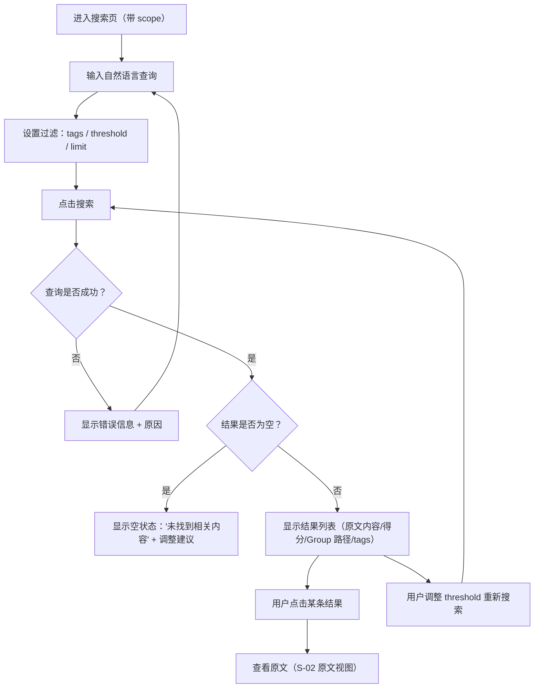
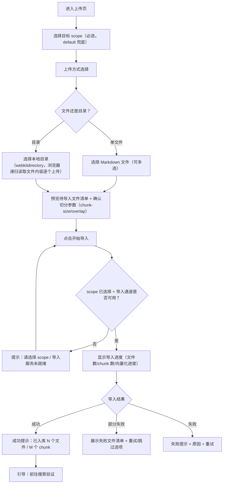
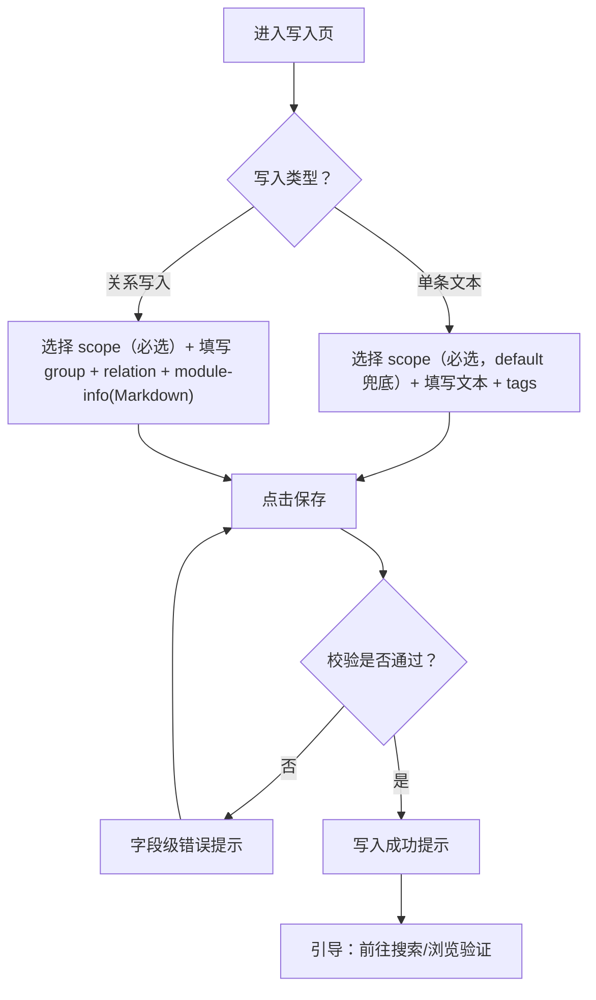
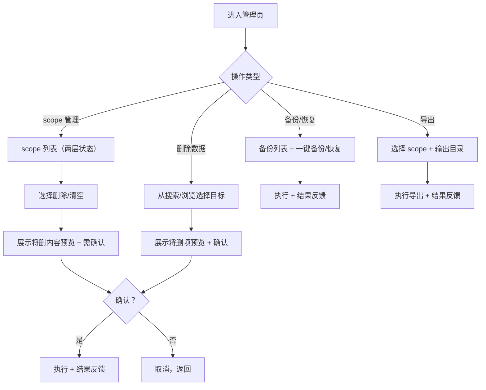
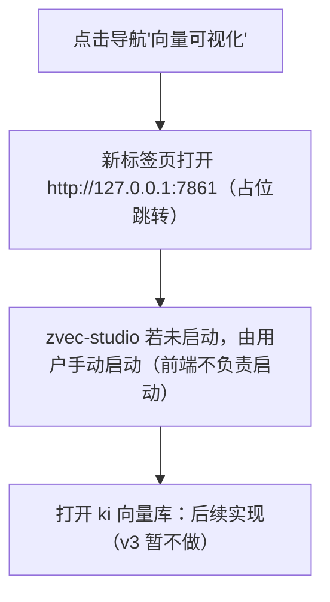

# 交互设计：可视化前端界面

> 场景类型：Web 系统（浏览器端应用）
> 状态：草案（阶段 1-3 已确认，阶段 4-6 待确认）

## 1. 角色与意图

| 角色 | 核心目标 | 技术熟悉度 | 交互频率 |
|------|----------|-----------|----------|
| 管理员 | 在浏览器中查看文档数据、上传文档、管理知识库，无需命令行 | 中 | 高（日常使用） |
| 开发人员 | 语义搜索 + 定位原文，快速找到知识 | 高 | 中（按需使用） |

> 本机单用户 Web 工具，无登录/权限体系；写操作保留二次确认以防御误操作。

## 2. 交互场景清单

| 场景编号 | 场景名称 | 触发条件 | 目标角色 | 优先级 | 成功标志 |
|----------|----------|----------|----------|--------|----------|
| S-01 | 总览 Dashboard | 打开应用首页 | 管理员 | P0 | 看到 scope 列表 + 各库统计 + 健康状态 |
| S-02 | 知识库浏览 | 点击导航"知识库" | 管理员 | P0 | 展开 Group 树，按文件名模糊搜索，查看文档原文 |
| S-03 | 语义搜索 | 点击导航"搜索" | 开发人员/管理员 | P0 | 输入查询得到结果（原文内容 + Group 路径），可查看原文 |
| S-04 | 上传文档与导入 | 点击"上传文档" | 管理员 | P0 | 选 scope（必选）→ 上传 Markdown 后知识可被搜索到 |
| S-05 | 知识写入 | 点击"写入知识" | 管理员/开发人员 | P1 | 选 scope（必选）→ 单条/关系表单提交后新知识可被查询 |
| S-06 | ~~管理操作~~ | ~~点击"管理"~~ | 管理员 | ~~P1~~ | ~~受控操作（删除/备份/导出/scope）完成~~（v2 取消，留 CLI） |
| S-07 | 向量可视化跳转 | 点击导航"向量可视化" | 管理员 | P1 | 新标签页打开 zvec-studio 页面（占位跳转） |

**场景关联性**：
- S-01 是应用入口，S-02~S-07 从总览导航进入，均依赖 S-01 的 scope 选择上下文
- S-04 依赖底层导入通道（REQ-F06）与直导链路（REQ-20260806-001）
- S-05 与 S-02 相关（写入后可立即在浏览中看到）
- S-06 中删除类操作与 S-02/S-03 相关（从列表/搜索结果发起）
- S-07 完全独立（占位跳转外部应用）
- S-04/S-05 的 scope 选择为**必选**（v3，default 兜底）

## 3. 交互流程

### 3.1 S-01：总览 Dashboard

| 节点 | 用户感知 | 备注 |
|------|----------|------|
| 服务未就绪 | 醒目提示 + 手动启动指引 | 前端**不负责启动服务**（v3），仅提示 `ki mcp --http --web` 命令 |
| scope 卡片 | 名称、两层状态（KB/向量）、统计数字 | 空库显示"空"状态 |
| 选择 scope | 进入浏览页并带 scope 上下文 | scope 上下文全局共享 |

### 3.2 S-02：知识库浏览

| 节点 | 用户感知 | 备注 |
|------|----------|------|
| 数据源 | `/api/doc/list` 直接返回 **Group 路径 + 文档** | v4 契约：浏览页数据源统一走该接口，Group 树与文档列表同源 |
| 空查询 | 显示全部文档，按 Group 分组 | v4：空查询 = 全部文档，有 `q` 才过滤 |
| 文件名搜索 | 输入关键词 → 模糊匹配文件名 | 浏览页只做文件名检索，**无语义搜索、无 tag 过滤**（v3） |
| 文档列表 | 文件名 + Group 路径 | 结构化接口返回，非文本解析 |
| 原文查看 | Markdown 渲染显示 | 对应 `get-module-info` |

### 3.3 S-03：语义搜索

| 节点 | 用户感知 | 备注 |
|------|----------|------|
| 搜索输入 | 即时可搜索（回车提交） | 高频场景重效率 |
| 结果列表 | 每条含**原文内容摘要**、得分、**命中 Group 路径**、tags | 默认 `include_original: true`（v3：返回向量命中原文内容 + Group 路径） |
| 空结果 | 提示调整关键词/tags/threshold | 避免用户困惑 |
| 跳原文 | 点击结果查看原文 | 对应 `get-module-info` |

### 3.4 S-04：上传文档与导入

| 节点 | 用户感知 | 备注 |
|------|----------|------|
| scope 选择 | **必选**，default 兜底（v3） | 未选 scope 无法开始导入 |
| 文件清单预览 | 显示待导入文件数与大小 | 上传前可移除文件 |
| 切分参数 | 可展开的高级选项（默认值预填） | 对应 `--chunk-size/--chunk-overlap` |
| 导入进度 | 进度条 + 阶段文案（切分→向量化） | 长任务需等待反馈 |
| 部分失败 | 文件级失败清单，可单独重试 | 幂等覆盖更新 |

### 3.5 S-05：知识写入

| 节点 | 用户感知 | 备注 |
|------|----------|------|
| scope 选择 | **必选**，default 兜底（v3） | 未选 scope 无法提交 |
| 表单校验 | 字段级错误（如 group 路径格式） | 对应 `store`/`sync-relation` 参数 |
| 关系写入 | Markdown 编辑区（可预览） | module-info 为 Markdown |
| 成功反馈 | 成功提示 + 可跳验证 | 写后立即可查 |
| ~~批量写入~~ | ~~上传批量 JSON~~ | **v3 决策取消**，仅保留单条文本 + 关系写入 |

### 3.6 S-06：管理操作

> **v2 修订：本场景已取消**。破坏性操作（doc delete / scope clear|delete / backup / restore / export）前端不提供入口，保留在 CLI（防误操作）。以下为 v1 原始流程存档：

| 节点 | 用户感知 | 备注 |
|------|----------|------|
| ~~破坏性操作~~ | ~~预览将删项 + 明确确认弹窗~~ | ~~对齐 CLI `--yes` 语义~~（v2 取消） |
| ~~备份~~ | ~~备份列表 + 创建时间~~ | ~~对应 `backup`/`restore`~~（v2 取消） |
| ~~导出~~ | ~~输出路径反馈~~ | ~~对应 `export`~~（v2 取消） |
| 受限能力 | 破坏性操作在前端不可用，文档指引走 CLI | v2 决策：留 CLI |

### 3.7 S-07：向量可视化跳转（v3：占位跳转）

| 节点 | 用户感知 | 备注 |
|------|----------|------|
| 跳转 | 新标签页打开，不影响当前应用 | 端口 **7861**；**占位跳转**（v3） |
| 服务未启动 | 页面停留/浏览器报连接失败 | 前端**不检测、不启动** zvec-studio（v3），由用户手动启动 |
| ~~打开 ki 向量库~~ | ~~自动加载 ki 集合~~ | **v3 暂不做**，后续实现 |

## 4. 反馈与状态矩阵

### S-01 总览
| 节点 | 成功 | 失败 | 等待 | 空状态 |
|------|------|------|------|--------|
| 加载服务状态 | 显示就绪/未就绪徽标 | 连接失败提示 + 重试 | 加载指示 | 无 scope → "创建或导入第一个知识库"引导 |
| 加载 scope 列表 | 卡片列表 | 错误 + 重试 | 骨架屏 | 空库引导 |

### S-02 浏览
| 节点 | 成功 | 失败 | 等待 | 空状态 |
|------|------|------|------|--------|
| Group 树加载 | 树展开 | 错误 + 重试 | 骨架屏 | 空树引导 |
| 文件名搜索 | 匹配文件列表 | 错误提示 | 加载指示 | "无匹配文件"（v3：文件名模糊搜索） |
| 文档列表 | 文件名 + 路径 | 错误提示 | 加载指示 | "该 Group 暂无内容" |
| 原文查看 | Markdown 渲染 | 未找到提示 | 加载指示 | — |

### S-03 搜索
| 节点 | 成功 | 失败 | 等待 | 空状态 |
|------|------|------|------|--------|
| 搜索提交 | 结果列表 | 错误 + 原因 | 搜索中指示 | "未找到相关内容" + 调整建议 |
| threshold 调整 | 列表刷新 | — | 即时刷新 | 同空状态 |

### S-04 上传导入
| 节点 | 成功 | 失败 | 等待 | 空状态 |
|------|------|------|------|--------|
| scope 选择 | 显示已选 scope | 未选禁用导入按钮 | — | default 兜底（v3） |
| 文件选择 | 清单预览 | 类型/大小校验错误 | — | "拖拽或选择文件"占位 |
| 开始导入 | 成功汇总 | 失败原因 + 重试 | 进度条 + 阶段文案 | — |
| 导入完成 | 成功提示 + 引导验证 | 部分失败清单 | — | — |

### S-05 写入
| 节点 | 成功 | 失败 | 等待 | 空状态 |
|------|------|------|------|--------|
| scope 选择 | 显示已选 scope | 未选禁用提交按钮 | — | default 兜底（v3） |
| 表单提交 | 成功提示 + 跳验证 | 字段级错误 | 提交中禁用按钮 | — |

### S-06 管理（v2 已取消，留 CLI）
> 管理页不在前端范围内。破坏性操作经 CLI 执行，文档指引即可，无前端反馈矩阵。

### S-07 跳转（v3：占位）
| 节点 | 成功 | 失败 | 等待 | 空状态 |
|------|------|------|------|--------|
| 占位跳转 | 新标签页打开 7861 | 页面停留/浏览器报连接失败（用户手动启动 zvec） | — | — |
| ~~启动 zvec-studio~~ | ~~新标签页打开~~ | ~~启动失败原因 + 手动指引~~ | ~~启动中指示~~ | —（v3：前端不启动） |

## 5. 异常与边界处理

| 异常场景 | 触发条件 | 用户感知 | 恢复路径 | 是否阻断主流程 |
|----------|----------|----------|----------|----------------|
| MCP 服务未启动 | `ki mcp --http` 未运行 | 顶部横幅"服务未就绪" + 手动启动指引 | 用户手动执行 `ki mcp --http --web`（前端不启动，v3） | 是 |
| 后端调用超时 | 大查询/长导入 | 超时提示 + 重试 | 重试 / 调大阈值 | 否（可返回） |
| 上传文件格式错误 | 非 Markdown / 超大文件 | 文件级校验错误 | 移除该文件重选 | 否 |
| 导入中途失败 | 网络/向量服务异常 | 失败清单 + 已入库部分 | 重试 / 跳过失败项 | 否（部分成功） |
| ~~删除被拒绝~~ | ~~删除非空节点/跨 scope docid~~ | ~~拒绝原因提示~~ | ~~逐条删除或走 CLI~~ | ~~否~~（v2：删除类操作不在前端） |
| ~~破坏性操作未确认~~ | ~~用户未确认~~ | ~~预览 + 明确确认框~~ | ~~取消或确认~~ | ~~是（执行前）~~（v2：管理页取消） |
| ~~zvec-studio 端口占用~~ | ~~7861 被占用~~ | ~~启动失败原因~~ | ~~手动启动 / 换端口~~ | ~~否~~（v3：占位跳转，前端不启动 zvec） |
| MCP 会话过期 | 空闲 30 分钟回收 | 请求失败自动重连 | 前端自动重新 initialize | 否 |
| scope 未选择 | 上传/写入未选 scope | 禁用导入/提交按钮 + 提示 | 选择 scope（default 兜底） | 是（该操作） |

**边界情况**：
| 场景 | 条件 | 预期行为 |
|------|------|----------|
| 空知识库 | 无任何 scope/文档 | 各页面显示引导（创建/导入第一个知识库） |
| 超大 Group 树 | 节点数很多 | 树懒加载/虚拟滚动，避免卡顿 |
| 搜索无结果 | 查询不命中 | 空状态 + 调整建议（tags/threshold/关键词） |
| 多 scope 切换 | 用户在页面间切换 scope | scope 上下文全局生效，页面间一致 |
| 上传与增量并发 | 上传同时有人导入 | 后端串行化（MCP 单进程），前端展示排队状态 |
| 未选 scope 上传/写入 | scope 为空 | 禁用操作按钮 + 提示选择（default 兜底，v3） |
| 文件名搜索无匹配 | 关键词不命中任何文件名 | "无匹配文件"空状态（v3） |

## 6. 交互约束

| 约束类型 | 涉及操作 | 约束内容 | 用户感知 |
|----------|----------|----------|----------|
| ~~不可逆操作~~ | ~~scope 删除/清空、文档/关系删除~~ | ~~必须先展示将删内容预览 + 明确确认~~ | ~~二次确认弹窗~~（v2：破坏性操作不在前端，走 CLI） |
| 前置条件 | 上传/写入 | **必须选择 scope**（v3：必选，default 兜底） | 未选 scope 禁用操作按钮 |
| 前置条件 | 导入 | 需 MCP 服务就绪 | 服务未就绪横幅 |
| 服务生命周期 | 所有页面 | **前端不启动/不关闭服务**（v3），仅检测 MCP 状态 + 手动指引 | 服务未就绪时显示 `ki mcp --http --web` 指引 |
| ~~确认点~~ | ~~破坏性管理操作~~ | ~~对齐 CLI `--yes` 语义~~ | ~~确认弹窗 + 将删清单~~（v2：管理操作不在前端） |
| 依赖关系 | 上传→导入 | 上传文件落盘受控上传目录（`~/.ki/import-uploads/<uploadId>/`）后再触发导入 | 导入进度展示 |
| 频率限制 | 导入/写入 | 提交中禁用按钮防重复提交 | 按钮 loading |
| 能力限制 | 删除类操作 | MCP 零破坏性约束 + v2 决策：破坏性操作前端不提供入口 | 文档指引走 CLI |
| 能力边界 | 浏览页检索 | 只做**文件名模糊搜索**（v3），无语义搜索/tag 过滤（语义检索在搜索页） | 搜索框提示"按文件名搜索" |

## 7. 待确认事项

| 编号 | 事项 | 影响范围 | 状态 |
|------|------|----------|------|
| C-01 | 导入通道形态 | S-04 | ✅ 已决策（v2 修订）：无 MCP 工具的能力 → **扩展 mcp-http 新增 `/api/import/*` 路由**（方案 A，封装 scan-kb import 直导/切分/增量） |
| C-02 | 破坏性操作（doc delete / scope clear|delete / backup / restore / export）前端通道 | S-06 | ✅ 已决策（v2 修订）：**前端不提供入口**，破坏性操作保留在 CLI（防误操作，管理页已取消） |
| C-03 | MCP SDK 浏览器端可用性（否则需本地代理封装） | 全部场景 | ✅ **已调研确认可行**（2026-08-08）：SDK `StreamableHTTPClientTransport` 纯 Web API，`--web` 同源提供页面规避 CORS；`ki_search` 返回 JSON 含 group/original 可直接消费。详见 `review/mcp-sdk-browser-probe.md` |
| C-04 | zvec-studio 能否直接打开 ki 的 `~/.ki/vector/` 集合 | S-07 | ✅ 已决策（v3 修订）：**暂不考虑**，占位跳转，打开 ki 向量库后续实现 |
| C-05 | 阶段 4-6（反馈矩阵/异常边界/交互约束）内容 | 全部 | ✅ 已推演（review/scenario-rehearsal.md），🔴 项经决策关闭 |
| C-06 | zvec-studio 端口 | S-07 | ✅ 已决策：**改用 7861**（避免默认冲突） |
| C-07 | 健康状态（doctor）实现 | S-01 | ✅ 已决策：功能需要增加，**扩展 mcp-http 新增 `/api/health`**（调 ki `runHealthCheck` doctor 逻辑）实现（v2 修订：不用 zvec-studio healthz，其只反映 zvec-studio 自身存活，非 ki 健康） |
| C-08 | 前端服务生命周期 | 全部 | ✅ 已决策（v3）：前端**不启动/不关闭服务**，`ki mcp --http` 新增 `--web` 参数控制是否提供前端静态页面 |
| C-09 | 浏览页检索语义 | S-02 | ✅ 已决策（v3/v4）：浏览页 = **文件名模糊搜索**，数据源统一走 `/api/doc/list`（**返回 Group 路径 + 文档**，支持 `q` 搜索）；空查询 = 全部文档按 Group 分组；语义搜索 + tag 过滤仅保留在搜索页 |

> **架构分层（推演沉淀，进入技术设计，v3 修订）**：
> 1. **MCP HTTP（7423）**：已有 11 个工具（搜索/浏览/写入核心能力）
> 2. **扩展 mcp-http 新增 `/api/*` 路由**（方案 A）：补齐 MCP 缺失能力（导入 `/api/import/upload|run|status`、健康 `/api/health`、浏览页文件名检索 `/api/doc/list`）；管理操作（doc delete/scope/backup/restore/export）**不提供前端入口**，保留 CLI
> 3. **前端静态页面**：由 `ki mcp --http --web` 一并提供（新增 `--web` 参数；前端不启动/关闭服务，v3）
> 4. **第三方接口**：zvec-studio 跳转（**7861**，占位）
> 5. 文档列表（doc list）**不新增 MCP 工具**（功能冗余）；浏览页数据源 = `/api/doc/list`（**返回 Group 路径 + 文档**，支持 `q` 文件名搜索，v4）+ 原文（`get-module-info`）；tag 过滤仅保留在搜索页（relations 无 tag 字段）
