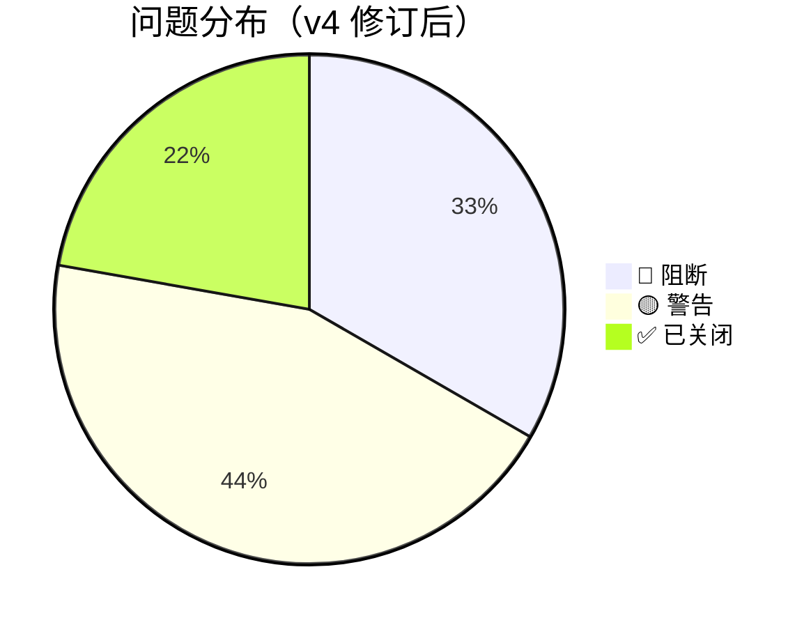
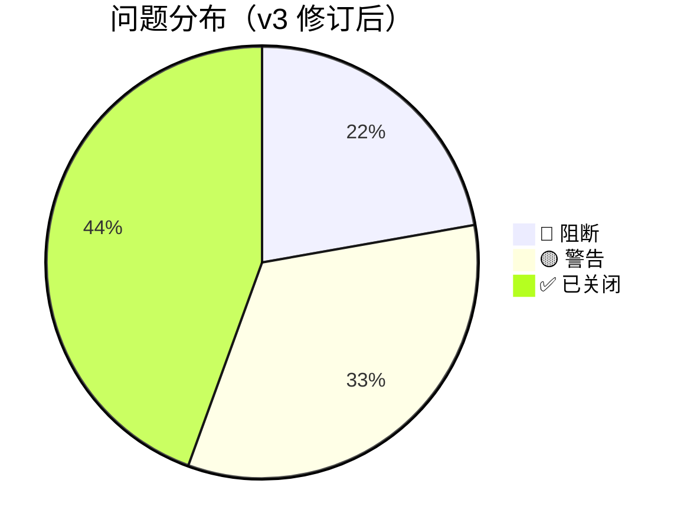

# 场景推演结果：可视化前端界面（v3/v4 需求）

> 推演时间：2026-08-08
> 推演对象：需求文档模式（requirement.md v4 + interaction-design.md v2）
> 输入文档：requirement.md、interaction-design.md、demo HTML 文件
> v3 修订：7 条决策已同步，原问题 #1/#2/#5/#9 已关闭（详见问题汇总）
>
> **v3 二次推演（2026-08-08）**：基于 v3 需求 + 源码实证（mcp-server.ts / mcp-http.ts / scoring.ts / search.ts），验证 7 条业务决策的技术落点。结论：**业务决策已自洽，剩余问题全部指向技术设计**（前端服务形态、`/api/*` 接口、`--web` 参数）。
>
> **v4 修订（2026-08-08）**：`/api/doc/list` 契约明确为**返回 Group 路径 + 文档，支持 `q` 文件名搜索**；关闭 E3/N1，剩余 3🔴 + 4🟡。

---

# 附：v3 二次推演报告（2026-08-08）

## 🎯 推演对象识别

- **对象类型**：需求文档模式（requirement.md v3 + interaction-design.md v2，无 DESIGN.md）
- **验证重点**：7 条 v3 业务决策在真实场景中的**技术可行性**（尤其前端服务形态、`--web`、`/api/doc/list`）

## 🌍 全局理解声明

- **业务目标**：为 ki 能力构建 Web 前端，浏览器浏览/搜索/上传/写入知识库
- **系统位置**：上游 `ki mcp --http --web`(7423) + zvec-studio(7861 占位) + 方案A `/api/*` → 前端 → 浏览器用户
- **整体成功判据**：①5 页面可用 ②破坏性操作留 CLI ③前端不启动/不关闭服务 ④上传/写入 scope 必选 ⑤浏览=文件名搜索、搜索=语义+tag+原文+Group 路径 ⑥不暴露服务器文件系统

## 👥 角色清单

| # | 角色 | 类型 | 权限 | 核心目标 | 来源 |
|---|------|------|------|----------|------|
| 1 | 知识库管理员 | 用户 | 本机单用户 | 浏览/上传/写入 | requirement §2.4 |
| 2 | 开发者 | 用户 | 本机单用户 | 语义搜索 + 定位原文 | requirement §2.4 |
| 3 | 手动运维 | 用户 | 本机 | 手动启动 ki mcp / zvec-studio | v3 决策④ |

## 📋 推演矩阵

| 场景 \ 角色 | 管理员 | 开发者 | 手动运维 |
|-------------|--------|--------|---------|
| S-01 总览（服务检测） | ✅ | ✅ | ✅ 手动启动前置 |
| S-02 浏览（文件名搜索） | ✅ 主要 | ✅ 辅助 | - |
| S-03 语义搜索（原文+Group） | ✅ | ✅ 主要 | - |
| S-04 上传导入（scope 必选） | ✅ 主要 | - | - |
| S-05 写入（scope 必选） | ✅ | ✅ | - |
| S-07 zvec 占位跳转 | ✅ | ✅ | ✅ 手动启动 zvec |

## 🎬 场景推演详情

### S-01：手动启动 + 总览

```
用户手动 `ki mcp --http --web` → 浏览器打开前端
  → 调 /healthz 检测 → /api/health doctor → scope 列表 → 选 scope
```

| 步骤 | 数据流 | 需求覆盖 | 问题 |
|------|--------|---------|------|
| 手动启动 | 用户执行 `ki mcp --http --web` | 🔴 `--web` 未实现（mcp-server.ts 源码 0 匹配） | W1 |
| 打开前端 | 浏览器访问 web 端口 | 🔴 web 端口/路由未定义（7423 是 MCP；`handleRequest` 对非 `/mcp` 一律 404） | W2 |
| 检测 MCP | `GET /healthz` | ✅ 已实现 | — |
| scope 列表 | `ki_scope_list` | ✅ | — |
| 健康状态 | `GET /api/health` | 🔴 未实现 | E2 |

### S-02：浏览（文件名搜索）

```
浏览页 → GET /api/doc/list?scope=（返回 Group 路径 + 文档）
  → 空查询显示全部文档按 Group 分组 → 输入 q 过滤 → 点击 → ki_get_module_info 原文
```

| 步骤 | 数据流 | 需求覆盖 | 问题 |
|------|--------|---------|------|
| 文档列表 | `GET /api/doc/list` | ✅ **v4 契约已明确**：直接返回 Group 路径 + 文档，支持 `q` 文件名搜索 | E3 已关闭 |
| 空查询 | 关键词为空 | ✅ v4：返回全部文档按 Group 分组 | N1 已关闭 |
| 原文 | `ki_get_module_info` | ✅ | — |

> 数据源实证：`Relation.sourcePath`（scoring.ts:29）存原始文件相对路径，可用于文件名聚合 + 模糊匹配。

### S-03：语义搜索

```
搜索页 → ki_search（include_original: true）→ 原文 + 得分 + Group 路径 + tags
```

| 步骤 | 数据流 | 需求覆盖 | 问题 |
|------|--------|---------|------|
| 语义搜索 | `ki_search` | ✅ | — |
| include_original | 默认 true | ✅ REQ-20260807-001 已实现 | — |
| Group 路径展示 | 命中原文 Group | ⚠️ 需验证 `ki_search` 返回是否含 Group 路径 | N2 |

### S-04：上传导入（scope 必选）

```
选 scope（必选）→ 选文件/目录 → 预览 → 设置切分 → upload → run → 轮询 status
```

| 步骤 | 数据流 | 需求覆盖 | 问题 |
|------|--------|---------|------|
| scope 必选 | 未选禁用 | ✅ v3 | — |
| upload/run/status | `/api/import/*` | 🔴 未实现 | E4 |
| 大目录 | 大量文件 | ⚠️ 无上限（#7 遗留） | — |

### S-05：写入（scope 必选 + 去批量）

```
选 scope（必选）→ 单条 store / sync-relation 关系写入
```

| 步骤 | 数据流 | 需求覆盖 | 问题 |
|------|--------|---------|------|
| scope 必选 | 未选禁用 | ✅ v3 | — |
| 单条/关系 | `ki_store`/`ki_sync_relation` | ✅ | — |
| 批量 | — | ✅ v3 取消 | — |

### S-07：zvec 占位跳转

```
点击"向量可视化" → 新标签页打开 7861 → zvec 未启动用户手动启动
```

| 步骤 | 需求覆盖 | 问题 |
|------|---------|------|
| 占位跳转 | ✅ v3 | — |
| zvec 未启动 | 浏览器报连接失败 | ⚠️ 符合"前端不启动"，可接受 |

### S-01 异常：MCP 崩溃恢复（#8 遗留）

```
使用中 MCP 崩溃 → 前端请求失败 → 用户手动重启 → 刷新
```

| 检查点 | 需求覆盖 | 问题 |
|--------|---------|------|
| 崩溃自动重连 | ❌ 未定义 | #8 遗留 |

## 📊 问题汇总（v3 二次推演）

| # | 类型 | 角色 | 场景 | 问题描述 | 功能影响 | 建议 | 严重度 |
|---|------|------|------|---------|---------|------|:------:|
| W1 | 需求缺口 | 手动运维 | S-01 | **`--web` 参数未实现**：`src/mcp-server.ts` `parseMcpArgs` known 数组无 `--web` | 前端无法启动 → F01 全不可用 | 技术设计加 `--web` 解析并传给 HTTP 服务 | 🔴 |
| W2 | 需求缺口 | 手动运维 | S-01 | **前端静态页面端口/路由未定义**：`--web` 后页面复用什么端口？`handleRequest` 对非 `/mcp` 一律 404 | 浏览器访问 URL 未定 → 用户无从访问 | 技术设计：复用 7423 加根路由 `/` 或另开 web 端口 | 🔴 |
| E2 | 需求缺口 | 管理员 | S-01 | **`/api/health` 未实现** | 总览健康状态无法显示 | 技术设计落地 | 🔴 |
| E3 | 需求缺口 | 管理员 | S-02 | **`/api/doc/list` 未实现**；sourcePath 聚合未设计 | 浏览页文件名搜索不可用 | ✅ **v4 已关闭**（契约明确：返回 Group 路径 + 文档，支持 `q` 搜索；技术设计落地实现） | 🔴→✅ |
| E4 | 需求缺口 | 管理员 | S-04 | **`/api/import/*` 三端点未实现** | F05/F06 不可用 | 技术设计落地 | 🔴 |
| N1 | 边界覆盖 | 管理员 | S-02 | **文件名空查询行为未定义** | 首次进浏览页不知看什么 | ✅ **v4 已关闭**（空查 = 返回全部文档按 Group 分组） | 🟡→✅ |
| N2 | 需求缺口 | 开发者 | S-03 | **`ki_search` 返回是否含 Group 路径未确认** | Group 路径展示可能无法直接实现 | 🟡 部分关闭：浏览页 Group 路径已由 `/api/doc/list` 提供；搜索页仍需技术设计验证 `ki_search` 返回结构 | 🟡 |
| #7 | 边界覆盖 | 管理员 | S-04 | 超大目录上传无上限（遗留） | 内存溢出/超时 | 补上限 | 🟡 |
| #8 | 异常覆盖 | 全部 | S-01 | MCP 崩溃无自动重连（遗留） | 停留错误态 | 补自动重连 | 🟡 |
| #6 | 术语冲突 | 全部 | S-01~S-05 | "两层状态"模糊（遗留） | 理解不一致 | 明确定义 | 🟡 |



## 推演结论（v3 二次）

### 整体评估

| 维度 | 状态 |
|------|:--:|
| 场景完整性 | ⚠️ v3/v4 业务决策已吸收，前端服务形态（端口/路由）+ 3 接口仍是空 |
| 验收标准可达性 | ❌ F01/F02/F05/F06 依赖未实现 `--web` 与接口（F03 契约已明确，待实现） |
| 需求一致性 | ✅ v3 7 条决策 + v4 接口契约已消除内部矛盾 |
| 角色-需求对齐 | ✅ |
| 边界/异常覆盖 | ⚠️ 大目录/崩溃重连/搜索页 Group 路径未定义 |
| 术语一致性 | ⚠️ "两层状态"模糊 |

### 评审结论

| 条件 | 结论 |
|------|------|
| 存在 ≥3 个 🔴阻断（W1/W2/E2/E4 待落地） | **❌ 不通过**（进入技术设计前需落地） |

> 推演结论（基于文档推理，未实际执行）。关键判定：**剩余问题全部属于"技术设计待产出"而非"需求缺陷"**——v3 业务决策 + v4 `/api/doc/list` 契约已自洽，无需再改需求文档。E3/N1 已由 v4 关闭。

### 下一步建议

1. **W2 是技术设计第一决策**：前端静态页面端口/路由（复用 7423 加 `/` 根路由 vs 另开端口）
2. **W1**：技术设计定 `--web` 参数解析（`parseMcpArgs` known 数组 + 传给 HTTP 服务）
3. **E2/E4**：技术设计落地方案 A 接口契约（`/api/health`、`/api/import/*`）
4. **E3 实现**：技术设计落地 `/api/doc/list`（契约已定：返回 Group 路径 + 文档，支持 `q` 搜索；数据源 = sourcePath 聚合）
5. **N2**：技术设计验证 `ki_search` 返回结构是否含 Group 路径（搜索页用）
6. **#6/#7/#8**：需求或设计补充（术语、上限、重连）

## 变更记录

- 2026-08-06 v1：初版推演（基于 v1 需求）
- 2026-08-08 v2：基于 v2 需求 + 交互设计重新推演，发现 9 个问题（4🔴 + 5🟡）
- 2026-08-08 v3：同步 7 条决策，关闭 #1/#2/#5/#9，剩余 2🔴 + 3🟡，结论升级为"有条件通过"
- 2026-08-08 v3 二次推演：源码实证验证 7 条业务决策技术落点，发现 5🔴 + 5🟡 均指向技术设计；结论"❌ 需先做技术设计"
- 2026-08-08 v4 修订：`/api/doc/list` 契约明确（返回 Group 路径 + 文档，支持 `q` 搜索），关闭 E3/N1，剩余 3🔴 + 4🟡

---

# 附：v3 首次推演报告（2026-08-08，7 条决策同步后）

> 以下为 v3 需求定稿后首次推演完整正文（含问题汇总、评审结论），供追溯。

## 1. 全局理解声明 + 角色清单

### 🌍 全局理解

- **业务目标**：为 ki CLI/MCP 能力构建可视化 Web 前端，让用户在浏览器中浏览/搜索/上传/写入知识库，脱离命令行
- **系统位置**：上游 `ki mcp --http`(7423) + zvec-studio(7861) + 方案A扩展 `/api/*` → 本前端（表示层）→ 下游浏览器用户
- **整体成功判据**：
  1. 5 个页面功能可用（总览/浏览/搜索/上传/写入），不破坏 CLI/MCP 既有能力
  2. 破坏性操作严格留 CLI，前端零破坏性入口
  3. 架构不新增常驻进程负担（复用 7423）
  4. 所有数据经受控通道，不暴露服务器文件系统

### 👥 角色清单

| # | 角色 | 类型 | 权限 | 核心目标 | 来源 |
|---|------|------|------|----------|------|
| 1 | 知识库管理员 | 用户 | 本机单用户（无登录） | 浏览文档、上传文档、管理 Group、写入知识 | requirement §2.4 |
| 2 | 开发者 | 用户 | 本机单用户（无登录） | 语义搜索、定位原文 | requirement §2.4 |

## 2. 推演矩阵

| 场景 \ 角色 | 管理员 | 开发者 |
|-------------|--------|--------|
| S-01 总览 Dashboard | ✅ 入口 | ✅ 入口 |
| S-02 知识库浏览 | ✅ 主要交互 | ✅ 辅助 |
| S-03 语义搜索 | ✅ | ✅ 主要交互 |
| S-04 上传导入 | ✅ 主要交互 | — |
| S-05 知识写入 | ✅ | ✅ |
| S-07 向量可视化跳转 | ✅ | ✅ |

> S-06 已取消（管理操作留 CLI），不推演

## 3. 场景推演详情

### S-01：管理员首次打开应用（总览 Dashboard）

```
管理员打开浏览器 → 访问前端 URL
  → 前端调 GET /healthz（7423）检测 MCP 是否就绪
  → [就绪] 调 ki_scope_list MCP 工具获取 scope 列表
  → 调 GET /api/health 获取 ki doctor 健康报告
  → 渲染 scope 卡片 + 健康状态
  → 用户选择 scope → 进入 S-02 浏览页
```

| 步骤 | 数据流 | 需求覆盖 | 问题 |
|------|--------|---------|------|
| 检测 MCP 就绪 | `/healthz` | ✅ 已实现 | — |
| 获取 scope 列表 | `ki_scope_list` | ✅ MCP 工具存在 | — |
| 获取健康状态 | `/api/health` | ⚠️ 接口**尚不存在**（方案A待实现） | 🟡 |
| 服务未就绪 | 手动指引 `ki mcp --http --web` | ✅ v3 决策：前端不启动服务，仅检测+指引 | #1 已关闭 |

### S-02：管理员浏览知识库

```
管理员在浏览页（带 scope 上下文）
  → 调 ki_query_group 获取 Group 树（文本格式，需解析）
  → 左侧 Group 树 + 右侧文档列表（文件名模糊搜索 /api/doc/list）
  → 用户输入文件名关键词 → 过滤文档列表
  → 用户点击文档 → 调 ki_get_module_info 查看 Markdown 原文
```

| 步骤 | 数据流 | 需求覆盖 | 问题 |
|------|--------|---------|------|
| Group 树 | `ki_query_group` | ⚠️ 返回文本，需解析 | 🟡 解析脆弱 |
| 文件名搜索 | `GET /api/doc/list?scope=&q=` | ✅ v3 决策：结构化接口（待实现） | — |
| 文档列表 | 文件名 + 路径 | ✅ v3：非文本解析 | — |
| 原文查看 | `ki_get_module_info` | ✅ | — |
| ~~tag 过滤~~ | ~~doc list --tags~~ | ✅ v3 已移除：tag 过滤仅搜索页 | #2 已关闭 |

### S-03：开发者语义搜索

```
开发者进入搜索页 → 输入查询 + tags/threshold/limit
  → 调 ki_search MCP 工具
  → 结果列表（得分/group/relation）→ 点击跳原文
```

| 步骤 | 数据流 | 需求覆盖 | 问题 |
|------|--------|---------|------|
| 语义搜索 | `ki_search` | ✅ 成熟工具 | demo mock 仍含已删除的 `isFullText` 字段 |

### S-04：管理员上传文档并导入（完整协作链）

```
管理员选择 scope → 选文件/本地目录 → 预览文件清单
  → 设置切分参数 → 点击导入
  → POST /api/import/upload → 落盘受控目录
  → POST /api/import/run → 触发导入
  → 轮询 GET /api/import/status → 进度条
```

| 步骤 | 数据流 | 需求覆盖 | 问题 |
|------|--------|---------|------|
| upload | `POST /api/import/upload` | 🔴 接口尚不存在 | #4 |
| run | `POST /api/import/run` | 🔴 接口尚不存在 | #4 |
| status | `GET /api/import/status` | 🔴 接口尚不存在 | #4 |
| 目录选择 | `webkitdirectory` | ✅ 本地选择 | 大目录无限制 #7 |

### S-05：管理员写入知识

```
管理员选择写入类型 → 填写表单 → 调 ki_store/sync_relation MCP
  → 成功 → 引导验证
```

| 步骤 | 数据流 | 需求覆盖 | 问题 |
|------|--------|---------|------|
| 单条/关系写入 | `ki_store`/`ki_sync_relation` | ✅ | — |
| ~~批量写入~~ | ~~`ki_bulk_store`~~ | ✅ v3 决策取消：前端不支持 JSON 导入 | #5 已关闭 |

### S-07：跳转向量可视化（v3：占位）

```
用户点击"向量可视化" → 新标签页打开 http://127.0.0.1:7861（占位）
  → zvec-studio 未启动则用户手动启动（前端不负责）
  → 打开 ki 向量库：后续实现
```

| 步骤 | 需求覆盖 | 问题 |
|------|---------|------|
| 占位跳转 | ✅ 外链 7861 | — |
| ~~一键启动~~ | ~~前端启动 zvec~~ | #1 已关闭（v3：前端不启动） |
| ~~打开 ki 向量库~~ | ~~C-04~~ | #9 已关闭（v3：暂不考虑，后续实现） |

### 协作场景：上传 → 搜索验证

```
上传完成 → 引导跳搜索 → 搜索刚上传内容 → 验证召回
```

验收标准 F05："上传后知识可被搜索到"——可行但依赖 #4（导入端点）。

### 协作场景：scope 跨页面上下文

```
总览选 scope A → 浏览页带 A → 切换 scope B → 搜索页带 B
```

交互设计 §6 "scope 上下文全局生效"——可行，但 scope 在 CLI 被删除后的前端状态未定义（🟡）。

### 补推：首次使用——空知识库

| 页面 | 空状态 | 需求覆盖 |
|------|--------|---------|
| S-01 | 引导创建/导入 | ✅ |
| S-02 | 空树引导 | ✅ |
| S-03 | 空结果+调整建议 | ✅ |
| S-04 | 文件选择占位 | ✅ |
| S-05 | 写入页无 scope 时体验未定义 | ⚠️ #6 |

## 4. 问题汇总

| # | 类型 | 角色 | 场景 | 问题描述 | 功能影响 | 建议 | 严重度 |
|---|------|------|------|---------|---------|------|:------:|
| 1 | 需求冲突 | 全部 | 全部 | **进程启动能力矛盾**：需求说"不另起常驻进程"，交互设计多处"一键启动 `ki mcp --http`"/"一键启动 zvec-studio"。纯静态浏览器页面无法 exec 本地进程 | 预期：前端可自动拉起依赖 → 实际：用户须手动在终端分别启动，体验降级 | ①接受手动启动（交互设计去"一键启动"改为状态检测+指引）；②前端改为带 Node 后端的应用 | ✅ **v3 已关闭**（决策④：前端不启动/关闭服务，仅状态检测 + 手动指引；`ki mcp --http --web`） |
| 2 | 需求冲突 | 管理员 | S-02 | **浏览页 tag 过滤残留**：需求v2已移除浏览页tag过滤，交互设计 §3.2 流程图/表格仍含tag过滤；demo browse.html 仍有tag过滤栏 | 预期：浏览页无tag过滤 → 实际：按交互设计/demo实现则数据源无tag字段，功能空转 | 同步修正交互设计和demo | ✅ **v3 已关闭**（决策⑤：浏览页改为文件名模糊搜索 `/api/doc/list`，tag 过滤仅搜索页） |
| 3 | 需求缺口 | 全部 | 全部 | **C-03 MCP SDK 浏览器端可用性待确认**：整个通信底座依赖 MCP JSON-RPC over HTTP，SDK 是否支持浏览器未验证 | SDK 不可用 → 所有 MCP 调用受阻（搜索/浏览/写入全部不可用） | 技术设计首先验证兼容性；不兼容则自实现或代理 | ✅ **已调研确认可行**（2026-08-08）：SDK 纯 Web API、`--web` 同源规避 CORS、`ki_search` 返回 JSON。详见 `review/mcp-sdk-browser-probe.md` |
| 4 | 需求缺口 | 管理员 | S-04 | **3 个 `/api/import/*` 端点全部未实现**：upload/run/status 是方案A新增，ki 代码中无对应路由 | F05/F06 功能全部不可用 | 技术设计落地方案A路由 | 🔴 |
| 5 | 需求缺口 | 管理员 | S-05 | **批量写入数据源不匹配**：`ki_bulk_store` 接收 `--file <path>`（服务器文件路径），前端只能传文件内容 | 批量写入需降级逐条 store，或耦合upload路径 | 降级逐条 store 或方案评估 | ✅ **v3 已关闭**（决策①：批量写入取消，仅保留单条 store + sync-relation） |
| 6 | 术语冲突 | 全部 | S-01~S-05 | **"两层状态"定义模糊**：F02验收标准写"两层状态"，但从未明确定义，多处用不同表述 | 开发/测试理解不一致 | 明确定义并统一术语 | 🟡 |
| 7 | 边界覆盖 | 管理员 | S-04 | **超大目录上传无限制**：未定义文件数/总大小上限、前端内存溢出防护 | 大目录可能内存溢出、上传超时 | 补上限：≤200文件、≤50MB、流式上传 | 🟡 |
| 8 | 异常覆盖 | 全部 | S-01 | **ki mcp --http 崩溃时前端无自动重连设计** | 服务重启后前端停留错误状态 | 补自动重连（指数退避 /healthz） | 🟡 |
| 9 | 边界覆盖 | 管理/开发 | S-07 | **C-04 zvec-studio 能否打开 ki 向量库待确认** | 跳转后可能看到空库或报错 | 技术设计验证 LanceDB 格式兼容性 | ✅ **v3 已关闭**（决策②：打开 ki 向量库暂不考虑，占位跳转，后续实现） |



## 5. 推演结论

### 整体评估

- 推演覆盖：2 个角色 / 8 个场景
- 问题发现：🔴 2 个（#3 需实测、#4 待落地）/ 🟡 3 个（#6/#7/#8）/ 已关闭 4 个（#1/#2/#5/#9）

| 维度 | 状态 |
|------|:--:|
| 场景完整性 | ✅ 7 条决策已吸收，场景对齐（v3） |
| 验收标准可达性 | ⚠️ F05/F06 依赖未实现接口（#4） |
| 需求一致性 | ✅ 内部矛盾已消除（#1/#2 已关闭） |
| 角色-需求对齐 | ✅ |
| 边界/异常覆盖 | ⚠️ 大目录/崩溃重连/scope 删除未定义（#7/#8） |
| 术语一致性 | ⚠️ "两层状态"模糊（#6） |

### 评审结论

| 条件 | 结论 |
|------|------|
| 存在 ≥1 个 🔴阻断（#3 需实测、#4 待落地） | **⚠️ 有条件通过**（进入技术设计前：#3 实测 MCP SDK 兼容性；#4 技术设计落地方案 A 路由） |

> 推演结论（基于文档推理，未实际执行）。v3 的 7 条决策已关闭 4 个原问题；剩余 🔴：#3（决策⑥明确要求实测）、#4（技术设计待落地）。

### 全局回扣

| 判据 | 破坏？ | 说明 |
|------|:--:|------|
| 5 页面功能可用 | 🔴 | #4 导入端点未实现仍阻断 F05/F06 |
| 破坏性操作留 CLI | ✅ | v2 已落地 |
| 前端不启动服务 | ✅ | v3 决策：仅状态检测 + 手动指引 |
| 不暴露服务器文件系统 | ✅ | 上传走受控目录，目录选择为本地 |
| 浏览页检索语义 | ✅ | v3：文件名模糊搜索（/api/doc/list），语义搜索在搜索页 |

### 下一步建议

1. **实测 #3**（决策⑥）：技术设计阶段先用 demo-verify 验证 MCP SDK 浏览器兼容性；不行则全部走 `/api/*` 接口形式
2. **落地 #4**：技术设计落地方案 A（`/api/import/*`、`/api/health`、`/api/doc/list`、`--web` 静态页面服务）
3. **修复 #6**（术语）：明确定义"两层状态"并统一表述
4. **修复 #7/#8**（边界）：补大目录上传上限、MCP 崩溃自动重连
5. 完成上述后进入技术设计（design-craft）

## 变更记录

- 2026-08-06 v1：初版推演（基于 v1 需求）
- 2026-08-08 v2：基于 v2 需求 + 交互设计重新推演，发现 9 个问题（4🔴 + 5🟡）
- 2026-08-08 v3：同步 7 条决策，关闭 #1/#2/#5/#9，剩余 2🔴 + 3🟡，结论升级为"有条件通过"
