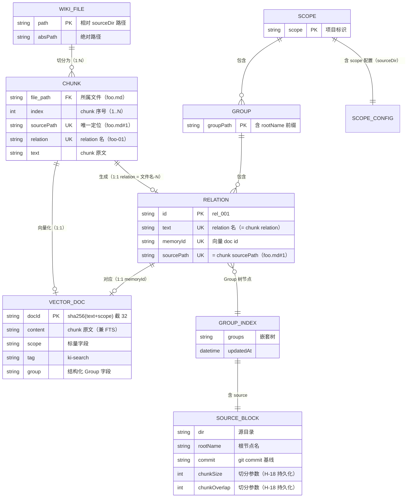
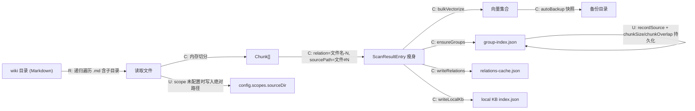
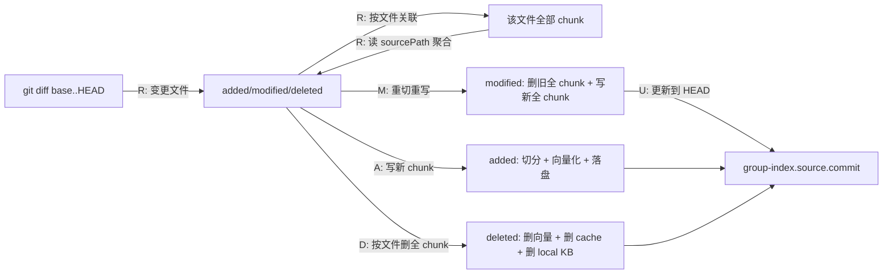
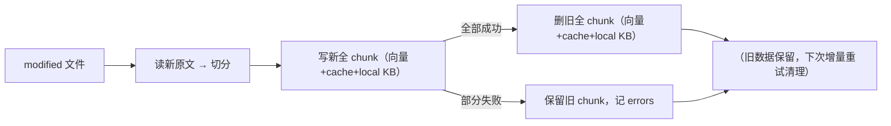
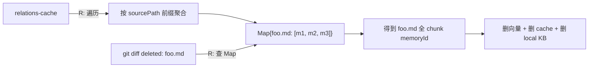
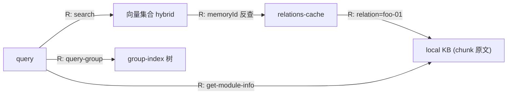

# 数据模型：外部Wiki直接导入与自动切分

> 场景类型：批处理（全量直导 + 增量直连）
> 状态：草案
> 关联需求：REQ-20260806-001（v7，15 条需求）

## 1. 实体清单

| 实体 | 说明 | 来源 | 场景类型 |
|------|------|------|----------|
| Wiki 源文件（Markdown） | 外部知识库目录中的 `.md` 文件 | 需求 H-01 | 批处理（输入） |
| **Chunk（内存实体）** | 大文档切分后的文本片段，不落盘为文件 | H-05/H-06 | 批处理（中间态） |
| 向量文档（doc） | zvec 集合中的向量条目，doc id = sha256(text+scope) 截 32 | 现有 | 批处理（写入） |
| relations-cache.json | 关系热缓存（Group → hot_relations） | 现有 | 简单 CRUD |
| local KB index.json | Group 级 Markdown 原文（moduleInfo） | 现有 | 简单 CRUD |
| group-index.json | Group 树 + source 块（含切分参数持久化） | 现有 + 扩展 | 简单 CRUD |
| 进度文件 import-progress.json | 断点续跑 | 现有 | 批处理（检查点） |
| scope 配置 sourceDir | 全量直导写入的绝对路径 | H-20 | 简单 CRUD |

**删除实体**（随本次改造移除）：ai-results.json（输入）、scan-pending/scan-index.json（scan 中间产物）、ai-results 备份（backupAiResults）、keywords 字段、isFullText 字段。

## 2. ER 图

### 字段说明

| 实体 | 字段 | 类型 | 约束 | 说明 |
|------|------|------|------|------|
| CHUNK | sourcePath | string | UK, 必填 | `foo.md#1`，文件↔chunk 关联键（REQ-08） |
| CHUNK | relation | string | UK, 必填 | `foo-01`，与 sourcePath 同源推导（H-06） |
| RELATION | sourcePath | string | UK | chunk 粒度唯一（REQ-08），支撑 diff 定位全 chunk |
| SOURCE_BLOCK | chunkSize | int | 首次导入完成后写入 | 切分参数，增量复用（H-18）；**缺失时回退默认 1000** |
| SOURCE_BLOCK | chunkOverlap | int | 首次导入完成后写入 | 切分参数，增量复用（H-18）；**缺失时回退默认 150** |
| SCOPE_CONFIG | sourceDir | string | 绝对路径 | 全量直导写入（H-20） |

## 3. 数据流图

### 3.1 全量直导（import --source）

| 流向 | 触发条件 | 操作 | 数据变化 | 备注 |
|------|----------|------|----------|------|
| wiki 目录 → Chunk | 文件 > chunk_size | C | 内存中切分，不落盘 | 递归字符切分（H-07） |
| Chunk → 向量 | bulkVectorize | C | doc id = sha256(text+scope) 截 32 | 幂等 upsert |
| Chunk → relations-cache | writeRelations | C | relation=`foo-01`，memoryId=docId | REQ-03 |
| Chunk → local KB | writeLocalKb | C | key=chunk relation（`foo-01`），value=chunk 原文 | **local KB 按 chunk relation 粒度存储** |
| group-index → source | recordSource | U | 持久化 commit + chunkSize/Overlap | H-18 |
| config → sourceDir | 直导完成 | U | 写绝对路径 | H-20 |

> **直导不触发 Wiki 写回**：import --source 只写本地 KB + 向量层，不调用 `writeBackToWiki`（避免 chunk 的 `{relation}.md` 污染外部源目录）。Wiki 写回仅由 sync-relation 单条写入触发。

### 3.2 增量直连（import --mode incremental）

| 流向 | 触发条件 | 操作 | 数据变化 | 备注 |
|------|----------|------|----------|------|
| git diff → added | 新文件 | A | 切分 + 向量化 + 写 cache/local KB | 同全量 |
| git diff → modified | 文件修改 | M | **先写新全 chunk → 全部成功后再删旧全 chunk**（写序见下方说明） | H-17 核心 + 质疑意见2 |
| git diff → deleted | 文件删除 | D | **按文件定位全 chunk（方案②聚合映射）→ 删向量 + cache + local KB** | H-17 |
| 全流程 → source.commit | 增量完成 | U | 更新到 HEAD | 失败不更新 |

**modified 写序（质疑意见2 修复）**——**先写新，后删旧**：

- **顺序**：新数据先就位（可检索），旧数据后清理（避免"先删后写"中断导致文件内容丢失）
- **失败语义**：写入部分失败 → 保留旧 chunk（不删），记 errors；配合"全部成功才更新 commit"，下次增量按新 diff 重试，最终收敛到新内容
- **幂等**：新 chunk doc id 确定性 → 重复写覆盖；旧 chunk 下次清理，无孤儿向量累积（至多残留到下次增量）

### 3.2.1 文件级 diff → chunk 定位机制（方案②）

**`buildMemoryIdMap` 改为多值映射**：`Map<文件path, memoryId[]>`，构建时遍历 relations-cache，按 `sourcePath` 前缀（`foo.md#`）聚合到文件级 key：

- **无新增数据文件**：复用 relations-cache（memoryId 已按 chunk 粒度写入，REQ-03）
- **构建开销**：O(N)（N=关系数），增量是低频操作，可接受
- **缓存**：构建后内存 Map 复用（与现有 `relation-map` 的 TTL 缓存策略一致）
- **查询**：O(1) 命中

**构建时机与失效策略（质疑意见1 修复）**：
- **构建时机**：每次增量调用（`import --mode incremental`）开始时**现场从当前 relations-cache 重建**——保证 Map 反映最新 cache 状态，杜绝"基于过期数据定位"导致删漏 chunk
- **失效触发点**：relations-cache 的**三个写入路径**都会使缓存过期，下次增量自动重建（无需显式失效）：
  - `sync-relation` 写入关系
  - `delete-relation` 删除关系
  - `boundaryDecay` 冷门衰减移除
- **一致性保证**：增量是低频操作，每次现场重建的开销（O(N)）可接受；不引入独立索引文件的"一致性维护"负担

> 选型依据（评审 #1/#2 修复 + 质疑意见1）：方案①（独立"文件→chunk"索引）需新增数据文件并维护一致性，与"删除实体最小化"原则冲突；方案②不新增文件，纯内存计算，增量低频场景下"每次现场重建"成本可忽略。**采用方案② + 每次现场重建。**

### 3.3 检索/查询流（改造后）

| 流向 | 触发条件 | 操作 | 数据变化 | 备注 |
|------|----------|------|----------|------|
| search → relations-cache | 命中反查 | R | 附加 group/relation（无 keywords/isFullText） | REQ-05/09 |
| get-module-info | 索引直查 | R | 返回 chunk 原文 | relation=`foo-01` 定位 chunk |

## 4. 场景分析（批处理）

| 分析维度 | 设计 | 说明 |
|----------|------|------|
| **管道设计** | 遍历目录 → 读文件 → 内存切分 → bulkVectorize → ensureGroups → writeRelations → writeLocalKb → recordSource | 5-Phase 复用，Phase 1 从"读 ai-results"改为"读文件+切分" |
| **批次大小** | 复用 bulkVectorize（一次 bulkStore 多条目）；切分参数 chunk-size 默认 1000 字符 | REQ-07 |
| **检查点** | 复用 progress 文件（full 模式断点续跑）；增量无进度文件（文件级幂等，可重跑） | 现有机制 |
| **错误处理** | 单文件切分/向量化失败记入 errors 不中断；delete 缺 memoryId 记 errors；增量全部成功才更新 commit | 现有机制 |
| **幂等** | doc id 确定性（sha256(text+scope)）→ 重复导入覆盖；增量 modified 全 chunk 覆盖可重跑 | 关键保证 |
| **并发** | 向量写入由引擎单例串行化（serializeEngineOp）+ CLI 进程单持锁；**CLI per-call 结束调用 `closeEngine` 释放向量锁** | 现有，不新增 |

## 5. 关键设计决策（数据视角）

| # | 决策 | 依据 | 影响实体 |
|---|------|------|----------|
| D-1 | **1 文件 → N chunk → N memoryId**，relation=`文件名-N`、sourcePath=`文件#N` | H-06/H-17 | CHUNK / RELATION / VECTOR_DOC |
| D-2 | **文件级 diff 通过 `buildMemoryIdMap` 多值映射定位全 chunk（方案②）**：`Map<文件path, memoryId[]>`，遍历 relations-cache 按 sourcePath 前缀聚合；diff 给 `foo.md` → O(1) 查全 chunk memoryId | H-17 | diff / relations-cache |
| D-3 | **modified 全 chunk 覆盖更新**（不做 chunk 级 diff 精确定位） | H-17（用户确认） | 增量链路 |
| D-4 | **切分参数持久化到 source 块**，增量复用 | H-18 | SOURCE_BLOCK |
| D-5 | **全量直导写 scope sourceDir（绝对路径）**，增量免传 | H-20 | SCOPE_CONFIG |
| D-6 | **删除 keywords / isFullText / ai-results / scan / from-results / migrate-keywords** | H-08~11, H-15/16/21 | 删除实体 |
| D-7 | **content 纯化**：向量 content = chunk 原文（无 `[摘要]/[关键词]/[路径]` 前缀） | H-02 | VECTOR_DOC.content |
| D-8 | **切分参数变更语义（质疑意见3 + 场景推演 #2/#3 修复）**：`--mode full` 全量重导**允许更新 chunk-size**（按新参数对受影响文件整体重切，文件级全量覆盖天然兼容）；`--mode incremental` **永远用 source 块持久化值**（命令行传参忽略）；首次导入时命令行参数写入 source 块 | H-18 + 质疑意见3 + 推演修复 | SOURCE_BLOCK |
| D-9 | **无 git 仓库时增量明确报错（场景推演 #1 修复）**：`--mode incremental` 检测 `--source` 不在 git 仓库 → 报错（提示 git init 或改用 --mode full），不做静默降级全量 | H-25 + 推演修复 | 增量入口 |

## 6. 待确认事项

| 编号 | 事项 | 影响范围 | 状态 |
|------|------|----------|------|
| P-1 | ~~sourcePath 聚合实现~~ → **已定方案②**：`buildMemoryIdMap` 改多值 `Map<文件path, memoryId[]>`，遍历 relations-cache 按前缀聚合；详见 §3.2.1 | diff 性能 | ✅ 已解决（评审 #1/#2） |
| P-2 | local KB 按 chunk 存（key=`foo-01`）后，`get-module-info` 输入是 chunk relation；如需"读整篇"需额外能力（本次不做，标注） | 检索体验 | 已接受 |
| P-3 | **进度文件适配（质疑意见4 修复）**：**进度跳过的最小粒度定为文件级**——一个文件要么全部 chunk 完成（标记 done），要么视为未完成（中断后该文件整体重来），避免"跳过已写 5/10 chunk 但 cache 不完整"的数据不一致；chunk 级 `{sourcePath: "foo.md#1", file: "foo.md", index: 1}` 字段仅用于进度展示与统计，不作为跳过依据 | 断点续跑 | ✅ 已定（文件级跳过 + chunk 级展示） |
| P-4 | **向量 doc 的 `group` 标量字段已明确**：`VECTOR_DOC.group = deriveGroupPath(文件路径)`（原文件目录推导的 groupPath），与 chunk relation 后缀（`-01`）解耦 | VECTOR_DOC.group | ✅ 已明确 |
| P-5 | **scan-index.json 消费方清点（质疑意见5 修复）**：技术设计阶段 `grep -rn "scan-index\|getScanIndexPath" src/` 全量清点，逐点确认删除或改为 null 安全（避免删除 scan 子命令后遗留引用读 null） | 删除链路完整性 | 待技术设计处理 |
| P-6 | **全文 FTS 规模评估（质疑意见6 修复）**：技术设计阶段补充量化基准——1000 文件全量直导（content=chunk 原文）的 BM25 索引构建时间 / 存储膨胀 / 检索延迟实测；必要时调整 chunk-size 默认值 | 性能 | 待技术设计处理 |
| P-7 | **超大文件 chunk 数上限（质疑补充场景5）**：**建议方向**——保留单文件大小上限（复用 `MAX_SCAN_FILE_SIZE` 或改默认 2MB，超限跳过并告警"文件过大已跳过，可手动切分后导入"）；同时设单文件 chunk 数上限（如 500 chunk，超限告警）防向量爆炸 | 单文件规模 | 已定方向（技术设计确认数值） |

## 7. 质量自检

✅ 所有核心实体（Chunk / RELATION / VECTOR_DOC / SOURCE_BLOCK / relations-cache / local KB / group-index）都有 ER 图表示
✅ 实体关系基数标注正确（WIKI_FILE 1:N CHUNK，CHUNK 1:1 RELATION/VECTOR_DOC）
✅ 关键字段（PK/FK/UK/必填）已标注
✅ 数据流图覆盖全量直导 / 增量直连 / 检索查询三大核心操作
✅ 每条数据流都有 CRUD 标注
✅ 批处理场景：管道设计、批次、检查点、错误处理、幂等已定义
✅ 并发场景标注：复用现有串行化机制 + closeEngine 释放
✅ 评审修复：文件级 diff → chunk 定位机制（方案②）已明确（§3.2.1）；local KB 存储模型已明确；直导不触发 wiki 写回已标注；进度文件字段方向已定
✅ 质疑修复（challenger）：Map 构建时机/失效策略（意见1）、modified 写序原子性（意见2）、切分参数变更语义 D-8（意见3）、进度文件级跳过粒度（意见4）、scan 消费方清点 P-5（意见5）、FTS 规模评估 P-6（意见6）均已补充
✅ 推演修复（scenario-rehearsal）：无 git 增量明确报错 D-9（推演 #1）、切分参数变更语义 full/incremental 双模式 D-8 更新（推演 #2/#3）、超大文件上限方向 P-7（推演 #4）

---

**下一步建议**：将数据模型文档传递给 `design-craft` 进行技术设计（重点：P-5/P-6/P-7 数值确认、切分器实现、增量写序实现）。
