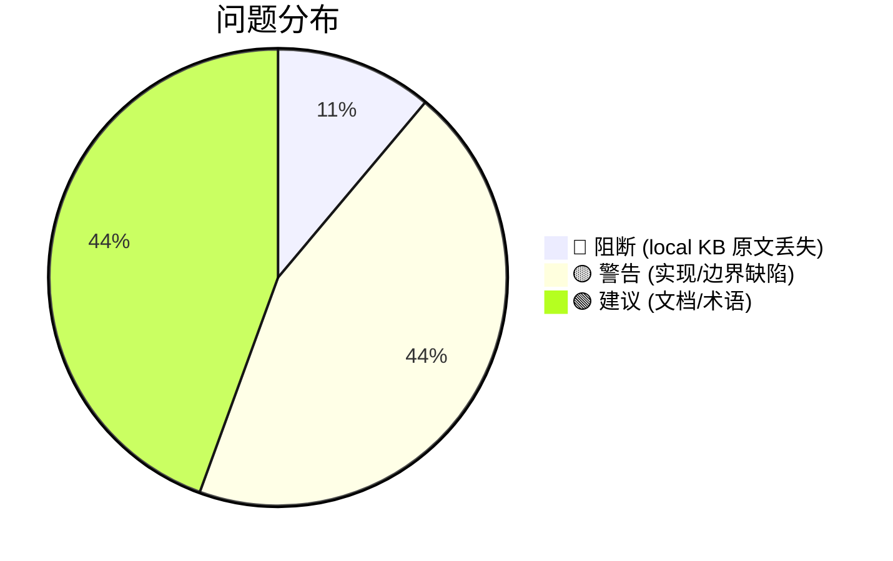

# 场景推演结果展示：数据清洗方案（REQ-06/07）

> 推演时间：2026-08-07（v2，基于源码核实修正）
> 推演对象：设计文档模式（reference/code-survey.md 清洗方案 + requirement.md REQ-06/07）
> 输入文档：`.requirements/2026-08-07-向量库导入中断防护与自愈/requirement.md`、`reference/code-survey.md`
> 修正说明：v1 报告 S6 误判"local KB 存未清洗原文"，经源码核实（`import.ts:479-486`）发现 local KB 实际存 chunk text（清洗后），S6 结论反转；本次补充 1 个 🔴 阻断 + 2 个 🟡 警告

## 0. 全局理解声明

🌍 **全局理解声明**
- **业务目标**：向量化前清洗 Markdown 原文（BOM/frontmatter/mermaid/路径/代码块/空 chunk），提升检索质量、省 embedding 成本；支持自定义清洗钩子
- **系统位置**：`scan-kb import`（full/incremental）→ `readFileToChunks` → **[清洗]** → `splitIntoChunks` → chunk.text 同时流向 ①向量化 content ②local KB（`phase4WriteRelations` 用 `e.text`，因 `e.path` 含 `#N` 导致原文路径不存在、降级用 chunk text）
- **整体成功判据**：① 清洗不破坏检索可用性；② `--no-clean` 逃生阀必达；③ 钩子容错不阻断导入；④ 清洗与原文返回解耦（local KB 须保留原文供 REQ-20260807-002 召回）；⑤ 零新增依赖；⑥ 不误伤正文（frontmatter/路径剥离的边界防护有效）

## 1. 角色清单

| # | 角色 | 类型 | 职责 | 来源 |
|---|------|------|------|------|
| 1 | CLI 使用者 | 用户 | 运行 `scan-kb import`，期望清洗生效/可关闭 | requirement §2.3 |
| 2 | 配置者 | 用户 | 配置 `clean.rules`/`clean.hooks` | requirement REQ-07 |
| 3 | 向量检索（search） | 程序（下游消费方） | 消费清洗后向量 content | AGENTS.md ki-search |
| 4 | local KB 召回（get-module-info / REQ-002 原文返回） | 程序（下游消费方） | 期望从 local KB 取**原文** | requirement REQ-06 验收 + REQ-002 |
| 5 | 增量链路（incremental.ts） | 程序 | 复用 `readFileToChunks`，清洗自动生效 | incremental.ts:56,220 |
| 6 | 文件系统/编码环境 | 环境 | BOM/乱码/钩子失败/超时 | requirement §2.7 |

## 2. 推演矩阵 + 启用策略 profile

🎯 **启用策略 profile**
- ✅ 新增功能类（命中：新增 `cleanMarkdownText` + `clean.ts` 模块 + 清洗规则）
- ✅ 重构/迁移类（命中：行为变更默认开启、`--no-clean` 回退、incremental 一致性、cleanVersion 兼容）
- ➖ 未启用：批处理/同步类（本次只看清洗这一环）

📋 **推演矩阵**（场景 × 设计点）

| 场景 \ 设计点 | 落点(readFileToChunks) | BOM/控制字符 | frontmatter 剥离 | 路径剥离正则 | mermaid/代码块 | 空 chunk 过滤 | --no-clean | incremental 复用 | local KB 原文保留 |
|--------------|:---:|:---:|:---:|:---:|:---:|:---:|:---:|:---:|:---:|
| S1 正常导入 | ✅ | ✅ | ✅ | ✅ | ✅ | ✅ | - | ✅ | 🔴 B1 |
| S2 噪声文档(API安全.md) | ✅ | ✅ | 🟡 B2 | 🟡 B3 | ✅ | ✅ | - | ✅ | 🔴 B1 |
| S3 逃生阀 | ✅ | - | - | - | - | - | ✅ | ✅ | - |
| S4 钩子容错 | ✅ | - | - | - | - | - | ✅ | ✅ | - |
| S5 增量一致 | ✅ | ✅ | ✅ | ✅ | ✅ | ✅ | - | 🟡 B4 | 🔴 B1 |
| S6 原文解耦(REQ-002) | - | - | - | - | - | - | - | - | 🔴 B1 |
| S7 边界(空文件/单文件名引用) | ✅ | ✅ | 🟡 B2 | ✅ | ✅ | 🟡 B5 | - | ✅ | - |

## 3. 场景推演详情

### S1 正常导入（Happy Path）

【执行者】CLI 使用者
【数据走向】
| 步骤 | 操作 | 数据流向 | 验证结果 | 问题 |
|------|------|----------|---------|------|
| 1 | `readFileToChunks` 读原文 | `fs.readFileSync` → 原文 | ✅ | - |
| 2 | `cleanMarkdownText` 清洗 | 原文 → 清洗后 text | ✅ BOM/frontmatter/mermaid 剥离 | - |
| 3 | `splitIntoChunks` | 清洗后 text → chunks | ✅ | - |
| 4 | 向量化 | `chunk.text`（清洗后）→ 向量 content | ✅ 符合 REQ-06 验收 | - |
| 5 | local KB 写入 | `e.text`（清洗后 chunk.text）→ local KB | 🔴 B1 | 见下 |

【关键设计点验证】
| # | 设计点 | 验证问题 | 验证结果 | 证据 | 严重度 |
|---|--------|---------|---------|------|:------:|
| B1 | local KB 原文保留 | 清洗后 local KB 是否仍存原文？ | ❌ 失败 | `import.ts:479-486`：`e.path`=`文件#N`（`deriveChunkSourcePath` import.ts:157-159），`path.resolve(sourceDir, 'docs/foo.md#1')` 不存在 → `fs.existsSync` false → 走 else `moduleInfo = e.text` = chunk.text（清洗后）。两链路一致：full（import.ts:482）与 incremental（incremental.ts:382 `writeLocalKb(..., en.text)`）均写 chunk.text | 🔴 |
| - | 落点准确性 | 清洗落点是否在 readFileToChunks 内、splitIntoChunks 前？ | ✅ 通过 | `import.ts:162-164` readFileToChunks 当前直接 `fs.readFileSync`→`splitIntoChunks`，无清洗（缺口确认）；设计在此插入 cleanMarkdownText 正确 | - |
| - | incremental 复用 | 增量链路是否自动生效清洗？ | ✅ 通过 | `incremental.ts:56` `import { readFileToChunks } from './import.js'`；`incremental.ts:220` chunkifyFile 调用 readFileToChunks → 同函数同清洗 | - |

【推演结论】
- 数据走向：5 项，4 通过 / 1 失败（B1）
- 全局回扣：🔴 B1 **破坏全局成功判据④**（清洗与原文返回解耦）—— local KB 被清洗，REQ-20260807-002（返回原文支持）的前提假设"local KB 存原文"不成立。局部（向量清洗）通过但破坏全局（原文召回链路），按 🔴 记录
- 证据性质：推演结论（基于源码推理，未实际执行）

### S2 噪声文档（含 frontmatter + mermaid + file:// + 代码路径）

【执行者】CLI 使用者
【关键设计点验证】
| # | 设计点 | 验证问题 | 验证结果 | 证据/推演 | 严重度 |
|---|--------|---------|---------|---------|:------:|
| B2 | frontmatter 剥离防误伤 | 正文 `---` 分隔线是否被误剥？闭合 `---` 后是否校验行尾？ | ⚠️ 部分通过 | 设计已加键值对校验（`/^[A-Za-z_-]+:\s*\S/m`）降低误伤概率；但 `t.indexOf('\n---', 3)` 找闭合时**未校验 `---` 后紧跟行尾/EOF**，`---important` 类边界（`---` 后紧跟非换行内容）会被误判为闭合。实际 Markdown 罕见但属边界缺陷 | 🟡 |
| B3 | 路径剥离正则 ④ 误伤 | `https://github.com/foo/bar.ts` 类 URL 是否被误剥？ | ⚠️ 存疑 | 正则 ② 只剥 `file://` URL；正则 ④ `[\w./-]*\/[\w./-]+\.(py|ts...)` 不区分 URL 中的路径 → `github.com/foo/bar.ts` 被匹配剥离，残留 `https://`（无意义片段，正则 ⑤ 不删因非纯符号）。设计文档（code-survey.md:71）声称"误伤防护：单文件名默认保留"，但未覆盖 URL 路径误伤 | 🟡 |
| - | mermaid 剥离 | `/```mermaid[\s\S]*?```/g` 是否误伤？ | ✅ 通过 | 非贪婪匹配 + `g` 多块逐个；未闭合时不匹配保留原样（安全降级） | - |
| - | 剥离顺序 | md 链接 → file:// → 行号 → 裸路径 → 删空行，顺序是否正确？ | ✅ 通过 | 先剥链接目标保留文字，避免残留 `[text]()`；code-survey.md:70 已论证 | - |

【推演结论】
- 关键设计点：4 项，2 通过 / 2 存疑（B2/B3）
- 全局回扣：B2/B3 不破坏全局判据，属实现细节缺陷，补充正则即可

### S3 逃生阀（--no-clean / enabled:false）

【执行者】CLI 使用者 / 配置者
【验证】`enabled:false` 等效 `--no-clean`，连 hooks 一起关闭 ✅；关闭后 `readFileToChunks` 走原始路径（不调 cleanMarkdownText）✅
【问题】G2：外链 URL 剥离副作用（设计预期剥离 URL）需 docs 说明可回退 🟢
【推演结论】逃生阀链路成立 ✅

### S4 钩子容错（外部脚本失败/超时）

【执行者】配置者 / 环境
【验证】钩子非零退出/10s 超时 → 跳过 + 告警 + 记 skipped，不阻断导入 ✅
【问题】G1：超时后子进程清理（SIGKILL 兜底）未在设计中明确 🟢
【推演结论】容错链路成立 ✅

### S5 增量一致性（incremental 复用 + cleanVersion）

【执行者】增量链路
【关键设计点验证】
| # | 设计点 | 验证问题 | 验证结果 | 证据/推演 | 严重度 |
|---|--------|---------|---------|---------|:------:|
| B4 | cleanVersion 持久化 | 清洗规则升级后，存量数据是否自动重洗？ | ⚠️ 存疑 | 增量 diff 基于 git 文件内容（非 chunk content），规则变更**不触发 diff** → 存量未改文件保留旧清洗结果，新增/修改文件用新规则 → 同一 source 清洗风格不一致。code-survey.md:120 建议"source 块记录 cleanVersion（可选）"，但**可选非强制**，不记录则静默混用 | 🟡 |
| - | incremental 复用 | 增量是否自动生效清洗？ | ✅ 通过 | incremental.ts:56,220 复用 readFileToChunks | - |
| - | local KB 一致性 | 增量 local KB 是否也被清洗？ | 🔴 同 B1 | incremental.ts:382 `writeLocalKb(..., en.text)` 用 chunk.text | 🔴(同B1) |

【推演结论】复用链路成立，但 cleanVersion 非强制 + local KB 同 B1

### S6 与原文返回解耦（REQ-20260807-002）

【执行者】local KB 召回（get-module-info / REQ-002 原文返回）
【关键设计点验证】
| # | 设计点 | 验证问题 | 验证结果 | 证据 | 严重度 |
|---|--------|---------|---------|------|:------:|
| B1 | local KB 原文保留 | 清洗后 local KB 是否仍存原文供 REQ-002 召回？ | ❌ 失败 | 见 S1 B1 证据。REQ-002 方案（AGENTS.md）假设"local KB 存原文"，实际 local KB = chunk.text（清洗后）。两需求存在数据契约冲突：REQ-06 清洗改变 local KB，REQ-002 期望 local KB 是原文 | 🔴 |
| - | 解耦设计 | 清洗是否仅作用于向量 content、不影响 local KB？ | ❌ 失败 | 设计落点（readFileToChunks 内）使 chunk.text 被清洗，而 chunk.text 同时用于向量化 + local KB 写入，无法只影响前者 | 🔴 |

【推演结论】
- 关键设计点：2 项均失败
- 全局回扣：🔴 **破坏全局成功判据④**。v1 报告误判为 ✅，本次基于源码核实反转
- 证据性质：推演结论（基于源码推理）

### S7 边界（空文件 / 单文件名引用 / 超大文件）

【执行者】CLI 使用者
【关键设计点验证】
| # | 设计点 | 验证问题 | 验证结果 | 证据/推演 | 严重度 |
|---|--------|---------|---------|---------|:------:|
| B5 | 空 chunk 过滤 | 空文件/0 chunk 的统计归属？ | ⚠️ 存疑 | `splitIntoChunks` 空文本返回 `[]`（chunker.ts:61），清洗后 0 chunk → 统计 skipped 还是 total=0 未定义，进度分母含混 | 🟡 |
| - | 单文件名引用 | "参见 README.md" 是否被误剥？ | ✅ 通过 | 正则 ④ 要求路径含 `/`，`README.md` 不匹配（code-survey.md:71） | - |
| - | keepShortSamples 行数阈值 | 文档 ≤15 行 vs 实现 `<= 17` 是否一致？ | ✅ 通过(实现正确) | code-survey.md:82 `m.split('\n').length <= 17` 含开闭 fence 两行 = 内容 ≤15 行，文档"≤15 行"指内容，实现一致；仅表述需对齐 | 🟢 |
| - | 调研文档精确性 | code-survey.md 对 collectMarkdownFiles 描述是否准确？ | ✅ 通过(轻微) | code-survey.md:20 称"2MB/500chunk 在 collectMarkdownFiles"，实际在 handleDirectImport（import.ts:211,217）；不影响清洗方案 | 🟢 |

## 4. 问题汇总

| # | 类型 | 场景 | 问题描述 | 功能影响（预期 → 实际） | 建议 | 严重度 |
|---|------|------|---------|------------------------|------|:------:|
| 1 | 数据问题/全局破坏 | S1/S5/S6 | 调研文档 §5 建议"清洗落点在 readFileToChunks 内"错误——该落点使清洗后 chunk.text 流向 local KB（phase4WriteRelations 因 e.path 含 `#N` 降级用 e.text=chunk.text），违背"清洗只作用于向量化"原则，破坏 REQ-002 原文召回前提 | 预期：local KB 存原文 chunk，清洗后数据只去向量化 → 实际：清洗插在 readFileToChunks 内 → chunk.text 被清洗 → local KB 也存清洗后文本 | **方案 C（用户澄清确认）**：`readFileToChunks` **不内嵌清洗**，返回原文 chunk（local KB 用原文 chunk.text，phase4/incremental 现状不改）；清洗移到**向量化前**——`handleDirectImport` 在 `bulkVectorize` 前 `entries.map(e => ({...e, text: cleanMarkdownText(e.text)}))`，`incremental.ts:367` 同步。调研文档 §5 落点建议需修订为"向量化前清洗" | 🔴 |
| 2 | 流程缺陷 | S5 | cleanVersion 可选非强制，规则升级后新旧混用 | 预期：同一 source 清洗一致 → 实际：规则变更不触发 diff，存量保留旧清洗，新增用新规则，风格不一致 | source 块**强制**持久化 cleanVersion；规则变更时增量检测到 cleanVersion 不匹配 → 提示全量重导（同 D-8 机制） | 🟡 |
| 3 | 遗漏场景 | S2/S7 | frontmatter 闭合 `---` 后未校验行尾/EOF | 预期：仅删合法 frontmatter → 实际：`---important` 类边界（`---` 后跟非换行内容）被误判为闭合 | 闭合判定补充：`---` 后须紧跟 `\n` 或 EOF；保留键值对校验 | 🟡 |
| 4 | 遗漏场景 | S2 | 路径剥离正则 ④ 误伤 HTTP/HTTPS URL 中的路径 | 预期：只剥 file:// 与裸代码路径 → 实际：`https://github.com/foo/bar.ts` 中 `github.com/foo/bar.ts` 被剥，残留无意义 `https://` | 正则 ④ 前置排除：跳过 `https?://`/`ftp://` 等 URL 中的路径；或先剥 URL 整体再处理裸路径 | 🟡 |
| 5 | 遗漏场景 | S1/S7 | 空文件/0 chunk 统计归属未定义 | 预期：明确计入 skipped → 实际：0 chunk 时统计/进度分母含混 | 空文件记 skipped + REQ-05 O-01 分母以清洗后 chunk 数为准 | 🟡 |
| 6 | 遗漏场景 | S4 | 钩子超时后子进程清理未明确 | 预期：超时释放 → 实际：可能留僵尸进程 | spawn kill 兜底（SIGKILL）+ exited 事件确认 | 🟢 |
| 7 | 需求缺口 | S3 | 外链 URL 剥离副作用未文档化 | 预期：引用类 Wiki 可回退 → 实际：URL 信息丢失 | docs 说明 + 可配保留 | 🟢 |
| 8 | 需求缺口 | 全局 | REQ-07 依赖 REQ-06 框架，depends_on 未标注 | 预期：实施顺序明确 → 实际：无依赖声明 | requirement.md 补 depends_on | 🟢 |
| 9 | 术语一致性 | S7 | keepShortSamples 文档"≤15 行"vs 实现 `<= 17` 表述需对齐 | 预期：文档与实现一致 → 实际：表述歧义（实为内容 ≤15 行 + fence 2 行） | 文档统一表述为"内容 ≤15 行（含 fence 共 ≤17 行）" | 🟢 |

统计：🔴 1 / 🟡 4 / 🟢 4

## 5. 推演结论

### 整体评估
- 推演覆盖：6 个角色 / 7 个场景
- 问题发现：🔴 1 / 🟡 4 / 🟢 4



### 评审结论
| 条件 | 结论 |
|------|------|
| 存在 ≥1 个 🔴阻断 | ❌ 不通过 |
| 无 🔴阻断，但存在 ≥1 个 🟡警告 | ⚠️ 有条件通过 |
| 仅存在 🟢建议或无问题 | ✅ 通过 |

**结论**：❌ **不通过**。核心阻断 B1（local KB 存清洗后 chunk.text 非原文）破坏全局成功判据④"清洗与原文返回解耦"，并与 REQ-20260807-002 数据契约冲突。该问题源于清洗落点（readFileToChunks 内）使 chunk.text 同时流向向量 content 与 local KB，设计假设"清洗只影响向量 content"经源码核实不成立。

清洗规则本身（BOM/控制字符/frontmatter/mermaid/代码块/路径/空 chunk）的正则设计与逃生阀、钩子容错链路**可行**；阻断不在清洗规则，而在清洗结果的数据流向未与 local KB 解耦。**推演结论（未实际执行）**。

### 下一步建议
1. **采纳方案 C 修复 🔴 B1**（用户澄清确认方向）：`readFileToChunks` **不内嵌清洗**（返回原文 chunk，local KB 用原文 chunk.text，phase4/incremental 现状不改）；清洗移到**向量化前**——`handleDirectImport` 在 `bulkVectorize` 前 `entries.map(e => ({...e, text: cleanMarkdownText(e.text)}))`，`incremental.ts:367` 同步清洗。调研文档 §5 落点建议（readFileToChunks 内清洗）需修订为"向量化前清洗"。修复后 S6 解封
2. 修复 4 个 🟡：cleanVersion 强制持久化（B4）、frontmatter 闭合行尾校验（B3）、URL 路径前置排除（B4）、空文件统计归属（B5）
3. 正则可执行性建议用 demo-verify 跑真实 fixture（含 BOM/frontmatter/`https://` URL/file:// 路径噪声）获取执行性证据
4. 修复 B1 后建议用增量推演模式（仅重推 S1/S5/S6 与 B1 相关场景，其余沿用本轮结论）
