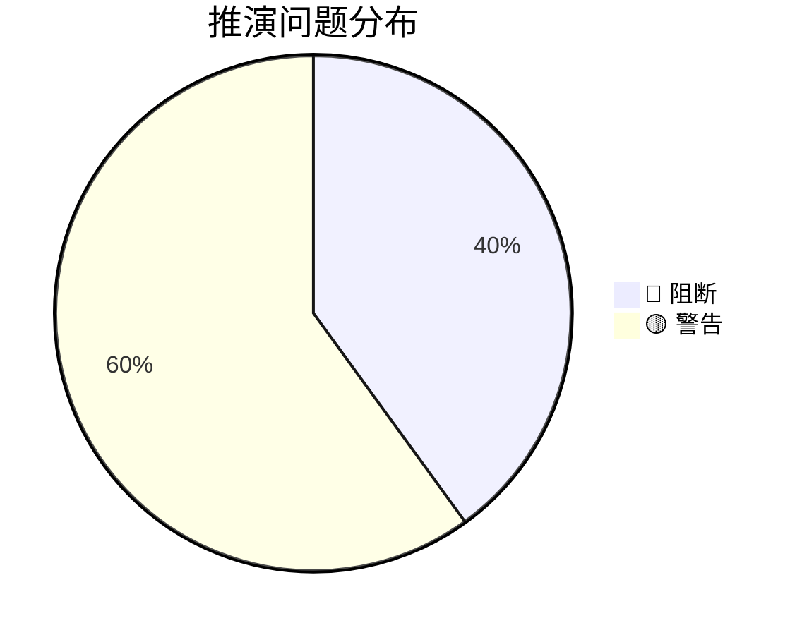
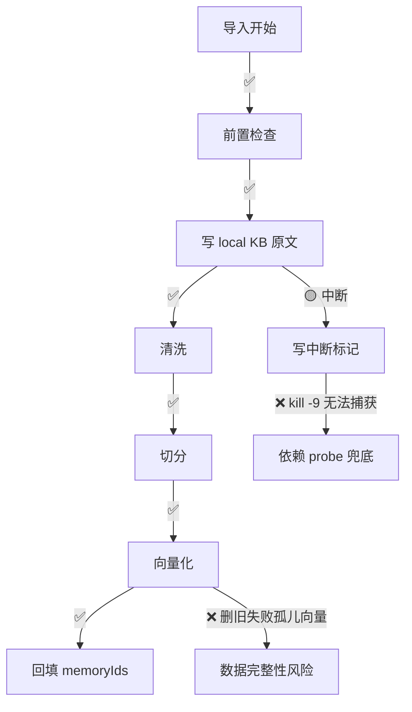

# 场景推演结果：向量库导入中断防护与自愈（方案 D）

> 推演时间：2026-08-08
> 推演对象：需求文档模式（输入仅 requirement.md v7，设计未开始）
> 输入文档：`.requirements/2026-08-07-向量库导入中断防护与自愈/requirement.md`
> 证据性质：推演结论（基于文档推理，未实际执行）

## 1. 全局理解声明 + 角色清单

### 全局理解

- **业务目标**：导入中断后向量库可识别、可恢复、可引导；导入内容（清洗+原文一对多）可靠；search 可返回原文
- **系统位置**：scan-kb import（上游：外部 Wiki/md 文件）→ 清洗+切分+向量化+local KB → ki search/doc/get-module-info（下游消费方）
- **整体成功判据**：
  - 中断后无不可恢复脏库（REQ-01/02/03 闭环）
  - 数据一致性：local KB 原文 ↔ 向量 chunk 映射不出现"新原文+旧向量"错配（P-2 事务顺序）
  - 无悬空数据：有原文无向量 / 有向量无原文（hook 回滚、冲突跳过、原文降级）
  - search 原文召回正确且去重（REQ-09）
  - 不破坏正常导入路径（兼容性约束 §2.7）

### 角色清单

| # | 角色 | 类型 | 权限层级 | 职责 | 来源 |
|---|------|------|---------|------|------|
| 1 | CLI 使用者 | 用户 | 已登录 | 运行 scan-kb import / ki search / rebuild-vector | §2.3 |
| 2 | 脚本维护者 | 用户 | 已登录 | 非 TTY 环境下自动化调用 ki 命令 | §2.3 |
| 3 | 导入进程 | 程序 | — | scan-kb import 执行导入（含 SIGINT/SIGTERM 处理） | REQ-01 |
| 4 | 外部清洗钩子 | 程序 | — | config 注入的外部脚本（stdin→stdout 管道） | REQ-07 |
| 5 | zvec 向量库 | 环境 | — | 向量存储；probe/写入的失败方（crash residue/recovery 冲突） | §1 事故背景 |
| 6 | embedding 服务 | 环境 | — | 向量化外部依赖（网络超时/失败可能） | §2.7 性能 |

## 2. 推演矩阵 + 策略识别

需求文档模式：**不启用设计 profile**，使用 requirement.md 策略的 6 维度全集（场景完整性 / 验收标准可达性 / 需求一致性 / 角色-需求对齐 / 边界异常覆盖 / 术语一致性）。

### 场景清单

| 场景 | 描述 | 覆盖维度 |
|------|------|---------|
| S1 正常导入 | 前置检查→写 local KB→清洗→切分→向量化→回填 | 场景完整性、验收可达性 |
| S2 中断导入 | Ctrl+C/kill → 状态标记 + 引导 | 边界异常覆盖、验收可达性 |
| S3 中断后使用 | getEngine 检测标记 → 引导 | 场景完整性、需求一致性 |
| S4 损坏库自愈 | rebuild-vector 重建 → 检索完整 | 场景完整性 |
| S5 原文召回 | search 命中→反查→返回原文去重 | 需求一致性、验收可达性 |
| S6 原文召回失败 | originalRetrieved:false + originalHint | 边界异常覆盖 |
| S7 增量 modified | 新向量→更新原文→删旧 | 需求一致性、边界异常覆盖 |
| S8 增量 deleted | local KB 与向量一并清除 | 场景完整性 |
| S9 --no-vector | 仅跳向量化，local KB 照写 | 需求一致性、边界异常覆盖 |
| S10 清洗 hook 失败 | 回滚 local KB + skipped | 边界异常覆盖、需求一致性 |
| S11 格式/大小/冲突 | 非 md / >1MB / 同 group 同名跳过 | 边界异常覆盖 |
| S12 并发/竞态 | 双导入 / 导入中查询 | 边界异常覆盖 |

## 3. 场景推演详情

### S1 正常导入（Happy Path）

【数据走向验证】6 项通过（前置检查→local KB→清洗→切分→向量化→回填均符合设计）。
【需求质量】场景完整性 ✅、验收可达性 ✅。
【结论】✅ 通过，正常路径满足兼容性约束。

### S2 中断导入

【需求质量验证】
- **边界异常覆盖 🔴**：REQ-01 捕获 SIGINT/SIGTERM 与 REQ-04 测试 kill -9 矛盾——**SIGKILL 无法被捕获**，状态标记写不出来。中断恢复实际依赖"REQ-02 标记检测（SIGTERM/SIGINT 可写）+ REQ-03 probe residue 检测（SIGKILL 兜底）"双路径，但需求未明示。
- **验收可达性 🔴**：REQ-04"kill -9 → 引导"依赖 probe 兜底，probe 稳定性未保证。

【结论】🔴 问题 1。若实现只做信号捕获、忽略 SIGKILL，则 kill -9 中断后无标记、probe 不稳定 → 数据完整性风险重现（事故源头）。

### S3 中断后使用 + S4 自愈

【需求质量验证】
- **边界异常覆盖 🟡**：中断标记生命周期未定义——重建/成功导入后是否清除标记？若不清除，任何后续命令反复引导（噪音），违反 §2.7 可观测性。
- 场景完整性 ✅（REQ-02+03+04 链路完整）。

【结论】🟡 问题 2。

### S5 原文召回 / S6 原文召回失败

【需求质量验证】需求一致性 ✅（REQ-09 与 REQ-06 第 5 步去重一致）、验收可达性 ✅、降级路径 ✅（含 sync-relation 兼容 S-3）。
【结论】✅ 通过（S6 依赖 S3 标记生命周期——local KB 不完整时原文获取失败频繁触发 originalHint）。

### S7 增量 modified + S8 deleted

【需求质量验证】
- **边界异常覆盖 🔴**：P-2 三步事务（写新向量→更新原文→删旧）中，**第三步"删旧"失败时的 memoryIds 字段一致性未定义**——先更新字段后删旧失败 → 孤儿向量（旧 id 残留库中）；删旧成功后更新字段 → 删旧基于哪个 id 列表未定义。
- **验收可达性 🔴**：测试方案（第 287 行）只验证"旧向量删除正确"，未覆盖"删除失败"的中间态孤儿向量。

【结论】🔴 问题 3。孤儿向量破坏数据完整性判据（search 命中孤儿 → relation-map 反查不到 → 原文降级噪音）。

### S9 --no-vector

【需求质量验证】需求一致性 ✅（KB 必写、memoryIds 空）。**边界异常覆盖 🟡**：与正常导入混用同 scope 的语义未定义（既有已知边界，方案 D 下未细化）。
【结论】🟡 问题 4。

### S10 清洗 hook 失败

【需求质量验证】✅ 通过。C-1 差异清晰（内置失败降级原文 vs hook 失败回滚跳过）；回滚时序自洽（local KB 第 1 步已写、hook 第 2 步失败回滚删除）。

### S11 格式/大小/冲突

【需求质量验证】✅ 通过。三类跳过 + 反馈可判定。

### S12 并发/竞态

【需求质量验证】**边界异常覆盖 🟡**：
- 两导入并发写同 scope relation-cache/local KB → 覆盖冲突（ki 有 mcp lock，CLI 直接跑是否加锁未说明）
- 导入中 search 读半写状态（部分文件向量化）语义未定义

【结论】🟡 问题 5。

## 4. 问题汇总

| # | 类型 | 角色 | 场景 | 问题描述 | 功能影响（预期 → 实际） | 建议 | 严重度 |
|---|------|------|------|---------|------------------------|------|:------:|
| 1 | 需求冲突 | CLI 使用者 | S2 | REQ-01 捕获 SIGINT/SIGTERM 与 REQ-04 kill -9 测试矛盾 | 预期：kill -9 中断也能写标记 → 实际：SIGKILL 无法捕获，标记写不出，引导依赖 REQ-03 probe 兜底（未明示） | 明示"信号捕获 + probe 兜底"双路径；REQ-04 区分 kill（SIGTERM）与 kill -9（SIGKILL）两种测试 | 🔴 |
| 2 | 流程缺陷 | CLI 使用者 | S3 | 中断标记生命周期未定义（何时清除） | 预期：重建/成功导入后恢复引导消失 → 实际：标记不清除，任何命令反复引导（噪音） | 定义标记清除时机（重建后/成功导入后/手动 clear） | 🟡 |
| 3 | 流程缺陷 | 导入进程 | S7 | P-2 三步事务中"删旧失败"时 memoryIds 字段一致性未定义 | 预期：删旧失败不产生孤儿向量 → 实际：可能字段已更新但旧向量残留（孤儿）或字段过期 | 定义删旧与 memoryIds 字段更新的原子顺序 + 删旧失败兜底 | 🔴 |
| 4 | 遗漏场景 | CLI 使用者 | S9 | --no-vector 与正常导入混用同 scope 语义未定义 | 预期：混用有明确语义 → 实际：未提（已知边界未细化） | 补混用语义（或标注为不支持的边界） | 🟡 |
| 5 | 遗漏场景 | 多进程 | S12 | 导入并发/导入中查询竞态未定义 | 预期：并发安全 → 实际：两导入写同 relation-cache 覆盖；导入中 search 读中间态 | 补并发控制（复用 mcp lock？）或明确不支持 | 🟡 |

统计：
- 🔴 阻断：2 个（问题 1、3）
- 🟡 警告：3 个（问题 2、4、5）
- 🟢 建议：0 个

## 5. 推演结论

### 整体评估

- 推演覆盖：6 个角色 / 12 个场景（正常 + 异常 + 边界）
- 问题发现：🔴 2 个 / 🟡 3 个 / 🟢 0 个

### mermaid 问题分布

### 评审结论

| 条件 | 结论 |
|------|------|
| 存在 ≥1 个 🔴 阻断 | ❌ 不通过 |

**❌ 不通过**：存在 2 个 🔴 阻断问题，需修复后才能进入开发。

### 核心场景推演路径

### 下一步建议

1. **修复 🔴 问题 1**：需求明确"信号捕获 + probe residue 兜底"双路径；REQ-04 区分 SIGTERM（可捕获写标记）与 SIGKILL（probe 兜底）两种中断测试
2. **修复 🔴 问题 3**：定义 P-2 三步事务中 memoryIds 字段更新与删旧的原子顺序，补"删旧失败"中间态兜底
3. 修复 🟡 问题 2/4/5（标记生命周期、混用语义、并发控制）
4. 修复后建议使用增量推演模式重推（仅重推本轮 🔴/🟡 关联场景）
5. 高风险点（probe 行为、真实 embedding、kill -9 中断）建议走 demo-verify / e2e-testing 获取执行性证据
