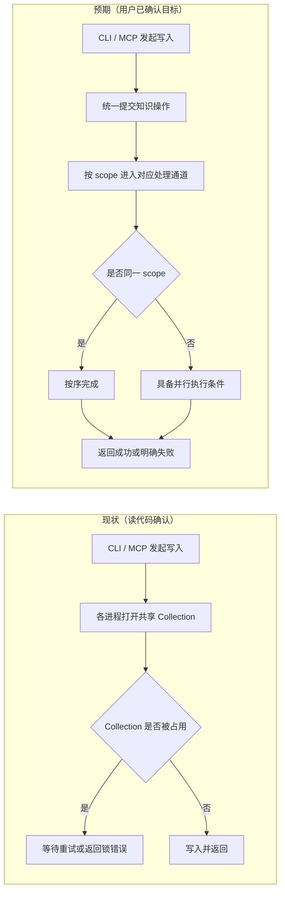
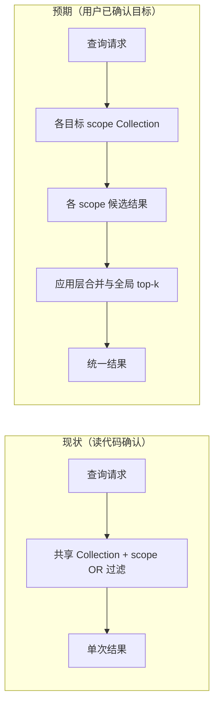
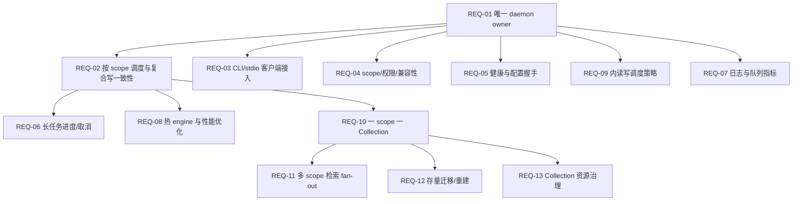

# 需求挖掘报告：CLI 与 MCP 共享 zvec 守护进程

## 1. 原始需求描述

当前 ki mcp 启动后，向量库存在进程锁，同一时间只能有一个写入操作；例如 MCP 写入和 CLI 写入不能同时发生。希望评估并设计 CLI 命令与 MCP 共用一个守护进程的优化方案。

## 2. 需求澄清

### 2.1 需求形态

表面描述是“CLI 和 MCP 共用一个守护进程”，本质需求是：多个入口并发提交知识操作时，不因 zvec 的进程级独占锁互相失败，并保证一次业务写入的完整性。

### 2.2 功能本质

将多个入口的并发访问统一转化为可观测、可恢复、不会丢数据的排队执行。

### 2.3 使用场景与角色

- 场景 1：用户在 IDE 中通过 MCP 写入知识，同时在终端执行 `ki store`、`ki sync-relation` 或 `ki import`；两项操作均应成功，后到请求可排队等待。
- 场景 2：多个 IDE/MCP 会话同时写入同一 scope；系统不得因 collection 锁报错，也不得出现 cache/KB 的静默覆盖。
- 场景 3：长时间 import 运行期间，用户发起搜索或短写入；系统应明确显示排队/执行状态，不应无限挂起或静默失败。
- 场景 4：守护进程未启动、配置不匹配、异常退出或重启；客户端应得到明确错误和可执行恢复提示。
- 场景关联性：场景 1–3 是并发访问主流程；场景 4 是所有主流程的生命周期与异常分支。

### 2.4 用户角色

- CLI 使用者：希望命令保持原有参数和退出码语义。
- MCP/IDE 使用者：希望工具调用不再因另一个入口持锁而失败。
- 运维/项目维护者：希望能查看 daemon 状态、队列和失败原因。

### 2.5 核心痛点

- 当前入口分属不同 OS 进程，均可能尝试打开同一个 zvec collection。
- 现有撞锁重试只能把冲突延后，不能保证成功。
- 复合业务写入包含向量、KB、relations-cache、Group/Wiki 等多个状态，单独锁住某一次向量调用不足以保证一致性。

### 2.6 期望体验

用户无需关心当前是谁持有 zvec 锁。并发操作应显示为“排队 → 执行 → 成功/明确失败”，而不是“等待数秒后报 collection locked”。正常情况下 CLI 命令和 MCP 工具可以同时发起，最终结果完整可追踪。

### 2.7 深层动机

根因不是缺少更多重试，而是缺少明确的 collection 所有者和跨入口的业务级调度边界。统一 owner 后，锁竞争、重复 open/close 和部分提交风险才能集中治理。

### 2.8 非功能性需求

- 稳定性：并发入口不得出现 zvec 锁冲突导致的可避免失败。
- 一致性：同一复合写操作的向量和元数据结果必须可解释；并发更新不得静默丢失。
- 可用性：现有 CLI/MCP 调用方式尽量不变；等待必须有上限或状态反馈。
- 可诊断性：daemon 不可用、版本/配置不匹配、排队超时和执行失败必须区分。
- 安全性：本地客户端只能访问本用户允许的 daemon；scope 隔离和现有 MCP 授权语义不能被绕过。
- 性能：常驻 daemon 应避免每次命令重复启动进程和打开 collection；不承诺同一 collection 的并行写入吞吐翻倍。

### 2.9 关键假设与验证建议

| 假设 ID | 假设内容 | 验证难度 | 验证建议 |
|---------|----------|----------|----------|
| H-01 | 主要使用形态是同一台机器上的 CLI、stdio MCP、HTTP MCP 共用本地数据目录 | 低 | 统计实际 CLI/MCP 入口与部署位置 |
| H-02 | 用户更重视并发成功率和一致性，而非同一 collection 的并行写吞吐 | 中 | 对比锁冲突失败次数、排队时长与实际写入耗时 |
| H-03 | CLI 的 `--config` 可能指向不同配置，因此 daemon 不能无条件全局复用 | 中 | 用多配置、多 vectorDir 场景验证 daemon 身份边界 |
| H-04 | 长 import 需要可见进度；是否需要中途取消尚未明确 | 中 | 确认 import 的最长运行时间和用户中断习惯 |
| H-05 | 用户接受同一 scope 内写入串行，但希望不同 scope 不再互相阻塞 | 低 | 用户已确认“一 scope 一 Collection”目标；实现后用跨 scope 并发压测验证 |

### 2.10 现状 → 预期（执行流程与数据流）

本需求同时改变“写入请求如何完成”和“多 scope 查询如何汇总”两条用户可见流程，采用两组 Mermaid 对照图。

#### 写入流程

#### 检索数据流

现状来源：读代码确认（[`src/lib/vector-client.ts`](/root/knowledge-indexer/src/lib/vector-client.ts:142)、[`src/search.ts`](/root/knowledge-indexer/src/search.ts:139)）；预期来源：用户确认的 daemon + 一 scope 一 Collection 方向。

| 变更点 | 现状 | 预期 | 类型 | 关联假设 |
|--------|------|------|------|----------|
| 写入入口 | CLI/MCP 进程各自打开共享 Collection，遇锁则重试或失败 | 所有入口提交到统一 owner，用户看到排队、成功或明确失败 | 修改 | H-01、H-05 |
| 写入隔离 | 所有 scope 共用一个 Collection 和锁 | 每个 scope 使用独立 Collection；同 scope 串行、跨 scope 具备并行条件 | 修改 | H-05 |
| 多 scope 检索 | 单 Collection 内用 scope-OR 过滤 | 各 scope 查询后在应用层合并全局 top-k | 修改 | H-01、H-05 |
| 结果反馈 | 锁错误与长等待原因不透明 | 队列状态、执行结果和失败原因可追踪 | 修改 | H-02、H-04 |

### 2.11 Zvec 官方能力边界与当前版本实测

- 官方概览将同一 Collection 的并发模型定义为：多进程可同时读取，写入为单进程独占；架构说明进一步明确，写线程进入互斥的写入临界区，同一时刻只有一个 writer 修改 Writing Segment。
- 官方 `read_only` 文档要求：只读打开时写入会报错；多个进程共享 Collection 时应使用只读模式。
- 针对本项目锁定的 `@zvec/zvec 0.6.0`，在隔离临时 Collection 上实测：`rw + rw` 立即因 `LOCK` 失败；`rw + ro` 也立即因 `LOCK` 失败；`ro + ro` 可以同时打开并查询；`ro + rw` 失败。因此不能把“多进程可读”解释为“一个可写进程与外部只读进程必然并行”。
- 守护进程只能把所有请求收敛到各 scope Collection 的唯一 owner，消除 CLI/MCP 之间的跨进程抢锁；它不会把同一 Collection 的两个写请求变成并行写。需求口径统一为“请求可并发提交、同 scope 复合写按顺序执行”。
- 守护进程内是否允许查询插入写队列，必须以运行时压测确认一致性、可见性和延迟；在证据不足前，默认允许请求排队但不承诺读写同时执行。

参考：

- [Zvec 概览](https://zvec.org/en/docs/db/)
- [Zvec 架构：Write Path](https://zvec.org/en/blog/2026-04-29-zvec-architecture/)
- [加载 Collection（只读模式）](https://zvec.org/zh/docs/db/collections/open/)
- [Zvec 数据建模：Collection 独立持久化与跨 Collection 查询边界](https://zvec.org/en/docs/db/concepts/data-modeling/)

## 3. 根本性分析

### 3.1 核心问题

多个入口对同一个进程独占的 zvec collection 进行生命周期管理，导致业务并发被错误地表现为随机锁失败；同时复合写操作缺少统一的业务事务边界。

### 3.2 根因链

多个入口进程 → 各自尝试 open collection → zvec 进程锁互斥 → 当前 retry/idle-close 只能错峰 → CLI/MCP 产生失败或长等待；另一方面，KB/WAL/cache 的读改写跨越异步边界 → 仅锁最终文件写入不能防止并发覆盖。

### 3.3 方案评估

**推荐方案**：由一个本地常驻 daemon 成为 zvec 唯一 owner，CLI、stdio MCP、HTTP MCP 统一提交完整业务操作，由 daemon 排队执行；物理布局采用“一个 scope 一个 Collection”，每个 scope 使用独立调度队列。

用户已确认将“一 scope 一 Collection”作为本期目标架构，并确定 Unix Socket 为本地 IPC、CLI/stdio 缺 daemon 时自动拉起、跨 scope 并发上限为 `min(4, CPU 数量)`；本阶段直接启用新布局，存量数据通过重新 `import` 恢复，不做静默兼容迁移。

**判断：情况 A（对症且触及根因）**。它同时解决 owner 不明确、重复 open/close、跨入口调度和业务级一致性问题。需要明确：外部请求可以并发到达，但同一 collection 的复合写操作仍按顺序执行。

**已放弃方案**：在主 Collection 被占用时临时创建副本 Collection，写入后再由查询触发异步合并。该方案只能把等待转移到合并阶段，且需要额外处理 upsert 冲突、删除墓碑、合并期间新写入、崩溃恢复、查询副作用和副本堆积；它不作为本期需求或默认降级路径。

**不推荐作为终态的替代方案**：仅继续增加文件锁/重试只能缓解报错；仅按 scope 拆 Collection 而不配套检索、迁移和资源治理会造成新的数据与性能问题；更换服务型向量库成本更高，暂不属于本需求范围。按 scope 拆 Collection 已纳入本期目标架构，但不能只改路径。

### 3.4 预期效果分析

- 核心场景覆盖度：高，覆盖 CLI、stdio MCP、HTTP MCP 和 Web/API 的本地并发入口。
- 痛点解决程度：高，锁冲突从随机失败转为受控排队；真实写吞吐仍受单写者约束。
- 用户体验提升：对应 §2.10 写入流程图，命令不再要求用户手动停止 MCP；可获得队列等待、执行结果和恢复提示。
- 潜在副作用：daemon 成为共享故障域；长任务可能阻塞同 scope 后续写入；多 Collection fan-out 会增加查询和资源开销；需要处理配置身份、权限、版本和 daemon 崩溃恢复。

### 3.5 建议

- 短期：保留现有命令语义，增加本地 daemon 客户端、按 scope Collection 路由和复合写队列，先覆盖所有会打开 zvec 的命令。
- 长期：根据实测写入队列长度和等待时间，评估在“一 scope 一 Collection”之上进一步分片，或迁移到支持多客户端并发的服务型向量库。
- 如果坚持仅增加文件锁：可以减少部分报错，但无法消除重复 open/close、业务级并发覆盖和长时间等待，不能作为完整需求验收方案。

### 3.6 关键决策点

| 决策 | 当前建议 | 备选方案 | 待确认内容 |
|------|----------|----------|------------|
| daemon 所有权 | 一个 daemon 持有一个 `vectorDir` 下的全部 scope Collections | 每个客户端自行抢锁 | 是否接受同一 Collection 单写者语义 |
| 客户端接入 | CLI/stdio 自动连接 daemon；缺失时按同一配置自动拉起；禁止静默 direct fallback | daemon 不存在时仅报错 / 显式维护直连 | 已确认自动启动 + fail-loud |
| 写入边界 | 代理完整 `import/sync/delete/store` 等业务操作 | 只代理向量 upsert | 阶段 1 纳入 CLI 核心写命令与 HTTP/stdio MCP 请求队列 |
| 本地通道 | Unix Domain Socket（0600）；HTTP MCP 继续作为协议入口 | 复用回环 HTTP 承载 CLI RPC | 已确认 Unix Socket；跨平台支持后续单独评估 |
| 长任务 | jobId + 进度 + 可取消 | 仅同步等待或超时返回 | import/restore 是否必须支持取消 |
| Collection 布局 | `vectorDir/collections/<validated-scope>`，一个 scope 一个 Collection | 所有 scope 继续共用单 Collection + scope filter | 阶段 1 直接采用新布局，不做旧数据兼容；存量由重新 `import` 恢复 |
| 调度粒度 | 任务声明其**涉及的 scope 集合**，集合相交即互斥；同 scope 写串行、不同 scope 有界并行；仅需跨全部 scope 独占的操作（存量迁移）用全局哨兵，并配防饥饿宽限期 | 全局单队列 / 多 scope 请求一律走全局屏障 | 阶段 1 上限为 `min(4, CPU 数量)`，超出排队；宽限期默认 5s |
| 多 scope 检索 | fan-out 到各 Collection，由应用层合并全局 top-k；embedding 只计算一次 | 单 Collection 内 scope-OR filter | top-k、超时、部分失败和排序一致性 |
| 存量迁移 | 显式迁移/重建并保留旧布局，完成校验后切换 | 启动时静默搬迁或覆盖旧 Collection | 迁移是否支持断点续跑与回滚 |
| 资源治理 | Collection 延迟打开 + 可配置上限/LRU 释放 | 常驻打开全部 scope | 最大打开句柄、mmap/内存预算 |
| 锁冲突降级 | 不创建副本 Collection，统一进入 owner 队列 | 临时副本写入后异步合并 | 已放弃；合并一致性和资源回收风险过高 |

## 4. 需求清单

### 4.1 需求拆分清单

| 优先级 | 需求 ID | 需求描述 | 预期效果 | 变更点 | 依赖 | 验收标准 |
|--------|---------|----------|----------|--------|------|----------|
| P0 | REQ-01 | 建立按数据目录识别的唯一 daemon owner，持有该目录下全部 scope Collections，CLI/MCP 请求共享该 owner | 同一 Collection 不再由多个客户端直接竞争打开 | 写入入口 | - | 混合启动 CLI、stdio MCP、HTTP MCP 后，只有 owner 持有各 scope Collection；客户端不直接抢锁 |
| P0 | REQ-02 | 对完整复合写操作提供业务级调度：同一 scope 串行，不同 scope 可并行；单个操作覆盖向量、KB、cache、Group/Wiki 等状态 | 并发写入不丢记录、不产生半成品，并释放跨 scope 并行度 | 写入隔离 | REQ-01 | 并发执行至少 20 个混合写请求，0 个可避免的锁错误；同 scope 保持提交顺序；不同 scope 在资源允许时可重叠执行；各 scope 记录全部保留 |
| P0 | REQ-03 | CLI 与 stdio MCP 提供统一客户端接入和明确等待/失败语义 | 用户无需手动停服务或重复重试 | 结果反馈 | REQ-01 | daemon 存活时 CLI 写入成功；daemon 不可用、配置不匹配或排队超时时返回非零/结构化错误和恢复提示 |
| P0 | REQ-04 | 保持 scope 隔离、CLI 参数/退出码和 MCP 授权语义 | 迁移后既有调用不出现无提示的权限扩大或行为漂移 | 权限边界 | REQ-01 | 现有 CLI/MCP 回归套件通过；未授权的跨 scope 请求仍被拒绝，已授权的多 scope 检索按 REQ-11 执行 |
| P0 | REQ-05 | 提供 daemon 健康、版本、配置指纹和优雅重启语义 | 可判断连接到的是否是正确实例 | 生命周期 | REQ-01 | 版本或配置不匹配时 fail-loud；重启期间请求得到可识别状态，恢复后可继续使用 |
| P0 | REQ-09 | 明确 daemon 内读写调度策略，不宣称同一 Collection 并行写入 | 避免把排队误解为并发执行，并锁定读写一致性语义 | 读写策略 | REQ-01/02 | 同 scope 写-写请求按序完成；不同 scope 写入可在 owner 资源允许时重叠；**多 scope 请求只与其涉及的分片互斥，不得冻结无关 scope**；只读枚举（scope-list）走不占 scope 的只读通道；全局独占操作在宽限期后停止放行新普通任务以避免饥饿；读-写是否可重叠由实测结果决定，未验证时读请求可排队且有可观测状态 |
| P0 | REQ-10 | 按 scope 路由到独立 Collection，并维护 Collection 布局版本与 scope 隔离 | 不同 scope 的 zvec 锁和队列互不阻塞；删除、备份、恢复边界清晰 | Collection 布局 | REQ-01/02/04 | scope 名称经过校验后只能映射到其目录；同一 daemon owner 内两个 scope 可同时打开/写入；单 scope 删除不会影响其他 scope；布局版本不匹配时 fail-loud |
| P0 | REQ-11 | 多 scope 检索采用 fan-out + 应用层合并，复用一次 query vector，并保持全局 top-k 语义 | 拆分 Collection 后默认搜索结果不出现静默漏召回或排序漂移 | 检索数据流 | REQ-02/04/10 | 单 scope 结果与基线一致；多 scope 结果等价于各 scope 结果合并后的全局 top-k；embedding 调用次数为 1；单分片超时/失败有明确错误或降级标记 |
| P0 | REQ-12 | 提供存量单 Collection 到按 scope Collection 的显式迁移/重建流程 | 迁移可验证、可重试、可回滚，不覆盖旧数据 | 迁移切换 | REQ-01/04/10 | 迁移前后各 scope 文档数、memoryId、relations-cache 和可检索结果核对一致；中断可续跑；旧 Collection 在确认前保留 |
| P1 | REQ-13 | 对 Collection handle、worker、mmap 资源实施延迟打开、上限和 LRU/空闲释放 | scope 数量增长时内存和文件句柄可控 | 资源治理 | REQ-02/10 | 达到配置上限后不再无限打开；释放后锁确实释放；重新打开结果正确；记录打开/释放耗时和资源峰值 |
| P1 | REQ-06 | 长任务提供 jobId、进度查询和取消/中断反馈 | import/restore 等操作可观察、可恢复 | 状态反馈 | REQ-02 | 客户端能看到运行阶段和进度；取消后不会继续产生未声明的后台写入 |
| P1 | REQ-07 | daemon 记录可追踪日志和队列指标 | 能定位锁、排队、崩溃和失败原因 | 可诊断性 | REQ-01 | 失败日志包含 operation、scope、jobId、原因和恢复建议；无 daemon 静默失败 |
| P1 | REQ-08 | 对短写入和查询做体验优化，减少重复启动与 open/close | 常驻使用更快、更稳定 | 性能体验 | REQ-01 | daemon 热身后命令不再重复创建 zvec worker；记录排队等待和执行耗时基线 |

### 4.2 远期需求清单

| 阶段 | 需求 ID | 需求描述 | 预期效果 | 依赖 | 验收标准 |
|------|---------|----------|----------|------|----------|
| 远期 | REQ-F01 | 在“一 scope 一 Collection”之上按热点、租户或数据规模进一步分片 | 为超大 scope 或多租户场景提供更细粒度扩展 | REQ-10/13 | 完成分片键、跨分片检索、迁移和资源成本评估后再决策 |
| 远期 | REQ-F02 | 评估支持多客户端并发写的服务型向量后端 | 突破单 Collection 单写者吞吐上限 | REQ-F01 | 完成迁移成本、性能、备份恢复和兼容性评估后再决策 |

### 4.3 需求依赖图

功能重叠：现有 HTTP MCP 已具备 daemon、healthz 和部分 import job 能力；本需求是统一其 owner 和业务调度边界，不重复建设另一个独立向量服务。

### 4.4 需求验证标准

| 需求 ID | 验证方式 | 验证指标 | 验证时机 |
|---------|----------|----------|----------|
| REQ-01/02/10 | 并发临时场景 + 回归测试 | 20+ 混合请求，0 锁失败；同 scope 串行、跨 scope 可重叠；各 scope 写入记录守恒 | 实现阶段与交付前 |
| REQ-03/05 | CLI/MCP 真实链路 | daemon 存活、缺失、版本不匹配、重启四种结果可区分 | 集成测试 |
| REQ-04 | 既有回归套件 + scope 越权场景 | CLI 参数/退出码保持；越权 403/拒绝语义保持 | 集成测试 |
| REQ-06/07 | 长 import/中断/daemon kill 场景 | 进度可见、取消可确认、失败可定位 | e2e 验证 |
| REQ-08 | 基线前后性能对比 | 记录启动、open、排队、执行各阶段耗时 | 实现完成后 |
| REQ-09 | 单 Collection 读写并发探针 + daemon 压测 | 同 scope `rw+rw` 不并行；不同 scope 是否重叠有实测记录；`rw+ro` 的行为、可见性和延迟有实测记录；读写策略与结果一致 | 设计评审与实现阶段 |
| REQ-11 | 单 scope/多 scope 检索对照 + embedding 计数 | 单 scope 与基线一致；多 scope 全局 top-k 正确；一次请求只生成一个 query vector；分片失败可诊断 | 实现阶段与交付前 |
| REQ-12 | 迁移 fixture + 中断续跑/回滚演练 | 文档数、ID、cache 和检索结果一致；旧布局在确认前可恢复 | 迁移实现与交付前 |
| REQ-13 | scope 数量压力测试 | 打开句柄、mmap、内存受配置上限约束；LRU 释放后无锁泄漏 | 性能测试 |

### 4.5 成功度量指标

| 度量维度 | 指标名称 | 当前基线 | 目标值 | 度量方式 |
|----------|----------|----------|--------|----------|
| 稳定性 | CLI/MCP 并发锁错误率 | 存在，需先跑基线 | 0 个可避免的 `CollectionLocked` | 混合并发测试 |
| 数据一致性 | 并发复合写丢失率 | 未建立基线 | 0 | 对 cache/KB/vector 结果逐项核对 |
| 体验 | 用户手动重试/停止 MCP 次数 | 需采样 | 0（正常 daemon 存活时） | 操作记录/e2e |
| 可诊断性 | 无原因失败比例 | 未建立基线 | 0 | 错误与 daemon 日志抽样 |
| 性能 | daemon 热身后的非 embedding 开销 | 需实测 | 不高于现状，且不重复 open/close | 前后基准测试 |
| 并行度 | 跨 scope 写入吞吐/队列互阻塞 | 当前所有 scope 共用一个 Collection | 不同 scope 不因彼此排队；提升幅度以压测结果为准 | 多 scope 并发压测 |
| 检索 | 多 scope fan-out 延迟与召回 | 当前单 Collection 一次查询 | 结果语义等价；P95 增量在评审阈值内 | 检索对照基准 |

### 4.6 非功能性约束

- 不承诺同一 zvec collection 的并行写入；写入顺序和一致性优先于吞吐。
- 一个 scope 一个 Collection 只提供跨 scope 并行的执行条件，不承诺线性加速；同 scope 仍为单写者。
- Zvec 不提供跨 Collection 查询/联表能力；多 scope 检索必须在应用层 fan-out、合并和限流，且不能无限制打开所有 Collection。
- Collection 目录、schema 和布局版本必须统一可识别；迁移采用显式命令，不得静默覆盖旧单 Collection。
- 不把“多进程只读”扩展解释为“可写进程与外部只读进程必然并行”；当前 0.6.0 的 `rw+ro` 组合必须以实测结果为准。
- 不允许因迁移而绕过 scope 授权、Token/RBAC 或现有 fail-loud 语义。
- daemon 不可用、配置不匹配、版本不兼容和队列超时必须可区分。
- 客户端默认不应静默 direct fallback；维护模式必须显式启用并确认无 daemon 持有 collection。
- 同一机器多用户场景必须有 IPC 权限边界；跨平台支持需单独确认。
- 长任务取消必须说明是否允许已提交批次完成，不能只停止客户端等待。

### 4.7 需求关系说明

REQ-01、REQ-02、REQ-03、REQ-04、REQ-05、REQ-09、REQ-10 是阶段 1 的不可拆闭环；只完成 daemon 而不迁移 CLI，锁冲突仍会存在；只迁移 zvec 调用而不代理完整复合写，也不能保证一致性。REQ-11/REQ-12 是阶段 2 的检索与可恢复性闭环：只拆 Collection 而不实现 fan-out 和迁移，会造成存量不可用或多 scope 漏召回。REQ-06/07/08/13 可在阶段 1 闭环后增强。REQ-F01/F02 不属于本期实现。

### 4.8 复杂度评估与快速实现判断

- 技术难度：高（涉及进程间 IPC、生命周期、zvec owner 和取消语义）。
- 范围大小：高（CLI、stdio MCP、HTTP MCP、向量层、KB/WAL/cache 多模块）。
- 依赖关系：中（依赖现有 MCP daemon、zvec 0.6.0 和配置/权限约定）。
- 需求清晰度：中（核心目标明确，IPC、自动启动、跨平台和取消仍待决）。
- 风险程度：高（错误的边界会导致数据丢失或所有客户端同时不可用）。
- 综合复杂度：高。
- 快速实现可行性：不可快速实现。
- 推荐下一步：`data-flow-model` → `design-craft`。先明确 daemon、客户端、业务写队列和 KB/vector 持久化的一致性流，再形成技术设计；不建议直接编码。

### 4.9 可行性分析

- 可行性结论：条件可行。
- 外部依赖文档可查阅性：Zvec 是多页官方文档，已直接查阅并引用并发、Collection 和数据操作页面；需求已确认，进入设计阶段后若需反复引用，再由 `dependency-docs` 登记依赖文档，不在本阶段重复建索引。
- 落地障碍：需要统一 daemon 身份；处理 `--config`/`vectorDir` 差异；定义 CLI 长任务和取消；补齐 daemon 日志；确保旧客户端不会绕过 owner；完成单 Collection 到按 scope Collection 的迁移与多 scope 检索合并。
- 前置条件：确认本期接受“外部并发、同 scope 内部单写”；确定本地 IPC 与自动启动策略；建立并发写入、丢更新、fan-out 召回和迁移一致性基线测试。
- 可行性约束：在上述条件确认前，不应关闭现有 direct 路径或修改默认命令行为。

## 5. 潜在风险与注意事项

- daemon 是共享故障域，崩溃会同时影响 CLI 和 MCP；必须有存活探测、自动恢复或明确恢复命令。
- FIFO 队列可能让大型 import 阻塞短写入；需要排队可见性和调度策略。
- daemon 与 CLI 的配置/API key 环境可能不同；握手必须暴露配置指纹和健康状态，禁止误连。
- 当前 WAL 的文件锁不等于完整事务锁；验收必须覆盖并发读改写，而不能只检查 `.lock` 文件。
- 若保留显式 direct 维护模式，必须避免它与 daemon 同时打开 collection。
- 真实 embedding 网络耗时仍会存在；daemon 主要改善锁竞争和冷启动，不能承诺所有命令延迟大幅下降。

## 6. 迭代建议

### 6.1 反馈收集计划

- 收集方式：并发场景 e2e、CLI/MCP 操作日志、用户对排队等待和错误提示的反馈。
- 收集频率：首期上线前逐场景验证；上线后按周查看锁错误、排队超时和 daemon 重启记录。
- 收集渠道：daemon 结构化日志、CLI 输出、MCP 工具错误响应。

### 6.2 迭代规划

| 阶段 | 阶段目标（一句话） | 覆盖需求 ID | 预期效果（用户可感知的状态变化） | 进入下一阶段条件 |
|------|-------------------|-------------|-----------------------------------|------------------|
| 一：核心并发链路 | 建立唯一 daemon owner，并让按 scope 路由、同 scope 有序写入和跨 scope 有界并行可用；直接启用新布局，不处理旧数据迁移 | REQ-01、REQ-02、REQ-03、REQ-04、REQ-05、REQ-09、REQ-10 | CLI、stdio MCP、HTTP MCP 可同时发起操作；请求从“撞锁失败/手动重试”变为“排队→成功或明确失败”；同 scope 结果按提交顺序完成，不同 scope 最多 `min(4, CPU 数量)` 并行，未授权 scope 仍被拒绝 | REQ-01/02/10 并发验收通过：20+ 混合请求无可避免锁错误、记录守恒、scope 隔离有效；REQ-03/05 生命周期场景可区分；存量需重新 `import` |
| 二：检索与可恢复性 | 完成多 scope 检索合并、存量迁移和长任务可观察性 | REQ-06、REQ-07、REQ-08、REQ-11、REQ-12 | 多 scope 搜索结果与迁移前语义一致；import/restore 能看到进度、失败原因和恢复状态；常用命令不再反复冷启动或重复打开 Collection | 阶段一完成；REQ-11 单/多 scope 检索对照通过；REQ-12 迁移 fixture 完成一致性、续跑和回滚演练 |
| 三：规模化与性能治理 | 在真实负载下控制 Collection 资源，并决定是否需要进一步分片或更换后端 | REQ-13、REQ-F01、REQ-F02 | scope 数量增长时仍不会因句柄、mmap 或内存耗尽而无故失败；用户可获得稳定的查询/写入延迟；只有度量显示单 scope 写吞吐成为瓶颈时才进入更细粒度扩展评估 | 阶段二完成；资源峰值、跨 scope 吞吐和检索 P95 达到 §4.5 目标或已形成可复现的扩展触发证据 |

### 6.3 长期演进建议

保持“入口适配器 → 业务操作 → 统一调度 → 持久化后端”的分层。未来即使替换 zvec 或在 scope 之上进一步细分分片，也应保留统一操作契约和一致性边界，避免 CLI/MCP 再次各自直接管理底层 Collection。

### 6.4 当前实施进度（2026-09-11）

阶段 2 已完成核心闭环，但尚未宣告整阶段验收完成：

- [x] REQ-11：按 scope Collection fan-out；query embedding 单次生成；应用层合并全局 top-k；分片错误 fail-loud。
- [x] REQ-12：新增 `ki migrate-vector --yes [--resume]`；旧 Collection 保留；目标文档内容、向量、字段核对后才补写缺失项。**续跑语义已澄清**：resume 是「幂等补写 + 全量核对」，checkpoint 仅记录已完成 scope 名作审计留痕，**不据此跳过任何 scope**（避免目标被人工篡改后静默成功），因此续跑代价与全量迁移同量级，不得当作增量续跑宣传。
- [x] REQ-06（import）：HTTP job 提供 scan/vectorize/persist 进度、状态查询和批次边界取消。
- [x] REQ-07：daemon RPC 失败日志包含 operation、scope、jobId、原因和恢复建议，并返回排队/执行耗时。
- [x] REQ-08：daemon 复用热 engine；CLI 自动启动失败时监听子进程退出，避免无效等待 30 秒。
- [x] REQ-06（restore）：新增 `/api/restore/run|status|cancel`，restore/rebuild 阶段进度与批次边界取消已接入。
- [x] REQ-13：新增 `vector.maxOpenCollections` 配置、空闲句柄 LRU、打开/释放耗时与峰值指标；既有 idle-close 参数未调整。
- [ ] 交付验收收口：已完成真实 embedding 首轮跨 scope P95、吞吐和读写排队观测；稳定生产基线、真实长 restore 取消与测试 teardown 隔离仍需补齐。

已验证：`npx tsc -p tsconfig.json --noEmit`（全量 src，非只 include zvec-engine 的 `tsconfig.src.json` 假阴性配置）exit 0；daemon 并发 9/9（含新增防饥饿与只读通道用例）、fan-out 2/2、迁移 3/3、safe-tar 1/1、HTTP API 21/21、search-multiscope 17/17、scope-isolation 5/5、lib 37/37、restore 17/17、import-scheme-d 14/14、scope-doc 14/14、config-doctor 51/51、error-handling 15/15、mcp-daemon 12/12、import-vector-rebuild 4/4、CLI 回归 21/21。全量 `npm run test:all` 受现有 CLI 长耗时场景影响仍不能在 240 秒窗口内跑完，不能作为全量通过证据。

P1-3 另做专项探针（隔离临时配置，实测已验证后清理）：① 新增 scope 无需 `resetConfigCache` 即可见；② strict 下已撤权 scope 立即被 `resolveScope` 拒绝、仍授权者正常放行；③ 未漂移时守卫放行；④ `vectorDir` 变更后抛 `DAEMON_IDENTITY_DRIFT` 且文案含重启出路；⑤ `dataDir` 变更同样触发；⑥ 仅改 scope 授权**不**误报漂移（且漂移状态在重启前持续存在、不被 scope 编辑洗掉）；⑦ `SIGHUP`/`resetConfigCache` 能消除同长度改写的漏检。其中“同长度改名 + 零间隔”的 stat 漏检为**非确定性**（两次运行结果相反），已按上述已知边界记录并给出 SIGHUP 出路。

#### 6.4.1 审查修复轮（2026-09-11，auto-review + challenger）

代码审查与二次质疑共查出并修复下列问题（本轮不改变已确认的需求方向，只修正实现与调度语义）：

| 编号 | 问题 | 修复 |
|------|------|------|
| C-1 | 全局屏障 `if (activeWorkers > 0) return` 会冻结整个调度：一次 `ki scope list` 就把无关 scope 的 30ms 短写拖到 4482ms（实测 149 倍），违反 REQ-02/REQ-09 | 调度器改为**单队列 + scope 集合占用**（集合相交即互斥）；`scope-list` 归不占 scope 的只读通道；多 scope 检索只占用其涉及分片。同场景实测降至 **31ms** |
| C-1b | 取消冻结后全局独占任务（migrate-vector）会被持续写流量饥饿，而客户端已取消超时 → 永久挂起 | 新增防饥饿宽限期（默认 5s）：期内不冻结普通 scope，超期后停止放行新普通任务（仅放行全局任务本身，避免死锁）；新增回归用例锁定 |
| P0-1 | 所有长任务 RPC 共用 120s 硬超时，而 import 内部预算可达 ~17 分钟；超时不取消 daemon 侧任务，用户重跑撞 `import.lock` 死路 | `callDaemon` 支持 `timeoutMs <= 0` 表示不设客户端超时（断连由 socket error 兜底并告知“可能已部分执行”）；import/restore/rebuild/migrate/bulk-* 均传 0；超时文案补出路 |
| C-2 | 上述修法的陷阱：`setTimeout(fn, 0)` 下一 tick 即触发，`Number.MAX_SAFE_INTEGER` 超 32 位被 Node 钳为 1ms（实测均 ~3ms 超时） | 显式 `timeoutMs > 0` 才注册 timer，并钳到 `2147483647`；注释记录该实测结论 |
| P0-2 | `startDaemon()` 把包装进程的正常 `exit(0)` 判为启动失败（`bin/ki.mjs` 3s 后必然 exit 0，而 socket 在健康预检之后才创建）→ CLI/stdio 首次自动拉起假失败 | 仅非 0 退出或被信号杀死才判失败；`exit 0` 视为包装器已后台化，继续轮询 socket 至 deadline；超时文案说明预检会发真实 embedding 请求 |
| P1-1 | 存量迁移 4 处原生 `ZvecEngine.open/create/probe/close` 未经 `serializeEngineOp`、未先 `closeEngine`；且 idle-close 不经过 coordinator，会在迁移途中并发 `closeEngine()` → 同进程并发 ZVecOpen（项目自述实测 ~62% 永久阻塞，daemon 是唯一 owner → 全入口挂死） | 迁移前 `closeEngine()` 关闭全部 scope engine；全程持有在途计数（新增 `beginExternalEngineOp`/`endExternalEngineOp`）抑制 idle-close；所有原生 open/create/probe/close 走 `serializeEngineOp` |
| C-3 | `restoreSnapshotLocal` 先 `rmSync` 整个 scope 目录再解压，中间是秒级窗口（两次完整 tar 清单 + 解压 + 递归校验）；进程被 SIGKILL/OOM → 数据已删且 catch 不执行 → 无自动恢复、零提示 | 改为 `rename` **原子移开**（`.pre-restore-<pid>-<ts>`，同父目录保证同文件系统）；解压成功才删，失败则改名回滚；回滚也失败时 fail-loud 并告知原始数据完整位置与 `mv` 命令 |
| C-4 | 迁移 checkpoint 的 `idsHash`（SHA-256）与 `total` 只写不读，属死字段；而 §6.4 却声明“checkpoint 续跑” | 删除死字段，`completed` 改为 scope 名数组（仅审计留痕）；旧格式 checkpoint 显式校验并 fail-loud；同步修正 §6.4 措辞 |
| C-5 | `/api/tags`、`/api/doc/list`、`/api/asset` 的队列 scope 取自原始 query（前端不传即空串）→ 落 `'default'`，与 handler 内部 `resolveScope` 在 strict 模式下不一致，且长任务期间前端面板无限挂起 | 队列占用改用**解析后**的 scope；配合 C-1 后不再被无关长任务冻结（`/api/import/status`、`/api/import/cancel` 本就不入队，进度轮询不受影响） |
| P1-2 | 客户端 ping 超时 800ms < daemon 侧陈旧判定 2000ms，而 daemon 有同步 `tar` 阻塞源 → 忙时误判“不存在”并拉起第二实例，后者又报 `DAEMON_ALREADY_RUNNING`（自相矛盾） | ping 超时提至 3000ms；**区分超时与 ENOENT/ECONNREFUSED**：超时直接 fail-loud 告知“可能正忙”并给出路，不再拉新实例 |
| P1-4 | MCP 会话级请求（`initialize`/`tools/list`/`notifications`）被无差别入队且取不到 scope → 落 `'default'`，import 期间新 IDE 无法建连 | 仅 `tools/call`、`resources/read|list` 入队，会话级方法直通 |
| C-6 | `__global__` 完全落在 `SCOPE_PATTERN`（`/^[a-zA-Z0-9_-]+$/`）白名单内，用户可创建同名 scope → 其全部请求被当成全局独占 | 纳入 `validateScope` 保留字黑名单（新错误码 `RESERVED_SCOPE`）；项目已有 `'all'` 保留字先例 |
| C-7 | `vectorSearch` 静默过滤“Collection 不存在的 scope”，属 REQ-11 点名要避免的静默漏召回 | 新增 `findMissingScopeCollections`；`search.ts` 写入 `skipped`（含 `ki migrate-vector --yes` / `ki import` 出路），且**单 scope 也返回** skipped |
| C-9 | 回传的 `activeWorkers` 在 `finally` 递减之前取值 → 恒虚高 1 且语义未声明 | 改为先释放占用再计算指标 |
| C-10 | RPC 以 `\n` 分帧且 `buffer += chunk` 无上限 → 不发换行的客户端可让唯一 owner OOM | 加 64MB 上限，超限返回 `DAEMON_REQUEST_TOO_LARGE` + 拆批出路并断开 |
| P2-1 | 服务端 socket 无 `error` 监听；`server.once('error', reject)` 在 listen 成功后常驻，会静默吞掉后续服务器级错误 | 补 socket 与 server 的 `error` 日志；listen 成功后摘掉一次性 reject |
| P2-5 | `daemon-bridge` 注册 SIGINT/SIGTERM 后只释锁不退出（Node 会抑制默认终止）→ “看起来能 Ctrl+C 但杀不掉”；`onerror` 只写 stderr 不断连 → IDE 侧静默无响应 | 信号处理后 `process.exit(0)`；`onerror` 补恢复提示 + 释锁 + 关闭 stdio |
| P1-3 | `loadConfig` 进程内缓存永不失效 → daemon 永久持有启动时配置快照；从配置里移除 scope（撤销授权）后 HTTP MCP 仍继续服务（fail-open） | `loadConfig` 改为 mtime+size 热失效，并按 `explicitPath` 区分缓存；新增**身份漂移守卫**（`captureDaemonIdentity`/`assertDaemonIdentityCurrent`）；`/healthz` 与 RPC `ping` 豁免并上报 `identityDrift`；指纹不匹配补 code `DAEMON_CONFIG_MISMATCH`。**未采用**原审查建议的 `X-KI-Config-Fingerprint` 请求头：浏览器前端无独立配置来源，只能先 GET /healthz 拿指纹再带回（同源自证、永远匹配）；而 mtime 热失效已使 daemon 自身授权判定实时正确，fail-open 自动消除 |

**P1-3 的两个必要配套设计**（否则热失效会引入新风险）：

1. **身份漂移必须 fail-loud，不能跟着配置热跑**：`vectorDir`/`dataDir` 变更后，daemon 内存中的 engine 与已打开 Collection 句柄仍指旧路径，而 `getScopeCollectionPath`/`getScopeDataDir` 已按新配置解析 → 读旧句柄、写新路径，数据静默落错位置。因此区分两类变更：**可热生效**（scope 注册/授权、scopeMode、token）与**不可热生效**（vectorDir/dataDir → 抛 `DAEMON_IDENTITY_DRIFT` + 重启出路）。注意客户端与 daemon 读同一份配置文件，热失效后两边指纹仍相同，**ping 拦不住这类漂移**（它比的是“客户端 vs 磁盘”，而漂移是“daemon 内存 vs 磁盘”），故必须在业务请求入口单独守卫。
2. **守卫范围只覆盖业务入口**：`/healthz`、RPC `ping` 与静态资源必须豁免 —— 否则漂移时运维连诊断端点都拿不到、前端页面本身也加载不出来（用户只能看到裸 409、无上下文）；豁免后前端能正常加载，再调 `/api/*` 时拿到 409 并展示错误与出路。

**已知边界（非确定性，已给确定性出路）**：`statSync` 只能看 `mtimeMs + size`，若配置文件被改写为**字节数相同**的内容且落在同一毫秒内（如脚本 `sed -i` 原地替换同长度值），缓存不会失效。实测可复现且**非确定性**（同长度改名零间隔：一次检出、一次漏检）。因该窗口涉及授权，daemon 已注册 `SIGHUP` 处理器强制刷新缓存（Unix 惯例；仅对真正的后台 daemon 注册，前台模式保留 SIGHUP 默认终止语义，避免关终端后成为占用端口与 zvec 锁的孤儿），且 SIGHUP 时会检测并告警“身份漂移必须重启、SIGHUP 不能代替重启”。

#### 6.4.2 P1-3 修复轮再审查（2026-09-11，CodeReview 子代理 + 实测复现）

对 P1-3 的首版实现再做一次专业审查，**查出首版引入了一个比原缺陷更严重的安全回归（P0，子代理已实测复现）**，并一并修复审查发现的 4 个 P1：

| 编号 | 问题（首版缺陷） | 修复 |
|------|------------------|------|
| **P0-1** | 热失效后配置源丢失/为空会**静默降级为 buildDefaults()**（`scopeMode` 从 strict 变 default、`scopes` 清空）→ `resolveScope` 从白名单校验退化为**任意放行**（越权 fail-open），`getScopeDataDir` 丢掉 scope 级 `kbDir` → KB 写入目录静默迁移、新数据与存量分裂。而 `daemonIdentityFingerprint` 只含 vectorDir/dataDir，**检测不到这类降级**。旧实现（永久缓存）对此免疫，是热失效把它暴露出来的。子代理实测：`mv config.yaml config.yaml.bak` 后未注册 scope "hacker" 被放行 | 新增 **last-known-good**：曾从真实文件成功加载过时，配置源不可用/内容损坏一律**沿用上一份配置**（授权与路径口径不降级）+ stderr 告警 + `getConfigLoadIssue()` 供 /healthz 上报；仅“从未加载过且无文件”才用默认值。同时把 `removeScopeFromConfigFile` 的写回改为**原子写（temp + rename）并保留原文件 mode**（直接 writeFileSync 会让并发的 daemon 读到半截文件；而 rename 会用临时文件权限覆盖，把含 apiKey 的 0600 配置改成 0644 即密钥泄露） |
| **P1-1** | TOCTOU：指纹在读**完**之后才采集，写者落在 `readFileSync` 与 `statSync` 之间时会把「旧内容 + 新指纹」一起缓存 → 此后 mtime/size 恒等、热失效永远命中，**该次变更在本进程生命周期内永久不可见**（直接抵消撤权实时生效）。窗口覆盖整个 YAML.parse + 字段校验 + 路径展开，非纳秒级 | 读前读后各采一次指纹，**一致才允许入缓存**；不稳定时本次结果仍返回但不入缓存（下次重读）并提示 |
| **P1-2** | HTTP 守卫把 `loadConfig()` 的**任意异常**误标为 `DAEMON_IDENTITY_DRIFT`（配置语法错也会被告诉“请重启 daemon”，重启后仍失败——复刻本轮要消灭的文案误导）；`/healthz` 因同一原因直接 500，`ki mcp --status` 报 running:false 而 daemon 其实活着 | 「取配置」与「判漂移」分离：配置加载失败返 503 + `CONFIG_LOAD_FAILED` + `ki doctor` 出路；漂移才返 409/JSON-RPC 错误。healthz 改为**只调一次配置并容错**（失败时报 `configError` 字段而非崩）+ 合并 `getConfigLoadIssue()` |
| **P1-3** | SIGHUP 处理器内无 try/catch 且 `resetConfigCache()` 先于 `loadConfig()` 执行 → 先销毁 last-known-good、再加载可能已损坏的配置，信号回调内抛异常（全仓无 `uncaughtException` 兜底）→ **daemon 当场崩溃**且绕过优雅关闭（HTTP lock/socket 残留、在跑的写盘被斩断）。运维最需要它的时刻（怀疑配置有问题 → kill -HUP）变成自杀开关 | 新增 `invalidateConfigFreshness()`（**只失效新鲜度、保留 last-known-good 内容**）替代 reset 后才重读；处理器全程 try/catch；**队列非空时拒绝刷新**（长操作中途切配置会导致同一请求前后半段按不同路径解析）并告知排队状态与替代方案 |
| **P1-4** | 守卫只在**请求入口**检查一次，而全仓 82 处独立 `loadConfig()`、无请求级快照；`_enginePromises` 又只以 scope 名为键、命中即返回不校验路径 → 数分钟的长操作（import/restore）中途 `vectorDir`/`kbDir` 变化时，写操作走**旧路径的已打开句柄**而同一次操作里的路径解析已按新配置 → 「读旧句柄、写新路径」，数据静默落错位置 | ① `getEngine` 命中缓存前**校验 dbPath**（新增 `_engineDbPaths` 登记与清理，仅 daemon owner 开启以免破坏 CLI 零 IO 快路径）；② `scope 级 kbDir` **纳入漂移判定**（单独快照而不并入 `daemonIdentityFingerprint`，避免 Socket 路径随之变化而裂成双 owner）；③ SIGHUP 队列保护（同上）。**请求级 config 快照贯穿传递**（根治方向）属跨 34 文件重构，留待拍板 |
| P2-1/P2-3 | 漂移响应在 `/mcp` 上用 REST 包体（MCP SDK 客户端无法解析 → 出路文案丢失）；`startsWith('/mcp')` 前缀宽于真实路由 | `/mcp` 改返回 JSON-RPC 2.0 信封；改为与路由同源的 `=== '/mcp'` 精确匹配；healthz 的 `configFingerprint`/`identityDrift` 改为条件字段 |
| P2-4/P2-6 | `DAEMON_CONFIG_MISMATCH` 文案已成事实错误（热失效后 daemon 不再持有启动快照，旧文案把用户推向无效的重启动作）；`ensureDaemon`/`startDaemon` 仍靠中文子串判定错误类别（文案一改就静默失效 → mismatch 被当成“daemon 不存在”而误拉第二实例） | 文案改写为“多为 --config 指向另一份配置；若确认同一份则说明 daemon 身份漂移”；判定改用 `code === 'DAEMON_CONFIG_MISMATCH'`；`recoveryHint` 去重（不再重复 message 里已有的重启命令） |
| P2-5 | `_daemonIdentity` 是模块级单例且无清零入口（当前实测无污染：`test:all` 每文件独立 jiti 进程、无测试引用 capture，但未来同文件内先跑 daemon 路径再断言 CLI 语义的用例会被静默污染） | 新增 `resetDaemonIdentity()` 供测试隔离 |

**本轮验证（全部实测）**：

- `npx tsc -p tsconfig.json --noEmit` exit 0；16 个套件 **238 例全绿**（config-doctor 50、mcp-http-api 17、daemon-concurrency 9、scope-isolation 5、lib 37、scope-doc 14、error-handling 15、import-scheme-d 14、restore 17、search-multiscope 17、cli-aliases 21、mcp-daemon 12、import-vector-rebuild 4、vector-migrate 3、search-fanout 2、safe-tar 1）。
- P0-1 专项探针（12 项，跑完已清理）：复现子代理的原始越权场景（`mv` 配置后 scopeMode 保持 strict、白名单不清空、未注册 scope 仍被拒、kbDir 不丢失、故障经 `getConfigLoadIssue` 上报、恢复后 issue 自动清空）；配置内容损坏（未闭合 YAML）同样沿用 last-known-good；`invalidateConfigFreshness` 能强制重读到新配置且坏配置下不销毁 last-known-good；`removeScopeFromConfigFile` 原子写且**保留 0600 权限**、无临时文件残留。
- 修复过程中自查并纠正的三处自身缺陷：① `_engineDbPaths.set()` 遗漏导致 dbPath 校验永不触发（`openedAt` 恒为 undefined）→ 补登与清理；② rename 不改 mtime，配置被 `mv` 回来后指纹一致→快路径命中→故障状态永久残留 → 快路径加 `_configLoadIssue === null` 条件；③ 探针前置条件错误（`writeFileSync` 的 mode 仅对新建文件生效），改用 `chmodSync` 后确认权限保留正确。

**本轮保留边界**：

- P2-4：daemon 内 3s idle-close 的原始理由（“让其他进程错开抢锁”）在唯一 owner 下已失效，使间隔 >3s 的请求付约 0.7s reopen；本轮按用户确认暂不调整 idle-close 参数，仅叠加独立的 Collection 资源上限/LRU。

#### 6.4.3 阶段 2 收尾与阶段 3 启动（2026-09-11）

- [x] P1-4：引入 `runWithConfigSnapshot` 请求级异步上下文。daemon RPC、HTTP MCP、HTTP API job 与 CLI 直达长操作在入口捕获一次配置，并在出队执行时恢复该快照，避免长操作跨 `await` 发生配置路径/授权漂移。
- [x] HTTP lock 身份派生：`getHttpLockPath()` 与 daemon Socket 使用同一 `vectorDir + dataDir` 身份指纹；`ki mcp stop` 支持扫描多配置实例 lock，实例退出清理启动时固定的 lock 路径。
- [x] P2-2：backup、export、wiki-backfill 及 import CLI 的 autoBackup 纳入 daemon scope 队列；export 的相对输出路径在客户端先解析为绝对路径。
- [x] REQ-06：新增 `/api/restore/run|status|cancel`，支持 restore-only、restore + rebuild-vector、rebuild-only；取消只在 restore/rebuild 批次边界生效，当前 tar/embedding/zvec 批次不会被强行打断。
- [x] REQ-13：新增 `vector.maxOpenCollections`（默认 8）、空闲 LRU、`_enginePromises`/`_engineDbPaths`/LRU 元数据同步清理，以及 `/healthz.vectorResources` 打开/释放耗时和峰值指标；未调整既有 idle-close 参数。

本轮验证：隔离 mock embedding + 真实 zvec LRU 探针在上限 1 下验证 `peakOpenCount=1`、3 次打开、2 次释放、释放后重开检索成功；真实 embedding daemon 压测（上限 2）完成 8 个跨 scope 并发请求，墙钟 2265ms、P95 2263ms、吞吐 3.533 req/s，峰值打开数 2；同 scope 读写一方出现约 69ms 队列等待，确认未重叠执行。临时配置/探针/数据均已清理，压测 daemon 已停止。

当前剩余：未运行 `npm run test:all`（既有 CLI 长耗时约束）；真实 embedding 压测为本机单轮小样本，尚不能代表稳定生产 P95/吞吐基线；restore job 的取消中途真实长 tar/embedding 场景仍需更大 fixture 的专门演练。

#### 6.4.4 阶段 3 首轮基准（2026-09-11）

- [x] 资源上限并发回归：新增 `test/vector-resource-lru.test.ts`，真实 zvec worker + 本地 mock embedding 在 `maxOpenCollections=1` 下并发首次打开两个 scope，确认无串行队列自等待；LRU 释放后重新打开并检索成功，测试 1/1。
- [x] 真实 embedding 首轮规模基准：隔离 daemon、4 个 scope、3 轮 × 4 scope 的跨 scope 写入（12 请求）正式入口运行 C/D 均全部成功；C 墙钟 27817ms、P95 18927ms、吞吐 0.431 req/s、跨 scope 排队 0，D 墙钟 73282ms、P95 59740ms、吞吐 0.164 req/s、跨 scope 排队 1。同 scope 读写两轮均有 1 个请求报告排队，未观察到读写重叠。此前两次同构检索运行作为补充对照：运行 A 墙钟 4114ms、P95 1491ms、吞吐 2.917 req/s；运行 B 墙钟 26003ms、P95 21584ms、吞吐 0.461 req/s，显示真实 embedding 网络波动显著。
- [x] 资源观测：`maxOpenCollections=2` 时正式写入运行 C/D 的 `/healthz.vectorResources` 均报告 `peakOpenCount=2`、`opened=13`、`closed=11`，未超过配置上限；运行 D 结束时 `openCount=2`。
- [ ] 稳定基线：当前仍是单机、单轮、小数据集，尚不足以代表生产 P95/吞吐；需要固定数据规模、重复轮次和机器资源记录后再比较趋势。

阶段 3当前决策：暂不实施 REQ-F01（更细分片）或 REQ-F02（服务型向量后端）。本轮正式写入基准证明跨 scope 已具备并发条件、同 scope 仍按单写者排队；但正式写入两轮 P95 也相差约 3.2 倍，尚不能据此证明单 scope 写吞吐已经成为后端扩展瓶颈。后续以固定数据规模的重复写入基准、持续队列等待、句柄/mmap/内存接近预算或稳定性退化作为进入 F01/F02 评估的触发条件。

#### 6.4.4.1 阶段 3 高优先级补验（2026-09-14）

- [x] E2E teardown 隔离：新增 `test/e2e/isolated-daemon.mjs`。测试进程直接持有隔离 HTTP 子进程，使用 healthz 返回的实际 daemon PID 发送 SIGTERM，超时才 SIGKILL，并同时确认 PID 与隔离端口退出；不再调用全局 `ki mcp stop`。若测试前 7423 健康，测试后增加存活断言。
- [x] 24 请求真实 embedding 基准：4 个 scope × 6 轮，每轮 4 个 scope 并发提交，共 24 个写入请求；每条记录保存预期文本和 docId，测试结束通过 CLI 搜索以 docId+文本核对记录守恒。最新采样版运行 24/24 成功，墙钟 66546ms，P95 18866ms，吞吐 0.361 req/s，跨 scope 排队 0；同 scope 读写 2/2 成功且观察到 1 个排队请求；`maxOpenCollections=2` 时 `peakOpenCount=2`（`opened=25`、`closed=23`）。此前采样版运行 74631ms/P95 44548ms/0.322 req/s（跨 scope 排队 1），非采样版运行 28073ms/P95 5948ms/0.855 req/s；更早运行也显示同样的网络波动，当前不宣称生产 SLO。
- [x] 真实 restore/rebuild 中途取消：新增 `test/e2e/restore-cancel.network.mjs` 与 `npm run test:e2e:restore-cancel`。401 条 fixture 形成 803 个向量条目；在 rebuild 阶段第一批 200 条完成后请求取消，返回 202，最终 `cancelled`、`cancelRequested=true`、`done=200/803`，满足批次边界；额外等待 1500ms 后状态、进度和 `finishedAt` 不变，队列 `activeWorkers=0` 且 `queues={}`。测试后默认 7423 仍健康。

本轮真实运行中有一次 restore 隔离 daemon 启动预检超时，未进入业务断言；随后修正测试脚本响应体重复读取问题，并以受控前台子进程生命周期重跑通过。该次失败不计入产品取消结论，但保留在 round-2 报告的执行记录中。

#### 6.4.4.2 阶段 3 稳定基线续测（2026-09-14）

- [x] 固定规模重复基线：在同一台 Linux 主机、同一 embedding 配置和 `maxOpenCollections=2` 下连续追加 3 轮 `4 scope × 6 轮` 真实写入；每轮 24/24 成功、跨 scope 排队 0、同 scope 读写均有 1 个请求排队，且每轮均通过 CLI 搜索核对 24 条 docId+文本记录守恒。

| 追加轮次 | 墙钟 | P95 | 吞吐 | OS 峰值 RSS / mmap / fd | engine open / close 累计耗时 |
|----------|------|-----|------|-------------------------|------------------------------|
| 续测 1 | 9345ms | 1696ms | 2.568 req/s | 663156KB / 760 / 146 | 5654ms / 1565ms |
| 续测 2 | 8111ms | 1516ms | 2.959 req/s | 662964KB / 767 / 149 | 5676ms / 1616ms |
| 续测 3 | 12265ms | 3053ms | 1.957 req/s | 689664KB / 655 / 144 | 7221ms / 2057ms |

- [x] 多轮 OS 采样：三轮均实际采集 daemon `/proc` RSS、mmap 映射数和 fd 数；结合前两轮采样，当前已有 5 轮真实负载资源记录。资源量级在本机样本内相近，但尚未形成跨时间、固定网络条件下的容量趋势。
- [ ] 稳定生产基线：本次续测已补齐固定规模和重复轮次证据，但 embedding 外部网络仍造成延迟波动，尚不能据此给出生产 P95/吞吐 SLO；embedding、RPC、排队、engine open/close 与 zvec 写入的细分耗时也尚未全部拆出。

#### 6.4.5 首次整体验收（2026-09-11）

- L1 静态检查：`npx tsc -p tsconfig.json --noEmit` exit 0；相关 daemon、HTTP API、配置、迁移、检索、restore、资源和 CLI 回归套件均通过，详见验收报告。
- L2 场景核验：当前 daemon `/healthz` 返回 `ok=true`、`identityDrift=false`、队列为空且资源指标可见；非法 scope 以非零退出和明确路径穿越提示拒绝；未知 restore job 返回 JSON 404 和重新提交提示。
- L3 真实 embedding：`npm run test:e2e:stage3` 1/1 通过；12/12 跨 scope 写入成功，墙钟 36709ms、P95 18689ms、吞吐 0.327 req/s、跨 scope 排队 0；同 scope 读写 2/2 成功且一方排队；`peakOpenCount=2` 未超过 `maxOpenCollections=2`。
- default scope 重建：用户执行 `ki restore default --rebuild-vector` 成功；随后 `ki scope list` 显示 `default` 的 KB 与 Vector 均为 ✓。此前失败命令 `ki restore ki-search default --rebuild-vector` 实际把 `ki-search`（错误拼写，真实注册名为 `kisearch`）当作 scope，第二个位置参数 `default` 未被当作 scope 或 Group 使用。
- 首次整体验收结论为**有条件通过**：核心 daemon、scope 调度、fan-out、迁移、长任务接口和 Collection LRU 已有证据；20+ 混合请求稳定基线、真实大规模 restore 中途取消、OS 级 mmap/RSS/文件句柄指标尚未完成。另发现 `stage3-scale.network.mjs` 的 `mcp stop --config <隔离配置>` teardown 可能误停同机默认 7423 daemon；默认 daemon 已恢复，测试隔离逻辑需修复后才能宣称环境收尾完整。

#### 6.4.6 当前进度与后续事项（2026-09-14）

当前阶段进度：阶段 2 的 daemon、scope 调度、fan-out、迁移、长任务 API 和 Collection LRU 主路径已有回归与真实链路证据；阶段 3 三项高优先级补验已完成：E2E teardown 隔离、24 请求真实 embedding 记录守恒、真实 restore/rebuild 中途取消；backup/export/wiki-backfill 三个低频 daemon 路由也已完成独立黑盒验证。default scope 的独立向量重建已成功。阶段 3固定规模重复基线和 OS 采样已追加 3 轮，整体仍保持“有条件通过”，原因是跨时间稳定生产 SLO 与资源容量趋势尚未建立，不将单机真实 embedding 运行结果直接视为生产 SLO。

已完成的高优先级事项：

1. **E2E teardown 隔离**：按隔离 daemon 实际 PID/端口清理，禁止全局 stop；测试前后默认 7423 存活性已实测确认。
2. **20+ 真实 embedding 基准**：固定 4 scope × 6 轮共 24 个写入请求；跨 scope 全部成功，CLI 搜索按预期 docId+文本核对记录守恒，同 scope 读写排队现象和资源峰值均有诊断输出。
3. **真实 restore/rebuild 取消**：401 条 fixture、803 个向量条目，在第一批边界取消并验证终态、稳定进度和空队列；没有观察到取消后的继续写入。
4. **backup/export/wiki-backfill 黑盒链路**：隔离 scope 下 backup 快照 tar 内容、backup list、export Markdown、wiki-backfill 首次写回、幂等跳过和 `--force` 覆盖均已通过 daemon 路由验证，队列恢复为空。
5. **OS 资源采样实现与真实负载证据**：`test/e2e/isolated-daemon.mjs` 已接入 Linux `/proc` 的 RSS、mmap 映射数和 fd 数采样；本次追加 3 轮真实运行峰值分别为 RSS=663156/662964/689664KB、mmap=760/767/655、fd=146/149/144；结合此前两轮采样（RSS=822288/759220KB、mmap=628/631、fd=143/150），已有 5 轮资源证据。当前只能说明本机样本资源量级，不能作为容量上限；endpoint 短时超时的失败仍保留在验收报告，未计为成功证据。

后续事项按优先级排列：

1. **中优先级**：补充可控 embedding 网络或本地回放条件，并在 daemon 侧拆分记录 embedding、RPC、排队、engine open/close 和 zvec 写入耗时，形成可比较的稳定生产趋势。
2. **中优先级**：继续重复采集 OS RSS、mmap 映射和文件描述符趋势，结合多轮 embedding 性能数据判断资源预算；当前已有 5 轮真实峰值，但不将其视为容量上限或生产 SLO。
3. **暂不启动**：REQ-F01 更细粒度分片与 REQ-F02 服务型向量后端，继续等待稳定基线满足扩展触发条件。

本轮未运行 `npm run test:all`；既有 CLI 长耗时约束仍按分批套件执行，不能宣称全量测试通过。
