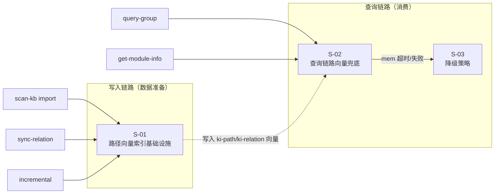

# 向量语义兜底设计

> 状态：草案
> 需求编号：vector-fallback

---

## 1. 需求背景 & 目标

### 痛点
ki 命令的 group/relation 路径匹配仅支持精确匹配 + 顶层前缀补全。AI Agent 传入的路径只要有偏差就匹配失败，需要多轮试错，浪费 token 和交互轮次。

### 目标
在精确匹配失败后，用向量语义搜索做兜底，返回最接近的真实路径并标注 `💡 近似匹配`。

### 成功指标
- Agent 首次命中率从 ~60% 提升到 ≥ 90%
- 向量兜底延迟 < 3s
- 向量服务不可用时静默降级，不阻塞原有流程

⛔ 不在范围内：KB 内容向量化（已有 `kb-import` category）、Group 树结构变更、新 scope 支持

---

## 2. 关键环节一览图



### 依赖关系
- S-01 → S-02（S-02 消费 S-01 写入的向量数据）
- S-03 嵌入 S-02 实现中，但独立定义接口

### 分期
- 第一期：S-01 + S-03（接口定义）
- 第二期：S-02（消费端，依赖 S-01 数据）

---

## 3. 总体方案设计

### 架构概览

```
┌─────────────────────────────────────────────┐
│                写入链路                       │
│  import / sync-relation / incremental        │
│          ↓                                   │
│  path-vectorize.ts（新增模块）                │
│  ├── buildPathContent()  → 构建向量文本       │
│  ├── bulkStorePath()     → mem bulk-store    │
│  └── storeOnePath()      → mem store（单条）  │
│          ↓                                   │
│  mem CLI → LanceDB（tag: ki-path / ki-relation）│
└─────────────────────────────────────────────┘

┌─────────────────────────────────────────────┐
│                查询链路                       │
│  query-group / get-module-info               │
│          ↓                                   │
│  group-resolve.ts（修改）                     │
│  ├── 精确匹配（原有三层查找）                  │
│  └── 向量兜底（新增第四层）                    │
│          ↓                                   │
│  path-search.ts（新增模块）                   │
│  ├── searchPath()     → mem search --json    │
│  └── parseResult()    → 提取 score + 路径     │
│          ↓                                   │
│  ResolveResult（原有 + fuzzyMatched 字段）     │
└─────────────────────────────────────────────┘
```

### 共享术语速查

| 术语 | 定义 | 引用子需求 |
|------|------|-----------|
| ki-path | `mem store --tags ki-path` 使用的标签，存储 Group 路径级向量 | S-01, S-02 |
| ki-relation | `mem store --tags ki-relation` 使用的标签，存储 Relation 名称级向量 | S-01, S-02 |
| 阈值 0.75 | 向量 score ≥ 0.75 视为有效近似匹配，低于则视为无命中 | S-02, S-03 |
| 静默降级 | mem CLI 超时/失败时不抛异常，退化为原有候选列表行为 | S-03 |
| 空格分隔 | 路径层级用空格分隔存储（如 `告警系统设计 告警收敛机制`），禁止用 `/` | S-01 |

---

## 4. 全局风险 & 跨子需求依赖

### 跨子需求风险

| 风险 | 影响范围 | 缓解措施 |
|------|---------|---------|
| SiliconFlow API 超时 | S-01 写入 + S-02 查询 | S-03 降级策略覆盖；写入侧记录 error 不阻塞主流程 |
| 存量数据无路径向量 | S-02 查询端无数据可搜 | S-01 完成后提供补录脚本 `ki scan-kb import --reindex-paths` |
| S-01 写入格式变更 | S-02 解析逻辑需同步调整 | 向量文本格式由 S-01 统一定义，S-02 只消费 mem search 返回的 text 字段 |

### 跨子需求接口契约

**path-search.ts 返回结构**（S-02 定义，S-01 写入时不消费）：

```typescript
interface PathSearchResult {
  /** 是否找到有效近似匹配（score ≥ 阈值） */
  matched: boolean;
  /** 匹配到的原始文本（mem 存储的完整 text） */
  rawText: string;
  /** 从 rawText 中提取的路径/名称 */
  extractedPath: string;
  /** 向量匹配分数 */
  score: number;
}
```

**path-vectorize.ts 接口**（S-01 定义）：

```typescript
interface PathVectorizeEntry {
  /** 向量文本内容（空格分隔格式） */
  text: string;
  /** 标签：ki-path 或 ki-relation */
  tag: 'ki-path' | 'ki-relation';
  /** scope */
  scope: string;
}
```
