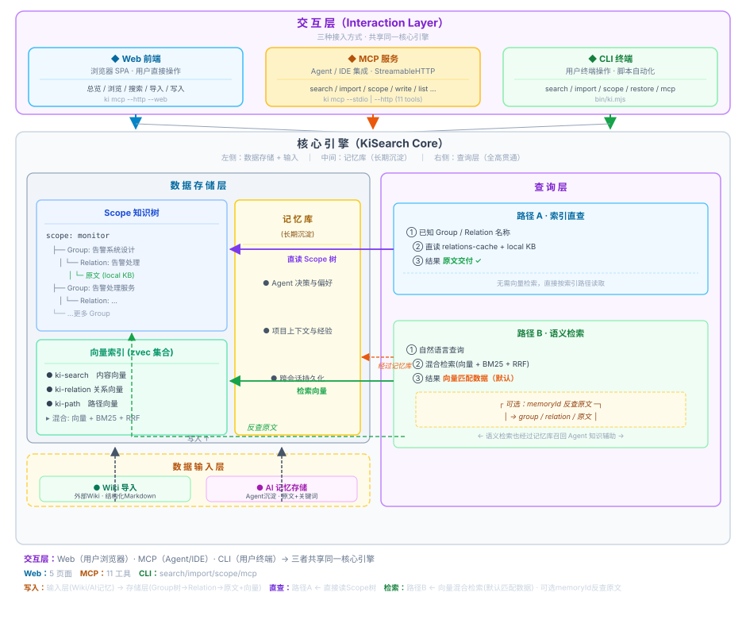
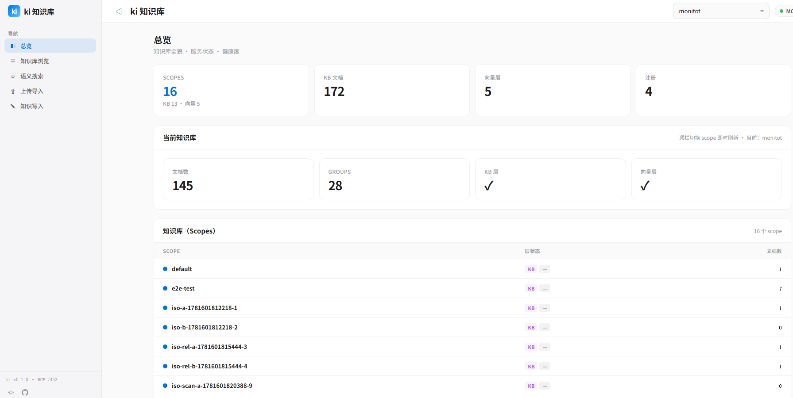

# KiSearch

<p align="center">
  <strong>AI Agent 知识索引系统 · RAG 语义检索 + 结构化知识索引的结合体</strong>
</p>

<p align="center">
  
  
  
  
</p>

---


## 📑 目录

- [📖 项目介绍](#intro)
- [🆚 与常规 RAG 的差异](#why-not-rag)
- [🧩 核心概念](#concepts)
- [✨ 核心特性](#features)
- [🚀 快速开始](#quickstart)
- [🛠️ CLI 命令参考](#cli-commands)
- [🔌 MCP 集成](#mcp)
- [📥 知识库导入](#kb-import)
- [📚 文档导航](#docs)
- [🔒 设计约束](#constraints)
- [🤝 参与开发](#contributing)
- [📄 License](#license)

---

## <a id="intro"></a>📖 项目介绍

`KiSearch`（CLI 命令：`ki`）为 AI Agent 提供**结构化知识索引 + 向量语义检索**能力，**主要通过 MCP 协议向 Agent 暴露**（同时提供 CLI 直接使用）。它不是常规的 RAG chunk 检索，而是把项目知识组织成 **Group 树 / Relation 结构化视图**，叠加 [**zvec**](https://github.com/alibaba/zvec) 混合检索引擎（语义 + BM25 + RRF 融合），让 Agent 既能"语义搜到"，也能"按索引直查原文"。

> 底层向量引擎 [**zvec**](https://github.com/alibaba/zvec)（阿里巴巴开源） 

```
发现层  zvec 向量引擎：语义召回 · BM25 全文 · RRF 融合 · 长期持久化
交付层  KiSearch：Group 树导航 · Relation 热缓存 · 原文全文交付
```



### 配套可视化：内置 Web 前端

KiSearch 自带可视化前端 `web`，由 `ki mcp --http --web` 一并提供：浏览器打开 `http://127.0.0.1:7423/` 即可查看**总览**（scope / KB / 向量 / 注册 / 当前 scope 等状态）、**知识库浏览**（Group 树 + 文档列表 + 文件名模糊搜索）、**语义搜索**、**上传导入**、**知识写入**五个页面，便于在知识导入后验证写入效果、排查检索异常。



> 底层向量引擎 [zvec](https://github.com/alibaba/zvec) 的独立可视化工具 [Zvec Studio](https://github.com/zvec-ai/zvec-studio) 仍可作为向量层的辅助调试工具单独使用（`zvec-studio --port 7861`），本项目内置前端不集成跳转入口。

### 启动内置 Web 前端

```bash
cd web && npm install && npm run build   # 构建前端产物（web/dist）
ki mcp --http --web                      # 启动服务（提供静态页面 + /api/* 扩展路由）
# 浏览器打开 http://127.0.0.1:7423/
```

## <a id="why-not-rag"></a>🆚 与常规 RAG 的差异

常规 RAG 把文档切块（chunking）→ embedding → 向量检索 → 返回 chunk 片段。KiSearch 在此之上叠加**结构化知识索引**，解决常规 RAG 的几个核心痛点：

| 维度 | 常规 RAG | KiSearch |
|------|---------|----------|
| **知识组织** | 无序 chunk，无层级关系 | Group 树 + Relation 结构化索引，知识有归属有层级 |
| **检索结果** | chunk 片段（可能断裂、缺上下文） | 原文全文（命中时可直接引用原文） |
| **查询路径** | 仅语义检索一条路（模糊召回） | **双路径**：已知索引时**直接精准查询原文**（100% 命中、无向量噪声）；未知时语义检索兜底 |
| **检索精准度** | 语义模糊匹配，存在噪声 | 索引直查**精准命中**原文（零误差）；语义检索有 memoryId 反查定位兜底 |
| **原文定位** | 黑盒召回，不知结果来自哪 | 每条结果带 `group` / `relation` 定位字段，可定位到原文出处 |
| **符号检索** | 弱（纯语义向量，camelCase 难匹配） | BM25 全文路支持类名 / 方法名精确召回 |
| **状态管理** | 无状态，每次检索平等 | 冷热治理 + 评分衰减 + 使用计数，热点 Relation 优先 |
| **跨会话** | 一次性检索，无积累 | 长期记忆库，Agent 沉淀的知识持续积累 |
| **写入校验** | 无约束，随意写入 | scope 隔离 + WAL 原子写入 + 幂等覆盖更新 |

> **一句话**：常规 RAG 解决"搜得到"，KiSearch 同时解决"搜得到 + 看得见 + 定位到原文"。

## <a id="concepts"></a>🧩 核心概念

| 概念 | 含义 |
|------|------|
| `scope` | 项目隔离标识，不同 scope 物理隔离（`scopeMode: default` 自动创建 / `strict` 需注册） |
| `Group` | 知识分组路径，如 `项目/告警系统设计/告警处理服务` |
| `Relation` | 某个 Group 下可被检索和命中的知识条目（含 memoryId / sourcePath） |
| `module-info` | Relation 对应的 Markdown 原文说明 |
| 标签（Tag） | `ki-search`（内容）/ `ki-path`（路径）/ `ki-relation`（关系）三层标签 |
| 记忆库 | 跨会话持续积累的知识，带评分衰减与冷热治理 |

## <a id="features"></a>✨ 核心特性

- **结构化知识索引**：Group 树导航、Relation 热缓存、关键词词云 —— 不是无序 chunk
- **混合检索（Hybrid）**：语义向量 + BM25 全文 + RRF 融合排序；camelCase 符号（类名/方法名）可精确召回
- **双路径查询**：索引直查（已知路径 → 原文）+ 语义检索（自然语言 → 向量 → 反查原文）
- **原文交付**：search 结果按 memoryId 反查定位（group / relation），交付原文全文而非片段
- **三层标签**：`ki-search` / `ki-relation` / `ki-path`，按需过滤提升准确率；默认搜全部且按标签限流（内容优先）
- **向量语义兜底**：精确 Group / Relation 路径未命中时，自动经向量模糊定位
- **TypeScript 直接执行**：jiti 运行时，无需编译；Node ≥ 18
- **CLI + MCP 双通道**：19 个 CLI 命令；`ki mcp` 暴露 11 个 MCP 工具（stdio / HTTP 共享单例）
- **MCP 安全约束**：工具集不含 scope / doc 级破坏性操作，仅 `ki_delete_relation` 可按 Group+Relation 删除单条知识条目

## <a id="quickstart"></a>🚀 快速开始

### 1. 安装

```bash
# 方式一：一键安装 CLI（推荐）
curl -fsSL https://raw.githubusercontent.com/HACK-WU/KiSearch/master/scripts/install-latest.sh | bash

# 方式二：源码安装（开发 & CLI）
git clone git@github.com:HACK-WU/KiSearch.git && cd KiSearch
npm install && npm link
```

### 2. 初始化配置

```bash
ki config init        # 生成 ~/.ki/config.yaml（含 dataDir/backupDir/vectorDir/embedding/scopeMode）
ki doctor             # 一键校验配置、目录、Embedding API 密钥与向量维度
```

生成的配置（节选）：

```yaml
dataDir: $HOME/.ki-data       # KB 源数据目录
backupDir: $HOME/.ki-backup   # 备份目录
vectorDir: $HOME/.ki/vector   # zvec 向量库（所有 scope 共享，按 metadata 隔离）
embedding:
  provider: siliconflow       # apiKey 从环境变量 SILICONFLOW_API_KEY 读取
  model: Qwen/Qwen3-Embedding-8B
  dimension: 4096             # 必须与建库时一致
scopeMode: default            # default: 自动创建 scope；strict: 必须显式注册
```

> `SILICONFLOW_API_KEY` 需在环境中导出（MCP 场景必须在客户端 `env` 字段显式传入，MCP 进程不继承 shell 环境）。

### 3. 使用示例（导入外部 Wiki + HTTP 模式启动 MCP）

```bash
# ① 首次全量导入外部 Markdown Wiki（原文直导，无 AI 依赖，自动切分）
ki scan-kb import \
  --scope my-project \
  --source /path/to/wiki \
  --root-name Wiki \
  --chunk-size 1000 \
  --chunk-overlap 150

# ② 增量导入（修改 source 目录文件后执行，git diff 驱动）
ki scan-kb import \
  --scope my-project \
  --source /path/to/wiki \
  --mode incremental

# ③ 语义检索（默认搜全部标签；不传 --tags 时每个标签最多返回 --limit 条，ki-search 内容优先）
ki search --scope my-project --query "用户登录流程"

# ④ 启动 MCP HTTP 共享单例（供 AI Agent 经 URL 接入）
ki mcp --http

# ⑤ 查看连接信息（含持锁进程与对外绑定地址）
ki mcp --status
```

导入完成后，AI Agent 通过 MCP 接入（推荐 **HTTP 模式**）：

```json
{
  "mcpServers": {
    "ki": {
      "url": "http://127.0.0.1:7423/mcp",
      "headers": { "Authorization": "Bearer <your-token>" }
    }
  }
}
```

> 回环绑定（仅本机）免鉴权时省略 `headers`；跨机访问需绑定 `0.0.0.0` 并先生成 Token。连接 URL 需与 `ki mcp --status` 输出的 `host`/`port` 完全一致。

Token 生成与查看：

```bash
ki mcp token generate       # 生成托管 Token 并持久化到 ~/.ki/mcp-token
ki mcp token show           # 查看当前托管 Token（填入上方 headers 的 <your-token>）
```

> ⚠️ 已存在 Token 时 `generate` 会拒绝覆盖，需改用 `ki mcp token reset --yes` 轮换。

## <a id="cli-commands"></a>🛠️ CLI 命令参考

| 命令 | 说明 |
|------|------|
| `scan-kb` | 外部知识库导入统一入口：import（原文直导/增量直连，支持 `--no-vector` 非向量化）/ diff |
| `manage-index` | Group 树 CRUD + scope 列表（create / delete / list-scopes） |
| `query-group` | 查询 Group + 分区（索引直查 · 支持模糊路径语义兜底） |
| `get-module-info` | 读取本地 KB 原文（索引直查 · 支持模糊 Relation 语义兜底） |
| `sync-relation` | 写入 Relation + 本地 KB（向量 + KB 双写，支持 `--no-vector`） |
| `delete-relation` | 删除 Relation（cache + KB + wiki + 向量四层） |
| `search` | 语义检索（zvec 混合检索，输出含原文定位字段） |
| `store` | 向量化存储单条知识 |
| `bulk-store` | 批量向量化存储知识 |
| `scope` | scope 管理：list / delete / clear（KB + 向量两层） |
| `doc` | 向量文档管理：list / delete |
| `tag` | 向量 tag 发现：list（只读，含文档数） |
| `config` | 配置管理：init（生成 YAML） |
| `doctor` | 配置诊断（apiKey / 连通性 / 维度 / 目录） |
| `backup` | 备份 scope 目录快照 |
| `restore` | 从快照还原（支持 `--list` / `--rebuild-vector`） |
| `export` | 导出 KB 为 Wiki Markdown |
| `mcp` | 启动 MCP Server（stdio 默认 / `--http` 共享单例 / `--status` / `token` 子命令） |
| `setup` | 下载 Skills / Rules 到目标项目目录 |

> `ki <command> --help` 查看每个命令的完整参数。

## <a id="mcp"></a>🔌 MCP 集成

启动后 AI Agent 可通过标准 MCP 协议使用知识索引能力：

```bash
ki mcp                      # stdio 模式（默认，单客户端单进程）
ki mcp --http               # HTTP 共享单例（多 IDE 共享同一持锁进程，见 docs/mcp-http.md）
ki mcp --http --web         # HTTP 模式 + 可视化前端（浏览器访问 http://127.0.0.1:7423/）
ki mcp --status             # 查看 HTTP 单例运行状态（只读）
ki mcp stop                 # 关闭本机所有 ki mcp 实例并清理 lock
ki mcp token generate       # 一键生成托管 Token（远程访问鉴权）
ki mcp token show           # 查看当前托管 Token
ki mcp token reset --yes    # 轮换托管 Token（破坏性，需显式确认）
```

> **启动预检**：`ki mcp` 启动前自动执行健康检查（等价 `ki doctor`），报告写入 stderr（不污染 stdio）。存在 ❌ 失败项（缺 API 密钥、向量维度不匹配）拒绝启动；仅 ⚠️ 警告继续启动。

### MCP 客户端配置

支持 **stdio** 与 **HTTP** 两种接入方式：

#### 方式一：stdio（单客户端单进程）

```json
{
  "mcpServers": {
    "ki": {
      "command": "ki",
      "args": ["mcp"],
      "env": { "SILICONFLOW_API_KEY": "<your-api-key>" }
    }
  }
}
```

#### 方式二：HTTP（共享单例，多 IDE / 远程接入）

先用 `ki mcp --http` 启动服务（详见 [`docs/mcp-http.md`](./docs/mcp-http.md)），再用 URL 型条目接入：

```json
{
  "mcpServers": {
    "ki": {
      "url": "http://127.0.0.1:7423/mcp",
      "headers": { "Authorization": "Bearer <your-token>" }
    }
  }
}
```

> 回环绑定（仅本机）免鉴权时，可省略 `headers`；跨机访问需绑定 `0.0.0.0` 并强制 Token——先用 `ki mcp token generate` 生成托管 Token，再用 `ki mcp token show` 查看明文填入上方 `<your-token>`。
> 所有 IDE 必须使用完全一致的连接 URL，且不要再保留 stdio 的 `command` 配置，否则会争抢向量库锁。

### 暴露的工具（11 个）

| 工具 | 功能 | 对应路径 |
|------|------|---------|
| `ki_query_group` | 查询 Group 树 + Relations + 词云 | 索引直查 |
| `ki_get_module_info` | 读取本地 KB Markdown 原文 | 索引直查 |
| `ki_manage_index_create` | 创建 Group 节点 | — |
| `ki_manage_index_list` | 列出所有 scope | — |
| `ki_sync_relation` | 写入 Relation + 关键词（向量 + KB 双写） | 写入 |
| `ki_delete_relation` | 删除 Relation（四层清理） | — |
| `ki_search` | 语义检索，输出 group/relation 定位字段 | 语义检索 |
| `ki_store` | 向量化存储单条知识 | 写入 |
| `ki_bulk_store` | 批量向量化存储知识 | 写入 |
| `ki_scope_list` | 列出 scope 及其 KB/向量状态 | — |
| `ki_tag_list` | 列出 scope 下 tag 及文档数 | — |

> `ki_search` 的 `tags` 参数：**不传 → 搜索全部标签**（每个标签最多返回 `limit` 条，`ki-search` 内容优先）；传值 → 按标签过滤（逗号分隔多标签，OR 组合）。
> 工具集遵循零破坏性约束，不含 delete/force 操作。

## <a id="kb-import"></a>📥 知识库导入

### 前置：scope 注册

- `scopeMode: default`（默认）：首次使用某个 scope 时自动创建，无需注册
- `scopeMode: strict`：必须在 `~/.ki/config.yaml` 的 `scopes` 中显式注册，否则拒绝访问

### 首次导入（外部 Wiki 原文直导，无 AI 依赖）

```bash
ki scan-kb import \
  --scope my-project \
  --source /path/to/wiki \
  --root-name Wiki
```

内部完成：格式白名单校验（默认 `.md`）→ 自动切分（chunkSize 1000 / overlap 150，段落边界优先）→ 批量向量化（zvec）→ local KB 文件级原文写入 → relations-cache 写入（含 memoryIds）。

### 增量更新（git diff 驱动，无 AI）

```bash
# 修改 source 目录中文件后直接执行，自动按 diff 增/改/删
ki scan-kb import --scope my-project --source /path/to/wiki --mode incremental
```

`--source` / `--mode` / `--chunk-*` 等参数详解见 [`docs/scan-kb.md`](./docs/scan-kb.md)。

## <a id="docs"></a>📚 文档导航

### 操作指南

| 文档 | 场景 |
|------|------|
| [`docs/build-kb.md`](./docs/build-kb.md) | 首次构建知识索引 |
| [`docs/update-kb.md`](./docs/update-kb.md) | 增量更新知识索引 |
| [`docs/query-kb.md`](./docs/query-kb.md) | 知识库查询 |
| [`docs/manage-index.md`](./docs/manage-index.md) | 索引结构管理 |
| [`docs/verify-index.md`](./docs/verify-index.md) | 验证操作结果 |
| [`docs/scan-kb.md`](./docs/scan-kb.md) | scan-kb 子命令与 ai-results 详解 |

### 参考与架构

| 文档 | 内容 |
|------|------|
| [`docs/cli.md`](./docs/cli.md) | CLI 命令完整参考（含 search 输出字段说明） |
| [`docs/architecture.md`](./docs/architecture.md) | 架构与协作关系 |
| [`docs/mcp-http.md`](./docs/mcp-http.md) | MCP HTTP 共享单例模式 |
| [`docs/vector-engine-mem.md`](./docs/vector-engine-mem.md) | 向量引擎（zvec）设计说明 |
| [`docs/tags-design.md`](./docs/tags-design.md) | 三层标签设计 |
| [`docs/error-handling.md`](./docs/error-handling.md) | 异常处理与恢复 |
| [`docs/workflows.md`](./docs/workflows.md) | 典型工作流 |
| [`docs/backup-restore.md`](./docs/backup-restore.md) | 备份与恢复 |
| [`docs/memory-system-requirements.md`](./docs/memory-system-requirements.md) | 记忆系统需求 |
| [`docs/memory-system-dataflow.md`](./docs/memory-system-dataflow.md) | 数据流图 |

### Agent Skills

| Skill | 场景 | 核心能力 |
|-------|------|---------|
| [`skills/ki-foundation/SKILL.md`](./skills/ki-foundation/SKILL.md) | 前置知识（必读） | ki 架构心智模型 + 命令参考 |
| [`skills/codekb-skill/SKILL.md`](./skills/codekb-skill/SKILL.md) | 代码知识库检索/写入 | 四步走查询 + 白名单/黑名单 |
| [`skills/memory-skill/SKILL.md`](./skills/memory-skill/SKILL.md) | 项目记忆/用户画像 | 归档机制 + 自动沉淀 + Group 结构 |
| [`skills/snippet-memory/SKILL.md`](./skills/snippet-memory/SKILL.md) | 代码片段记忆 | 片段级知识的沉淀与召回 |
| [`skills/update-kb/SKILL.md`](./skills/update-kb/SKILL.md) | 知识库增量更新 | diff / 增量导入流程 |

> 加载顺序与使用规则见 [`rules/ai-codekb-memory.md`](./rules/ai-codekb-memory.md)。

## <a id="constraints"></a>🔒 设计约束

- **Scope 隔离**：仅允许字母、数字、连字符、下划线；禁止路径遍历 `../`；不同 scope 物理隔离
- **关键词规则**：仅自然语言词汇，禁止代码符号（类名、方法名、路径等）；关键词需真实出现在原文中
- **数据版本**：所有 JSON 文件含 `version` 字段，当前版本 1
- **WAL 写入**：JSON 写入采用临时文件 → 原子 rename
- **自动迁移**：读取旧格式 `group-index.json`（`roots`）自动迁移为 `groups`
- **幂等安全**：重复操作无副作用（重复导入覆盖更新）
- **快速失败**：输入校验失败立即退出，不静默降级
- **异常恢复**：运行时数据损坏自动从 `_template/` 恢复

## <a id="contributing"></a>🤝 参与开发

```bash
npm install                 # 安装依赖
npm run build:zvec-engine   # 构建 zvec 引擎层（tsc）
npm test                    # 运行单元测试（test/*.test.ts）
npm run test:zvec-engine    # zvec 引擎测试（node --test）
npm run test:all            # 全部单元测试
npx jiti src/search.ts --help   # 直接执行任意命令
```

## <a id="license"></a>📄 License

MIT


