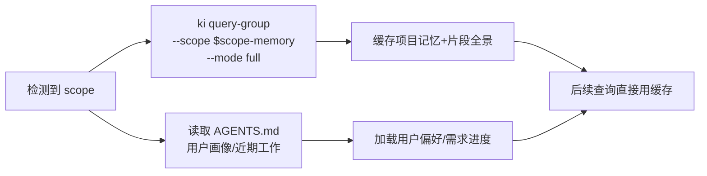

# memory-agent-guide 记忆系统行为规则

> **面向所有项目**。本规则指导 AI 利用 `ki` 命令构建跨会话的持久化记忆能力。
> 覆盖两大领域：**项目记忆与代码片段**（`${scope}-memory`，经 ki）和**用户画像/近期工作**（AGENTS.md 直接存储，不经 ki）。
> 与 `codekb-agent-guide` 互补，不重叠。

---

## 0. 速览：什么时候做什么

```
对话开始?
  ├─ scope 已知 → 自动召回
  │   ├─ ki query-group --scope ${scope}-memory --mode full   → 项目记忆 + 片段全景
  │   └─ 读取 AGENTS.md"用户画像"/"近期工作"章节
  │
  └─ scope 未知 → 暂停，问用户

对话中发现关键信息?
  ├─ 项目信息（背景/技术栈/踩坑...）  → ki sync-relation --scope ${scope}-memory ...
  ├─ 代码要点（函数/逻辑/模型...）    → ki sync-relation --scope ${scope}-memory（工具库/通用记忆片段等）
  ├─ 需求/进度                        → 更新 AGENTS.md"近期工作"章节
  └─ 用户偏好（沟通/代码风格/工具...）→ 更新 AGENTS.md"用户画像"章节

查询记忆（三步走）:
  ① 定位 Group  → 从全景缓存中锁定目标 Group
  ② 查热区      → ki query-group --groups <G> --mode hot,emerging
  ③ 取原文      → 命中 → ki get-module-info → 提炼回答
                  未命中 → 回问用户 / 使用默认行为

访问 AGENTS.md"近期工作"时?
  → 检查过期条目，超过 7 天的移入项目根目录 archive.md（归档，不删除）
```

---

## 1. Scope 约定

本规则使用一个 ki scope：

| scope | 用途 | 命名规则 |
|-------|------|----------|
| `${scope}-memory` | 项目记忆 + 代码片段记忆 | 代码知识库 scope + `-memory` 后缀 |

**示例**：代码知识库 scope 为 `monitor` → 项目记忆 scope 为 `monitor-memory`

**用户画像与近期工作不使用 scope**：直接存储于项目根目录 AGENTS.md 的"用户画像"/"近期工作"章节（格式由 `agents-md-init` skill 维护），不经 ki。

**前提条件**：`${scope}` 必须已知（来自代码知识库规则或用户指定）。若未知，暂停问用户。

> 当 `${scope}` 仍是字面量时，禁止执行任何 ki 命令。必须先确认 scope。

---

## 2. 与代码知识库的边界

| 维度 | codekb-agent-guide | memory-agent-guide |
|------|------------------------|------------------------|
| scope | `${scope}` | `${scope}-memory` |
| 内容类型 | 代码知识（模块、API、设计） | 项目上下文 + 代码级要点 |
| 查询兜底 | `ki_search` 语义兜底 | 无语义兜底，未命中则回问 |

**代码知识库已覆盖**（不要写入记忆系统）：
- 模块/组件职责、API 接口、架构约束、bug 模式、重构策略、依赖版本、测试策略

**记忆系统覆盖**：
- 项目记忆：项目背景、技术栈选型、团队约定、项目历史、当前状态、踩坑点、项目架构、工具库
- 代码片段：工具函数、关键执行逻辑、核心流程、数据模型、API 调用、配置模板、错误处理（归入工具库/项目踩坑点/部署运维/通用记忆片段等 Group）

**AGENTS.md 直接存储（不经 ki）**：
- 用户画像：沟通偏好、代码风格、工具链、技术背景、工作习惯、对话习惯
- 近期工作：最近需求 + 进度

**判断口诀**：能用代码引用回答的 → 代码知识库；需要项目背景/代码要点的 → 记忆系统；用户偏好/需求进度 → AGENTS.md。

---

## 3. 存储结构定义

### 3.1 项目记忆 + 代码片段（scope: `${scope}-memory`）

```
${scope}-memory/
├── 背景与目标/          # 项目目标、业务领域、当前阶段、里程碑
├── 技术栈选型/          # 框架版本、选型原因、技术债务
├── 团队约定/            # 代码风格、分支策略、发布流程、Commit 规范
├── 项目历史/            # 重大变更记录、架构演进决策
├── 当前状态/            # 进行中任务、待解决问题、阻塞项
├── 外部依赖/            # 第三方服务、API 配置、环境变量
├── 项目踩坑点/          # 常见问题、解决方案、注意事项（含代码踩坑片段）
├── 项目架构/            # 整体架构、模块关系、数据流
├── 工具库/              # 通用工具函数、脚本（代码片段）
├── 常用命令/
├── 部署运维/            # 配置模板、部署流程（代码片段）
├── 通用记忆片段/        # 兜底：按功能/类型细分（关键逻辑、数据模型、API 调用、配置模板、错误处理）
└── ...                  # 🔄 AI 可自行扩展（见 §9）
```

> **已移除**：`最近需求`、`进度` 两个 Group 不再建于 ki，改由 AGENTS.md"近期工作"章节直接维护。

> **代码片段记忆**：详细分类原则与片段格式见 `rules/ai-codekb-memory.md`"代码片段记忆"章节。

### 3.2 用户画像（存 AGENTS.md，不经 ki）

```
沟通偏好/  代码风格/  工具链/  技术背景/  工作习惯/  对话习惯/
```

> 以上为 AGENTS.md"用户画像"章节的预定义维度（见 `agents-md-init` skill 的模板），非 ki Group。

### 3.3 近期工作（存 AGENTS.md）

```
## 近期工作 (7天内)
### 最近需求
- [YYYY-MM-DD] 需求描述（1-2 句话）

### 进度
- 进行中: [YYYY-MM-DD] 🔄 描述
- 已完成: [YYYY-MM-DD] ✅ 描述
```

> 超过 7 天的已完成条目移入项目根目录 `archive.md`（进行中进度永久保留）。

---

## 4. 对话开始：自动召回

**触发条件**：检测到 `${scope}` 后自动执行（无需用户触发）。



**执行命令**：

```bash
# 1. 加载项目记忆 + 片段全景
ki query-group --scope ${scope}-memory --mode full

# 2. 读取 AGENTS.md"用户画像"/"近期工作"章节（无需 ki 调用）
```

**缓存策略**：首次查询后，索引信息在当前会话中有效。写入操作后需刷新。

**静默失败**：scope 不存在或树为空时不报错，记录"无记忆索引"后继续。

---

## 5. 查询记忆：三步走

```mermaid
flowchart TD
    A([需要记忆信息]) --> Q{信息类型?}
    Q -- 项目记忆/片段 --> S1[从 ${scope}-memory 缓存<br/>定位目标 Group]
    Q -- 用户画像 --> S2[读取 AGENTS.md<br/>用户画像章节]
    Q -- 近期工作 --> S3[读取 AGENTS.md<br/>近期工作章节]
    
    S1 --> P{全景中已明确<br/>Relation 名称?}
    P -- 是 --> F[取原文<br/>ki get-module-info]
    P -- 否 --> D[查该 Group 热区<br/>ki query-group --groups G<br/>--mode hot,emerging]
    
    D --> E{命中 relation?}
    E -- 是 --> F
    F --> G[提炼回答 / 应用偏好]
    G --> H([结束])
    E -- 否 --> L[回问用户 / 使用默认行为]
    L --> H
```

### 第①步：定位目标 Group

基于 §4 已缓存的全景索引，判断信息属于哪个 Group。

- **项目记忆/片段**：根据用户问题锁定 `${scope}-memory` 下的某个 Group（工具库、通用记忆片段、背景与目标等）
- **用户画像/近期工作**：直接读取 AGENTS.md 对应章节
- **若缓存中无明确匹配**，重新执行全景查询确认
- **若定位到多个候选 Group**，优先选择得分最高的；不确定时可依次排查

### 第②步：查热门 + 新兴热区

对目标 Group 执行：

```bash
# 项目记忆 / 代码片段
ki query-group --scope ${scope}-memory --groups "目标Group路径" --mode hot,emerging
```

**输出示例**：

```
=== monitor-memory/背景与目标 ===

🔥 热门知识 (Top 3):
├── 项目简介 (score: 8.5) [热]
├── 技术选型原因 (score: 6.2) [热]
└── 业务领域 (score: 4.8) [常温]


```

**操作**：
- 从热门知识中选择最匹配的 relation
- **命中** → 进入第③步取原文
- **未命中** → 先检查 Group 是否定位正确（可换 Group 重试一次），确认无误后回问用户或使用默认行为

**快捷路径（跳过②）**：如果全景索引中已经能看到与用户问题直接匹配的 Relation 名称，可跳过第②步，直接进入第③步 `get-module-info`。

### 第③步：取原文

```bash
# 项目记忆 / 代码片段
ki get-module-info --scope ${scope}-memory --group "目标Group路径" --relation "Relation名称"
```

返回完整 Markdown 原文。**Agent 必须提炼后回答**，不要全文转储。

**各 Group 的典型 Relation 名称示例**：

| Group | 典型 Relation |
|-------|--------------|
| 背景与目标 | "项目简介"、"业务领域"、"里程碑节点" |
| 团队约定 | "分支策略"、"Commit 规范"、"发布流程" |
| 技术栈选型 | "技术栈清单"、"选型原因" |
| 工具库 | "日期时间"、"字符串处理" |
| 通用记忆片段/关键逻辑 | "认证流程"、"告警收敛" |

---

## 6. 自动沉淀：写入记忆

### 6.1 触发条件

AI 在对话中识别到以下信息时，**自动沉淀**（无需用户指示）：

| 信息类型 | 触发信号 | 记录位置 | 示例 Group |
|----------|----------|----------|------------|
| 项目信息 | 用户明确陈述项目事实 | `${scope}-memory` | 背景与目标、技术栈选型、团队约定... |
| 踩坑经验 | 用户提及问题与解决方案 | `${scope}-memory` | 项目踩坑点 |
| 代码要点 | 工具函数/关键逻辑/数据模型/API等 | `${scope}-memory` | 工具库、通用记忆片段/关键逻辑... |
| 需求/进度 | 用户提到要做的事或完成情况 | AGENTS.md"近期工作"章节 | — |
| 用户偏好 | 用户表达个人倾向 | AGENTS.md"用户画像"章节 | — |

### 6.2 写入方式

**项目记忆/代码片段统一使用 `ki sync-relation`**：

```bash
# 项目记忆
ki sync-relation \
  --scope ${scope}-memory \
  --group "目标Group路径" \
  --relation "Relation名称" \
  --module-info "Markdown内容"
```

**用户画像/近期工作直接更新 AGENTS.md 对应章节**（覆盖/追加写入），不经 ki。

**写入后刷新**：每次写入完成后，必须重新执行全景查询更新缓存：

```bash
ki query-group --scope ${scope}-memory --mode full
```

### 6.3 module-info 内容要求

- 内容为 Markdown 格式的模块说明
- 超长内容（>1000 字符）会收到警告，建议拆分多条写入或用 `scan-kb import --source` 自动切分导入

### 6.4 代码片段写入前检查

写入片段前必须检查目标 Relation 是否已存在同名片段：
- 先 `ki get-module-info` 获取该 Relation 当前内容
- 已存在同名 `###` 片段 → 更新而非追加
- 不存在 → 追加

### 6.5 近期工作（AGENTS.md）的写入格式

**最近需求**：每条只需 1-2 句话，必须带日期前缀：

```
- [YYYY-MM-DD] 需求描述
```

示例：
```
- [2026-06-12] 实现用户登录功能
- [2026-06-12] 优化搜索性能，目标响应时间 < 200ms
```

**进度**：区分进行中与已完成：

```
- 进行中: [YYYY-MM-DD] 🔄 重构告警引擎（预计 6/15 完成）
- 已完成: [2026-06-12] ✅ 修复登录页面样式问题
```

---

## 7. 记忆更新

当用户纠正旧信息或信息发生变化时：

**流程**：查找现有内容 → 确认 → 覆盖写入

**项目记忆/片段更新**：

```bash
# 1. 查找现有 Relation
ki query-group --scope ${scope}-memory --groups "目标Group路径" --mode hot,emerging

# 2. 取现有内容确认
ki get-module-info --scope ${scope}-memory --group "目标Group路径" --relation "Relation名称"

# 3. 覆盖写入新内容
ki sync-relation \
  --scope ${scope}-memory \
  --group "目标Group路径" \
  --relation "同一Relation名称" \
  --module-info "更新后的Markdown内容"

# 4. 刷新缓存
ki query-group --scope ${scope}-memory --mode full
```

**用户画像/近期工作更新**：直接覆盖写入 AGENTS.md 对应章节/小节。

**`sync-relation` 同名覆盖**：Relation 名称相同时，自动覆盖原有内容。

---

## 8. 归档机制

### 8.1 归档策略

| 数据 | 位置 | 保留规则 | 归档方式 |
|------|------|----------|----------|
| 近期工作（最近需求/已完成进度） | AGENTS.md"近期工作"章节 | 仅保留最近 7 天，每条必须带日期 | 超期移入项目根目录 `archive.md` |
| 近期工作（进行中进度） | AGENTS.md"近期工作"章节 | 永久保留 | 不归档 |
| 当前状态 | ki `${scope}-memory` | 超过 30 天自动标记过期 | 移到 `archive.md` |
| 其他 Group（含代码片段） | ki `${scope}-memory` | 永久保留 | 不归档 |

### 8.2 归档时机

**每次访问 AGENTS.md"近期工作"章节或"当前状态"时**，AI 必须检查并归档过期条目。

### 8.3 归档操作

**近期工作（AGENTS.md）**：

```
1. 读取 AGENTS.md"近期工作"章节 → 解析 [YYYY-MM-DD] 条目
2. AI 标记超 7 天为过期（进行中进度永久保留）
3. 覆盖写回 AGENTS.md → 保留活跃条目
4. 文件写入 → 过期条目追加到项目根目录 archive.md（按日期分组）
```

**当前状态（ki）**：

```
1. ki get-module-info → 获取 Relation 完整内容
2. AI 标记超 30 天为过期
3. ki sync-relation → 活跃条目写回（覆盖原 Relation）
4. 文件写入 → 过期条目追加到 archive.md
5. ki query-group --mode full → 刷新缓存
```

**archive.md 位置与格式**：位于项目根目录（与 AGENTS.md 同级），按日期分组追加，不删除历史信息。首次归档时自动创建。

```markdown
# 归档记录

## 2026-06-05
- [2026-06-05] 添加数据导出功能

## 2026-06-04
- [2026-06-04] 重构告警引擎
```

> **关键原则**：过期条目归档（移到 archive.md），不是删除。历史信息有参考价值。

---

## 9. AI 自主扩展

> AI 在对话过程中，如果发现当前 Group 结构无法覆盖新信息，可以**自行创建新的 Group**，无需用户确认。

**示例**：对话中发现"部署流程"相关信息，但现有 Group 无此分类 → 自动创建"部署流程" Group。

```bash
ki manage-index --scope ${scope}-memory --action create --parent "" --name "部署流程"
```

**创建后刷新**：创建 Group 后重新执行全景查询：

```bash
ki query-group --scope ${scope}-memory --mode full
```

---

## 10. 协同：结合代码知识库和项目记忆

当用户问题同时涉及代码知识和项目上下文时：

```
1. 先查代码知识库 ${scope} → 找到模块/架构信息
2. 再查项目记忆 ${scope}-memory → 找到相关项目上下文/代码要点
3. 用户偏好/需求进度 → 读取 AGENTS.md
4. 综合信息回答
```

**示例**：用户问"告警引擎为什么这样设计？"
- 代码知识库 → 告警引擎的架构实现
- 项目记忆 → 技术栈选型原因、历史决策背景

---

## 11. 禁忌清单

| # | 红线 |
|---|------|
| 🔴 1 | `${scope}` 仍是字面量时，执行任何 ki 命令 |
| 🔴 2 | 把代码知识（模块、API、设计）写入记忆系统 scope |
| 🔴 3 | 把项目上下文写入代码知识库 scope |
| 🔴 4 | 跨 scope 串数据 |
| 🔴 5 | 删除过期条目而非归档（必须移到 `archive.md`） |
| 🔴 6 | 用户偏好写入 ki scope（应存 AGENTS.md"用户画像"章节） |
| 🔴 7 | 需求/进度写入 ki scope（应存 AGENTS.md"近期工作"章节） |
| 🔴 8 | 近期工作条目不带日期前缀 `[YYYY-MM-DD]` 或超过 1-2 句 |
| 🔴 9 | 代码片段内容过长（超 5 行）或写入无意义片段 |
| 🔴 10 | 不检查重复就写入代码片段（同名片段应先检查再更新） |
| 🔴 11 | 将临时记忆写入片段记忆（临时方案等必须写 AGENTS.md） |

**写前自检三问**：scope 对了吗？是项目上下文/代码要点/用户偏好吗？归档检查做了吗？

---

## 12. 快速命令速查

> **公共命令语法见 [ki-command-guide](ki-command-guide.md)**。各命令在不同 scope 下的使用示例如下：

### 12.1 项目记忆 + 代码片段（scope: `${scope}-memory`）

```bash
# 拉全景
ki query-group --scope ${scope}-memory --mode full

# 查热区
ki query-group --scope ${scope}-memory --groups "路径" --mode hot,emerging

# 取原文
ki get-module-info --scope ${scope}-memory --group "路径" --relation "名称"

# 写入
ki sync-relation --scope ${scope}-memory --group "路径" --relation "名称" --module-info "内容"

# 创建 Group
ki manage-index --scope ${scope}-memory --action create --parent "父" --name "子"
```

### 12.2 用户画像 / 近期工作（AGENTS.md）

```bash
# 读取：直接读项目根目录 AGENTS.md 的"用户画像"/"近期工作"章节
# 写入：直接编辑对应章节（不经 ki 命令）
```

---

## 13. 数据存储位置

```
<ki安装路径>/kb/
└── ${scope}-memory/                    # 项目记忆 + 代码片段
    ├── group-index.json                # Group 树索引（ki 自动管理）
    ├── relations-cache.json            # Relations 缓存（ki 自动管理）
    ├── 背景与目标/index.json           # 内容稳定的 Group：仅 index.json
    ├── 技术栈选型/index.json
    ├── 团队约定/index.json
    ├── 项目历史/index.json
    ├── 当前状态/index.json
    ├── 外部依赖/index.json
    ├── 项目踩坑点/index.json
    ├── 项目架构/index.json
    ├── 工具库/index.json
    ├── 部署运维/index.json
    └── 通用记忆片段/index.json

项目根目录/
├── AGENTS.md                            # 用户画像 + 近期工作 + 项目记忆索引缓存
└── archive.md                           # 近期工作归档（AI 直接读写）
```

> 当前环境实际路径：`/root/.npm/node_modules/lib/node_modules/kisearch/kb/`
>
> **文件管理权责**：`index.json` / `group-index.json` / `relations-cache.json` 由 ki 命令自动管理；`AGENTS.md` / `archive.md` 由 AI 通过文件读写工具直接操作。

---

## 14. 测试阶段反馈

`knowledge-index` 正处于测试验证阶段。使用过程中遇到以下情况时，请进行反馈报告：

### 需要反馈的场景

| 类型 | 示例 |
|------|------|
| **非使用错误的异常** | 命令执行崩溃、返回格式异常、数据不一致 |
| **可优化点** | 归档流程繁琐、Group 结构不合理、沉淀时机不准 |
| **文档/规则问题** | 描述与实际行为不符、遗漏边界场景、术语歧义 |
| **其他错误** | scope 隔离失效、归档数据丢失、关键词匹配偏差 |

### 反馈方式

向项目维护者报告时，尽量提供：
- 复现步骤（具体命令 + 参数）
- 实际输出 vs 期望输出
- scope 名称、Group 路径等上下文

---

> 本规则覆盖 REQ-01~16。与 `codekb-agent-guide` 互补，各管各的 scope，互不重叠。
