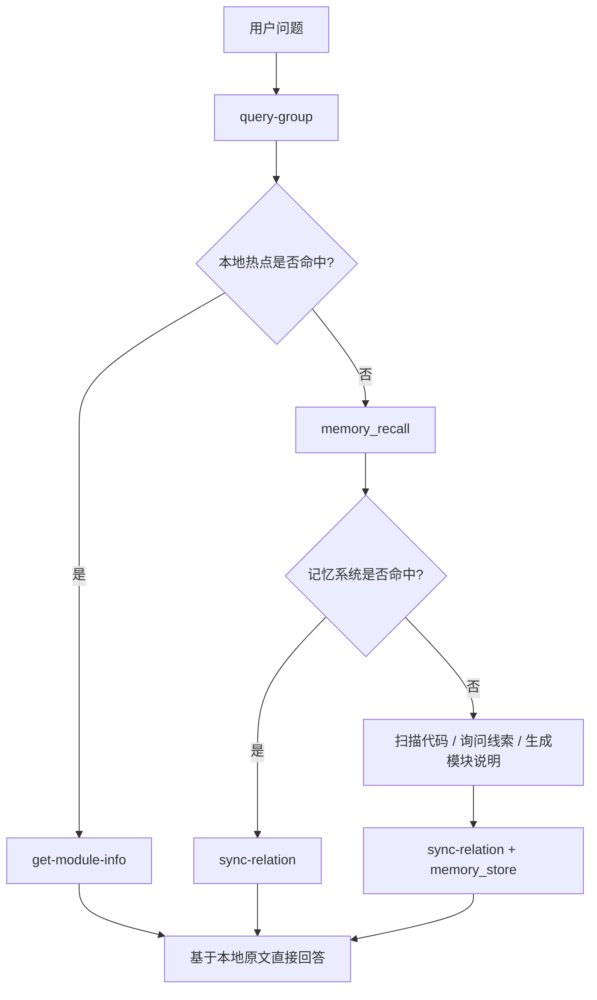

## 典型工作流

本文档把 `kisearch` 当前最常见的使用方式整理成可直接执行的流程。

重点覆盖 4 类场景：

- **本地知识沉淀**：人工或 AI 主动写入项目知识
- **运行时查询闭环**：优先本地命中，不足时回流到记忆系统
- **外部知识库导入（新流程）**：2 步首次导入 / 3 步增量更新
- **外部知识库导入（旧流程）**：7 步旧流程，仍可用

---

## 工作流一：手工沉淀一条项目知识

适合场景：

- 已经明确知道某个模块要怎么描述
- 希望把它直接写进本地索引
- 希望以后能被快速命中和读取

### 步骤 1：创建顶层 Group

```bash
ki manage-index \
  --scope my-project \
  --action create \
  --name "API"
```

### 步骤 2：创建 Group

```bash
ki manage-index \
  --scope my-project \
  --action create \
  --parent "我的项目" \
  --name "API"
```

### 步骤 3：写入 Relation 和模块说明

```bash
ki sync-relation \
  --scope my-project \
  --group "我的项目/API" \
  --relation "用户登录接口" \
  --module-info "## 登录流程\n用户输入账号密码后进入认证流程，服务端校验成功后返回 token。"
```

### 步骤 4：查看写入效果

```bash
ki query-group \
  --scope my-project \
  --groups "我的项目/API"
```

### 步骤 5：读取原文

```bash
ki get-module-info \
  --scope my-project \
  --group "我的项目/API" \
  --relation "用户登录接口"
```

---

## 工作流二：运行时查询闭环

AI Agent 在回答用户问题时的典型路径：



---

## 工作流三：外部知识库导入（推荐：S-04 统一流程）

> 前置条件：**首次使用某个 `scope` 前**，需在 `~/.ki/config.yaml` 的 `scopes` 中注册该 scope。

### 首次导入（原文直导，1 步）

> **REQ-04（批次 3）**：ai-results.json 输入契约已删除，改为 `--source` 原文直导。

**一条命令完成**：

```bash
ki scan-kb import \
  --scope my-project \
  --source /path/to/wiki \
  --group QoderWiki
```

内部完成：递归扫描 .md → 逐文件切分（大文档自动切分）→ 批量 zvec 引擎向量化（content = chunk 原文）→ Group 树创建 → `relations-cache` 写入（文件级 relation 挂 `memoryIds` 多值 + `sourcePath`）→ `group-index.source` 块记录（含切分参数持久化）→ scope sourceDir 写入。

### 增量更新（幂等追加，1 步）

> 历史：`--mode incremental`（git diff 驱动）与 `diff` 子命令已废弃移除。增量更新由「幂等追加」语义承载，不再依赖 git。

```bash
# 修改 / 新增 source 目录中的文件后，重新执行同一条 import 命令即可
ki scan-kb import \
  --scope my-project \
  --source /path/to/wiki \
  --group QoderWiki
```

幂等语义（文件级）：
- 同文件重导（sourcePath 相同）→ 覆盖更新
- 同名不同文件（sourcePath 不同）→ 跳过
- 新文件 → 正常导入

---

## 工作流五：外部知识库导入（旧 7 步流程，仍可用）

> 旧流程（ai-results 契约）已随批次 3 删除，仅保留 `scan-kb import --source` 原文直导。

```text
（旧流程已删除：scan / scan --results / vectorize / import-kb / migrate-keywords）
```

迁移路径：`scan-kb import --source <dir> --group <name>`（幂等追加，重复执行即增量）。

---

## 工作流六：排障时怎么判断自己卡在哪一步

- **`scan-kb import` 报 `Access denied to scope`**：scope 未在 `config.yaml` 注册
- **`scan-kb import` 报 `--source 目录不存在或不是目录`**：确认 `--source` 指向的 Markdown 目录存在
- **`scan-kb import` 报 `--group 不能为空`**：`--group` 未传或为空（缺省会落到 `default` group）
- **追加后 `ki search` 召回不到**：确认导入未用 `--no-vector`（非向量化模式不产生 memoryId，无法被召回）

---

## 最推荐的落地策略

1. 先用 `scan-kb import --group <name>` 跑通首次导入
2. 之后变更：修改/新增 source 目录文件后重新执行同一条 `scan-kb import` 命令（幂等追加 = 增量更新）
3. 查询时遵循"本地优先，记忆兜底，命中后回写"的闭环

## 相关文档

- `scan-kb` 详细说明：[`scan-kb.md`](./scan-kb.md)
- 异常与恢复：[`error-handling.md`](./error-handling.md)
- 架构与数据文件关系：[`architecture.md`](./architecture.md)
- 备份与恢复：[`backup-restore.md`](./backup-restore.md)
