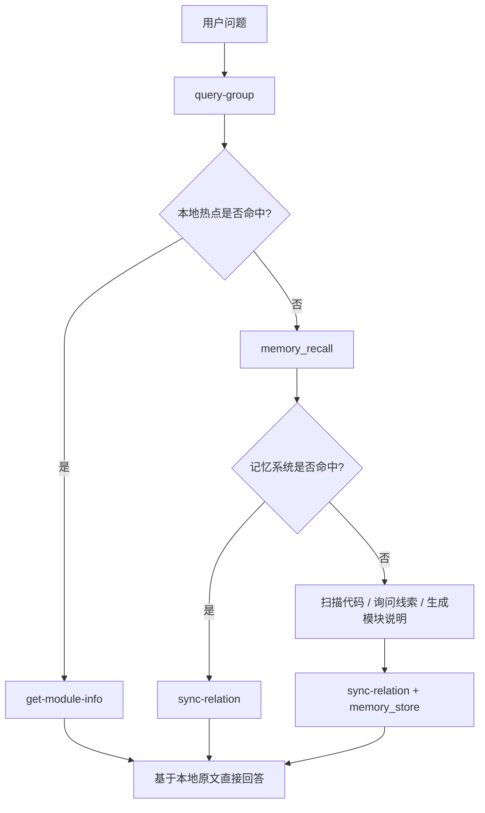

## 典型工作流

本文档把 `KiSearch` 当前最常见的使用方式整理成可直接执行的流程。

重点覆盖 4 类场景：

- **本地知识沉淀**：人工或 AI 主动写入项目知识
- **运行时查询闭环**：优先本地命中，不足时回流到记忆系统
- **外部知识库导入（新流程）**：2 步首次导入 / 3 步增量更新
- **外部知识库导入（旧流程）**：7 步旧流程，仍可用

---

## 工作流一：手工沉淀一条项目知识

适合场景：

- 已经明确知道某个模块要怎么描述
- 希望把它直接写进本地索引
- 希望以后能被快速命中和读取

### 步骤 1：创建顶层 Group

```bash
ki manage-index \
  --scope my-project \
  --action create \
  --name "API"
```

### 步骤 2：创建 Group

```bash
ki manage-index \
  --scope my-project \
  --action create \
  --parent "我的项目" \
  --name "API"
```

### 步骤 3：写入 Relation 和模块说明

```bash
ki sync-relation \
  --scope my-project \
  --group "我的项目/API" \
  --relation "用户登录接口" \
  --module-info "## 登录流程\n用户输入账号密码后进入认证流程，服务端校验成功后返回 token。"
```

### 步骤 4：查看写入效果

```bash
ki query-group \
  --scope my-project \
  --groups "我的项目/API"
```

### 步骤 5：读取原文

```bash
ki get-module-info \
  --scope my-project \
  --group "我的项目/API" \
  --relation "用户登录接口"
```

---

## 工作流二：运行时查询闭环

AI Agent 在回答用户问题时的典型路径：



---

## 工作流三：外部知识库导入（推荐：S-04 统一流程）

> 前置条件：**首次使用某个 `scope` 前**，需在 `~/.ki/config.yaml` 的 `scopes` 中注册该 scope。

### 首次导入（原文直导，1 步）

> **REQ-04（批次 3）**：ai-results.json 输入契约已删除，改为 `--source` 原文直导。

**一条命令完成**：

```bash
ki scan-kb import \
  --scope my-project \
  --source /path/to/wiki \
  --root-name QoderWiki
```

内部完成：递归扫描 .md → 逐文件切分（大文档自动切分）→ 批量 zvec 引擎向量化（content = chunk 原文）→ Group 树创建 → `relations-cache` 写入（文件级 relation 挂 `memoryIds` 多值 + `sourcePath`）→ `group-index.source` 块记录（含 git HEAD commit + 切分参数持久化）→ scope sourceDir 写入。

### 增量更新（git diff 直连，1 步）

> **REQ-06（批次 3）**：增量由 git diff 驱动，无 AI 依赖。

```bash
# 在外部知识库目录提交变更后
ki scan-kb import \
  --scope my-project \
  --source /path/to/wiki \
  --mode incremental
```

增量语义（文件级覆盖更新）：

- `added`：读原文 → 切分 → 向量化 + 写入索引
- `modified`：先写新全 chunk → 成功后再删旧全 chunk（写序保证中断不丢数据）
- `deleted`：按文件关联全 chunk memoryId → 删向量 + cache + local KB

可选：先查看变更（`ki scan-kb diff --scope my-project`），确认后再执行增量。

---

## 工作流四：用 `mapping.json` 精确导入

适合场景：外部目录结构不适合作为 Group，文件名不适合作为 Relation。

```bash
ki scan-kb import \
  --scope my-project \
  --source /path/to/wiki \
  --root-name QoderWiki \
  --mapping mapping.json
```

`mapping.json` 格式见：[`scan-kb.md`](./scan-kb.md)

---

## 工作流五：外部知识库导入（旧 7 步流程，仍可用）

> 旧流程（ai-results 契约）已随批次 3 删除，仅保留 `scan-kb import --source` 原文直导。

```text
（旧流程已删除：scan / scan --results / vectorize / import-kb / migrate-keywords）
```

迁移路径：首次全量 `scan-kb import --source <dir> --root-name <name>`；增量 `scan-kb import --source <dir> --mode incremental`。

---

## 工作流六：排障时怎么判断自己卡在哪一步

- **`scan-kb diff` 返回 `status: 'first_import'`**：说明尚未首次导入
- **`scan-kb import` 报 `Access denied to scope`**：scope 未在 `config.yaml` 注册
- **`scan-kb import` 报 `--source 目录不存在或不是目录`**：确认 `--source` 指向的 Markdown 目录存在
- **`scan-kb import --mode incremental` 报 `source 目录不在 git 仓库中`**：增量依赖 git，需 `git init` 或用 `--mode full`
- **增量 diff 返回 0 变更**：文件可能未 git commit，或 `source.commit` 已是最新

---

## 最推荐的落地策略

1. 先用 `scan-kb import` 跑通首次导入
2. 之后变更走 `diff` → AI → `import --mode incremental`
3. 查询时遵循"本地优先，记忆兜底，命中后回写"的闭环

## 相关文档

- `scan-kb` 详细说明：[`scan-kb.md`](./scan-kb.md)
- 异常与恢复：[`error-handling.md`](./error-handling.md)
- 架构与数据文件关系：[`architecture.md`](./architecture.md)
- 备份与恢复：[`backup-restore.md`](./backup-restore.md)
